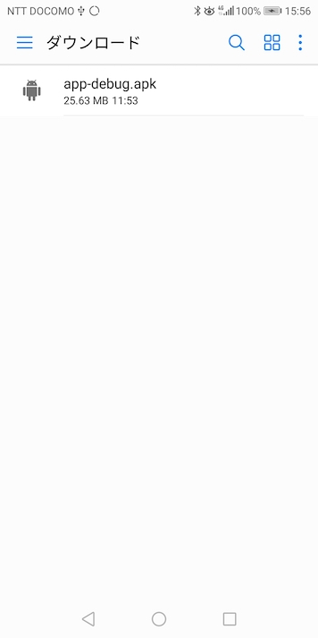
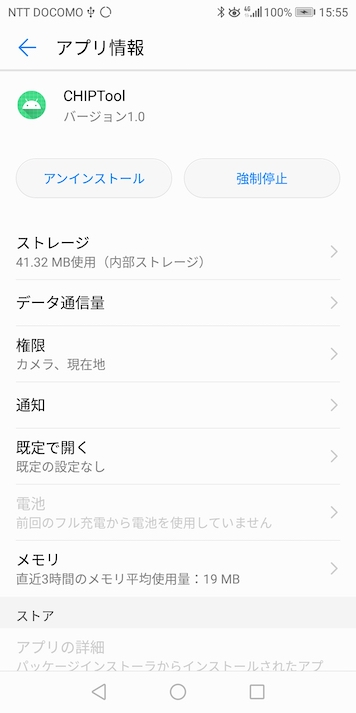

# Matterライブラリー更新手順

最終更新日：2022/02/28

現在開発中のMatterライブラリーを最新版に更新し、サンプルアプリを使用して動作確認する手順について掲載しています。

## 概要

概ね以下の手順でライブラリーの更新／動作確認を実施します。

- nRF5340サンプルアプリの更新

- Androidサンプルアプリの更新

## nRF5340サンプルアプリの更新

nRF5340サンプルアプリを更新します。<br>
その段階で、nRF Connect SDKも更新されます。

### nRF Connect SDKの更新

nRF Connect SDKの最新版をチェックアウトします。<br>
同時に、Matterが推奨するバージョン（タグ）と整合させます。

#### Python3仮想環境を再作成
nRF Connect SDKチェックアウト時は、Python3の仮想環境ごと、作り直すのが良いと思われます。

```
bash-3.2$ cd ${HOME}/opt
bash-3.2$ /usr/bin/python3 -m venv ncs_1.8.99
bash-3.2$ cd ${HOME}/opt/ncs_1.8.99;source bin/activate
(ncs_1.8.99) bash-3.2$
```

#### nRF Connect SDKの再導入
nRF Connect SDKの最新版をチェックアウトします。<br>
以下のコマンドを実行します。

```
pip3 install west
west init -m https://github.com/nrfconnect/sdk-nrf
west update
PATH=${PATH}:/Applications/CMake.app/Contents/bin
west zephyr-export
```

（実行例は[こちらをご参照](../MatterPoCKit/logs/LOG4.log)）

#### 依存ライブラリーの導入
Python3の依存ライブラリーをインストールします。

```
pip3 install -r zephyr/scripts/requirements.txt
pip3 install -r nrf/scripts/requirements.txt
pip3 install -r bootloader/mcuboot/scripts/requirements.txt
```

（実行例は[こちらをご参照](../MatterPoCKit/logs/LOG5.log)）


#### 環境設定
`west-completion.bash`というスクリプトを生成しておきます。

```
(ncs_1.8.99) bash-3.2$ pwd
/Users/makmorit/opt/ncs_1.8.99
(ncs_1.8.99) bash-3.2$ cd zephyr
(ncs_1.8.99) bash-3.2$ west completion bash > ../west-completion.bash
(ncs_1.8.99) bash-3.2$ cd ..
(ncs_1.8.99) bash-3.2$ pwd
/Users/makmorit/opt/ncs_1.8.99
(ncs_1.8.99) bash-3.2$
(ncs_1.8.99) bash-3.2$ ls -al
total 120
drwxr-xr-x  17 makmorit  staff    544  2  7 16:42 .
:
-rw-r--r--   1 makmorit  staff  17789  2  7 16:42 west-completion.bash
drwxr-xr-x  47 makmorit  staff   1504  2  7 16:36 zephyr
(ncs_1.8.99) bash-3.2$
(ncs_1.8.99) bash-3.2$ deactivate
bash-3.2$
```

#### Matter推奨バージョンと整合

最後に、nCSのバージョンを、Matterが推奨するバージョン（タグ）と整合させます。

```
export NCS_HOME=${HOME}/opt/ncs_1.8.99
export ZEPHYR_BASE=${NCS_HOME}/zephyr
source ${NCS_HOME}/west-completion.bash
${HOME}/GitHub/connectedhomeip/scripts/setup/nrfconnect/update_ncs.py --update
```

（実行例は[こちらをご参照](../MatterPoCKit/logs/LOG6.log)）

### サンプルアプリを使用した動作確認

nRF5340にサンプルアプリを書込み、始動まで確認します。

#### サンプルアプリのビルド

`westbuild.sh`を使用し、サンプルアプリをビルドします。

（実行例は[こちらをご参照](../MatterPoCKit/logs/LOG7.log)）

#### サンプルアプリの書込み

`westbuild.sh -f`を使用し、サンプルアプリをnRF5340に書込みます。

（実行例は[こちらをご参照](../MatterPoCKit/logs/LOG8.log)）

#### 起動確認
nRF5340上のサンプルアプリから出力されるログを確認します。<br>
下記はどの端末ともコミッショニングを実行していない状態（＝工場出荷状態）でのログになります。

```
I: nRF5 802154 radio initialized
I: 4 Sectors of 4096 bytes
I: alloc wra: 2, f10
I: data wra: 2, 5fc
I: State changed! Flags: 0x00038200 Current role: 0
*** Booting Zephyr OS build v2.7.0-ncs1  ***
I: Init CHIP stack
I: 670 [DL]BLE address: C1:FF:E6:A6:9F:91
I: Starting CHIP task
I: Init Thread stack
I: 726 [DL]OpenThread started: OK
I: 729 [DL]Setting OpenThread device type to MINIMAL END DEVICE
I: 735 [ZCL]Using ZAP configuration...
D: 750 [DMG]Failed to read stored attribute (0, 0x0000_0028, 0x0000_0005: a0
D: 767 [DMG]Failed to read stored attribute (0, 0x0000_0028, 0x0000_0010: a0
D: 784 [DMG]Failed to read stored attribute (0, 0x0000_002B, 0x0000_0001: a0
D: 802 [DMG]Failed to read stored attribute (0, 0x0000_002C, 0x0000_0000: a0
D: 819 [DMG]Failed to read stored attribute (0, 0x0000_002C, 0x0000_0001: a0
I: 828 [ZCL]Initiating Admin Commissioning cluster.
I: 833 [ZCL]OpCreds: Initiating OpCreds cluster by writing fabrics list from fabric table.
D: 841 [DIS]Add fabric pairing table delegate
E: 845 [ZCL]Trying to write invalid Calendar Type
E: 850 [ZCL]Failed to write calendar type with error: 0x87
D: 855 [DMG]Endpoint 1, Cluster 0x0000_0006 update version to f11c8dcb
D: 861 [DIS]Init fabric pairing table with server storage
D: 920 [DMG]AccessControl: initializing
D: 923 [DMG]Examples::AccessControlDelegate::Init
D: 938 [DMG]AccessControl: unable to load stored ACL entries; using empty list instead
D: 946 [IN]UDP::Init bind&listen port=5540
D: 950 [IN]UDP::Init bound to port=5540
D: 953 [IN]TransportMgr initialized
D: 978 [DIS]DNS-SD StartServer modeHasValue=0 modeValue=0
D: 983 [DL]Using Thread extended MAC for hostname.
I: 988 [DIS]Failed to find a valid admin pairing. Node ID unknown
I: 994 [DIS]Start dns-sd server - no current nodeId
D: 998 [DL]Using Thread extended MAC for hostname.
I: 1014 [DIS]Advertise commission parameter vendorID=9050 productID=20043 discriminator=3840/15
E: 1022 [DIS]Failed to advertise unprovisioned commissionable node: Error CHIP:0x00000003
D: 1030 [DIS]Scheduling Discovery timeout in secs=900
E: 1035 [DIS]Failed to finalize service update: Error CHIP:0x0000001C
I: 1041 [IN]CASE Server enabling CASE session setups
D: 1046 [DL]Using Thread extended MAC for hostname.
I: 1051 [SVR]Server Listening...
I: 1054 [DL]Device Configuration:
I: 1067 [DL]  Serial Number: TEST_SN
I: 1070 [DL]  Vendor Id: 9050 (0x235A)
I: 1074 [DL]  Product Id: 20043 (0x4E4B)
I: 1088 [DL]  Hardware Version: 0
I: 1101 [DL]  Setup Pin Code: 20202021
I: 1115 [DL]  Setup Discriminator: 3840 (0xF00)
I: 1130 [DL]  Manufacturing Date: (not set)
I: 1134 [DL]  Device Type: 65535 (0xFFFF)
I: 1159 [SVR]SetupQRCode: [MT:W0GU2OTB00KA0648G00]
I: 1163 [SVR]Copy/paste the below URL in a browser to see the QR Code:
    https://dhrishi.github.io/connectedhomeip/qrcode.html?data=MT%3AW0GU2OTB00KA0648G00
I: 1198 [SVR]Manual pairing code: [34970112332]
I: 1224 [SVR]Long manual pairing code: [749701123309050200434]
D: 1229 [DL]CHIP task running
I: 1243 [ZCL]GeneralDiagnosticsDelegate: OnDeviceRebooted
D: 1248 [DMG]Endpoint 0, Cluster 0x0000_0033 update version to b318c38c
I: 1254 [ZCL]PlatformMgrDelegate: OnStartUp
D: 1258 [EVL]LogEvent event number: 0x0000000000000000 priority: 2, endpoint id:  0x0 cluster id: 0x0000_0028 event id: 0x0 Sys timestamp: 0x00000000000004EA
```

## Androidサンプルアプリの更新

#### 環境準備

以下のコマンドを実行します。

```
export PKG_CONFIG_PATH=${PKG_CONFIG_PATH}:/usr/local/Cellar/openssl@1.1/1.1.1k/lib/pkgconfig/
cd ${HOME}/GitHub/connectedhomeip
source scripts/bootstrap.sh
```

（実行例は[こちらをご参照](../MatterPoCKit/logs/LOG3.log)）

#### Android Studio用のライブラリー更新

以下のコマンドを実行します。<br>
（環境準備で生成された仮想環境を使用します）

```
cd ${HOME}/GitHub/connectedhomeip
. scripts/activate.sh
export ANDROID_NDK_HOME=/Applications/AndroidNDK7075529.app/Contents/NDK
export ANDROID_HOME=${HOME}/Library/Android/sdk
export PKG_CONFIG_PATH=${PKG_CONFIG_PATH}:/usr/local/Cellar/openssl@1.1/1.1.1k/lib/pkgconfig/
TARGET_CPU=arm64 ./scripts/examples/android_app_ide.sh
deactivate
```

（実行例は[こちらをご参照](../MatterPoCKit/logs/LOG1.log)）

#### Androidサンプルアプリのビルド

以下のコマンドを実行します。<br>
（環境準備で生成された仮想環境を使用します）

```
cd ${HOME}/GitHub/connectedhomeip
. scripts/activate.sh
./scripts/build/build_examples.py --target android-arm64-chip-tool build
deactivate
```

（実行例は[こちらをご参照](../MatterPoCKit/logs/LOG2.log)）

プロジェクトフォルダー配下の`out/android-arm64-chip-tool/outputs/apk/debug/`という場所に、サンプルアプリのインストール用ファイル`app-debug.apk`が生成されます。

```
bash-3.2$ cd ${HOME}/GitHub/connectedhomeip
bash-3.2$ ls -al out/android-arm64-chip-tool/outputs/apk/debug/
total 52512
drwxr-xr-x  4 makmorit  staff       128  2  8 11:51 .
drwxr-xr-x  4 makmorit  staff       128  2  8 11:52 ..
-rw-r--r--  1 makmorit  staff  26879457  2  8 11:51 app-debug.apk
-rw-r--r--  1 makmorit  staff       325  2  8 11:51 output-metadata.json
bash-3.2$
```

`app-debug.apk`は、適宜PCからUSB経由（または電子メール経由）でAndroidに格納してください。



`app-debug.apk`をタップしてインストールすると、サンプルアプリ`CHIPTool`がインストールされます。



## 確認結果

最終更新日現在、以上のサンプルアプリ更新を実施しても、nRF5340サンプルアプリ〜Androidサンプルアプリ間で、[Matterコミッショニング](https://github.com/project-chip/connectedhomeip/blob/master/docs/guides/nrfconnect_android_commissioning.md)が成立できていません。[注1]<br>
nRF5340アプリケーションが下記のようなログ[注2]を出力しているので、おそらくそれが要因の一つと考えられますが、原因は掴めておりません。

```
E: 142201 [DL]OnSrpClientNotification: Operation refused for security reasons
```
[注1] コミッショニング処理の過程におけるnRF5340〜Android間のBLEペアリング、nRF5340-->MatterハブのThreadネットワーク参加は、確認できておりました。<br>
[注2] nRF5340のコミッショニング失敗までのログ全量は[こちらをご参照](../MatterPoCKit/logs/LOG9.log)
