# Matterコマンド実行手順

最終更新日：2021/07/20

コントローラーアプリを使用し、デバイスにMatterコマンドを送信する手順について掲載しています。

## 概要

#### Matterコマンド
この評価用キットでは、数ある[Matterコマンド](https://github.com/project-chip/connectedhomeip/blob/master/src/controller/data_model/gen/CHIPClusters.h)のうち、`OnOffCluster`というコマンド群（クラスター）をサポートします。<br>
以下のコマンドがあります。
- `OffCommand`
- `OnCommand`
- `ToggleCommand`

このうち、コントローラーアプリでは`OffCommand`、`OnCommand`の２点を実行できます。

#### 制約事項

最終更新日現在、Matterコマンドから、Matterデバイスに対し、TCP接続を実行するための仕組みが、[Matterライブラリー](https://github.com/project-chip/connectedhomeip/tree/master/src)に用意されていないようです。<br>
このため、コマンド実行は、ペアリング時に確立されたBLE接続を経由して行う実装となっています。

したがって、Android側もしくはnRF52840側のいずれかにおいて、BLE接続が切断された後は、Matterコマンドを実行することが出来なくなります。<br>
BLE切断後ふたたび、Matterコマンド実行を試したい場合は、本ドキュメントの手順を、最初からやり直していただく必要があります。

## 実行準備手順

#### Matterハブの準備

別途手順書「[Matterハブ構築手順](../MatterPoCKit/SETUPHUB.md)」の「Matterハブ開始手順」に従い、Matterハブを開始させます。

なお、Matterハブは後述「ペアリング／コミッショニング」で使用する、Wi-Fiアクセスポイントとなります。<br>
デフォルトのSSIDは`BorderRouter-AP`、パスワードはMatterハブ内のファイル`/etc/hostapd/hostapd.conf`に記載されている`wpa_passphrase`になります。

#### Matterデバイスの準備

別途手順書「[Matterデバイスアプリ導入手順](../MatterPoCKit/SETUPHUB.md)」でファームウェアを書き込んだ[MDBT50Q Dongle](../FIDO2Device/MDBT50Q_Dongle/README.md)を、任意のPCのUSBポートに装着します。<br>
これで、MDBT50Q Dongleのファームウェアが開始し、Matterデバイスとして動作します。

Matterデバイスは、Matterハブの開始が完了してから、動作を開始させるようにしてください。

#### Matterコントローラーの準備

MatterコントローラーとなるAndroidスマートフォンを、MatterハブのWi-Fiアクセスポイントに接続させるように設定します。<br>
Wi-Fi設定画面から、`BorderRouter-AP`というアクセスポイントを選択します。

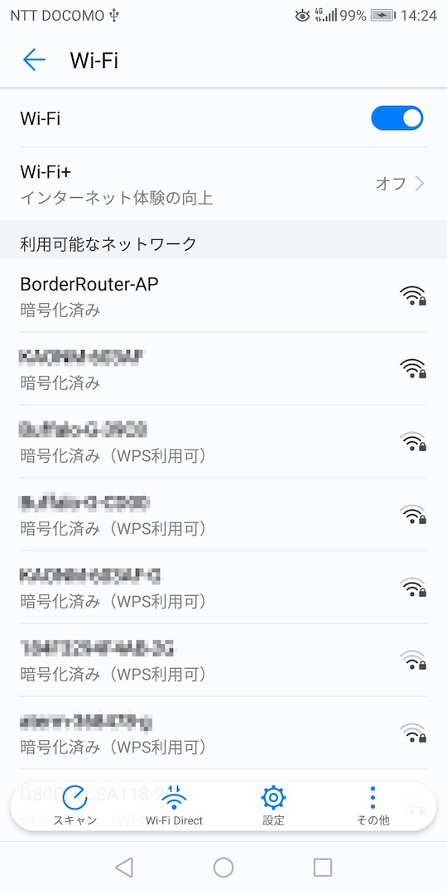

パスワードを入力し「接続」をタップします。

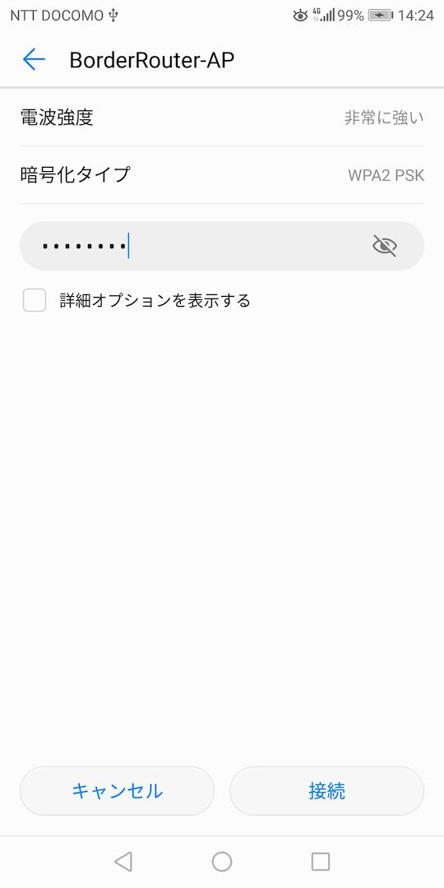

Wi-Fi設定画面の`BorderRouter-AP`が接続ずみに変化します。

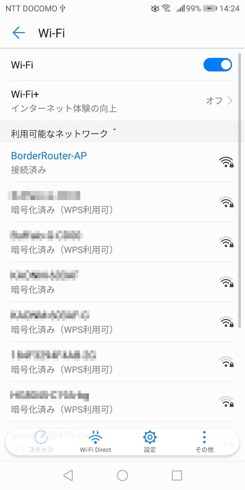

次に、BluetoothをOnにしておきます。

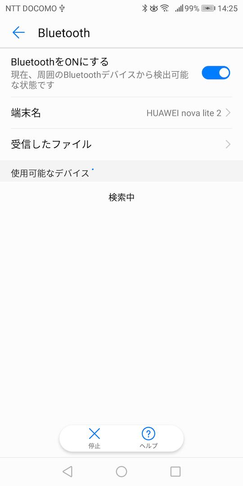

## コマンド実行手順

以下の手順でMatterコマンド実行を試行します。[注]

- Matterデバイスのリセット
- Matterデバイスのコミッショニング
- Matterコマンドの実行

[注]最終更新日時点で、Matterコマンド実行は、ペアリング時に確立されたBLE接続を経由して行う実装となっています。このため、Android側もしくはnRF52840側のいずれかにおいてBLE接続が切断された後、再度コマンド実行を試行したい場合は、常に上記３点の手順を実施いただく必要があります。

#### Matterデバイスのリセット

MatterデバイスとなるMDBT50Q Dongleを、工場出荷状態に戻します。<br>
この作業は基板上のボタンを使用して実行することができます。

基板上のボタンを７秒以上長押しすると、途中（約３秒経過後）基板上の全LEDが点滅した後、工場出荷状態に戻す処理が自動的に行われます。


ボタンから指を離すと、Matterデバイスのリセットが完了します。<br>
ほどなく、MDBT50Q Dongleの基板上のLEDが、点灯・点滅を開始することを確認します。

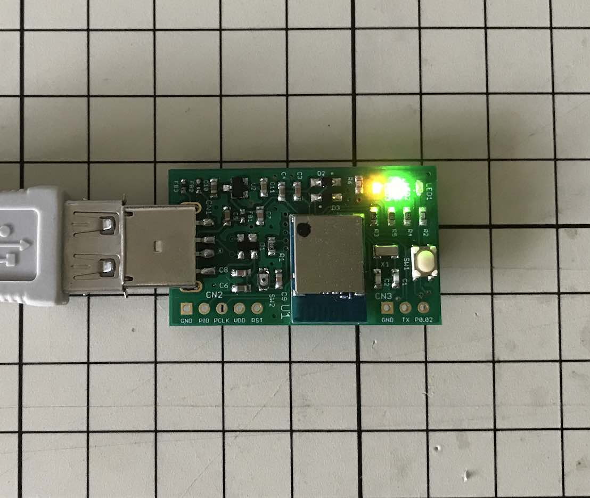

点灯・点滅のパターンは以下の通りになります。

```
緑色LEDは常時点滅
橙色LEDが50ms点灯
橙色LEDが950ms消灯
橙色LEDが50ms点灯
橙色LEDが950ms消灯
：
```

#### Matterデバイスのコミッショニング

Matterコントローラーは、Matterハブに対し、Matterデバイスとの通信が可能になるよう指示します。<br>
この処理は「コミッショニング」と呼ばれています。

コミッショニングは、MatterハブのWi-Fiアクセスポイントを使用して実行します。<br>
ただし、それに先立ち、Matterデバイスの固有情報を収集するため、Matterコントローラー〜Matterデバイス間で、BLEペアリングを実行する必要があります。

Androidスマートフォンに導入した、Matterコントローラーアプリを起動し「ペアリング実行」をタップします。

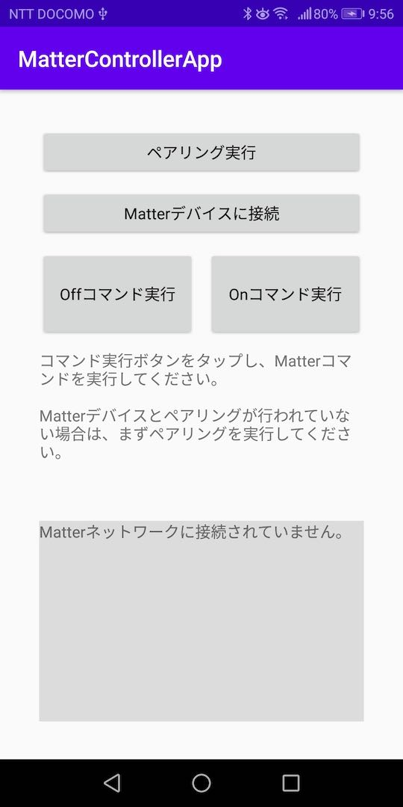

ペアリング処理が開始されます。<br>
Matterデバイス（MDBT50Q Dongle）からBLE経由で情報取得が行われた後、Wi-Fi経由で先述の「コミッショニング」処理が自動的に実行されます。

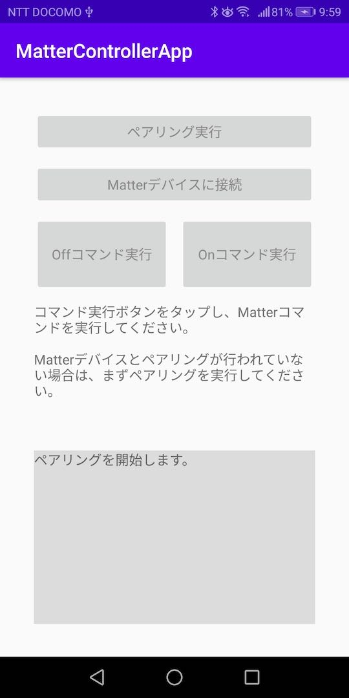

概ね１分以内でペアリング処理が完了します。

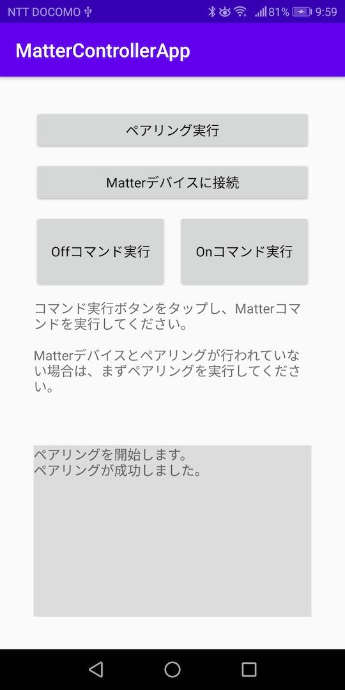

これで、Matterコマンドを実行できる準備が整いました。

#### Matterコマンドの実行

ペアリング完了時点では、MDBT50Q Dongleの基板上のLEDは、下図のように点灯・点滅しています。

```
緑色LEDは常時点滅（On状態を示しています）
橙色LEDが950ms点灯
橙色LEDが50ms消灯
橙色LEDが950ms点灯
橙色LEDが50ms消灯
：
```

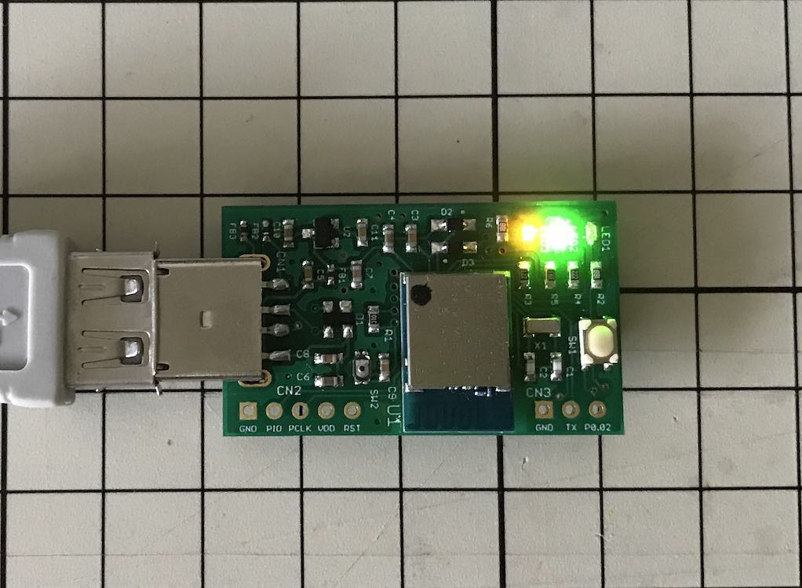

ここで「Offコマンド」実行をタップします


Offコマンドが実行され、緑色LEDが消灯します。<br>
（Off状態を示しています）

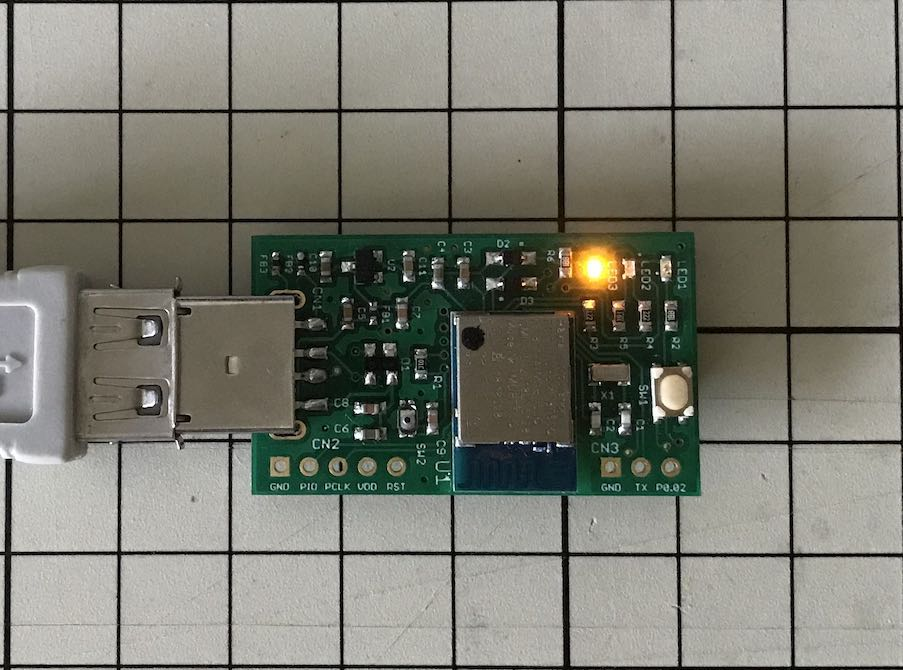

コマンドが完了します。

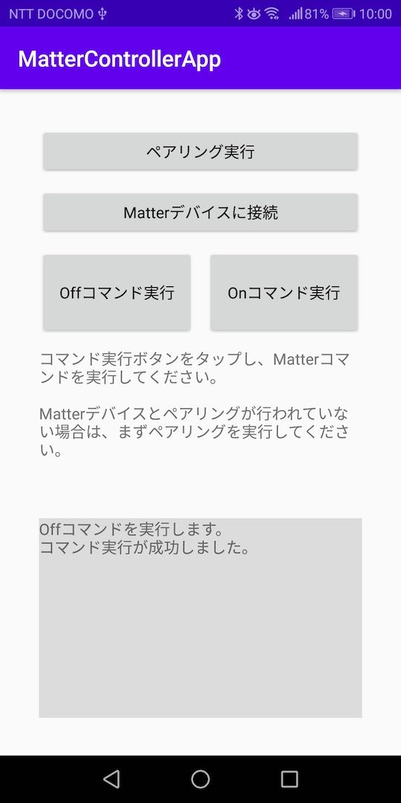

次に「Onコマンド」実行をタップします

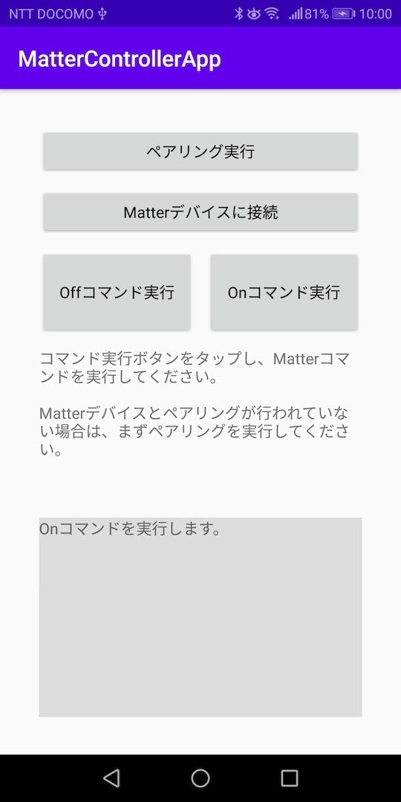

Onコマンドが実行され、緑色LEDが再び点灯します。<br>
（On状態を示しています）


コマンドが完了します。


以上で、Matterコマンドの実行は完了になります。
