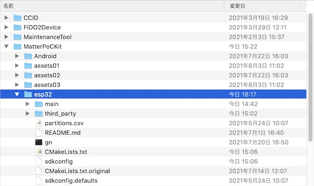
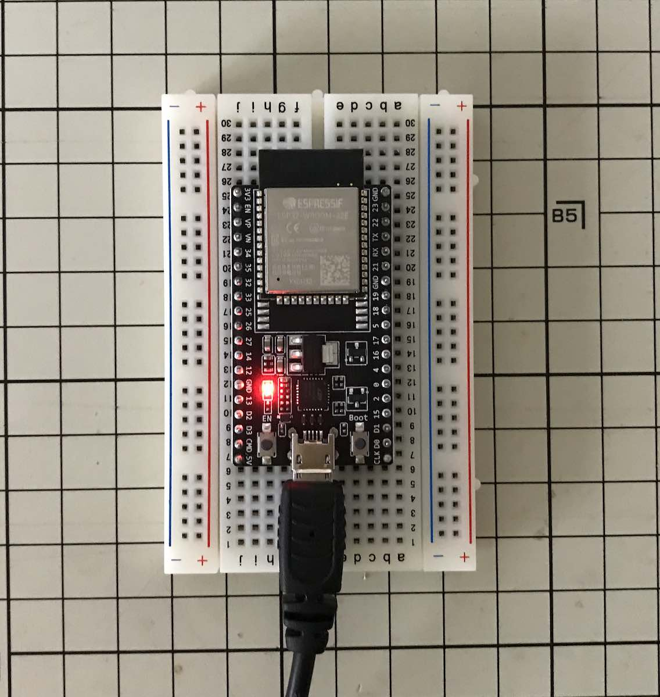

# ESP32版サンプルアプリのビルド手順

[ESP32版サンプルアプリ](https://github.com/project-chip/connectedhomeip/tree/master/examples/lock-app/esp32)をビルドし、開発ボード「ESP32-DevKitC」に書き込む手順について掲載します。

以下のガイドを参考に作業を進めます。<br>
<b>・[CHIP ESP32 Lock Example](https://github.com/project-chip/connectedhomeip/tree/master/examples/lock-app/esp32/README.md)</b>

## 事前準備

ESP32版サンプルアプリのビルドに必要な物件を準備します。

- bashを最新版に更新
- リポジトリーをチェックアウト
- ESP-IDFをインストール
- gnの取得

#### bashを最新版に更新

macOSに導入されている`bash`を、最新版に更新します。<br>
以下のコマンドを実行します。

```
brew install bash
```

以下は実行例になります。

```
makmorit@iMac-makmorit-jp ~ % brew install bash
Updating Homebrew...
==> Auto-updated Homebrew!
：
==> Downloading https://ghcr.io/v2/homebrew/core/bash/manifests/5.1.8
######################################################################## 100.0%
==> Downloading https://ghcr.io/v2/homebrew/core/bash/blobs/sha256:751ffc4d6980a91d4a73dd8758465f519770519d0a4b39ab79806
==> Downloading from https://pkg-containers.githubusercontent.com/ghcr1/blobs/sha256:751ffc4d6980a91d4a73dd8758465f51977
######################################################################## 100.0%
==> Pouring bash--5.1.8.catalina.bottle.tar.gz
🍺  /usr/local/Cellar/bash/5.1.8: 157 files, 10.9MB
makmorit@iMac-makmorit-jp ~ %
```

#### リポジトリーをチェックアウト

GitHubリポジトリー[`Espressif ESP-IDF`](https://github.com/espressif/esp-idf.git)の「`v4.3 tag`」をチェックアウトします。<br>
以下のコマンドを実行します。

```
cd ${HOME}/GitHub/
git clone https://github.com/espressif/esp-idf.git
cd esp-idf
git checkout v4.3
git submodule update --init
```

以下は実行例になります。

```
bash-3.2$ cd ${HOME}/GitHub/
bash-3.2$ git clone https://github.com/espressif/esp-idf.git
Cloning into 'esp-idf'...
remote: Enumerating objects: 263451, done.
remote: Counting objects: 100% (2042/2042), done.
remote: Compressing objects: 100% (1065/1065), done.
remote: Total 263451 (delta 973), reused 1881 (delta 914), pack-reused 261409
Receiving objects: 100% (263451/263451), 147.92 MiB | 1.76 MiB/s, done.
Resolving deltas: 100% (194560/194560), done.
Updating files: 100% (9158/9158), done.
bash-3.2$ pwd
/Users/makmorit/GitHub
bash-3.2$ cd esp-idf
bash-3.2$ git checkout v4.3
Note: switching to 'v4.3'.

You are in 'detached HEAD' state. You can look around, make experimental
changes and commit them, and you can discard any commits you make in this
state without impacting any branches by switching back to a branch.

If you want to create a new branch to retain commits you create, you may
do so (now or later) by using -c with the switch command. Example:

  git switch -c <new-branch-name>

Or undo this operation with:

  git switch -

Turn off this advice by setting config variable advice.detachedHead to false

HEAD is now at c9646ff0be versions: Update version to 4.3.0
bash-3.2$ git submodule update --init
Submodule 'components/asio/asio' (https://github.com/espressif/asio.git) registered for path 'components/asio/asio'
Submodule 'components/bootloader/subproject/components/micro-ecc/micro-ecc' (https://github.com/kmackay/micro-ecc.git) registered for path 'components/bootloader/subproject/components/micro-ecc/micro-ecc'
Submodule 'components/bt/controller/lib_esp32' (https://github.com/espressif/esp32-bt-lib.git) registered for path 'components/bt/controller/lib_esp32'
：
Submodule path 'components/spiffs/spiffs': checked out 'f5e26c4e933189593a71c6b82cda381a7b21e41c'
Submodule path 'components/tinyusb/tinyusb': checked out '334e95fac52a607150157ae5199a19e11f843982'
Submodule path 'components/unity/unity': checked out '7d2bf62b7e6afaf38153041a9d53c21aeeca9a25'
Submodule path 'examples/build_system/cmake/import_lib/main/lib/tinyxml2': checked out '7e8e249990ec491ec15990cf95b6d871a66cf64a'
Submodule path 'examples/peripherals/secure_element/atecc608_ecdsa/components/esp-cryptoauthlib': checked out 'c3d3a69021cfec3236ca2c0b63be4048ec6643a4'
bash-3.2$
```

#### ESP-IDFをインストール
ESP32の開発ツール「ESP-IDF」をインストールします。<br>
以下のコマンドを実行します。

```
cd ${HOME}/GitHub/esp-idf
./install.sh
```

以下は実行例になります。

```
bash-3.2$ ./install.sh
Detecting the Python interpreter
Checking "python" ...
Checking "python3" ...
Python 3.9.5
"python3" has been detected
Installing ESP-IDF tools
Installing tools: xtensa-esp32-elf, xtensa-esp32s2-elf, xtensa-esp32s3-elf, riscv32-esp-elf, esp32ulp-elf, esp32s2ulp-elf, openocd-esp32
Installing xtensa-esp32-elf@esp-2020r3-8.4.0
Downloading xtensa-esp32-elf-gcc8_4_0-esp-2020r3-macos.tar.gz to /Users/makmorit/.espressif/dist/xtensa-esp32-elf-gcc8_4_0-esp-2020r3-macos.tar.gz.tmp
Done
Extracting /Users/makmorit/.espressif/dist/xtensa-esp32-elf-gcc8_4_0-esp-2020r3-macos.tar.gz to /Users/makmorit/.espressif/tools/xtensa-esp32-elf/esp-2020r3-8.4.0
：
Collecting MarkupSafe>=2.0
  Downloading https://dl.espressif.com/pypi/markupsafe/MarkupSafe-2.0.1-cp39-cp39-macosx_10_9_x86_64.whl (13 kB)
Building wheels for collected packages: reedsolo
  Building wheel for reedsolo (setup.py) ... done
  Created wheel for reedsolo: filename=reedsolo-1.5.4-py3-none-any.whl size=28968 sha256=cd7cd0aefef909dd3580b89b081f87a713baaadb4ec52c030959ea74bf9d45f8
  Stored in directory: /Users/makmorit/Library/Caches/pip/wheels/f7/1f/ed/764f0e7a774d1d580c3f5c865e78e2922d7f6d3924eef78b56
Successfully built reedsolo
Installing collected packages: six, MarkupSafe, Werkzeug, python-engineio, Jinja2, itsdangerous, click, python-socketio, pycparser, greenlet, Flask, brotli, Pygments, pygdbmi, gevent, Flask-SocketIO, Flask-Compress, cffi, reedsolo, pyserial, pyparsing, pyelftools, kconfiglib, gdbgui, future, ecdsa, cryptography, construct, bitstring
Successfully installed Flask-0.12.5 Flask-Compress-1.10.1 Flask-SocketIO-2.9.6 Jinja2-3.0.1 MarkupSafe-2.0.1 Pygments-2.10.0 Werkzeug-0.16.1 bitstring-3.1.9 brotli-1.0.9 cffi-1.14.6 click-8.0.1 construct-2.10.54 cryptography-3.4.7 ecdsa-0.17.0 future-0.18.2 gdbgui-0.13.2.0 gevent-1.5.0 greenlet-1.1.1 itsdangerous-2.0.1 kconfiglib-13.7.1 pycparser-2.20 pyelftools-0.27 pygdbmi-0.9.0.2 pyparsing-2.3.1 pyserial-3.5 python-engineio-3.14.2 python-socketio-4.6.1 reedsolo-1.5.4 six-1.16.0
WARNING: You are using pip version 21.2.3; however, version 21.2.4 is available.
You should consider upgrading via the '/Users/makmorit/.espressif/python_env/idf4.3_py3.9_env/bin/python -m pip install --upgrade pip' command.
All done! You can now run:

  . ./export.sh

bash-3.2$
```

#### gnの取得

Googleの開発ツール`gn`を開発元から取得します。

リポジトリー[`https://gn.googlesource.com/gn/`](https://gn.googlesource.com/gn/)をWebブラウザーで開きます。<br>
下図のようなページが表示されます。


下の方にスクロールし「Getting a binary」の「macOS」というリンク（下図参照）をクリックすると、`gn`のバイナリーファイルを格納した`gn-mac-amd64.zip`がダウンロードされます。


`gn-mac-amd64.zip`を解凍して、実行可能ファイル`gn`を取り出します。


## ビルドの実行

ESP-IDFのツールを使用し、ESP32版サンプルアプリのビルドを実行します。

#### ソースコードの配置

[MatterのGitHubリポジトリー](https://github.com/project-chip/connectedhomeip)に含まれている[サンプルアプリのソースコード](https://github.com/project-chip/connectedhomeip/tree/master/examples/lock-app/esp32)を、任意の場所にコピーします。<br>
ソースコード配置ディレクトリーの直下に、コマンドツール`gn`も一緒に配置します。

以降の手順は、ソースコードが`${HOME}/GitHub/onecard-fido/MatterPoCKit/esp32`配下にコピーされたと想定しています。




#### メイクファイルの修正

メイクファイル`CMakeLists.txt`に記述されているパスのうち、コピーしたことにより、相対パスが変わってしまう部分を修正します。

```
bash-5.1$ pwd
/Users/makmorit/GitHub/onecard-fido/MatterPoCKit/esp32
bash-5.1$ diff /Users/makmorit/GitHub/onecard-fido/MatterPoCKit/esp32/CMakeLists.txt.original /Users/makmorit/GitHub/onecard-fido/MatterPoCKit/esp32/CMakeLists.txt
24c24
<     "${CMAKE_CURRENT_LIST_DIR}/../../common/QRCode"
---
>     "${CMAKE_CURRENT_LIST_DIR}/third_party/connectedhomeip/examples/common/QRCode"
bash-5.1$
```

#### シンボリックリンクの作成

ソースコードの位置から、Matterリポジトリーを参照するためのシンボリックリンクを生成します。<br>
以下のコマンドを実行します。

```
ln -s ${HOME}/GitHub/connectedhomeip ${HOME}/GitHub/onecard-fido/MatterPoCKit/esp32/third_party/connectedhomeip
```

以下は実行例になります。

```
bash-5.1$ pwd
/Users/makmorit/GitHub/onecard-fido/MatterPoCKit/esp32
bash-5.1$
bash-5.1$ rm -v third_party/*
third_party/connectedhomeip
bash-5.1$ ls -al third_party
total 0
drwxr-xr-x   2 makmorit  staff   64  8 16 15:01 .
drwxr-xr-x  10 makmorit  staff  320  8 16 14:41 ..
bash-5.1$
bash-5.1$ ln -s ${HOME}/GitHub/connectedhomeip ${HOME}/GitHub/onecard-fido/MatterPoCKit/esp32/third_party/connectedhomeip
bash-5.1$ ls -al third_party
total 0
drwxr-xr-x   3 makmorit  staff   96  8 16 15:02 .
drwxr-xr-x  10 makmorit  staff  320  8 16 14:41 ..
lrwxr-xr-x   1 makmorit  staff   38  8 16 15:02 connectedhomeip -> /Users/makmorit/GitHub/connectedhomeip
bash-5.1$
```

#### ビルド実行

ESP32版サンプルアプリのファームウェアをビルドします。<br>
以下のコマンドを実行します。

```
cd ${HOME}/GitHub/onecard-fido/MatterPoCKit/esp32
export LANG=en_US.UTF-8
export PATH=${PATH}:`pwd`
. ${HOME}/GitHub/esp-idf/export.sh
idf.py build
```

以下は実行例になります。

```
bash-5.1$ cd ${HOME}/GitHub/onecard-fido/MatterPoCKit/esp32
bash-5.1$
bash-5.1$ export LANG=en_US.UTF-8
bash-5.1$ export PATH=${PATH}:`pwd`
bash-5.1$
bash-5.1$ . ${HOME}/GitHub/esp-idf/export.sh
Setting IDF_PATH to '/Users/makmorit/GitHub/esp-idf'
Detecting the Python interpreter
Checking "python" ...
Checking "python3" ...
Python 3.9.5
"python3" has been detected
Adding ESP-IDF tools to PATH...
Using Python interpreter in /Users/makmorit/.espressif/python_env/idf4.3_py3.9_env/bin/python
Checking if Python packages are up to date...
Python requirements from /Users/makmorit/GitHub/esp-idf/requirements.txt are satisfied.
Added the following directories to PATH:
  /Users/makmorit/GitHub/esp-idf/components/esptool_py/esptool
  /Users/makmorit/GitHub/esp-idf/components/espcoredump
  /Users/makmorit/GitHub/esp-idf/components/partition_table
  /Users/makmorit/GitHub/esp-idf/components/app_update
  /Users/makmorit/.espressif/tools/xtensa-esp32-elf/esp-2020r3-8.4.0/xtensa-esp32-elf/bin
  /Users/makmorit/.espressif/tools/xtensa-esp32s2-elf/esp-2020r3-8.4.0/xtensa-esp32s2-elf/bin
  /Users/makmorit/.espressif/tools/xtensa-esp32s3-elf/esp-2020r3-8.4.0/xtensa-esp32s3-elf/bin
  /Users/makmorit/.espressif/tools/riscv32-esp-elf/1.24.0.123_64eb9ff-8.4.0/riscv32-esp-elf/bin
  /Users/makmorit/.espressif/tools/esp32ulp-elf/2.28.51-esp-20191205/esp32ulp-elf-binutils/bin
  /Users/makmorit/.espressif/tools/esp32s2ulp-elf/2.28.51-esp-20191205/esp32s2ulp-elf-binutils/bin
  /Users/makmorit/.espressif/tools/openocd-esp32/v0.10.0-esp32-20210401/openocd-esp32/bin
  /Users/makmorit/.espressif/python_env/idf4.3_py3.9_env/bin
  /Users/makmorit/GitHub/esp-idf/tools
Done! You can now compile ESP-IDF projects.
Go to the project directory and run:

  idf.py build

bash-5.1$
bash-5.1$ idf.py build
Executing action: all (aliases: build)
Running cmake in directory /Users/makmorit/GitHub/onecard-fido/MatterPoCKit/esp32/build
Executing "cmake -G Ninja -DPYTHON_DEPS_CHECKED=1 -DESP_PLATFORM=1 -DCCACHE_ENABLE=0 /Users/makmorit/GitHub/onecard-fido/MatterPoCKit/esp32"...
-- Found Git: /usr/bin/git (found version "2.24.3 (Apple Git-128)")
-- IDF_TARGET not set, using default target: esp32
：
Running ninja in directory /Users/makmorit/GitHub/onecard-fido/MatterPoCKit/esp32/build
Executing "ninja all"...
[8/1147] Generating ../../partition_table/partition-table.bin
Partition table binary generated. Contents:
*******************************************************************************
# ESP-IDF Partition Table
# Name, Type, SubType, Offset, Size, Flags
nvs,data,nvs,0x9000,24K,
phy_init,data,phy,0xf000,4K,
factory,app,factory,0x10000,1945K,
*******************************************************************************
[412/1147] Performing configure step for 'chip_gn'
Done. Made 125 targets from 107 files in 40ms
[666/1147] Performing configure step for 'bootloader'
：
-- Build files have been written to: /Users/makmorit/GitHub/onecard-fido/MatterPoCKit/esp32/build/bootloader
[686/1147] Performing build step for 'bootloader'
[1/86] Generating project_elf_src_esp32.c
[2/86] Building C object esp-idf/soc/CMakeFiles/__idf_soc.dir/soc_include_legacy_warn.c.obj
[3/86] Building C object CMakeFiles/bootloader.elf.dir/project_elf_src_esp32.c.obj
：
[1147/1147] Generating binary image from built executable
esptool.py v3.1-dev
Merged 1 ELF section
Generated /Users/makmorit/GitHub/onecard-fido/MatterPoCKit/esp32/build/chip-lock-app.bin

Project build complete. To flash, run this command:
/Users/makmorit/.espressif/python_env/idf4.3_py3.9_env/bin/python ../../../esp-idf/components/esptool_py/esptool/esptool.py -p (PORT) -b 460800 --before default_reset --after hard_reset --chip esp32  write_flash --flash_mode dio --flash_size detect --flash_freq 40m 0x1000 build/bootloader/bootloader.bin 0x8000 build/partition_table/partition-table.bin 0x10000 build/chip-lock-app.bin
or run 'idf.py -p (PORT) flash'
bash-5.1$
bash-5.1$ echo $?
0
bash-5.1$
```

以上でビルドは完了です。

## 書込みの実行

ビルドしたESP32版サンプルアプリのファームウェアを、開発ボードである「ESP32-DevKitC」に転送します。<br>

#### 開発ボードの準備

開発ボード「ESP32-DevKitC」を、USBケーブルでPCに接続します。<br>
基板上の赤いLEDが点灯し、動作が開始されます。



#### 書込みコマンドの実行

以下のコマンドを実行します。

```
cd ${HOME}/GitHub/onecard-fido/MatterPoCKit/esp32
idf.py -p `ls /dev/tty.usbserial*` flash
```

以下は実行例になります。

```
bash-5.1$ cd ${HOME}/GitHub/onecard-fido/MatterPoCKit/esp32
bash-5.1$ idf.py -p `ls /dev/tty.usbserial*` flash
Executing action: flash
Running ninja in directory /Users/makmorit/GitHub/onecard-fido/MatterPoCKit/esp32/build
Executing "ninja flash"...
[1/9] Performing build step for 'bootloader'
ninja: no work to do.
[2/7] Performing build step for 'chip_gn'
ninja: no work to do.
[2/3] cd /Users/makmorit/GitHub/esp-idf/components/esptool...GitHub/esp-idf/components/esptool_py/run_serial_tool.cmake
esptool.py esp32 -p /dev/tty.usbserial-1470 -b 460800 --before=default_reset --after=hard_reset write_flash --flash_mode dio --flash_freq 40m --flash_size 2MB 0x8000 partition_table/partition-table.bin 0x1000 bootloader/bootloader.bin 0x10000 chip-lock-app.bin
esptool.py v3.1-dev
Serial port /dev/tty.usbserial-1470
Connecting....
Chip is ESP32-D0WD-V3 (revision 3)
Features: WiFi, BT, Dual Core, 240MHz, VRef calibration in efuse, Coding Scheme None
Crystal is 40MHz
MAC: 08:3a:f2:22:b9:3c
Uploading stub...
Running stub...
Stub running...
Changing baud rate to 460800
Changed.
Configuring flash size...
Flash will be erased from 0x00008000 to 0x00008fff...
Flash will be erased from 0x00001000 to 0x00007fff...
Flash will be erased from 0x00010000 to 0x0010ffff...
Compressed 3072 bytes to 106...
Writing at 0x00008000... (100 %)
Wrote 3072 bytes (106 compressed) at 0x00008000 in 0.1 seconds (effective 333.7 kbit/s)...
Hash of data verified.
Compressed 25072 bytes to 15383...
Writing at 0x00001000... (100 %)
Wrote 25072 bytes (15383 compressed) at 0x00001000 in 0.8 seconds (effective 255.3 kbit/s)...
Hash of data verified.
Compressed 1048544 bytes to 681778...
Writing at 0x00010000... (2 %)
Writing at 0x0001b62f... (4 %)
Writing at 0x000258d9... (7 %)
：
Writing at 0x00101f71... (95 %)
Writing at 0x00107827... (97 %)
Writing at 0x0010c95d... (100 %)
Wrote 1048544 bytes (681778 compressed) at 0x00010000 in 16.1 seconds (effective 522.6 kbit/s)...
Hash of data verified.

Leaving...
Hard resetting via RTS pin...
Done
bash-5.1$
```

以上でファームウェアの書込みは完了です。
