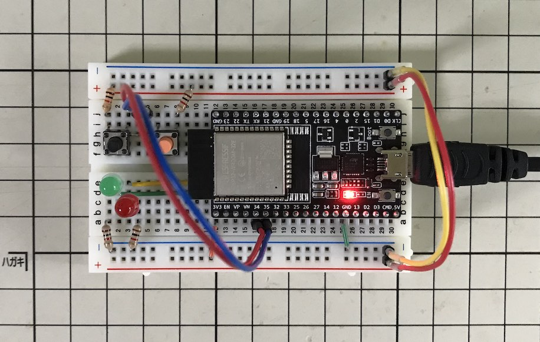
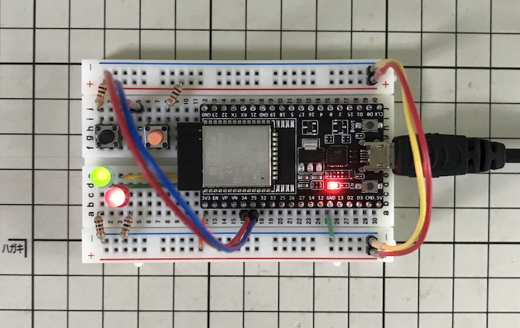
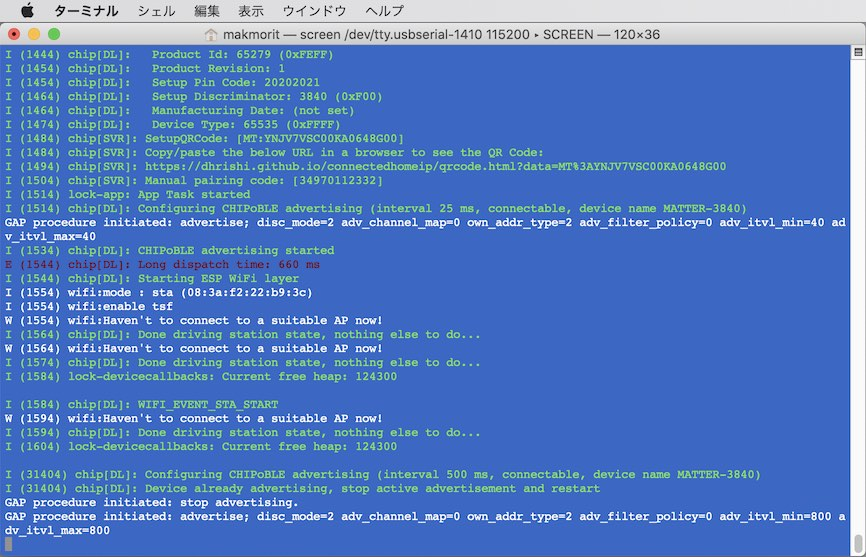
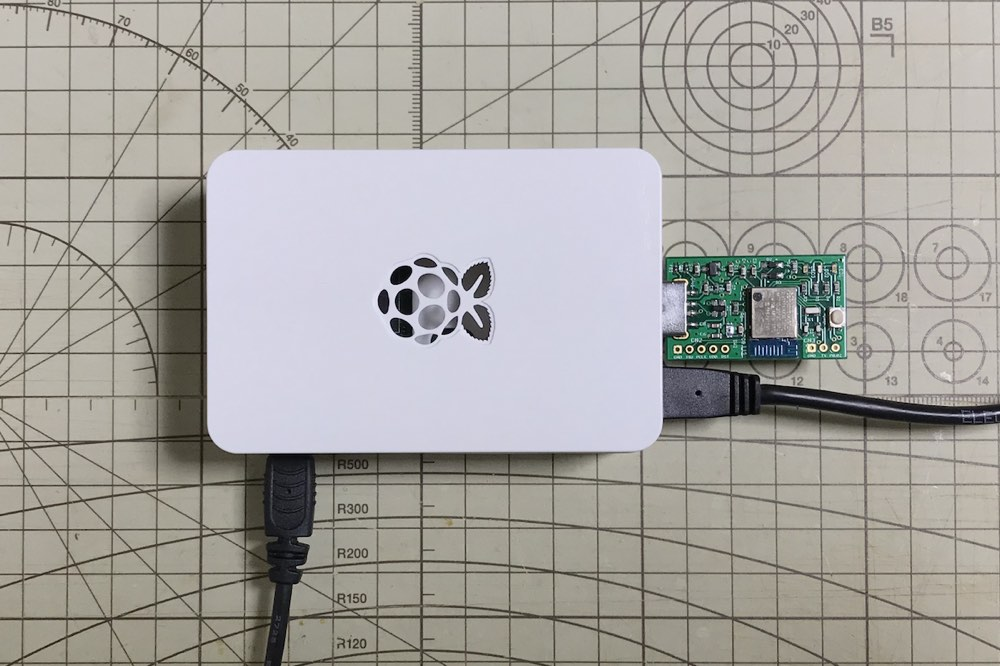
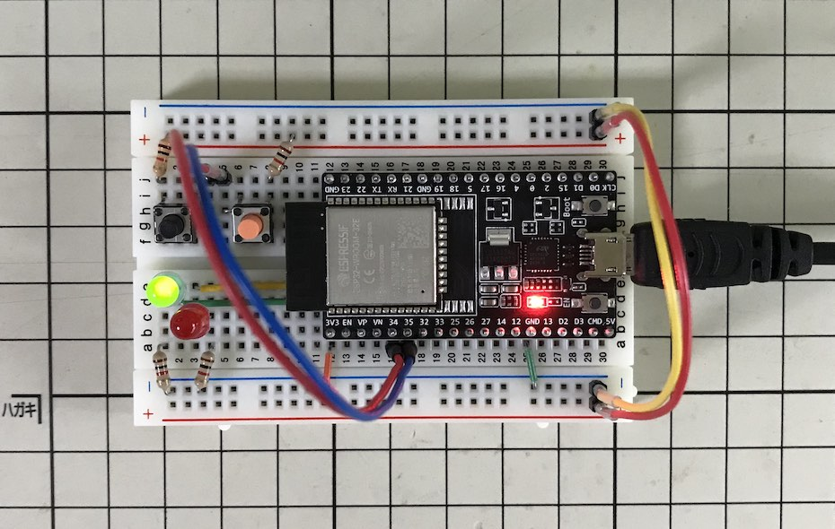

# ESP32版サンプルアプリの動作確認手順

開発ボード「ESP32-DevKitC」に書き込まれた[ESP32版サンプルアプリ](https://github.com/project-chip/connectedhomeip/tree/master/examples/lock-app/esp32)の動作確認手順について掲載します。

以下のガイドを参考に作業を進めます。<br>
<b>・[CHIP ESP32 Lock Example](https://github.com/project-chip/connectedhomeip/tree/master/examples/lock-app/esp32/README.md)</b>

## 事前準備

ESP32版サンプルアプリの動作確認に必要な物件を準備します。

- Matterコントローラーの準備
- Matterデバイスの準備
- Matterハブの準備

### Matterコントローラーの準備

Matterコントローラーとなる、コマンドラインベースの制御ツール[`Python CHIP Device Controller`](https://github.com/project-chip/connectedhomeip/tree/master/src/controller/python)を、PCにインストールします。

#### 制御ツールのインストール

[MatterのGitHubリポジトリー](https://github.com/project-chip/connectedhomeip)に含まれている`Python CHIP Device Controller`を、提供されているシェル（[`build_python.sh`](https://github.com/project-chip/connectedhomeip/blob/master/scripts/build_python.sh)）を使用してビルド／インストールします。

下記のコマンドを実行します。

```
cd ${HOME}/GitHub/connectedhomeip
./scripts/build_python.sh -m platform
```

下記は実行例になります。

```
chip_detail_logging = false , chip_mdns = "platform"

  WELCOME TO...

  ▄███▒  ░▓█  ░▓█ ░▓█▓ ▒█████▄
 ██▒ ▀█▒  ▒█   ▒█  ░█▒  ▒█░  █░
 █▓░      ▒██████  ░█▒  ▒█▄▄▄█░
 ▓█   █▒  ▒█   ▒█  ░█░  ▒█▀
 ░▓███▀  ░▓███░▓█▒ ░█░  ▒█

  ACTIVATOR! This sets your shell environment variables.

Activating environment (setting environment variables):

  Setting environment variables for CIPD package manager...done
  Setting environment variables for Python environment.....done
  Setting environment variables for Host tools.............done

Checking the environment:
：
[331/331] stamp obj/src/controller/python/python.stamp
created virtual environment CPython3.8.2.final.0-64 in 453ms
  creator CPython3Posix(dest=/Users/makmorit/GitHub/connectedhomeip/out/python_env, clear=True, no_vcs_ignore=False, global=False)
  seeder FromAppData(download=False, pip=bundle, setuptools=bundle, wheel=bundle, via=copy, app_data_dir=/Users/makmorit/Library/Application Support/virtualenv)
    added seed packages: pip==21.0.1, setuptools==54.1.2, wheel==0.36.2
  activators BashActivator,CShellActivator,FishActivator,PowerShellActivator,PythonActivator,XonshActivator
Requirement already satisfied: pip in ./out/python_env/lib/python3.8/site-packages (21.0.1)
Collecting pip
  Using cached pip-21.2.4-py3-none-any.whl (1.6 MB)
Installing collected packages: pip
：
Collecting pyobjc-framework-Cocoa>=7.3
  Downloading pyobjc_framework_Cocoa-7.3-cp38-cp38-macosx_10_9_x86_64.whl (273 kB)
     |████████████████████████████████| 273 kB 2.8 MB/s
Building wheels for collected packages: construct
  Building wheel for construct (setup.py) ... done
  Created wheel for construct: filename=construct-2.10.67-py3-none-any.whl size=59037 sha256=694392ec7bf9a4b5a545b8f3847a78a1bd232027b38846181b2afdd9ea44a5c2
  Stored in directory: /private/var/folders/hn/087_vn3j0lq1sbh89zfjl0640000gp/T/pip-ephem-wheel-cache-1kew7_qp/wheels/e3/4e/be/d56811047059833c9eaa777779b57d6e86b34c836f050a7745
Successfully built construct
Installing collected packages: ipython-genutils, wcwidth, traitlets, pyobjc-core, ptyprocess, parso, setuptools, pyobjc-framework-Cocoa, pygments, prompt-toolkit, pickleshare, pexpect, matplotlib-inline, jedi, humanfriendly, decorator, backcall, appnope, pyobjc-framework-corebluetooth, ipython, construct, coloredlogs, chip
  Attempting uninstall: setuptools
    Found existing installation: setuptools 54.1.2
    Uninstalling setuptools-54.1.2:
      Successfully uninstalled setuptools-54.1.2
Successfully installed appnope-0.1.2 backcall-0.2.0 chip-0.0 coloredlogs-15.0.1 construct-2.10.67 decorator-5.0.9 humanfriendly-9.2 ipython-7.26.0 ipython-genutils-0.2.0 jedi-0.18.0 matplotlib-inline-0.1.2 parso-0.8.2 pexpect-4.8.0 pickleshare-0.7.5 prompt-toolkit-3.0.19 ptyprocess-0.7.0 pygments-2.10.0 pyobjc-core-7.3 pyobjc-framework-Cocoa-7.3 pyobjc-framework-corebluetooth-7.3 setuptools-57.4.0 traitlets-5.0.5 wcwidth-0.2.5

Compilation completed and WHL package installed in:
  ./out/python_env

To use please run:
  source ./out/python_env/bin/activate
bash-5.1$
```

#### 制御ツールの起動確認

制御ツールがインストールされたら、正常に起動するか確認します。<br>
以下のコマンドを実行します。

```
source ${HOME}/GitHub/connectedhomeip/out/python_env/bin/activate
chip-device-ctrl
```

以下は実行例になります。<br>
この例では、試しにBLEデバイスをスキャンしています。

```
bash-3.2$ source ${HOME}/GitHub/connectedhomeip/out/python_env/bin/activate
(python_env) bash-3.2$ chip-device-ctrl
[1629160314608] [813:11332] CHIP: [IN] local node id is 0x000000000001B669
[1629160314608] [813:11332] CHIP: [ZCL] Using ZAP configuration...
[1629160314609] [813:11332] CHIP: [ZCL] deactivate report event
[1629160314609] [813:11332] CHIP: [CTL] Getting operational keys
[1629160314609] [813:11332] CHIP: [CTL] Getting root certificate for the controller from the issuer
[1629160314609] [813:11332] CHIP: [CTL] Generating operational certificate for the controller
[1629160314609] [813:11332] CHIP: [CTL] Getting intermediate CA certificate from the issuer
[1629160314609] [813:11332] CHIP: [CTL] GetIntermediateCACertificate returned 0
[1629160314609] [813:11332] CHIP: [CTL] Generating credentials
[1629160314609] [813:11332] CHIP: [CTL] Loaded credentials successfully
[1629160314612] [813:11357] CHIP: [DL] Platform main loop started.
Chip Device Controller Shell
Bluetooth adapter set to hciNone

chip-device-ctrl > ble-scan
2021-08-17 09:32:22,968 ChipBLEMgr   INFO     BLE is ready!
2021-08-17 09:32:30,755 ChipBLEMgr   INFO     adding to scan list:
2021-08-17 09:32:30,755 ChipBLEMgr   INFO     
2021-08-17 09:32:30,755 ChipBLEMgr   INFO     Name            = None                                                                            
2021-08-17 09:32:30,755 ChipBLEMgr   INFO     ID              = 282D9DB3-D25D-4E49-884B-5E64A74F337D                                            
2021-08-17 09:32:30,755 ChipBLEMgr   INFO     RSSI            = -33                                                                             
2021-08-17 09:32:30,756 ChipBLEMgr   INFO     Pairing State   = 0
2021-08-17 09:32:30,756 ChipBLEMgr   INFO     Discriminator   = 3840
2021-08-17 09:32:30,756 ChipBLEMgr   INFO     Vendor Id       = 9050
2021-08-17 09:32:30,756 ChipBLEMgr   INFO     Product Id      = 65279
2021-08-17 09:32:30,756 ChipBLEMgr   INFO     ADV data: {
    kCBAdvDataChannel = 37;
    kCBAdvDataIsConnectable = 1;
    kCBAdvDataServiceData =     {
        FFF6 = <00000f5a 23fffe>;
    };
}
2021-08-17 09:32:30,756 ChipBLEMgr   INFO     
2021-08-17 09:32:32,969 ChipBLEMgr   INFO     scanning stopped
chip-device-ctrl > exit
(python_env) bash-3.2$ deactivate
bash-3.2$
```

以上で、Matterコントローラーの準備は完了です。

### Matterデバイスの準備

Matterデバイスとなる、開発ボード「ESP32-DevKitC」に、LED、ボタンを２点ずつ装着します。

#### LED／ボタンの装着

「ESP32-DevKitC」を、適宜ブレッドボードに取り付けた後、ワイヤー類を使用してLED、ボタンと接続します。

下図は装着・配線の例になります。<br>
（ご注意：LED／ボタンの装着・配線は、ボードをPCのUSBポートに接続していない＝電源が投入されていない状態で実施してください）



##### 装着部品

|名称|ESP32-DevKitC| |装着部品[注1]|備考|
|:--|:-:|:-:|:-|:--|
|System State LED|IO25  | --> |緑色LED|Anode側に接続[注2]|
|Lock State LED |IO26  | -->  |赤色LED|Anode側に接続[注2]|
|Lock Button |IO34  | <-- |タクトスイッチ（橙）|High-active[注3]|
|Function Button |IO35  | <--  |タクトスイッチ（黒）|High-active[注3]|

[注1] LED・ボタンの色は適宜決めています<br>
[注2] Cathode側には抵抗器を経由し0Vに接続します。抵抗器の定数は、使用LEDの性能によって適宜決めます<br>
[注3] High-active＝スイッチで3.3Vに接続するとOn（3.3Vには抵抗器を介して接続）、未接続でOff

#### 基板の接続

LED／ボタンの装着が終わりましたら、ボードをPCのUSBポートに接続します。<br>
基板上の赤色LEDが点灯／緑色LEDが点滅を開始します。



#### ターミナルの準備

開発ボードからのデバッグプリントを表示させるため、ターミナルを起動し、開発ボードと接続しておきます。<br>
以下のコマンドを実行します。

```
screen `ls /dev/tty.usbserial*` 115200
```

以下は実行例になります。<br>
（下図は開発ボード上のリセットボタンを押下した時のデバッグプリントです）



以上で、Matterデバイスの準備は完了です。

### Matterハブの準備

別途手順書「[Matterハブ構築手順](../MatterPoCKit/SETUPHUB.md)」の「Matterハブ開始手順」に従い、Matterハブを開始させます。



なお、Matterハブは後述「ペアリング／コミッショニング」で使用する、Wi-Fiネットワークのルーターとなります。<br>
コミッショニング処理において、MatterデバイスはWi-Fi経由でMatterハブに接続する必要があるため、Matterハブが準備できていないと、ペアリング／コミッショニングが正常に完了しません。



