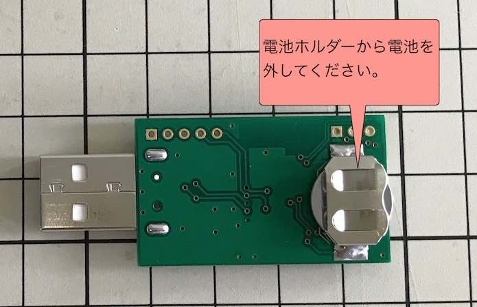

# Matterデバイスアプリ導入手順

## 概要
Matterデバイスアプリ（ファームウェア）をnRF52840環境にインストールする手順について掲載しています。

以下の順番で作業を進めます。
- ファームウェアのビルド
- ファームウェアの書込み
- 動作確認

#### 使用した機材

- macOSが導入されたPC<br>
OSのバージョンは10.15.5（Catalina）です。

- [MDBT50Q Dongle（rev2）](../FIDO2Device/MDBT50Q_Dongle/pcb_rev2/README.md)<br>
nRF52840を搭載した基板です。<br>
本件検証のために転用しています。

- [nRF52840 DK](https://www.nordicsemi.com/Products/Development-hardware/nrf52840-dk)<br>
ファームウェアを書き込むために使用します。<br>
（国内技適が無いため、動作確認環境としては利用できません）

## ファームウェアのビルド

ファームウェアのソースコードをビルドし、ファームウェアを生成します。<br>

#### nRF Connect SDK環境の作成

ビルド実行のために必要となるツール「[nRF Connect SDK](https://www.nordicsemi.com/Products/Development-software/nrf-connect-sdk)」を、macOS環境にインストールします。 <br>

詳細につきましては、以下の手順書をご参照願います。

- <b>[ARM GCCインストール手順](../nRF52840_app/ARMGCCINST.md)</b>

- <b>[NetBeansインストール手順](../nRF52840_app/NETBEANSINST.md)</b>

- <b>[nRF Connect SDKインストール手順書](../nRF5340_app/INSTALLSDK.md)</b>

#### ビルドを実行

まずは、ソースコードをGitHubリポジトリーからチェックアウトします。<br>
（以下本ドキュメントでは、`${HOME}/GitHub/onecard-fido/`にチェックアウトされたと想定しています）

次に、ファームウェアのソースコードディレクトリー`onecard-fido/MatterPoCKit/nrfconnect/`に移動し、ビルド用シェルを実行します。

```
cd ${HOME}/GitHub/onecard-fido/MatterPoCKit/nrfconnect/
./westbuild.sh
```

以下は実行例になります。

```
bash-3.2$ cd ${HOME}/GitHub/onecard-fido/MatterPoCKit/nrfconnect/
bash-3.2$ ./westbuild.sh
-- west build: generating a build system
Including boilerplate (Zephyr base): /Users/makmorit/GitHub/onecard-fido/pyvenvs/ncs/zephyr/cmake/app/boilerplate.cmake
-- Application: /Users/makmorit/GitHub/onecard-fido/MatterPoCKit/nrfconnect
-- Zephyr version: 2.6.0-rc1 (/Users/makmorit/GitHub/onecard-fido/pyvenvs/ncs/zephyr), build: v2.6.0-rc1-ncs1-3-g0944459b5b62
-- Found Python3: /Users/makmorit/GitHub/onecard-fido/pyvenvs/ncs/bin/python3 (found suitable exact version "3.7.3") found components: Interpreter
-- Found west (found suitable version "0.10.1", minimum required is "0.7.1")
-- Board: nrf52840dk_nrf52840
-- Cache files will be written to: /Users/makmorit/Library/Caches/zephyr
-- Found toolchain: gnuarmemb (/Users/makmorit/opt/gcc-arm-none-eabi-9-2020-q2-update)
-- Found BOARD.dts: /Users/makmorit/GitHub/onecard-fido/pyvenvs/ncs/zephyr/boards/arm/nrf52840dk_nrf52840/nrf52840dk_nrf52840.dts
-- Found devicetree overlay: configuration/nrf52840dk_nrf52840/MDBT50Q_dongle_rev2.overlay
-- Generated zephyr.dts: /Users/makmorit/GitHub/onecard-fido/MatterPoCKit/nrfconnect/build/zephyr/zephyr.dts
：
-- Generating done
-- Build files have been written to: /Users/makmorit/GitHub/onecard-fido/MatterPoCKit/nrfconnect/build
-- west build: building application
[0/655] cd /Users/makmorit/GitHub/connectedhomeip && /User...tup/nrfconnect/update_ncs.py --check --quiet || ( exit 0 )
[1/655] Preparing syscall dependency handling

[56/655] cd /Users/makmorit/GitHub/onecard-fido/MatterPoCK...o/pyvenvs/ncs/modules/lib/openthread/etc/cmake/print.cmake
OPENTHREAD_CONFIG_ASSERT_ENABLE=1
OPENTHREAD_CONFIG_BACKBONE_ROUTER_DUA_NDPROXYING_ENABLE=0
OPENTHREAD_CONFIG_BACKBONE_ROUTER_MULTICAST_ROUTING_ENABLE=0
OPENTHREAD_CONFIG_ENABLE_BUILTIN_MBEDTLS=0
OPENTHREAD_CONFIG_ENABLE_BUILTIN_MBEDTLS_MANAGEMENT=0
OPENTHREAD_CONFIG_DHCP6_CLIENT_ENABLE=1
OPENTHREAD_CONFIG_DNS_CLIENT_ENABLE=1
OPENTHREAD_CONFIG_ECDSA_ENABLE=1
OPENTHREAD_CONFIG_SRP_CLIENT_ENABLE=1
OPENTHREAD_CONFIG_DUA_ENABLE=1
OPENTHREAD_CONFIG_MLR_ENABLE=1
OPENTHREAD_CONFIG_TMF_NETWORK_DIAG_MTD_ENABLE=1
OPENTHREAD_CONFIG_TMF_NETDATA_SERVICE_ENABLE=1
OPENTHREAD_CONFIG_IP6_SLAAC_ENABLE=1
OPENTHREAD_CONFIG_SNTP_CLIENT_ENABLE=1
OPENTHREAD_SPINEL_CONFIG_RCP_RESTORATION_MAX_COUNT=0
PACKAGE_NAME=OPENTHREAD
PACKAGE_VERSION=eae63bb47
OPENTHREAD_CONFIG_THREAD_VERSION=OT_THREAD_VERSION_1_2
OPENTHREAD_CONFIG_NCP_HDLC_ENABLE=1
KERNEL
__ZEPHYR__=1
_FORTIFY_SOURCE=2
BUILD_VERSION=v2.6.0-rc1-ncs1-3-g0944459b5b62
__LINUX_ERRNO_EXTENSIONS__
USE_PARTITION_MANAGER=0
__PROGRAM_START
NRF52840_XXAA
NRF_802154_ENCRYPTION_ENABLED=0
NRF_802154_SECURITY_WRITER_ENABLED=0
NRF_802154_IE_WRITER_ENABLED=0
NRF_802154_USE_RAW_API=1
NRF_802154_PENDING_SHORT_ADDRESSES=16
NRF_802154_PENDING_EXTENDED_ADDRESSES=16
NRF_802154_RX_BUFFERS=16
NRF_802154_CCA_CORR_LIMIT_DEFAULT=2
NRF_802154_CCA_CORR_THRESHOLD_DEFAULT=45
NRF_802154_CCA_ED_THRESHOLD_DEFAULT=45
NRF_802154_CSMA_CA_ENABLED=1
NRF_802154_TX_STARTED_NOTIFY_ENABLED=1
NRF_802154_ACK_TIMEOUT_ENABLED=1
NRF_802154_CCA_MODE_DEFAULT=NRF_RADIO_CCA_MODE_ED
NRF_802154_INTERNAL_RADIO_IRQ_HANDLING=0
PSA_CRYPTO_SECURE
MBEDTLS_CONFIG_FILE=nrf-config.h
[590/655] No configure step for 'chip-gn'
[591/655] Performing build step for 'chip-gn'
Generating compile_commands took 7ms
Done. Made 65 targets from 71 files in 28ms
[263/263] stamp obj/ABS_PATH/Users/makmorit/GitHub/connectedhomeip/config/nrfconnect/chip-gn/default.stamp
[648/655] Linking CXX executable zephyr/zephyr_prebuilt.elf

[655/655] Linking CXX executable zephyr/zephyr.elf
Memory region         Used Size  Region Size  %age Used
           FLASH:      645484 B         1 MB     61.56%
            SRAM:      186241 B       256 KB     71.05%
        IDT_LIST:          0 GB         2 KB      0.00%
bash-3.2$
```

以上でビルド実行は完了になります。

## ファームウェアの書込み

ビルド実行の結果、生成されたファームウェアを、MDBT50Q Dongleに書込みます。<br>

#### ファームウェア書込み準備

まず最初に、MDBT50Q Dongleの背面にあるボタン電池ケースに、<b>電池が入っていないこと</b>を必ず確認します。



次に、MDBT50Q DongleをPCのUSBポートに装着後、nRF52840 DKと接続します。<br>
接続するピンの対応関係は以下の通りです。

|ピンの名前 |MDBT50Q Dongle（rev2）| | nRF52840 DK|
|:--|:-:|:-:|:-:|
|0V |GND  | <-->  |GND|
|SWD IO |PIO  | <-->  |SWDIO|
|SWD Clock |PCLK  | <--  |SWDCLK|
|SWD IO Level |VDD  | -->  |VTG|
|SWD Reset |RST  | <--  |RESET|

|ピンの名前 |MDBT50Q Dongle（rev2.1.2）| | nRF52840 DK|
|:--|:-:|:-:|:-:|
|0V |GND  | <-->  |GND|
|SWD IO Level |VDD  | -->  |VTG|
|SWD IO |PIO  | <-->  |SWDIO|
|SWD Clock |PCLK  | <--  |SWDCLK|

[注1] nRF52840 DK上の「P20」というコネクター（オスピン）に接続します。<br>
[注2] MDBT50Q Dongle（rev2, PCA10059_01）の回路図はこちら（[FIDO2AUTH_002.pdf](../FIDO2Device/MDBT50Q_Dongle/pcb_rev2/FIDO2AUTH_002.pdf)）になります。<br>
[注3] MDBT50Q Dongle（rev2.1.2, PCA10059_02）の回路図はこちら（[FIDO2AUTH_00212.pdf](../FIDO2Device/MDBT50Q_Dongle/pcb_rev2_1_2/FIDO2AUTH_00212.pdf)）になります。

下図は実際に両者を接続した時のイメージになります。


#### ファームウェア書込みの実行

次に、ファームウェアのソースコードディレクトリー`onecard-fido/MatterPoCKit/nrfconnect/`に移動し、ビルド用シェルを実行します。

```
cd ${HOME}/GitHub/onecard-fido/MatterPoCKit/nrfconnect/
./westbuild.sh -f
```

以下は実行例になります。

```
bash-3.2$ cd ${HOME}/GitHub/onecard-fido/MatterPoCKit/nrfconnect/
bash-3.2$ ./westbuild.sh -f
ZEPHYR_BASE=/Users/makmorit/GitHub/onecard-fido/pyvenvs/ncs/zephyr (origin: env)
-- west flash: rebuilding
cmake version 3.20.2 is OK; minimum version is 3.13.1
Running CMake: /usr/local/bin/cmake --build build
[0/5] cd /Users/makmorit/GitHub/connectedhomeip && /Users/...tup/nrfconnect/update_ncs.py --check --quiet || ( exit 0 )
[1/5] Performing build step for 'chip-gn'
Generating compile_commands took 6ms
Done. Made 65 targets from 71 files in 27ms
ninja: no work to do.
[3/3] cd /Users/makmorit/GitHub/onecard-fido/MatterPoCKit/...o/pyvenvs/ncs/modules/lib/openthread/etc/cmake/print.cmake
OPENTHREAD_CONFIG_ASSERT_ENABLE=1
OPENTHREAD_CONFIG_BACKBONE_ROUTER_DUA_NDPROXYING_ENABLE=0
OPENTHREAD_CONFIG_BACKBONE_ROUTER_MULTICAST_ROUTING_ENABLE=0
：
NRF_802154_CCA_MODE_DEFAULT=NRF_RADIO_CCA_MODE_ED
NRF_802154_INTERNAL_RADIO_IRQ_HANDLING=0
PSA_CRYPTO_SECURE
MBEDTLS_CONFIG_FILE=nrf-config.h
-- west flash: using runner nrfjprog
runners.nrfjprog: nrfjprog --ids
Using board 683272599
-- runners.nrfjprog: Flashing file: build/zephyr/zephyr.hex
runners.nrfjprog: nrfjprog --program build/zephyr/zephyr.hex --sectoranduicrerase -f NRF52 --snr 683272599
Parsing hex file.
Erasing page at address 0x0.
Erasing page at address 0x1000.
Erasing page at address 0x2000.
Erasing page at address 0x3000.
：
Erasing page at address 0x9A000.
Erasing page at address 0x9B000.
Erasing page at address 0x9C000.
Erasing page at address 0x9D000.
Applying system reset.
Checking that the area to write is not protected.
Programming device.
runners.nrfjprog: nrfjprog --pinresetenable -f NRF52 --snr 683272599
Enabling pin reset.
runners.nrfjprog: nrfjprog --pinreset -f NRF52 --snr 683272599
Applying pin reset.
-- runners.nrfjprog: Board with serial number 683272599 flashed successfully.
bash-3.2$
```

シェルの実行が完了したら、MDBT50Q DongleをPCのUSBポートから外し、nRF52840 DKとの配線を外してください。

これで、ファームウェアの書込みは完了となります。

## 動作確認

ファームウェアが書き込まれたMDBT50Q Dongleについて、基本的な動作確認を行います。

#### LED点滅を確認

MDBT50Q DongleをPCのUSBポートに再度装着します。<br>
ほどなく、MDBT50Q Dongleの基板上のLEDが、点灯・点滅を開始することを確認します。


点灯・点滅のパターンは以下の通りになります。

```
緑色LEDは常時点滅
橙色LEDが50ms点灯
橙色LEDが950ms消灯
橙色LEDが50ms点灯
橙色LEDが950ms消灯
：
```

#### USB接続を確認

このMatterデバイスアプリは、USB HIDインターフェースが用意されています。<br>
USBデバイスとして認識されているかどうかは、macOSの「システム情報」アプリで確認できます。

下図のように「Matter device」として認識されていればOKです。


以上で、Matterデバイスアプリの導入は完了となります。
