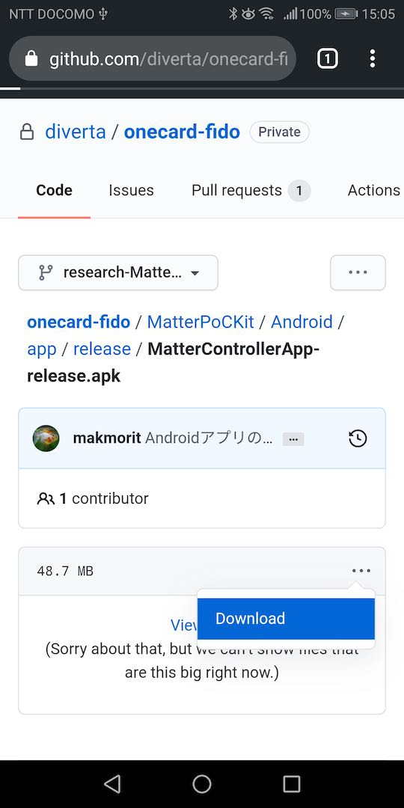
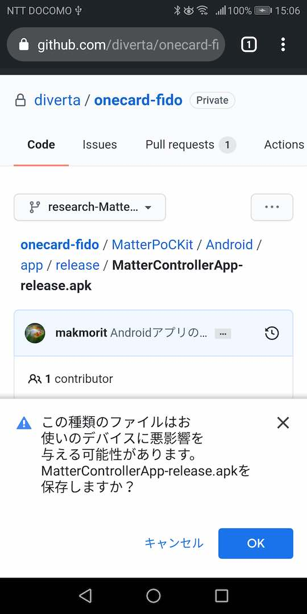
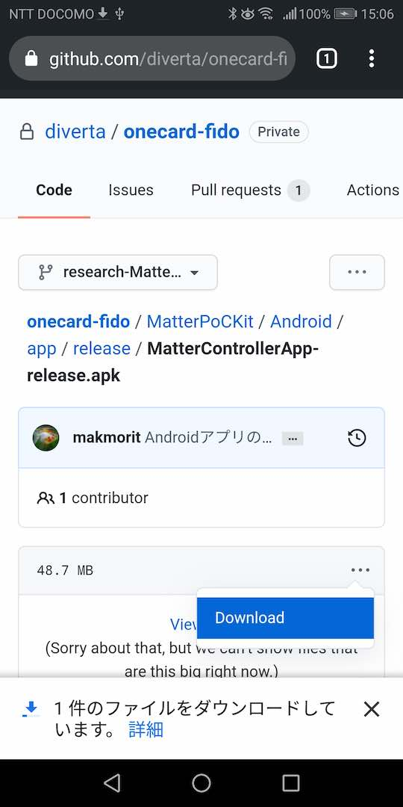
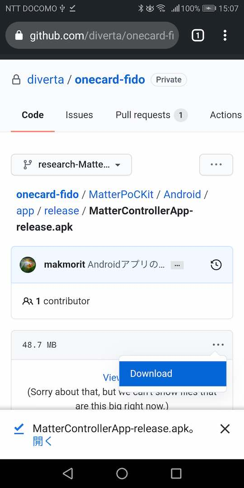
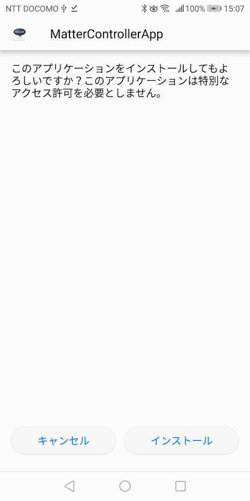
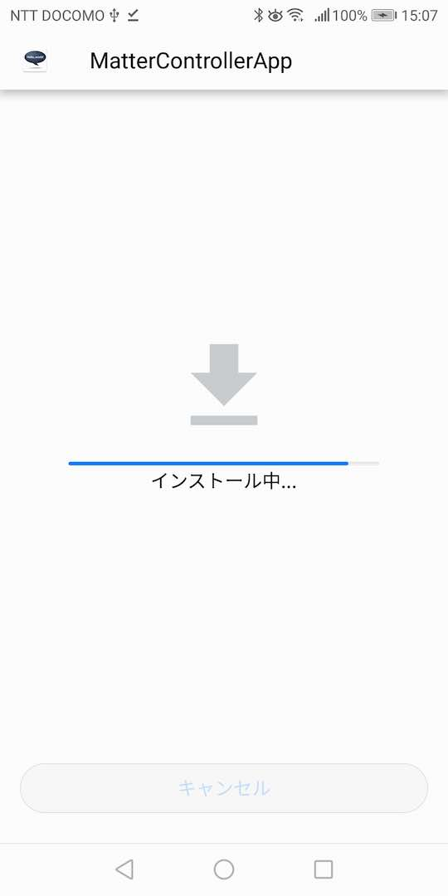
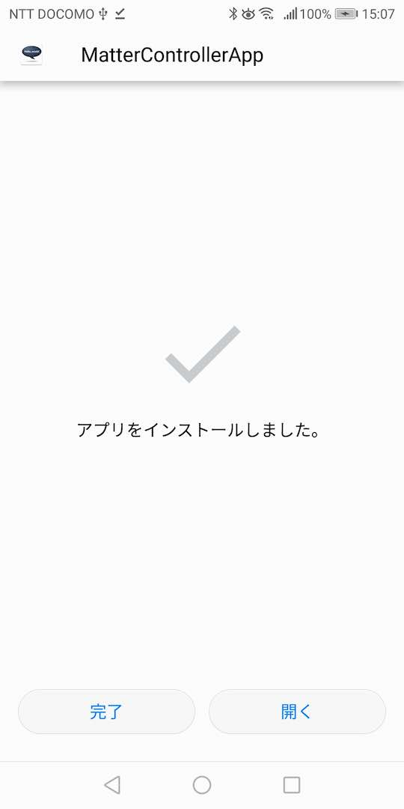
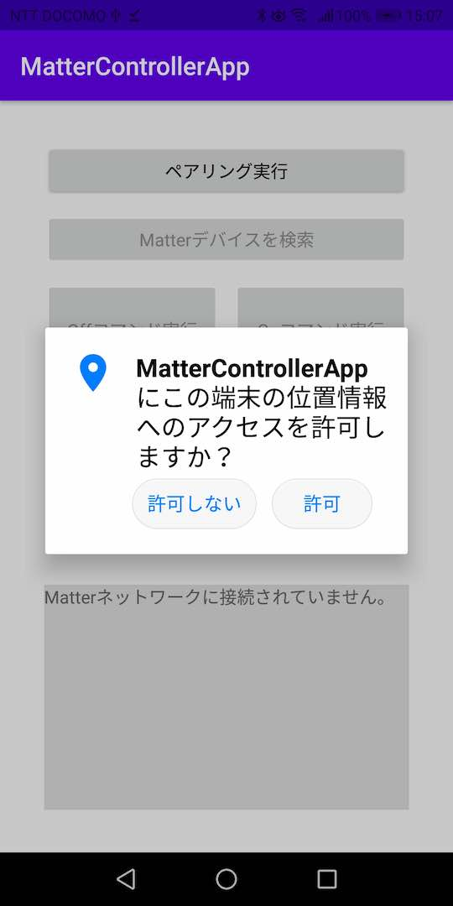
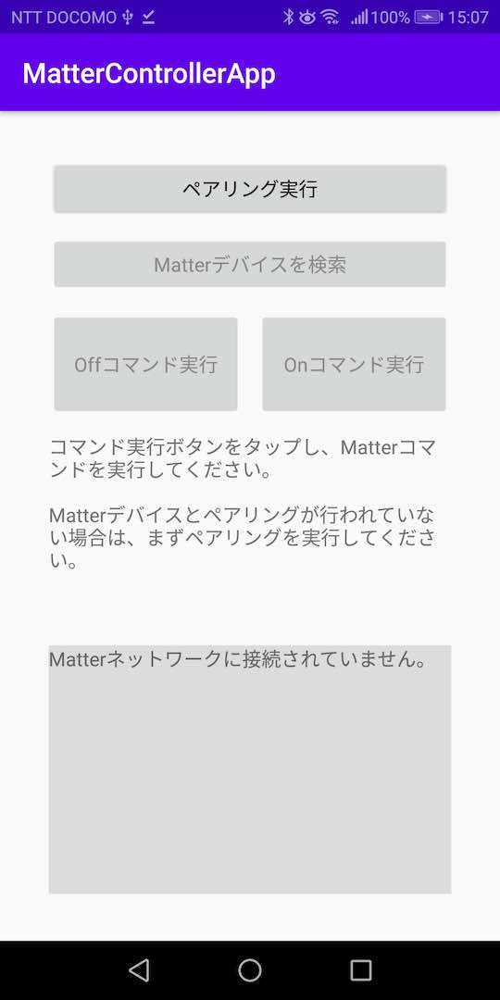

# Matterコントローラーアプリ導入手順

## 概要
MatterコントローラーアプリをAndroid環境にインストールする手順について掲載しています。

## アプリのインストール

[Matterコントローラーアプリ](../MatterPoCKit/Android)を、GitHubリポジトリーからダウンロードします。 
該当ページで「Download」を実行すると、[MatterControllerApp-release.apk](../MatterPoCKit/Android/app/release/MatterControllerApp-release.apk)がダウンロードできます。

下図のようなメッセージが表示されたら「OK」をタップします。

アプリのダウンロードが開始されます。

ダウンロードが完了します。 
「開く」というリンクをタップします。

下図のような画面に遷移したら「インストール」をタップします。

アプリのインストールが開始されます。

インストールが完了したら「開く」をタップしてください。

下図のような画面に遷移したら「許可」をタップします。

下図のようにMatterコントローラーアプリが起動します。

以上で、アプリのインストールは完了になります。
