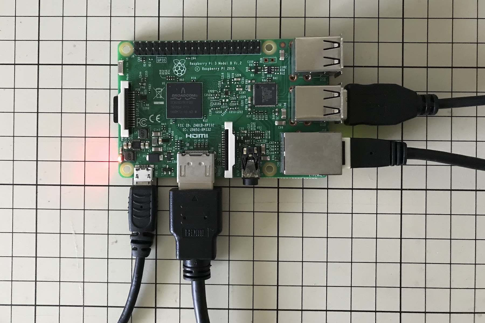
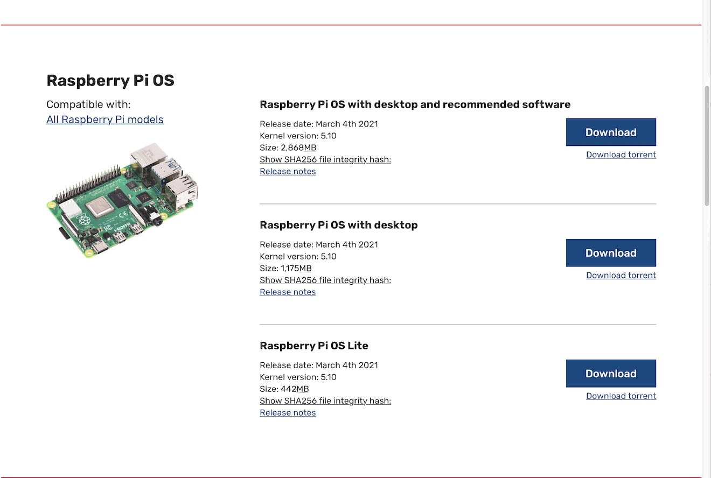
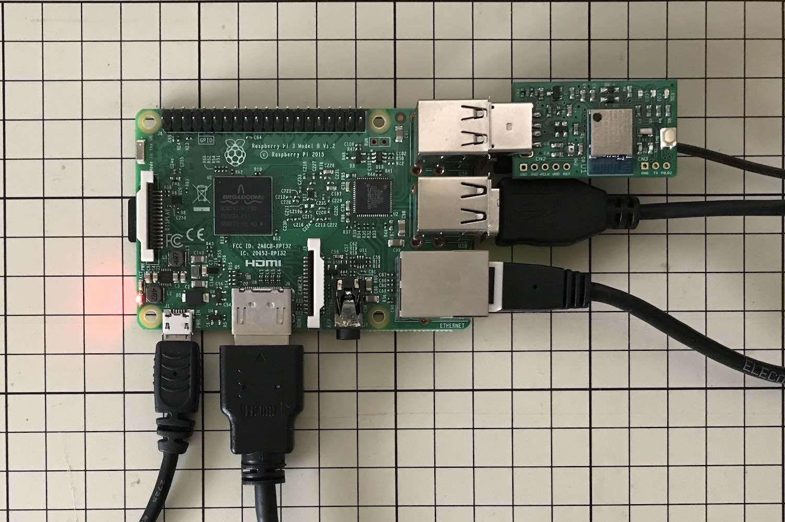

# OpenThread Border Router導入手順

最終更新日：2022/03/07

`Raspberry Pi 3 Model B`を使用し、OpenThread Border Router（以下、本ドキュメントにおいて <b>OTBR</b> と略します。）として構築する手順を記載しています。

下記は、`Raspberry Pi 3 Model B`＋[MDBT50Q Dongle](../../FIDO2Device/MDBT50Q_Dongle/README.md)を使用した、OTBRの構築イメージになります。


## Linuxシステム（ラズパイ）の準備

EthernetとWi-Fiが同時に使用できるPCに、Linuxシステムを構築します。

今回の例では、`Raspberry Pi 3 Model B`（本ドキュメントではラズパイと略します。）という基板を使用します。



#### システムイメージのコピー

下記サイトから`Raspberry Pi OS with desktop`をダウンロードします。<br>
[https://www.raspberrypi.org/software/operating-systems/](https://www.raspberrypi.org/software/operating-systems/)



ダウンロードしたOSのイメージファイルを、SDカードにコピーします。<br>
最終更新日現在、使用したOSイメージファイルは`2022-01-28-raspios-bullseye-armhf.img`になります。

以下のコマンドを実行します。

```
diskutil list
diskutil unmountDisk /dev/disk2
sudo dd bs=1m if=${HOME}/Downloads/2022-01-28-raspios-bullseye-armhf.img of=/dev/rdisk2; sync
sudo diskutil eject /dev/rdiskN
```

下記は実行例になります。

```
bash-3.2$ diskutil list
/dev/disk0 (internal, physical):
   #:                       TYPE NAME                    SIZE       IDENTIFIER
   0:      GUID_partition_scheme                        *500.3 GB   disk0
   1:                        EFI EFI                     314.6 MB   disk0s1
   2:                 Apple_APFS Container disk1         500.0 GB   disk0s2

/dev/disk1 (synthesized):
   #:                       TYPE NAME                    SIZE       IDENTIFIER
   0:      APFS Container Scheme -                      +500.0 GB   disk1
                                 Physical Store disk0s2
   1:                APFS Volume Macintosh HD            11.3 GB    disk1s1
   2:                APFS Volume Macintosh HD - Data     236.4 GB   disk1s2
   3:                APFS Volume Preboot                 86.1 MB    disk1s3
   4:                APFS Volume Recovery                529.0 MB   disk1s4
   5:                APFS Volume VM                      2.1 GB     disk1s5

/dev/disk2 (external, physical):
   #:                       TYPE NAME                    SIZE       IDENTIFIER
   0:      GUID_partition_scheme                        *15.5 GB    disk2
   1:                        EFI EFI                     209.7 MB   disk2s1
   2:       Microsoft Basic Data RPI                     15.3 GB    disk2s2

bash-3.2$ diskutil unmountDisk /dev/disk2
Unmount of all volumes on disk2 was successful
bash-3.2$
bash-3.2$ sudo dd bs=1m if=/Users/makmorit/Documents/Softwares/2022-01-28-raspios-bullseye-armhf.img of=/dev/rdisk2; sync
Password:
4040+0 records in
4040+0 records out
4236247040 bytes transferred in 376.821015 secs (11242067 bytes/sec)
bash-3.2$
bash-3.2$ sudo diskutil eject /dev/rdisk2
Password:
Disk /dev/rdisk2 ejected
bash-3.2$

```

イメージのコピーが完了したら、SDカードを一旦PCに装着し、`/boot`配下に`.ssh`という長さ０のファイルを作っておきます。

```
bash-3.2$ cd /Volumes/boot
bash-3.2$ touch .ssh
bash-3.2$ ls -al .ssh
-rwxrwxrwx  1 makmorit  staff  0  3  7 14:59 .ssh
bash-3.2$
```

これで、PCからSSH経由で、ラズパイにログインすることが出来るようになります。

#### OTBR導入作業の準備

SDカードをラズパイの基板にセット後、電源を入れてシステムを起動します。<br>
システムが起動すると、`arp -a`コマンドにより、ラズパイのIPアドレスを知ることができます。

```
bash-3.2$ arp -a
:
? (192.168.0.1) at xx:xx:xx:xx:xx:xx on en0 ifscope [ethernet]
raspberrypi (192.168.0.202) at xx:xx:xx:xx:xx:xx on en0 ifscope [ethernet]
? (192.168.0.255) at ff:ff:ff:ff:ff:ff on en0 ifscope [ethernet]
:
bash-3.2$
```

システムが起動したら、ラズパイにログインします。<br>
（ラズパイのデフォルトログインユーザー／パスワードは、`pi`／`raspberry`となっています）

```
bash-3.2$ ssh pi@192.168.0.202
The authenticity of host '192.168.0.202 (192.168.0.202)' can't be established.
ECDSA key fingerprint is SHA256:UAkgqFUuVpvtvZ/oR6Qu8RxQIbSAG7lKIVvVCijSFWw.
Are you sure you want to continue connecting (yes/no/[fingerprint])? yes
Warning: Permanently added '192.168.0.202' (ECDSA) to the list of known hosts.
pi@192.168.0.202's password:
Linux raspberrypi 5.10.92-v7+ #1514 SMP Mon Jan 17 17:36:39 GMT 2022 armv7l

The programs included with the Debian GNU/Linux system are free software;
the exact distribution terms for each program are described in the
individual files in /usr/share/doc/*/copyright.

Debian GNU/Linux comes with ABSOLUTELY NO WARRANTY, to the extent
permitted by applicable law.
Last login: Thu Mar  3 08:24:50 2022

SSH is enabled and the default password for the 'pi' user has not been changed.
This is a security risk - please login as the 'pi' user and type 'passwd' to set a new password.


Wi-Fi is currently blocked by rfkill.
Use raspi-config to set the country before use.

pi@raspberrypi:~ $
```

ログインが完了したら、為念でgitのインストールを実行します。

```
sudo apt install git
```

下記は実行例になります。

```
pi@raspberrypi:~ $ sudo apt install git
Reading package lists... Done
Building dependency tree... Done
Reading state information... Done
git is already the newest version (1:2.30.2-1).
The following package was automatically installed and is no longer required:
  libfuse2
Use 'sudo apt autoremove' to remove it.
0 upgraded, 0 newly installed, 0 to remove and 0 not upgraded.
pi@raspberrypi:~ $
```

## OTBRのインストール

下記サイトの指示に従い、インストールを進めます。<br>
[https://openthread.io/guides/border-router/raspberry-pi](https://openthread.io/guides/border-router/raspberry-pi)

#### ソースコードの取得

GitHubから、OTBRのソースコードを取得します。<br>
下記コマンドを実行します。

```
git clone https://github.com/openthread/ot-br-posix
```

下記は実行例になります。

```
pi@raspberrypi:~ $ pwd
/home/pi
pi@raspberrypi:~ $
pi@raspberrypi:~ $ git clone https://github.com/openthread/ot-br-posix
Cloning into 'ot-br-posix'...
remote: Enumerating objects: 266246, done.
remote: Counting objects: 100% (62010/62010), done.
remote: Compressing objects: 100% (18013/18013), done.
remote: Total 266246 (delta 43447), reused 61627 (delta 43144), pack-reused 204236
Receiving objects: 100% (266246/266246), 104.49 MiB | 4.35 MiB/s, done.
Resolving deltas: 100% (183083/183083), done.
pi@raspberrypi:~ $
```

#### インストールの準備

依存ライブラリー／パッケージの導入を実行します。<br>
下記コマンドを実行します。（実行例は<b>[こちら](assets05/otbr_bootstrap.log)</b>）

```
cd ot-br-posix
./script/bootstrap
```

#### インストールの実行

OTBRのビルド／インストールを実行します。<br>
下記コマンドを実行します。（実行例は<b>[こちら](assets05/otbr_setup_eth0.log)</b>）

```
INFRA_IF_NAME=eth0 ./script/setup
```

#### RCPの設定

別途、nRF52840を使いセットアップした`OpenThread RCP Dongle`[注1]を、ラズパイのOTBRに割り当てます。<br>
今回の例では、nRF52840デバイスとして、以前に製作した「[MDBT50Q Dongle](../FIDO2Device/MDBT50Q_Dongle/README.md)」を使用しております。

まずはラズパイのUSBポートに、MDBT50Q Dongleを装着します。



ラズパイに装着されたnRF52840のデバイス名を取得します。<br>
以下は、nRF52840が`/dev/ttyACM0`として認識された例です。

```
pi@raspberrypi:~/ot-br-posix $ ls -al /dev/tty*
crw-rw-rw- 1 root tty       5,  0 Jan 28 01:30 /dev/tty
crw--w---- 1 root tty       4,  0 Jan 28 01:30 /dev/tty0
:
crw--w---- 1 root tty       4,  9 Jan 28 01:30 /dev/tty9
crw-rw---- 1 root dialout 166,  0 Mar  3 09:10 /dev/ttyACM0
crw-rw---- 1 root dialout 204, 64 Jan 28 01:30 /dev/ttyAMA0
crw------- 1 root root      5,  3 Jan 28 01:30 /dev/ttyprintk
pi@raspberrypi:~/ot-br-posix $
```

`/etc/default/otbr-agent`というファイルの内容を確認し、記述されているデバイス名が、上記のデバイス名と整合していることを確認します。

```
pi@raspberrypi:~/ot-br-posix $ cat /etc/default/otbr-agent
# Default settings for otbr-agent. This file is sourced by systemd

# Options to pass to otbr-agent
OTBR_AGENT_OPTS="-I wpan0 -B eth0 spinel+hdlc+uart:///dev/ttyACM0 trel://eth0"
OTBR_NO_AUTO_ATTACH=0
pi@raspberrypi:~/ot-br-posix $
```

ここまで確認できたら、MDBT50Q DongleをUSBポートに装着したまま、ラズパイを再起動します。

```
sudo reboot
```

[注1]RCP=`Radio Co-Processor`

#### 各サービスの稼働確認

再起動が完了したら、RCP（nRF52840）および各サービス（`otbr-agent.service`、`otbr-web.service`）の稼働状況を確認します。<br>
以下は実行例になります。

```
pi@raspberrypi:~ $ sudo systemctl status
● raspberrypi
    State: running
     Jobs: 0 queued
   Failed: 0 units
    Since: Thu 1970-01-01 09:00:03 JST; 51 years 4 months ago
   CGroup: /
           ├─user.slice
           │ └─user-1000.slice
           │   ├─session-3.scope
           │   │ ├─ 695 lightdm --session-child 14 17
           │   │ ├─ 699 /usr/bin/lxsession -s LXDE-pi -e LXDE
           ：
           ├─init.scope
           │ └─1 /sbin/init splash
           └─system.slice
             ├─lightdm.service
             │ ├─531 /usr/sbin/lightdm
             │ └─574 /usr/lib/xorg/Xorg :0 -seat seat0 -auth /var/run/lightdm/root/:0 -nolisten tcp
             ：
             ├─avahi-daemon.service
             │ ├─413 avahi-daemon: running [raspberrypi.local]
             │ └─455 avahi-daemon: chroot helper
             ├─otbr-web.service
             │ └─384 /usr/sbin/otbr-web
             ├─wpa_supplicant.service
             │ └─407 /sbin/wpa_supplicant -u -s -O /run/wpa_supplicant
             ├─triggerhappy.service
             │ └─412 /usr/sbin/thd --triggers /etc/triggerhappy/triggers.d/ --socket /run/thd.socket --user nobody --deviceglob /dev/input/event*
             ├─systemd-logind.service
             │ └─390 /lib/systemd/systemd-logind
             ├─rtkit-daemon.service
             │ └─769 /usr/lib/rtkit/rtkit-daemon
             ├─cups.service
             │ ├─381 /usr/sbin/cupsd -l
             │ └─941 /usr/lib/cups/notifier/dbus dbus://
             ├─polkit.service
             │ └─507 /usr/lib/policykit-1/polkitd --no-debug
             ├─otbr-agent.service
             │ └─383 /usr/sbin/otbr-agent -I wpan0 -B eth0 spinel+hdlc+uart:///dev/ttyACM0 trel://eth0
             ：
pi@raspberrypi:~ $
```

以下は個別の動作確認になります。<br>
まずはRCPの状況確認を実行します。

```
sudo ot-ctl state
```

以下は実行例です。<br>
`disable`の文言は、RCPおよび`otbr-agent.service`は正常に稼働しているが、Threadネットワークには参加されていない状態であることを示します。

```
pi@raspberrypi:~ $ sudo ot-ctl state
disabled
Done
pi@raspberrypi:~ $
```

次に、Webブラウザーを起動し、`http://<ラズパイのIPアドレス>/`を実行します。<br>
下図のような管理画面が表示されれば、`otbr-web.service`が正常に稼働していることを示します。


以上で、OpenThread Border Router（OTBR）の構築は完了です。

## Wi-Fi APのセットアップ

OTBRと、Thread設定用スマートフォンを接続させるために必要となる、Wi-Fi AP（アクセスポイント）のセットアップを実行します。

#### 依存パッケージの導入

下記コマンドを実行します。（実行例は<b>[こちら](assets05/otbr_apt-get_install.log)</b>）

```
sudo apt-get install hostapd dnsmasq tayga
```

途中、`dnsmasq: failed to create listening socket for port 53: アドレスは既に使用中です`というメッセージが表示されますが、手順上は問題ありません。

#### IPv4アドレスの設定

まずは`wlan0`に対するDHCPを無効化します。<br>
`/etc/dhcpcd.conf`を新規作成し、下記エントリーを記述します。

```
denyinterfaces wlan0
```

次に、`wlan0`に対し、固定IPアドレスを割り当てます。<br>
`/etc/network/interfaces.d/wlan0`を新規作成し、下記エントリーを記述します。

```
allow-hotplug wlan0
iface wlan0 inet static
    address 192.168.1.2
    netmask 255.255.255.0
    network 192.168.1.0
    broadcast 192.168.1.255
```

#### `hostapd`の設定

`hostapd`（Wi-Fi APプロセス）の設定を行います。<br>
`/etc/hostapd/hostapd.conf`を新規作成し、下記エントリーを記述します。

```
# The Wi-Fi interface configured for static IPv4 addresses
interface=wlan0

# Use the 802.11 Netlink interface driver
driver=nl80211

# The user-defined name of the network
ssid=BorderRouter-AP

# Use the 2.4GHz band
hw_mode=g

# Use channel 6
channel=6

# Enable 802.11n
ieee80211n=1

# Enable WMM
wmm_enabled=1

# Enable 40MHz channels with 20ns guard interval
ht_capab=[HT40][SHORT-GI-20][DSSS_CCK-40]

# Accept all MAC addresses
macaddr_acl=0

# Use WPA authentication
auth_algs=1

# Require clients to know the network name
ignore_broadcast_ssid=0

# Use WPA2
wpa=2

# Use a pre-shared key
wpa_key_mgmt=WPA-PSK

# The network passphrase
wpa_passphrase=12345678

# Use AES, instead of TKIP
rsn_pairwise=CCMP
```

Wi-Fi APプロセスをバックグラウンド稼働させるようにします。<br>
`/etc/default/hostapd`に、以下のエントリーを記述します。

```
DAEMON_CONF="/etc/hostapd/hostapd.conf"
```

Wi-Fi APプロセスが、システム始動時に自動的に起動するよう設定します。<br>
以下のコマンドを実行します。
```
sudo systemctl unmask hostapd
sudo systemctl start hostapd
```

`/etc/systemd/system/hostapd.service`を新規作成し、下記エントリーを記述します。

```
[Unit]
Description=Hostapd IEEE 802.11 Access Point
After=sys-subsystem-net-devices-wlan0.device
BindsTo=sys-subsystem-net-devices-wlan0.device

[Service]
Type=forking
PIDFile=/var/run/hostapd.pid
ExecStart=/usr/sbin/hostapd -B /etc/hostapd/hostapd.conf -P /var/run/hostapd.pid

[Install]
WantedBy=multi-user.target
```

`/etc/rc.local`の最後に、以下のエントリーを記述します。

```
sudo service hostapd start
```

以上が完了したら、ラズパイを再起動させます。
```
sudo reboot
```

ラズパイが起動したら、任意のPCから、Wi-FiのSSID`BorderRouter-AP`が参照できることを確認します。


これで`hostapd`の設定は完了です。

#### `dnsmasq`の設定

`/etc/dnsmasq.conf`を、以下のエントリーで置き換えます。

```
# The Wi-Fi interface configured for static IPv4 addresses
interface=wlan0

# Explicitly specify the address to listen on
listen-address=192.168.1.2

# Bind to the interface to make sure we aren't sending things elsewhere
bind-dynamic

# Forward DNS requests to the Google DNS
server=8.8.8.8

# Don't forward short names
domain-needed

# Never forward addresses in non-routed address spaces
bogus-priv

# Assign IP addresses between 192.168.1.50 and 192.168.1.150 with a 12 hour lease time
dhcp-range=192.168.1.50,192.168.1.150,12h
```

`/lib/systemd/system/bind9.service`を新規作成し、下記エントリーを記述します。

```
After="network.target dnsmasq.service"
```

#### NATの設定

`/etc/tayga.conf`に、以下のエントリーがあるかどうか確認します。<br>
無い場合または異なる場合は、適宜修正します。

```
prefix 64:ff9b::/96
dynamic-pool 192.168.255.0/24
ipv6-addr 2001:db8:1::1
ipv4-addr 192.168.255.1
```

`/etc/default/tayga`に、以下のエントリーを追加します。

```
RUN="yes"
```

#### IP転送設定

以下のコマンドを実行します。
```
sudo sh -c "echo 1 > /proc/sys/net/ipv4/ip_forward"
sudo sh -c "echo 1 > /proc/sys/net/ipv6/conf/all/forwarding"
```

`/etc/sysctl.conf`に、に、以下のエントリーがあるかどうか確認します。<br>
無い場合または異なる場合は、適宜修正します。

```
net.ipv4.ip_forward=1
```

以下のコマンドを実行します
```
sudo iptables -t nat -A POSTROUTING -o eth0 -j MASQUERADE
sudo iptables -A FORWARD -i eth0 -o wlan0 -m state --state RELATED,ESTABLISHED -j ACCEPT
sudo iptables -A FORWARD -i wlan0 -o eth0 -j ACCEPT

sudo sh -c "iptables-save > /etc/iptables.ipv4.nat"
```

続いて`/etc/rc.local`の最後に、以下のエントリーを追加します。

```
iptables-restore < /etc/iptables.ipv4.nat
```

以上が完了したら、ラズパイを再起動します。
```
sudo reboot
```

#### Wi-Fi APの動作確認

ラズパイが再始動したら、サービスの稼働状況を為念確認します。<br>
下記コマンドを実行します。（実行例は<b>[こちら](assets05/otbr_systemctl_status.log)</b>）

```
sudo systemctl status
```

次に、任意のPCから、SSID`BorderRouter-AP`に接続し、インターネット上の任意のサイトをWebブラウザーで開きます。<br>
ブラウザーにサイトが表示されたら、Wi-Fi APは正常動作していることになります。


以上で、Wi-Fi APのセットアップは完了です。

## Threadネットワークのセットアップ

OpenThread Border Routerをインストールしただけでは、OpenThread RCP Dongleは機能しません。<br>
OpenThread RCP Dongleを装着したOpenThread Border Routerが`Leader`となっているThreadネットワークを、新規に生成する必要があります。

#### 手順

Webブラウザーを起動し、`http://<ラズパイのIPアドレス>/`を実行します。<br>
下図のような管理画面が表示されますので、左側の「Form」メニューをクリックします。


「Form Thread Networks」というタイトルの画面に遷移します。<br>
全項目、デフォルトのまま「FORM」ボタンをクリックします。


下図のようなポップアップが表示されるので「OKAY」をクリックします。


Threadネットワーク生成処理が開始されます。


Threadネットワーク生成処理が完了すると、下図のようなポップアップが表示されます。


Threadネットワーク生成が完了したら、適宜管理画面を閉じます。

#### 設定確認

ラズパイにログインし、コマンド`sudo ot-ctl netdata show`を実行します。<br>
下記のような状態になっていればOKです。

```
pi@raspberrypi:~ $ sudo ot-ctl netdata show
Prefixes:
fd11:22:0:0::/64 paros med 5000
Routes:
2001:268:c246:3003::/64 s med 5000
Services:
44970 01 3604b000000e10 s 5000
44970 5d fda1c37b951f7d96e4e7a0fe833f65dad11f s 5000
Done
pi@raspberrypi:~ $
```

これで、Threadネットワークのセットアップは完了です。

## ご参考

本件調査で作成したラズパイのシステムを丸ごとバックアップしておきます。

#### バックアップの準備

ラズパイからシステムが書き込まれているSDカードを抜いて、macOSに接続します。<br>
自動的に`boot`という名前のボリュームでマウントされます。

こちらのマウントを解除します。<br>
以下は実行例になります。

```
bash-3.2$ df
Filesystem    512-blocks      Used Available Capacity iused      ifree %iused  Mounted on
/dev/disk1s1   976490568  21455304 618022152     4%  487391 4881965449    0%   /
devfs                392       392         0   100%     685          0  100%   /dev
/dev/disk1s2   976490568 331313808 618022152    35% 1379723 4881073117    0%   /System/Volumes/Data
/dev/disk1s5   976490568   4196392 618022152     1%       2 4882452838    0%   /private/var/vm
map auto_home          0         0         0   100%       0          0  100%   /System/Volumes/Data/home
/dev/disk2s1      516190     99383    416807    20%       0          0  100%   /Volumes/boot
bash-3.2$
bash-3.2$ sudo umount -fv /Volumes/boot
Password:
/dev/disk2s1 unmount from /Volumes/boot
bash-3.2$
```

#### バックアップの実行

ファイルシステムのマウントを解除したら、ディスクユーティリティーコマンドでバックアップを取得します。<br>
以下のコマンドを実行します。
```
sudo dd if=<バックアップ元のファイルシステム> of=<バックアップ先のファイル名>
```

以下は実行例になります。

```
bash-3.2$ sudo dd if=/dev/disk2 of=RaspberryPi3B_backup.img
30253056+0 records in
30253056+0 records out
15489564672 bytes transferred in 2497.155708 secs (6202883 bytes/sec)
bash-3.2$
bash-3.2$ ls -al RaspberryPi3B_backup.img
-rw-r--r--  1 root  staff  15489564672  5 27 16:22 RaspberryPi3B_backup.img
bash-3.2$
```

以上で、ラズパイシステムSDカードのバックアップは完了です。
