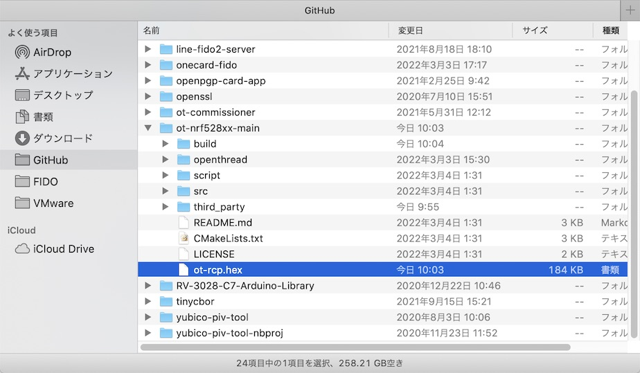

# OpenThread RCP Dongle導入手順

[MDBT50Q Dongle](https://github.com/diverta/onecard-fido/tree/master/FIDO2Device/MDBT50Q_Dongle)を`OpenThread RCP Dongle`として使用する手順について記載しています。

## 概要

`OpenThread RCP Dongle`は、MDBT50Q DongleをThreadネットワークの構成要素として転用させたデバイスです。<br>
別途構成する`OpenThread Border Router`の外付けThreadデバイス（`Radio Co-Processor`）として機能します。


下図は`OpenThread RCP Dongle`として[MDBT50Q Dongle](https://github.com/diverta/onecard-fido/tree/master/FIDO2Device/MDBT50Q_Dongle)、`OpenThread Border Router`として[Raspberry Pi 3](../../Research/Matter/OTBRSETUP.md)を使用する構成例です。


MDBT50Q Dongle（nRF52840）を`OpenThread RCP Dongle`として利用するためには、以降の手順により「[OpenThreadサンプルアプリケーション](https://github.com/openthread/ot-nrf528xx/blob/main/src/nrf52840/README.md)」をMDBT50Q Dongleに導入する必要があります。

[注1]Threadネットワークの構成要素についての詳細は「[`OpenThread > Guides > Node Roles and Types`](https://openthread.io/guides/thread-primer/node-roles-and-types)」ご参照

## ビルドの準備

#### ソースコードのダウンロード

ソースコードは、OpenThreadの特定バージョンを使用するため、GitHub Desktopなどのツールではなく、GitHubのリポジトリーサイトから直接.zipファイルをダウンロードするようにした方が確実です。

まずはGitHubのリポジトリー[`OpenThread on Nordic NRF528xx Example`](https://github.com/openthread/ot-nrf528xx)から、ソースコードをダウンロードします。


次に、上のページからOpenThreadライブラリーのリンク（上図では`openthread @ 6bb9631`とあるリンク）をクリックし、GitHubのリポジトリー[`openthread`](https://github.com/openthread/ot-nrf528xx)に遷移します。<br>
必ず、所定のバージョン（下図では`6bb9631e80`）がプルダウン上に表示されていることを確認してから、ソースコードをダウンロードします。


最後に、ダウンロードしたソースコードを適宜フォルダーに配置します。<br>
下図は、フォルダー`${HOME}/GitHub/ot-nrf528xx-main/`に配置した例です。


#### ビルドの準備

ビルドに必要な依存アプリケーション／ライブラリー等をインストールします。<br>
以下のコマンドを実行します。（実行例は<b>[こちら](assets05/rcp_bootstrap.log)</b>）

```
cd ${HOME}/GitHub/ot-nrf528xx-main
./script/bootstrap
```

## ファームウェアのビルドと書込み

#### ビルドの実行

ファームウェアのビルドを実行し、ファームウェアを作成します。<br>
以下のコマンドを実行します。（実行例は<b>[こちら](assets05/rcp_build_nrf52840.log)</b>）

```
cd ${HOME}/GitHub/ot-nrf528xx-main
./script/build nrf52840 USB_trans
arm-none-eabi-objcopy -O ihex build/bin/ot-rcp ot-rcp.hex
```

下図のように、プロジェクトディレクトリー配下に`ot-rcp.hex`というファームウェアイメージが生成されました。



#### ファームウェアの書込み

前述のファームウェアイメージ（`ot-rcp.hex`）を、それぞれMDBT50Q Dongleに書込みます。<br>
[nRF Connectツール](../nRF52840_app/NRFCONNECTINST.md)を使用して書込みすると便利です。

nRF Connectツールのアプリ「Programmer」を起動します。


「Programmer」が起動したら、右側のエリアに`.hex`ファイルをドラッグ＆ドロップして配置します。<br>
下図は`ot-rcp.hex`を右側のエリアに配置したところです。


画面左上部のプルダウンリストから「`PCA100nn`」を選択します。
- nRF52840 DKを使用して書き込む場合＝`PCA10056`
- nRF5340 DKを使用して書き込む場合＝`PCA10095`（下図ご参照）


書込み用のボード（今回の例ではnRF5340 DK）に接続されます。<br>
その後、画面右下部の「Write」ボタンをクリックし、書込みを開始させます。


書込みが完了すると、左側のエリアに書込みイメージが表示されます。<br>
画面左上部のプルダウンリストから「Close device」を選択し、nRF52840 DKから切断します。


メニューの「Quit」を選択して、nRF Connectツールを終了させます。


以上で、ファームウェアの書込みは完了です。

nRF Connectツール・nRF52840 DKを使用した、MDBT50Q Dongleへのファームウェア書込みについての詳細（機器配線方法、etc）は「[USBブートローダー書込み手順書](../nRF52840_app/firmwares/secure_bootloader/WRITESBL.md)」[注1]を参考にしてください。

[注1]`ot-rcp.hex`書き込みの際は、ソフトデバイス`s140_nrf52_7.2.0_softdevice.hex`の追加指定は不要です。
