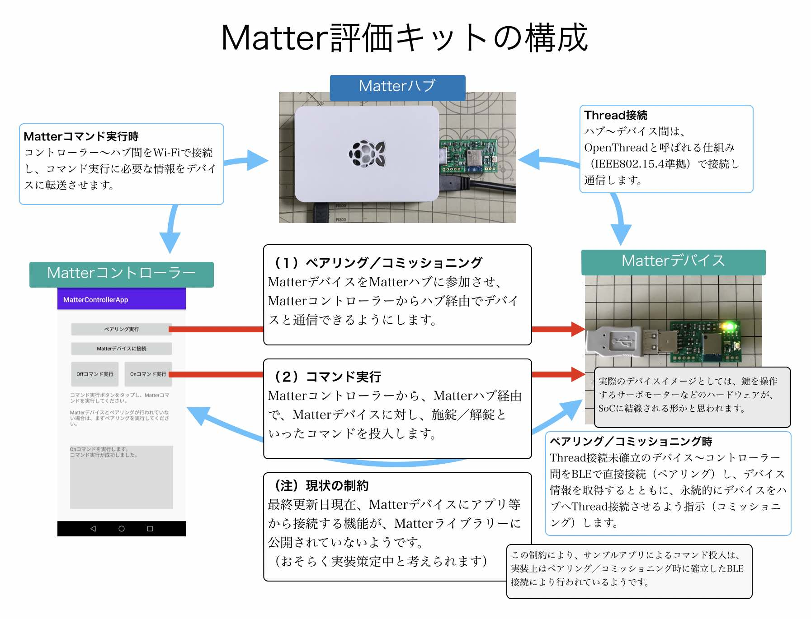

# Matter評価キット

最終更新日：2022/04/14

注：最終更新日現在のMatterは状況が混沌としており、仕様が確定しない様子です。 
この影響で過去（`2021/08/03`）に一旦制作したサンプルアプリは動作しなくなってしまった為、本リポジトリーからは削除しております。

## 概要
新しいスマートホーム共通規格「[Matter](https://buildwithmatter.com)」についての評価用ハードウェア／ソフトウェアです。

## 構成

本キットは、Matterコントローラー／デバイス／ハブの３点から構成されます。

#### Matterハブ
Matterコントローラー〜Matterデバイス間の中継役（ハブ）となるデバイスです。 
Raspberry Pi 3 Model Bを使用しています。

#### Matterコマンド
この評価用キットでは、数ある[Matterコマンド](https://github.com/project-chip/connectedhomeip/blob/master/src/controller/data_model/gen/CHIPClusters.h)のうち、`OnOffCluster`というコマンド群（クラスター）をサポートします。 
以下のコマンドがあります。
- `OffCommand`
- `OnCommand`
- `ToggleCommand`

## 手順書

[Matterアライアンス](https://buildwithmatter.com)が提供するサンプルについての手順書になります。

- <b>[Matterコントローラーサンプルアプリ更新手順](../MatterPoCKit/UPDATE_ANDROID_SAMPLE.md)</b> 
Matterコントローラーサンプルアプリ（Androidアプリ）をAndroid環境にインストールする手順について掲載しています。

- <b>[Matterデバイスサンプルアプリ更新手順](../MatterPoCKit/UPDATENCSSAMPLE.md)</b> 
Matterデバイスサンプルアプリ（ファームウェア）をnRF5340環境にインストールする手順について掲載しています。

- <b>[Matterハブ構築手順](../MatterPoCKit/SETUPHUB.md)</b> 
Matterハブを構築する手順について掲載します。

## Wi-Fi版Matterデバイス（ご参考）

開発ボード「ESP32-DevKitC」上に[ESP32版サンプルアプリ](https://github.com/project-chip/connectedhomeip/tree/master/examples/lock-app/esp32)を導入し、Wi-Fi版Matterデバイスの動作確認を行いました。 
結論としては前述のnRF5340サンプル（Thread版Matterデバイス）と等価の動作をします。

- <b>[ESP32版サンプルアプリのビルド手順](../MatterPoCKit/ESP32SAMPLE.md)</b> 
ESP32版サンプルアプリをビルドし、開発ボード「ESP32-DevKitC」に書き込む手順について掲載します。

- <b>[ESP32版サンプルアプリの動作確認手順](../MatterPoCKit/ESP32SAMPLECMD.md)</b> 
開発ボード「ESP32-DevKitC」に書き込まれたESP32版サンプルアプリの動作確認手順について掲載します。
