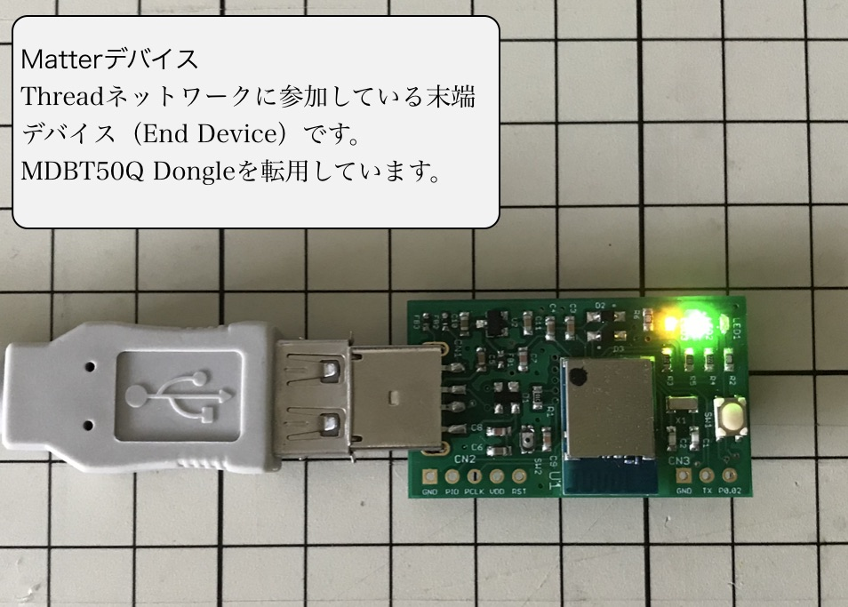

# Matter評価キット

## 概要
新しいスマートホーム共通規格「[Matter](https://buildwithmatter.com)」についての評価用ハードウェア／ソフトウェアです。

## 構成

本キットは、Matterコントローラー／デバイス／ハブの３点から構成されます。

#### Matterコントローラー
Matterコマンドを実行させる側の、Androidスマートフォン用のアプリです。

#### Matterデバイス
Matterコマンドを実行する側となる、nRF52840を組み込んだデバイスです。 
以前製作した「[MDBT50Q Dongle](../FIDO2Device/MDBT50Q_Dongle/README.md)」を、当面使用する想定です。

#### Matterハブ
Matterコントローラー〜Matterデバイス間の中継役（ハブ）となるデバイスです。 
Raspberry Pi 3 Model Bを使用しています。

#### Matterコマンド
この評価用キットでは、数ある[Matterコマンド](https://github.com/project-chip/connectedhomeip/blob/master/src/controller/data_model/gen/CHIPClusters.h)のうち、`OnOffCluster`というコマンド群（クラスター）をサポートします。 
以下のコマンドがあります。
- `OffCommand`
- `OnCommand`
- `ToggleCommand`

## 手順書

- <b>[Matterコントローラー導入手順]()</b> 
コントローラーアプリを、Android環境にインストールする手順について掲載します。

- <b>[Matterデバイスアプリ導入手順](../MatterPoCKit/INSTALLFW.md)</b> 
Matterデバイスアプリ（ファームウェア）をnRF52840環境にインストールする手順について掲載します。

- <b>[Matterハブ導入手順](../MatterPoCKit/SETUPHUB.md)</b> 
Matterハブを構築する手順について掲載します。

- <b>[Matterコマンド実行手順]()</b> 
コントローラーアプリを使用し、デバイスにMatterコマンドを送信する手順について掲載します。
