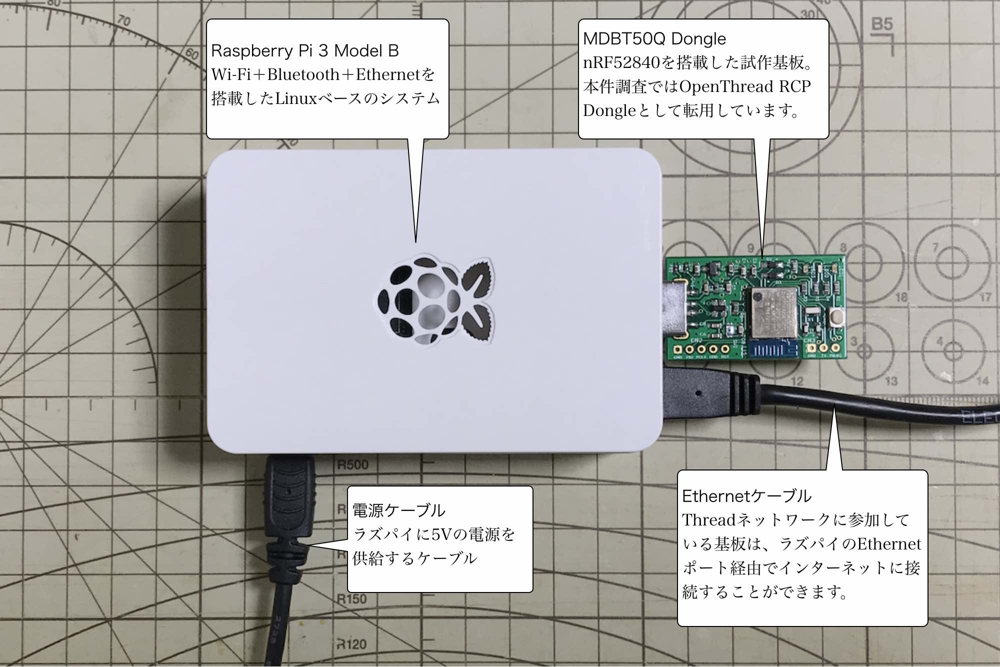

# Matterハブ構築手順

## 概要
Matterコントローラー〜デバイス間の仲介役となる「Matterハブ」を構築する手順について掲載しています。

## 構成



- <b>OpenThread Border Router</b>（以下「OTBR」）<br>
Matterコントローラー〜デバイス間の仲介役となるサーバーソフトウェアです。<br>
Matter評価キットでは、Raspberry Pi 3 Model B（以下「ラズパイ」）をOTBRとして使用します。

- <b>OpenThread RCP Dongle</b>（以下「RCPドングル」）<br>
Thread（IEEE802.15.4準拠のネットワーク）通信機能を持たないラズパイが、Thread通信機能を持つMatterデバイスと、通信できるようにするために必要なドングルです。<br>
Matter評価キットでは、[MDBT50Q Dongle](../FIDO2Device/MDBT50Q_Dongle)をRCPドングルとして使用します。

- <b>Ethernetネットワーク</b><br>
OTBRをインターネットに接続するために必要となります。

## 手順書

まず最初に、RCPドングル構築 --> OTBR構築の順に構築作業を進めます。

#### [OpenThread Dongle導入手順](../../Research/Matter/OTDONGLE.md)

MDBT50Q Dongleを、RCPドングルとして使用する手順について記載しています。

#### [OpenThread Border Router導入手順](../Research/Matter/OTBRSETUP.md)

ラズパイにOTBRを構築する手順について記載しています。

#### Matterハブ開始手順

前述２点の手順書により、RCPドングル構築、OTBR構築が完了したら、ラズパイを一旦停止させ、RCPドングルはラズパイから外しておきます。

その後、RCPドングル非装着の状態で、ラズパイを起動します。<br>
起動したら、ラズパイにSSHでログオンします。

```
bash-3.2$ ssh pi@192.168.100.165
pi@192.168.100.165's password:
Linux raspberrypi 5.10.17-v7+ #1403 SMP Mon Feb 22 11:29:51 GMT 2021 armv7l

The programs included with the Debian GNU/Linux system are free software;
the exact distribution terms for each program are described in the
individual files in /usr/share/doc/*/copyright.

Debian GNU/Linux comes with ABSOLUTELY NO WARRANTY, to the extent
permitted by applicable law.
Last login: Thu Jul 15 16:52:32 2021
pi@raspberrypi:~ $
```

SSHログオンが成功したら、この時点でRCPドングルをラズパイに装着します。<br>
以降、SSH経由で以下のコマンドを投入します。<br>
（１秒ほど間隔を開けて実行すると確実なようです）

```
# インターネット接続を確認
ping google.com

# 明示的にprefixを設定（エージェントを再始動）
sudo ot-ctl br disable
sudo ot-ctl prefix add fd11:22::/64 pasor
sudo ot-ctl br enable

# 設定反映を確認
sudo ot-ctl netdata show
```

以下は実行例になります。

```
pi@raspberrypi:~ $ ping google.com
PING google.com(kix06s05-in-x0e.1e100.net (2404:6800:400a:80c::200e)) 56 data bytes
64 bytes from kix06s05-in-x0e.1e100.net (2404:6800:400a:80c::200e): icmp_seq=1 ttl=56 time=58.9 ms
64 bytes from kix06s05-in-x0e.1e100.net (2404:6800:400a:80c::200e): icmp_seq=2 ttl=56 time=78.0 ms
64 bytes from kix06s05-in-x0e.1e100.net (2404:6800:400a:80c::200e): icmp_seq=3 ttl=56 time=76.8 ms
64 bytes from kix06s05-in-x0e.1e100.net (2404:6800:400a:80c::200e): icmp_seq=4 ttl=56 time=75.3 ms
64 bytes from kix06s05-in-x0e.1e100.net (2404:6800:400a:80c::200e): icmp_seq=5 ttl=56 time=74.4 ms
^C
--- google.com ping statistics ---
5 packets transmitted, 5 received, 0% packet loss, time 9ms
rtt min/avg/max/mdev = 58.874/72.659/77.968/7.007 ms
pi@raspberrypi:~ $
pi@raspberrypi:~ $ sudo ot-ctl br disable
Done
pi@raspberrypi:~ $ sudo ot-ctl prefix add fd11:22::/64 pasor
Done
pi@raspberrypi:~ $ sudo ot-ctl br enable
Done
pi@raspberrypi:~ $ sudo ot-ctl netdata show
Prefixes:
fd11:22:0:0::/64 paros med 8400
Routes:
2001:268:c1c5:37ec::/64 s med 8400
Services:
44970 5d fd6a32cace204ad62235de584291c49dc001 s 8400
44970 01 af04b000000e10 s 8400
Done
pi@raspberrypi:~ $
```

作業か完了したら、ラズパイからログオフします。

以上で、Matterハブ開始作業は完了になります。<br>
以降は、ラズパイを停止-->起動するごとに、この「Matterハブ開始」作業が必要になります。
