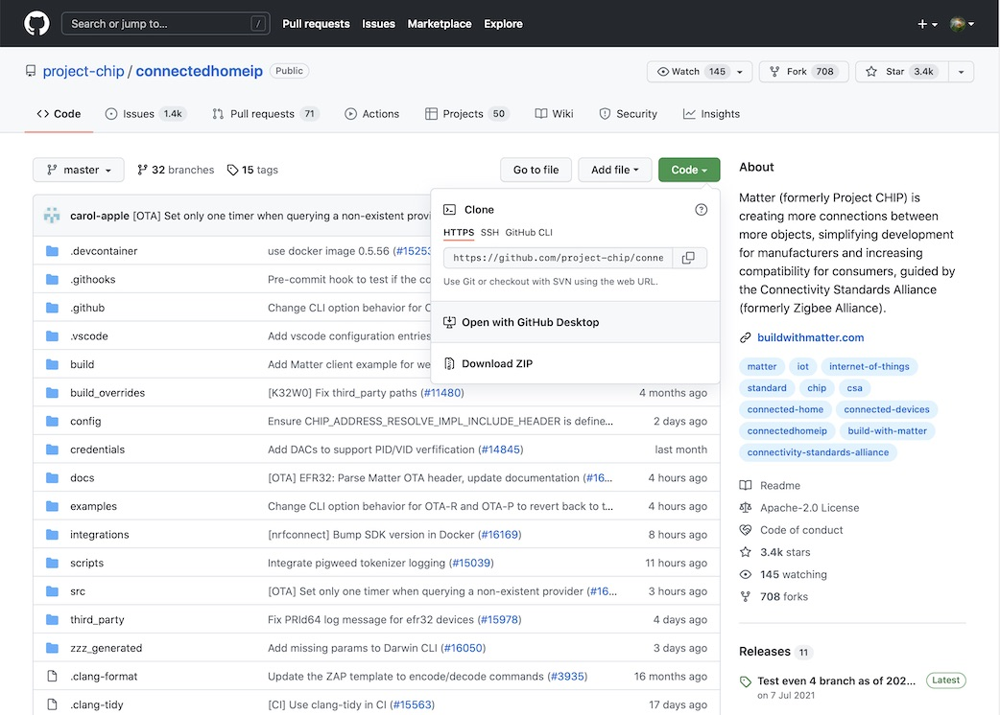
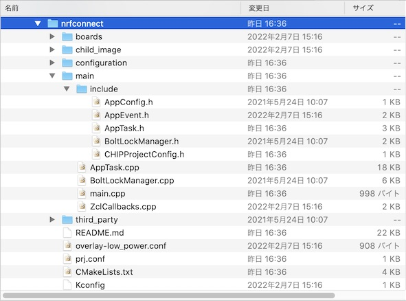

# Matterデバイスサンプルアプリ更新手順

最終更新日：2022/3/15

## 概要

[Matterデバイスサンプルアプリ（ファームウェア）](../MatterPoCKit/nrfconnect/)をnRF5340環境にインストールする手順について掲載しています。

以下の順番で作業を進めます。
- サンプルアプリのソースコード更新
- ファームウェアのビルド
- ファームウェアの書込み
- 動作確認

## サンプルアプリのソースコード更新

#### 最新版Matterリポジトリーの導入

まず最初に、Matterリポジトリー（[https://github.com/project-chip/connectedhomeip](https://github.com/project-chip/connectedhomeip)）を最新版に更新しておきます。<br>
Matterリポジトリーの更新は、アプリ「GitHub Desktop」を使用すると便利です。



#### ソースコードの更新

Matterリポジトリーのサンプルフォルダー「`connectedhomeip/examples/lock-app/nrfconnect`」配下にある、C++のソースコード／ヘッダーファイルを最新版に置き換えます。



置き換え対象ファイルは以下になります。

|# |ファイルパス|
|:--|:--|
|1 |`main/include/AppConfig.h`|
|2 |`main/include/AppEvent.h`|
|3 |`main/include/AppTask.h`|
|4 |`main/include/BoltLockManager.h`|
|5 |`main/include/CHIPProjectConfig.h`|
|6 |`main/AppTask.cpp`|
|7 |`main/BoltLockManager.cpp`|
|8 |`main/main.cpp`|
|9 |`main/ZclCallbacks.cpp`|

#### 各種定義ファイルの更新

前述の位置にある各種定義ファイルを更新します。<br>
該当ファイルは以下になります。

|# |ファイルパス|備考|
|:--|:--|:--|
|1 |`boards/nrf5340dk_nrf5340_cpuapp.conf`||
|2 |`boards/nrf5340dk_nrf5340_cpuapp.overlay`||
|3 |`child_image/multiprotocol_rpmsg.conf`||
|4 |`configuration/nrf5340dk_nrf5340_cpuapp/pm_static.yml`||
|5 |`configuration/mcuboot_multi_image_dfu.conf`||
|6 |`prj.conf`|一部書き換えが必要|
|7 |`CMakeLists.txt`|一部書き換えが必要|
|8 |`Kconfig`||

## ファームウェアのビルド

#### 最新版nCSのインストール

まず最初に、nRF Connect SDKを最新版に更新しておきます。<br>
具体的な手順につきましては、別途手順書<b>「[nRF Connect SDKインストール手順書](../nRF5340_app/INSTALLSDK.md)」</b>をご参照願います。

#### ビルド用スクリプトの用意

ビルド／書込み時に便利なスクリプトを生成しておきます。（内容は<b>[こちら](../MatterPoCKit/nrfconnect/westbuild.sh)</b>）<br>
一度作成しておけば、大きな修正が発生しない限り、継続して利用できます。

#### ビルド実行

ビルド用スクリプト[`westbuild.sh`](../MatterPoCKit/nrfconnect/westbuild.sh)を使用し、ファームウェアのビルドを実行します。（実行例は<b>[こちら](assets06/westbuild.log)</b>）

## ファームウェアの書込み

#### 書込み実行

ビルド用スクリプト[`westbuild.sh -f`](../MatterPoCKit/nrfconnect/westbuild.sh)を使用し、ファームウェアのビルドを実行します。（実行例は<b>[こちら](assets06/westbuild_f.log)</b>）

## 動作確認

nRF5340のUART出力から、下記のようなデバッグプリントが出力されるのを確認します。

```
I: nRF5 802154 radio initialized
I: 4 Sectors of 4096 bytes
I: alloc wra: 0, fe8
I: data wra: 0, 0
*** Booting Zephyr OS build v2.7.99-ncs1-17-gc3208e7ff49d  ***
I: Init CHIP stack
I: 914 [DL]BLE address: C3:FB:99:85:FE:61
I: 944 [DL]OpenThread started: OK
I: 947 [DL]Setting OpenThread device type to MINIMAL END DEVICE
I: 953 [ZCL]Using ZAP configuration...
D: 958 [DMG]Failed to read stored attribute (0, 0x0000_0028, 0x0000_0005: a0
D: 965 [DMG]Failed to read stored attribute (0, 0x0000_0028, 0x0000_0010: a0
D: 973 [DMG]Failed to read stored attribute (0, 0x0000_002B, 0x0000_0001: a0
D: 980 [DMG]Failed to read stored attribute (0, 0x0000_002C, 0x0000_0000: a0
D: 987 [DMG]Failed to read stored attribute (0, 0x0000_002C, 0x0000_0001: a0
I: 996 [ZCL]Initiating Admin Commissioning cluster.
I: 1000 [ZCL]OpCreds: Initiating OpCreds cluster by writing fabrics list from fabric table.
D: 1008 [DIS]Add fabric pairing table delegate
E: 1013 [ZCL]Trying to write invalid Calendar Type
E: 1017 [ZCL]Failed to write calendar type with error: 0x87
D: 1023 [DMG]Endpoint 1, Cluster 0x0000_0006 update version to 5ef73c81
D: 1029 [DIS]Init fabric pairing table with server storage
I: 1034 [IN]Loading from storage for fabric index 1
I: 1039 [IN]Loading from storage for fabric index 2
I: 1044 [IN]Loading from storage for fabric index 3
I: 1048 [IN]Loading from storage for fabric index 4
I: 1053 [IN]Loading from storage for fabric index 5
I: 1058 [DMG]AccessControl: initializing
I: 1061 [DMG]Examples::AccessControlDelegate::Init
I: 1066 [DMG]AccessControl: unable to load stored ACL entries; using empty list instead
I: 1074 [DMG]AccessControl: setting
D: 1077 [IN]UDP::Init bind&listen port=5540
D: 1081 [IN]UDP::Init bound to port=5540
D: 1085 [IN]BLEBase::Init - setting/overriding transport
D: 1090 [IN]TransportMgr initialized
D: 1097 [DIS]Add fabric pairing table delegate
D: 1103 [DIS]DNS-SD StartServer mode=0
D: 1106 [DL]Using Thread extended MAC for hostname.
I: 1111 [DIS]Failed to find a valid admin pairing. Node ID unknown
I: 1117 [DIS]Start dns-sd server - no current nodeId
D: 1122 [DL]Using Thread extended MAC for hostname.
I: 1127 [DIS]Advertise commission parameter vendorID=65521 productID=32774 discriminator=3840/15
E: 1136 [DIS]Failed to advertise unprovisioned commissionable node: Error CHIP:0x00000003
D: 1143 [DIS]Scheduling Discovery timeout in secs=900
E: 1148 [DIS]Failed to finalize service update: Error CHIP:0x0000001C
I: 1154 [IN]CASE Server enabling CASE session setups
E: 1159 [DIS]Failed to proxy operational discovery: missing delegate
D: 1165 [ZCL]Emitting StartUp event
D: 1169 [EVL]LogEvent event number: 0x0000000000000000 priority: 2, endpoint id:  0x0 cluster id: 0x0000_0028 event id: 0x0 Sys timestamp: 0x0000000000000490
I: 1182 [ZCL]GeneralDiagnosticsDelegate: OnDeviceRebooted
D: 1188 [DMG]Endpoint 0, Cluster 0x0000_0033 update version to 28c0e252
D: 1194 [EVL]LogEvent event number: 0x0000000000000001 priority: 2, endpoint id:  0x0 cluster id: 0x0000_0033 event id: 0x3 Sys timestamp: 0x00000000000004AA
I: 1208 [SVR]Server Listening...
I: 1211 [DL]Device Configuration:
I: 1214 [DL]  Serial Number: TEST_SN
I: 1218 [DL]  Vendor Id: 65521 (0xFFF1)
I: 1221 [DL]  Product Id: 32774 (0x8006)
I: 1225 [DL]  Hardware Version: 0
I: 1229 [DL]  Setup Pin Code (0 for UNKNOWN/ERROR): 20202021
I: 1235 [DL]  Setup Discriminator (0xFFFF for UNKNOWN/ERROR): 3840 (0xF00)
I: 1242 [DL]  Manufacturing Date: (not set)
I: 1246 [DL]  Device Type: 65535 (0xFFFF)
I: 1251 [SVR]SetupQRCode: [MT:8IXS142C00KA0648G00]
I: 1255 [SVR]Copy/paste the below URL in a browser to see the QR Code:
I: 1262 [SVR]https://dhrishi.github.io/connectedhomeip/qrcode.html?data=MT%3A8IXS142C00KA0648G00
I: 1270 [SVR]Manual pairing code: [34970112332]
D: 1275 [DL]CHIP task running
```

以上で、Matterデバイスサンプルアプリの更新は完了です。
