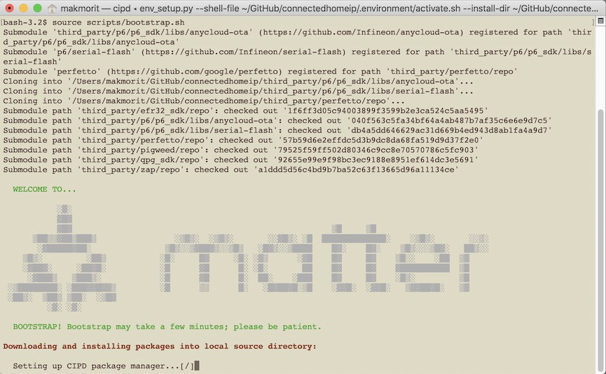
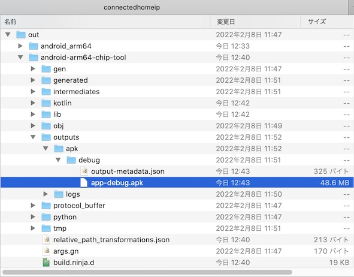

# Matterコントローラーサンプルアプリ更新手順

最終更新日：2022/3/15

## 概要

[Matterコントローラーサンプルアプリ（Androidアプリ）](https://github.com/project-chip/connectedhomeip/tree/master/src/android/CHIPTool)を、Android環境にインストールする手順について掲載しています。

以下の順番で作業を進めます。
- アプリのビルド
- ファームウェアの書込み
- 動作確認

## アプリのビルド準備

#### 最新版Matterリポジトリーの導入

まず最初に、Matterリポジトリー（[https://github.com/project-chip/connectedhomeip](https://github.com/project-chip/connectedhomeip)）を最新版に更新しておきます。<br>
Matterリポジトリーの更新は、アプリ「GitHub Desktop」を使用すると便利です。


#### ビルド準備の実行

Matterリポジトリーに用意されているスクリプト`scripts/bootstrap.sh`を実行し、依存モジュール導入等の準備処理を行います。<br>
実行コマンドは下記になります。（実行例は<b>[こちら](assets06/scripts_bootstrap.log)</b>）

```
cd ${HOME}/GitHub/connectedhomeip
export PKG_CONFIG_PATH=${PKG_CONFIG_PATH}:/usr/local/Cellar/openssl@1.1/1.1.1k/lib/pkgconfig/
source scripts/bootstrap.sh
```



#### ビルド環境の構築

サンプルアプリをビルドするための各種設定を実行します。<br>
実行コマンドは下記になります。（実行例は<b>[こちら](assets06/android_app_ide.log)</b>）

```
cd ${HOME}/GitHub/connectedhomeip
. scripts/activate.sh
export ANDROID_NDK_HOME=/Applications/AndroidNDK7075529.app/Contents/NDK
export ANDROID_HOME=${HOME}/Library/Android/sdk
export PKG_CONFIG_PATH=${PKG_CONFIG_PATH}:/usr/local/Cellar/openssl@1.1/1.1.1k/lib/pkgconfig/
TARGET_CPU=arm64 ./scripts/examples/android_app_ide.sh
```

## ビルドの実行

サンプルアプリをビルドします。<br>
実行コマンドは下記になります。（実行例は<b>[こちら](assets06/build_examples.log)</b>）

```
cd ${HOME}/GitHub/connectedhomeip
./scripts/build/build_examples.py --target android-arm64-chip-tool build
```

ビルドが完了したら、`connectedhomeip/out/android-arm64-chip-tool/outputs/apk/debug`というフォルダー配下に、Androidアプリが生成されていることを確認します。<br>
（ファイル名は`app-debug.apk`になります）



このファイルを、USB経由でAndroidスマートフォンに転送-->ダウンロードし、アプリをインストールします。

以上で、Matterコントローラーサンプルアプリの更新は完了です。
