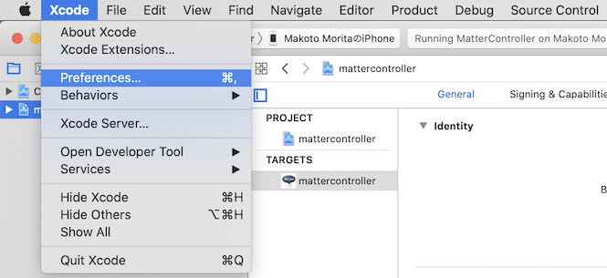
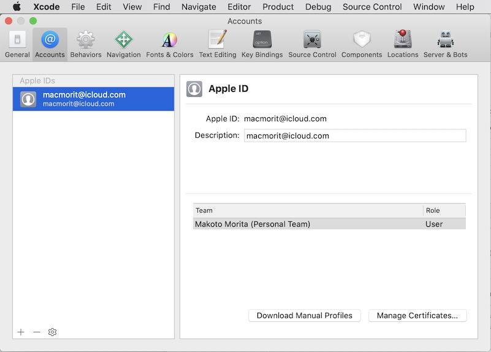
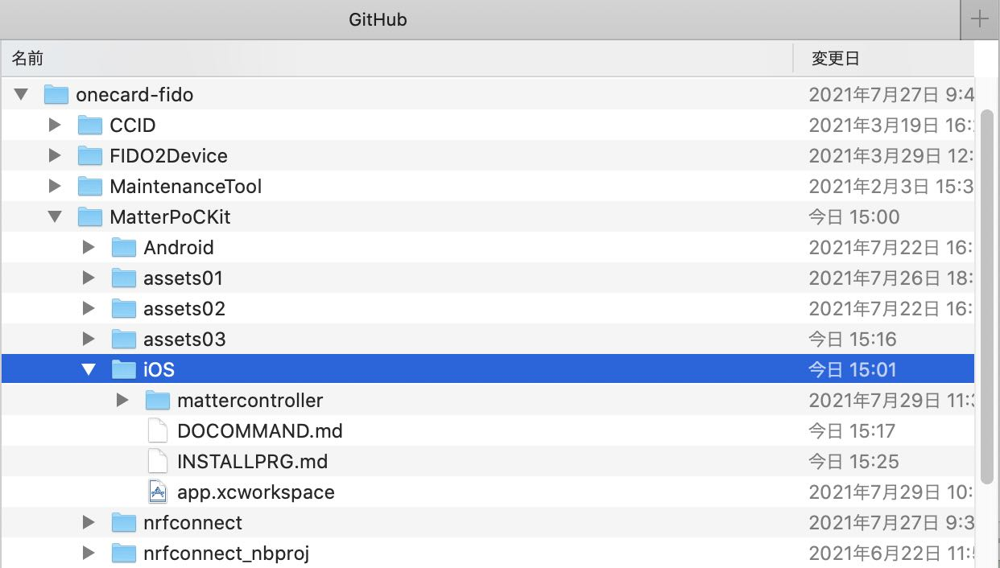
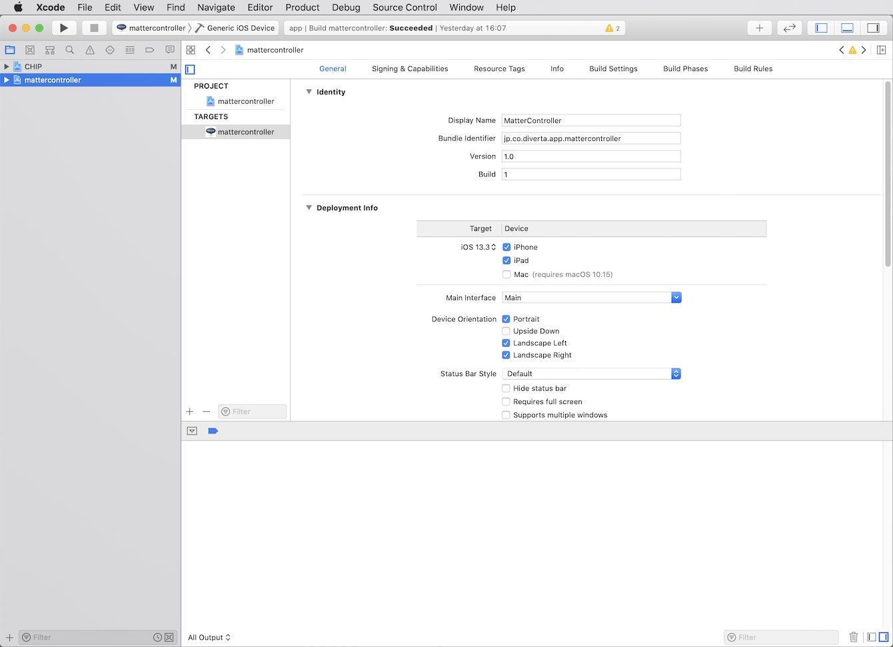
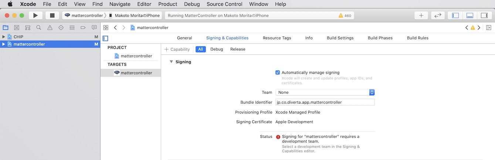
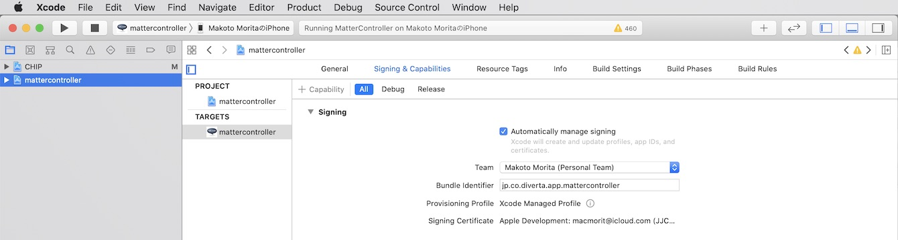
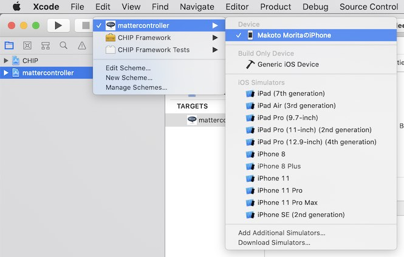
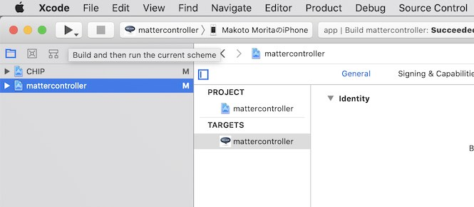
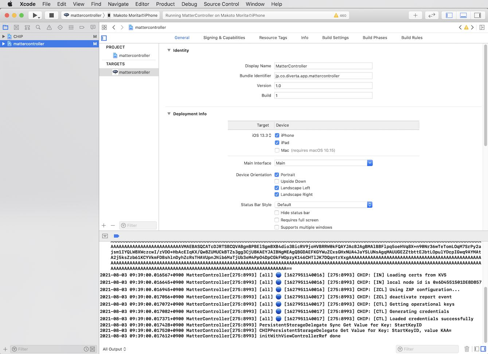

# Matterコントローラーアプリ導入手順

最終更新日：2021/08/03

## 概要
MatterコントローラーアプリをiOS環境（iPhone）にインストールする手順について掲載しています。

#### 制約

最終更新日現在、開発者がApple Developer Programメンバーシップ（Apple社から承認されている開発アカウント）を保有していないため、アプリをインターネットからダウンロード-->インストールという通常の導入手順が利用できません。

したがって、iPhoneとPCをUSB接続した上で、Xcodeを使用してアプリのインストールを行う必要があります。

#### 動作確認時の環境

- iPhone SE (1st generation) - iOS 13.3

- iMac Pro (2019) - macOS Catalina (Version 10.15.5)

- Xcode (Version 11.5)

## Xcodeの準備

iOS環境では、Apple社が承認していないアプリケーションのインストールができないようになっています。 
従いまして、本プロジェクトで制作したMatterコントローラーアプリは、開発ツール「Xcode」を使用し、インストールを行う必要があります。

アプリのインストールでは、Xcodeを使用し、ソースコードのビルドからiPhoneへのアプリ転送までを一気通貫で行います。

#### Xcodeアカウントの準備

Xcodeに開発用のユーザーアカウントを設定しておきます。 
Xcodeのメニューから「`Preferences`」を実行し、設定画面を開きます。

設定画面のタブ「`Accounts`」で、任意のApple IDを追加します。 
`Team`欄に、`Personal Team`が表示されていれば、準備は完了です。

## アプリの準備

[Matterコントローラーアプリ](../../MatterPoCKit/iOS)を、[GitHubリポジトリー](https://github.com/diverta/onecard-fido/tree/research-Matter-20210726)からチェックアウトします。 
下図は、チェックアウトされたGitHubリポジトリーにおけるMatterコントローラーのソースコードの位置を示しています。

macOSにインストールされたXcodeにより、ワークスペースを開きます。 
上図のファイル「`app.xcworkspace`」をダブルクリックします。

Xcodeのワークスペース画面が開きます。 
この時点ではPCにiPhoneが接続されていないので、ターゲットのデバイス名は「Generic iOS Device」となっています。

#### Xcodeアカウントの設定

開いたXcodeワークスペース画面の左ペインで、プロジェクト`mattercontroller`を選択後、画面右側のタブ`Signing & Capabilities`を開きます。 
`Team`欄が`None`となっています。

前述「Xcodeアカウントの準備」でXcodeに設定しておいた`Personal Team`を、`Team`欄のプルダウンから選択し、設定します。

## アプリのインストール

iPhoneをPCに接続します。 
その後Xcode画面上で、ターゲットを、接続したiPhoneに切り替えます。

画面左上部の黒い三角形のアイコンをクリックすると、ビルド-->インストールが開始されます。

ほどなくアプリのインストールが完了します。 
iPhone上でアプリが自動的に始動し、デバッグプリントがXcode画面下部に出力されます。

以上で、アプリのインストールは完了になります。
