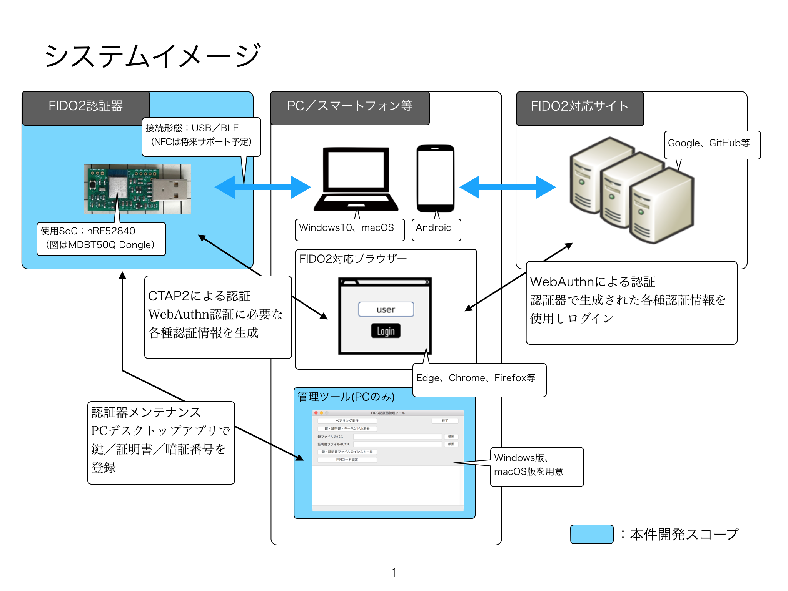
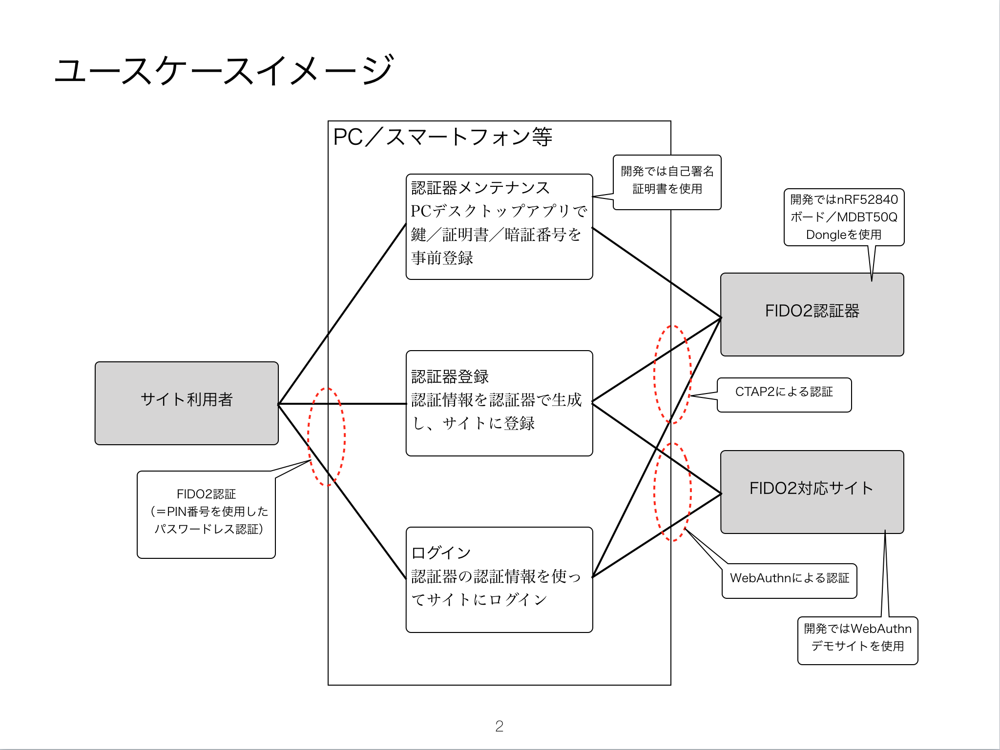

# One Card FIDO対応

One CardにFIDO U2F／WebAuthn認証機能を実装するプロジェクトです。

## プログラム

- <b>[FIDO2アプリケーション](nRF5_SDK_v15.3.0)</b> 
Nordic社のSoC「nRF52840」を使用した、FIDO U2F／WebAuthn認証器のファームウェアです。 
[MDBT50Q Dongle](FIDO2Device/MDBT50Q_Dongle)と、nRF52840 DK（開発ボード）に対応しています。

- <b>[FIDO認証器管理ツール](MaintenanceTool)</b> 
FIDO2認証器に、鍵・証明書・PINを導入するために使用する、デスクトップ・ツールです。 
[Windows版](MaintenanceTool/WindowsExe)、[macOS版](MaintenanceTool/macOSApp)の両方を用意しております。

## ハードウェア

- <b>[MDBT50Q Dongle](FIDO2Device/MDBT50Q_Dongle)</b> 
Nordic社のSoC「nRF52840」を使用した、FIDO U2F／WebAuthn認証器です。 
日本国内の技適取得済みであるnRF52840搭載モジュール「MDBT50Q」を使用し、nRF52840 Dongleとほぼ同じ仕様で製作しております。 
PCのUSBポート装着時はUSB HIDデバイスとして稼働し、ボタン乾電池装着時はBLEペリフェラルデバイスとして稼働します。

## What's new

#### 2020/1/15

[MDBT50Q Dongle](FIDO2Device/MDBT50Q_Dongle)のファームウェアを修正しました。 

- <b>[nRF52840ファームウェア（Version 0.2.5）](https://github.com/diverta/onecard-fido/tree/improve-nRF52840-disable-usb-cdc/nRF5_SDK_v15.3.0/firmwares)</b>

修正点は以下になります。（[#299](https://github.com/diverta/onecard-fido/pull/299) ご参照）
- MDBT50Q Dongleの仮想COMポートを閉塞 
macOS上で、仮想COMポートドライバー関連の障害が確認されているため、仮想COMポートを使用している機能「[デバイスのRSSI値ログ出力](https://github.com/diverta/onecard-fido/tree/improve-nRF52840-disable-usb-cdc/FIDO2Device/MDBT50Q_Dongle/DEMOFUNC_1.md)」を、為念で閉塞させていただきたく存じます。 
（[#260](https://github.com/diverta/onecard-fido/issues/260) ご参照。FIDO機能ではなく、デモ機能として追加したものになります。）

#### 2019/12/25

Windows版 FIDO認証器管理ツールのインストーラーを作成しました。 

- <b>[Windows版 FIDO認証器管理ツール（Version 0.1.23）](https://github.com/diverta/onecard-fido/blob/improve-FIDO2MT-Windows-make-installer/MaintenanceTool/WindowsExe/MaintenanceToolWin.zip)</b>

インストール方法につきましては、<b>[こちらの手順書](https://github.com/diverta/onecard-fido/blob/improve-FIDO2MT-Windows-make-installer/MaintenanceTool/WindowsExe/INSTALLPRG.md)</b>をご参照願います。 
なお、ツール本体のプログラム修正はありません。

#### 2019/12/24

FIDO認証器管理ツールを修正しました。 

- <b>[macOS版 FIDO認証器管理ツール（Version 0.1.23）](https://github.com/diverta/onecard-fido/blob/improve-FIDO2MT-macOS-view-log-file/MaintenanceTool/macOSApp/MaintenanceTool.pkg)</b>

- <b>[Windows版 FIDO認証器管理ツール（Version 0.1.23）](https://github.com/diverta/onecard-fido/blob/improve-FIDO2MT-Windows-view-log-file/MaintenanceTool/WindowsExe/MaintenanceToolWin.zip)</b>

修正点は以下になります。（[#278](https://github.com/diverta/onecard-fido/issues/278) ご参照）
- 管理ツールに、ログファイルが格納されているディレクトリーを開いて参照できるようにする機能を追加

<b>【ご注意】 
このバージョンのFIDO認証器管理ツールを使用される場合は、お手数ですが、合わせて[MDBT50Q Dongle](FIDO2Device/MDBT50Q_Dongle)のファームウェアを下記バージョンに更新いただきたくお願いします。</b> 
（鍵・証明書インストール時、管理ツール側で転送内容を暗号化するように修正したため、ファームウェア側が旧バージョンのままだと、転送内容が復号化されず、鍵・証明書インストールが正しく実行できません）

- <b>[nRF52840ファームウェア（Version 0.2.4）](https://github.com/diverta/onecard-fido/tree/improve-nRF52840-decrypt-pkcert/nRF5_SDK_v15.3.0/firmwares)</b>

#### [過去の更新履歴はこちら](HISTORY.md)

## FIDO2について

#### イメージ図

#### CTAP2とは

FIDOの新世代パスワードレス認証（<b>WebAuthn</b>）に対応するために用意された、FIDO 2.0の技術仕様です。

[FIDO2アプリケーション](nRF5_SDK_v15.3.0)では、既にUSB HIDトランスポート、BLEトランスポートに対応しています。 
NFCトランスポートは、後日対応予定です。

また、Windows環境（Edgeブラウザー）でのWebAuthnは、PINコード（暗証番号）入力が必須となるのですが、こちらの方もすでに対応済みとなっております。

Windows環境による具体的なテスト方法は、別途手順書[「Edgeブラウザーを使用したWebAuthnテスト手順」](FIDO2Device/MDBT50Q_Dongle/WEBAUTHNTEST.md)をご参照ください。

## 以前の仕様

以下の項目は、FIDOの旧世代２要素認証（U2F）に関する開発物件になります。 
[FIDO2アプリケーション](nRF5_SDK_v15.3.0)においては、U2FはCTAP2と同居していますので、現在も稼働させることができます。

ただし、U2FはChromeブラウザーのみのサポートであり、かつ将来的にサポートが拡張される予定もないため、現在はメンテナンスをストップさせております。 
何卒ご容赦ください。

#### BLE U2Fサービス

One CardのBLE上で稼働するFIDO U2F機能です。 
U2F v1.2の仕様に準拠しております。

FIDO U2Fに関する情報 : https://fidoalliance.org/download/

FIDO U2F対応デバイスは、USBポートに挿して使用する「YubiKey」が有名ですが、BLE U2Fサービスは、USBポートではなく、One CardのBLEを使用しています。

コード格納場所--->[nRF5_SDK_v13.0.0](nRF5_SDK_v13.0.0)

#### U2F管理ツール

PC環境から、BLE U2Fサービスの動作に必要な鍵・証明書の導入などを行うツールです。 
macOS版と、Windows版を用意しました。

コード格納場所--->[U2FMaintenanceTool](U2FMaintenanceTool)

## 新しい試み

- <b>[mbedOS版 FIDO2アプリケーション](STM32F411RE)</b>（対応無期限延期中） 
ST社のマイコン「STM32F411RE」を使用した、FIDO U2F／WebAuthn認証器です。 
mbed OSへのアプリケーション移植のほか、NFCタグIC（自己発電機能あり）、セキュアICを導入する新しい試みになります。
