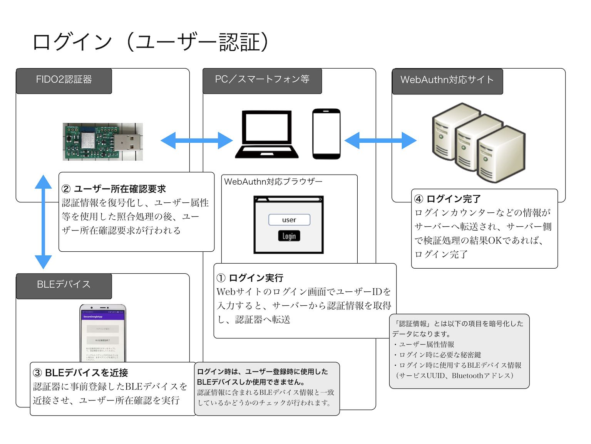

# One Card FIDO対応

One CardにFIDO U2F／WebAuthn認証機能を実装するプロジェクトです。

## [開発TODO](TODO.md)
現在進行中、もしくは将来予定している開発案件についての概要を掲載しています。

## プログラム

- <b>[FIDO2アプリケーション](nRF5_SDK_v15.3.0)</b> 
Nordic社のSoC「nRF52840」を使用した、FIDO U2F／WebAuthn認証器のファームウェアです。 
[MDBT50Q Dongle](FIDO2Device/MDBT50Q_Dongle)と、nRF52840 DK（開発ボード）に対応しています。

- <b>[FIDO認証器管理ツール](MaintenanceTool)</b> 
FIDO2認証器に、鍵・証明書・PINを導入するために使用する、デスクトップ・ツールです。 
[Windows版](MaintenanceTool/WindowsExe)、[macOS版](MaintenanceTool/macOSApp)の両方を用意しております。

- <b>[オープンソースコードライセンスについて](LICENSES.md)</b> 
上記プログラム内で使用されているオープンソースコード（ライブラリー）についての概要を掲載しています。

## ハードウェア

- <b>[MDBT50Q Dongle](FIDO2Device/MDBT50Q_Dongle)</b> 
Nordic社のSoC「nRF52840」を使用した、FIDO U2F／WebAuthn認証器です。 
日本国内の技適取得済みであるnRF52840搭載モジュール「MDBT50Q」を使用し、nRF52840 Dongleとほぼ同じ仕様で製作しております。 
PCのUSBポート装着時はUSB HIDデバイスとして稼働し、ボタン乾電池装着時はBLEペリフェラルデバイスとして稼働します。

## What's new

#### 2020/09/07

FIDO認証器管理ツールを修正しました。 

- <b>[macOS版 FIDO認証器管理ツール（Version 0.1.31）](https://github.com/diverta/onecard-fido/blob/bug-FIDO2MT-macOS-20200901/MaintenanceTool/macOSApp/MaintenanceTool.pkg)</b>

- <b>[Windows版 FIDO認証器管理ツール（Version 0.1.31）](https://github.com/diverta/onecard-fido/blob/bug-FIDO2MT-Windows-20200903/MaintenanceTool/WindowsExe/MaintenanceToolWin.zip)</b>

修正点は以下になります。（[#361](https://github.com/diverta/onecard-fido/issues/361) ご参照）
- 「ファームウェア更新」機能実行時、認証器に導入されているファームウェアのバージョンが、管理ツールに同梱されているバージョンより新しい場合、更新処理が行われないよう修正
- 管理ツール同梱のファームウェア更新イメージファイルを入替え（Version 0.2.11 にアップグレード）
- ファームウェア更新時、MDBT50Q Dongleの基板名（`rev2=PCA10059` or `rev2.1.2=PCA10059_02`）に応じ、更新対象のイメージファイルが自動的に選択されるよう修正

#### 2020/09/01

MDBT50Q Dongle、およびファームウェアを修正しました。 

- <b>[MDBT50Q Dongle（Rev2.1.2）](https://github.com/diverta/onecard-fido/blob/improve-FIDO2DEV-MDBT50Q-Dongle-rev2_1_2/FIDO2Device/MDBT50Q_Dongle/README.md)</b>

- <b>[nRF52840ファームウェア（Version 0.2.11）](https://github.com/diverta/onecard-fido/tree/improve-FIDO2DEV-MDBT50Q-Dongle-rev2_1_2/nRF5_SDK_v15.3.0/firmwares)</b>

MDBT50Q Dongleの主な修正点は以下になります。
- nRF52840アプリケーションに、セキュアIC（[ATECC608A](https://www.mouser.jp/new/microchip/microchip-atecc608a-crypto-devices/)）を組込み、秘密鍵／AESパスワードを読出し不可とする（[#347](https://github.com/diverta/onecard-fido/issues/347) ご参照）
- CCIDインターフェースを装備し、スマートカードエミュレーションを可能とする（[#339](https://github.com/diverta/onecard-fido/issues/339) ご参照。現時点で、業務アプリケーションは未実装）
- [署名検証機能付きUSBブートローダー](https://github.com/diverta/onecard-fido/blob/improve-FIDO2DEV-MDBT50Q-Dongle-rev2_1_2/nRF5_SDK_v15.3.0/firmwares/secure_bootloader/README.md)を採用し、不正ファームウェアの書込みを抑止
- 外形サイズを 5cm x 2cm に縮小

#### [過去の更新履歴はこちら](HISTORY.md)

## FIDO2について

最新バージョンのプログラムにより使用可能となった新機能「BLEデバイスによる自動認証機能（パスワードレス・ボタンレス）」のイメージです。

FIDO認証（WebAuthn）実行時、MDBT50Q Dongle上のボタンを押す代わりに、One CardなどのBLEデバイスを近づけることにより、認証処理を自動的に続行させる機能です。

詳細につきましてはドキュメント<b>「[BLEデバイスによる自動認証機能](FIDO2Device/MDBT50Q_Dongle/BLEDAUTH.md)」</b>をご参照願います。

#### CTAP2とは

FIDOの新世代パスワードレス認証（<b>WebAuthn</b>）に対応するために用意された、FIDO 2.0の技術仕様です。

[FIDO2アプリケーション](nRF5_SDK_v15.3.0)では、既にUSB HIDトランスポート、BLEトランスポートに対応しています。 
NFCトランスポートは、後日対応予定です。

また、Windows環境（Edgeブラウザー）でのWebAuthnは、PINコード（暗証番号）入力が必須となるのですが、こちらの方もすでに対応済みとなっております。

Windows環境による具体的なテスト方法は、別途手順書[「Edgeブラウザーを使用したWebAuthnテスト手順」](FIDO2Device/MDBT50Q_Dongle/WEBAUTHNTEST.md)をご参照ください。

#### [以前の仕様](FORMER.md)
FIDOの旧世代２要素認証（U2F）に関する開発物件になります。
