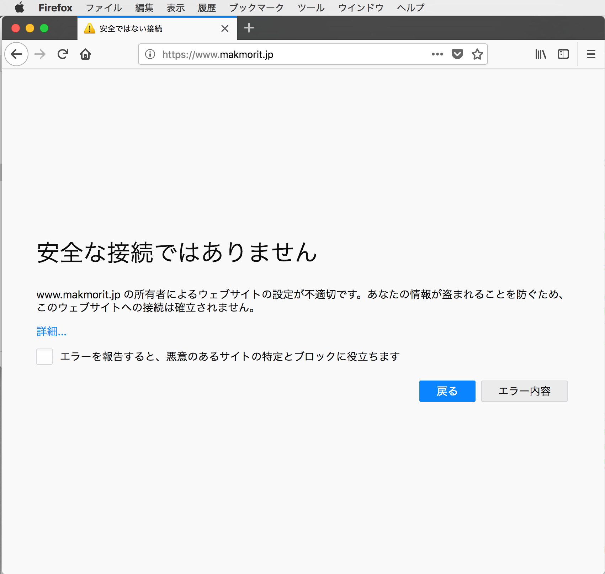
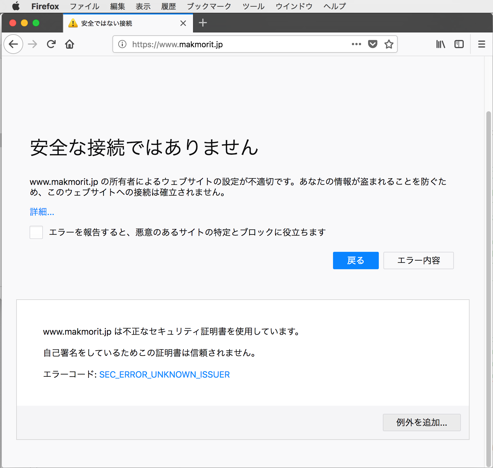
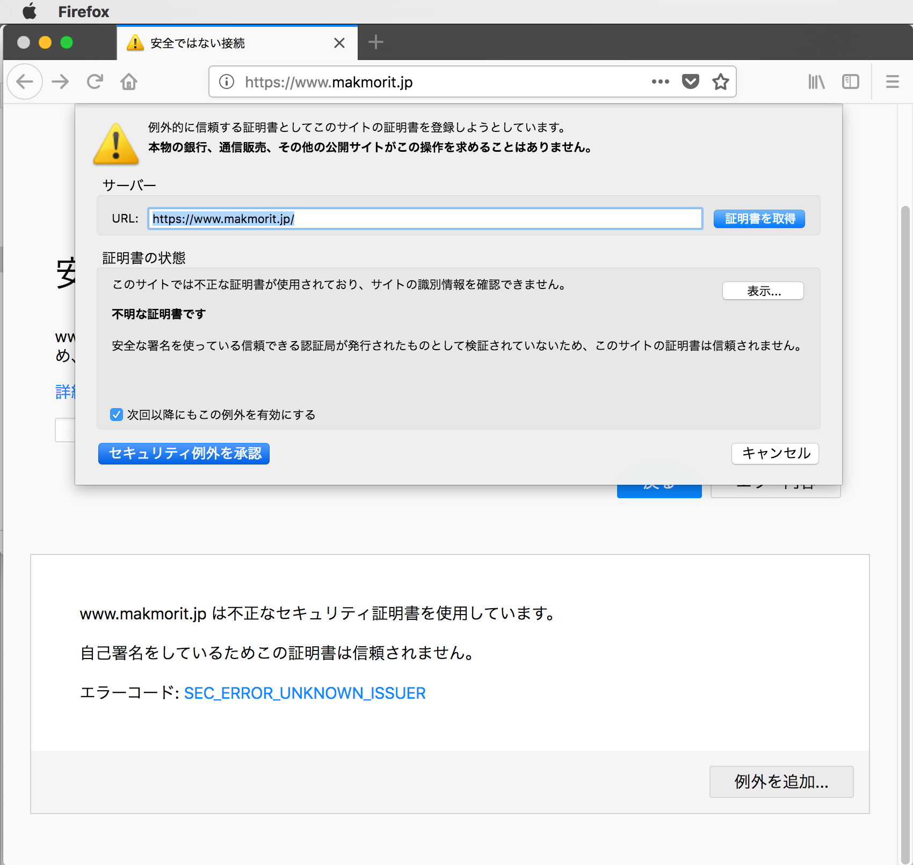
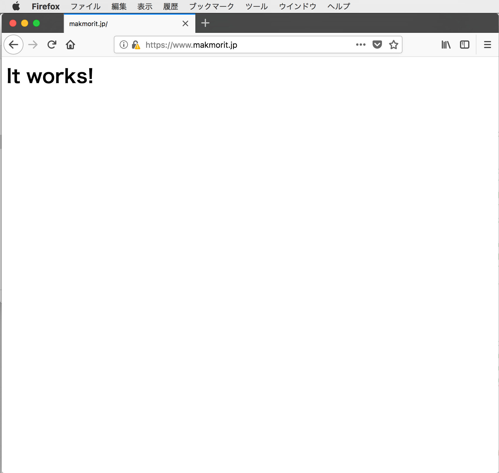

# Apacheローカルテストサーバー

FIDOサーバーをローカルPCでテストするために必要となる、Webサーバー（Apache）を立ち上げる手順を掲載しております。

PCはMacBook Pro（macOS）を使用します。

## ホスト名を決めます

今回は仮に `www.makmorit.jp` とします。

これを一時的に`/etc/hosts`ファイルに記述しておけば、ドメイン作成やDNS設定は不要なようです。

## サーバー鍵／証明書を作成

以下の手順で、サーバー鍵／証明書をECDSA_P256で作成します。

- 楕円曲線を指定して鍵を生成
- 生成した鍵を指定し、CSRを作成
- 生成した鍵とCSRを指定し、自己署名証明書を作成

### 鍵を生成

下記OpenSSLコマンドを実行します。
```
MacBookPro-makmorit-jp:Desktop makmorit$ openssl ecparam -out server.key -name prime256v1 -genkey
MacBookPro-makmorit-jp:Desktop makmorit$ ls -al *.key
-rw-r--r--  1 makmorit  staff  302  5 16 11:02 server.key
MacBookPro-makmorit-jp:Desktop makmorit$
```

### CSRを生成

下記OpenSSLコマンドを実行します。

```
MacBookPro-makmorit-jp:Desktop makmorit$ openssl req -new -sha256 -key server.key -out server.csr
You are about to be asked to enter information that will be incorporated
into your certificate request.
What you are about to enter is what is called a Distinguished Name or a DN.
There are quite a few fields but you can leave some blank
For some fields there will be a default value,
If you enter '.', the field will be left blank.
-----
Country Name (2 letter code) [AU]:JP
State or Province Name (full name) [Some-State]:Tokyo
Locality Name (eg, city) []:Kiyose
Organization Name (eg, company) [Internet Widgits Pty Ltd]:makmorit
Organizational Unit Name (eg, section) []:
Common Name (e.g. server FQDN or YOUR name) []:www.makmorit.jp
Email Address []:

Please enter the following 'extra' attributes
to be sent with your certificate request
A challenge password []:
An optional company name []:
MacBookPro-makmorit-jp:Desktop makmorit$ ls -al *.csr
-rw-r--r--  1 makmorit  staff  452  5 16 11:03 server.csr
MacBookPro-makmorit-jp:Desktop makmorit$
```

### 自己署名証明書を作成
下記OpenSSLコマンドを実行します。

```
MacBookPro-makmorit-jp:Desktop makmorit$ openssl req -days 365 -in server.csr -key server.key -x509 -out server.crt
MacBookPro-makmorit-jp:Desktop makmorit$ ls -al *.crt
-rw-r--r--  1 makmorit  staff  899  5 16 11:04 server.crt
MacBookPro-makmorit-jp:Desktop makmorit$
```

## サーバー鍵／証明書を配置

Apacheサーバーに、作成したサーバー鍵／証明書を配置します。

作成した鍵と証明書を、/private/etc/apache2/ 配下にインストールします。
```
MacBookPro-makmorit-jp:Desktop makmorit$ sudo cp -p ~/Desktop/server.crt /private/etc/apache2/server.crt
MacBookPro-makmorit-jp:Desktop makmorit$ sudo cp -p ~/Desktop/server.key /private/etc/apache2/server.key
MacBookPro-makmorit-jp:Desktop makmorit$ ls -alrt /private/etc/apache2/server.*
-rw-r--r--  1 makmorit  staff  302  5 16 11:02 /private/etc/apache2/server.key
-rw-r--r--  1 makmorit  staff  899  5 16 11:04 /private/etc/apache2/server.crt
MacBookPro-makmorit-jp:Desktop makmorit$
```

## サーバー設定の修正

### httpd.conf修正

SSLおよび、SSL設定ファイル`httpd-ssl.conf`を有効化します。

Apache設定ファイル`httpd.conf`の以下のエントリーを修正します。

```
MacBookPro-makmorit-jp:Desktop makmorit$ diff /private/etc/apache2/httpd.conf.original /private/etc/apache2/httpd.conf
89c89
< #LoadModule socache_shmcb_module libexec/apache2/mod_socache_shmcb.so
---
> LoadModule socache_shmcb_module libexec/apache2/mod_socache_shmcb.so
143c143
< #LoadModule ssl_module libexec/apache2/mod_ssl.so
---
> LoadModule ssl_module libexec/apache2/mod_ssl.so
166c166
< #LoadModule userdir_module libexec/apache2/mod_userdir.so
---
> LoadModule userdir_module libexec/apache2/mod_userdir.so
503c503
< #Include /private/etc/apache2/extra/httpd-userdir.conf
---
> Include /private/etc/apache2/extra/httpd-userdir.conf
526c526
< #Include /private/etc/apache2/extra/httpd-ssl.conf
---
> Include /private/etc/apache2/extra/httpd-ssl.conf
MacBookPro-makmorit-jp:Desktop makmorit$
```

### httpd-ssl.conf修正

鍵／証明書ファイルの名称が、設定ファイル内に記述されているものと同名にしているので、ひとまずホスト名以外は修正不要となります。

今回編集した箇所は以下になります。
```
MacBookPro-makmorit-jp:Desktop makmorit$ diff /private/etc/apache2/extra/httpd-ssl.conf.original /private/etc/apache2/extra/httpd-ssl.conf
125c125
< ServerName www.example.com:443
---
> ServerName www.makmorit.jp:443
MacBookPro-makmorit-jp:Desktop makmorit$
```

## サーバーの起動と確認

### Apacheサーバーを起動

`apachectl start`コマンドを実行します。
正常に起動すれば、`error_log`にエラーが出力されず、プロセス`httpd`が２件起動されます。

```
MacBookPro-makmorit-jp:Desktop makmorit$ sudo apachectl start
MacBookPro-makmorit-jp:Desktop makmorit$ cat /private/var/log/apache2/error_log
[Wed May 16 11:17:46.586838 2018] [ssl:warn] [pid 1820] AH01906: www.makmorit.jp:443:0 server certificate is a CA certificate (BasicConstraints: CA == TRUE !?)
AH00557: httpd: apr_sockaddr_info_get() failed for MacBookPro-makmorit-jp
AH00558: httpd: Could not reliably determine the server's fully qualified domain name, using 127.0.0.1. Set the 'ServerName' directive globally to suppress this message
[Wed May 16 11:17:46.598921 2018] [ssl:warn] [pid 1820] AH01906: www.makmorit.jp:443:0 server certificate is a CA certificate (BasicConstraints: CA == TRUE !?)
[Wed May 16 11:17:46.599679 2018] [mpm_prefork:notice] [pid 1820] AH00163: Apache/2.4.28 (Unix) LibreSSL/2.2.7 configured -- resuming normal operations
[Wed May 16 11:17:46.599705 2018] [core:notice] [pid 1820] AH00094: Command line: '/usr/sbin/httpd -D FOREGROUND'
MacBookPro-makmorit-jp:Desktop makmorit$
MacBookPro-makmorit-jp:Desktop makmorit$ ps -ef | grep httpd
    0  1820     1   0 11:17AM ??         0:00.08 /usr/sbin/httpd -D FOREGROUND
   70  1826  1820   0 11:17AM ??         0:00.00 /usr/sbin/httpd -D FOREGROUND
  501  1829  1425   0 11:18AM ttys000    0:00.00 grep httpd
MacBookPro-makmorit-jp:Desktop makmorit$
```

### デフォルトページを表示

ブラウザーを開き、`https://<ホスト名>/`をアドレスバーに入力して実行させます。

自己署名証明書であるため、下記のようなメッセージが表示されます。
右下の「エラー内容」ボタンをクリックします。



下図のようにエラー内容が表示されます。
右下の「例外を追加...」ボタンをクリックします。



表示されたダイアログの左下にある「セキュリティ例外を承認」ボタンをクリックします。



今度はドキュメントルートに配置されているデフォルトページが正しく表示されます。



これでApacheローカルテストサーバーの立ち上げ作業は完了になります。
