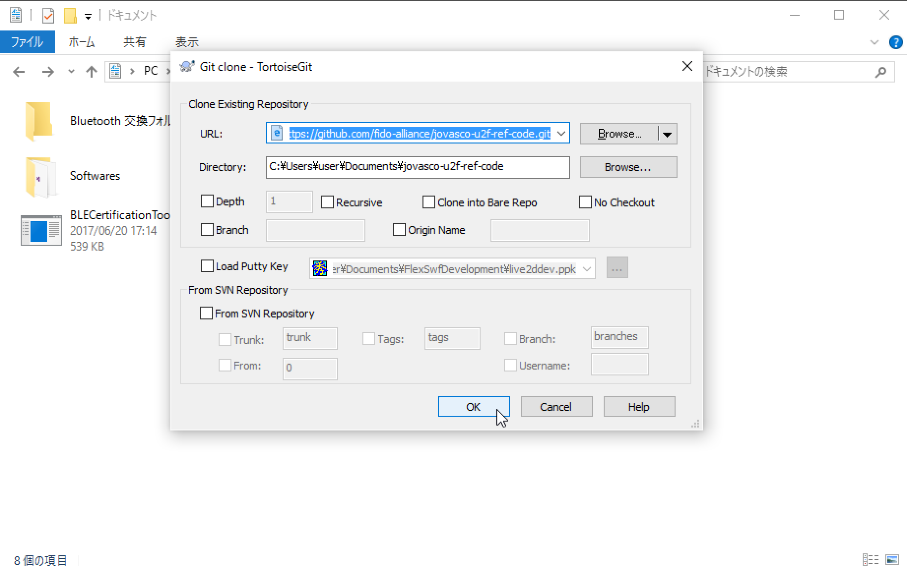
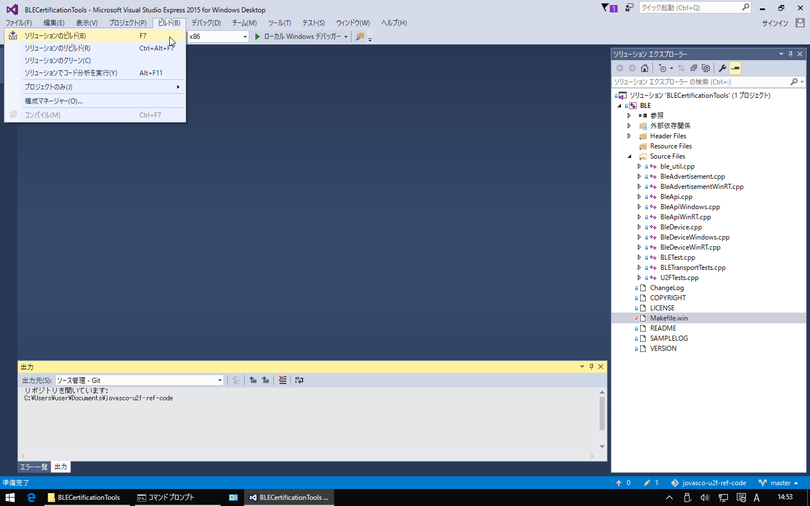
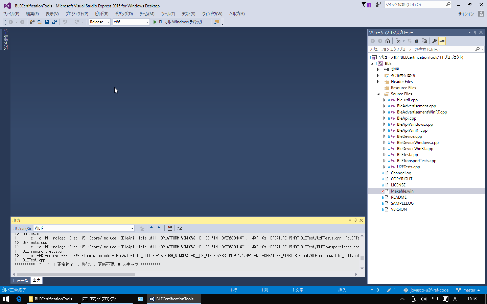
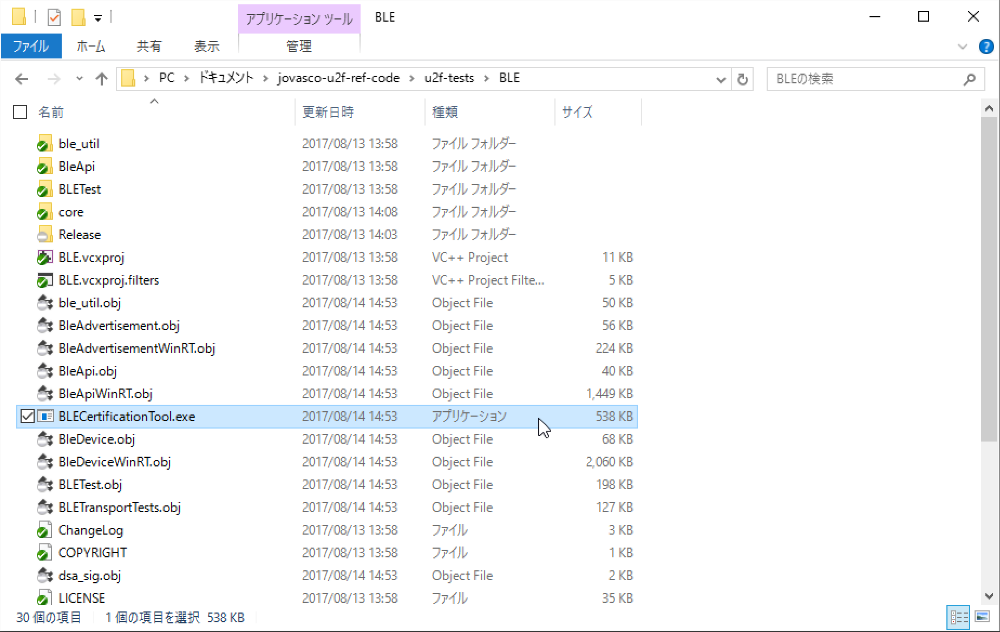
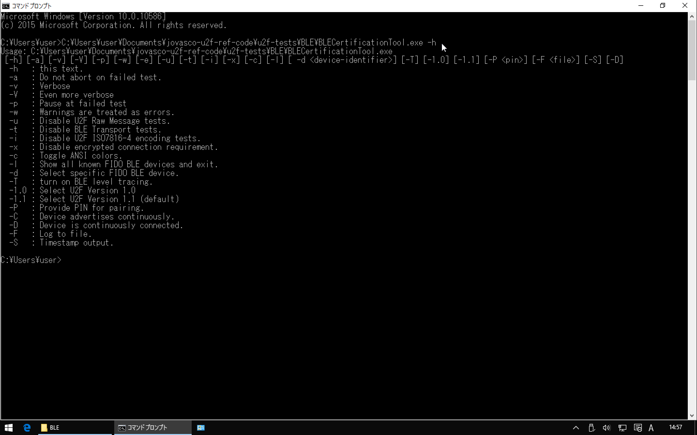

# FIDO U2F認証テストツールビルド手順

FIDOアライアンスから提供されている、FIDO U2F認証取得のための事前テストツール（BLECertificationTool.exe）について、ビルド手順を掲載しています。

## ツールのソースコード

ツールのソースコードは、下記GitHubリポジトリーで無償公開されております。
* Download and build code for Authenticator BLE Transport Layer Testing 
https://github.com/fido-alliance/jovasco-u2f-ref-code/tree/master/u2f-tests/BLE

本プロジェクトでは、ソースコードをカスタマイズしないで使用します。 
ですのでソースコードは本GitHubリポジトリーでは管理しません。

## ビルド準備

### ビルドツールの導入

Visual Studio 2015をインストールします。

まずはMicrosoftのサイトから「Visual C ++ 再頒布可能パッケージ」をダウンロードします。 
URL: https://www.microsoft.com/ja-jp/download/details.aspx?id=48145

ダウンロードした「wdexpress_JPN__1785415392.1497837634.exe」というファイルを実行し、インストールを実施します。 
１時間ほどかかります。

### ソースのチェックアウト

GitHubからリポジトリー「jovasco-u2f-ref-code」をチェックアウトし、任意のフォルダー配下にソースプログラムを展開します。 
URL: https://github.com/fido-alliance/jovasco-u2f-ref-code.git   


### メイクファイル修正

３２ビットマシンの場合「jovasco-u2f-ref-code\u2f-tests\BLEMakefile.win」内に記述されているパス「Program Files (x86)」を、単に「Program Files」と修正します。 
（下図の通り、３箇所あります）

## ビルド実行

BLECertificationTool.exeのビルドを実行します。

「jovasco-u2f-ref-code\u2f-tests\BLECertificationTools\BLECertificationTools.sln」をダブルクリックすると、前述で導入したVisual Studio 2015が立ち上がります。 
ここで、ビルドを実行します。
  

エラーが発生しなければ、ビルドは成功です。
  


### エラー発生時の対処

リビルド時にエラーが発生する場合は「jovasco-u2f-ref-code\u2f-tests\BLE\」配下で直接コマンド「del \*.exe \*.obj」を実行後、ビルドを再試行してみます。 
ビルドが成功すると「jovasco-u2f-ref-code\u2f-tests\BLE\」配下に実行ファイルが生成されていることを確認します。


### 初期動作確認

実行ファイル「jovasco-u2f-ref-code\u2f-tests\BLE\BLECertificationTool.exe」を実行してみます。
  

下図はhelpを表示させたところですが、エラーが発生しなければ、初期動作確認はOKです。
  

以上で、FIDO U2F認証テストツールのビルド作業は完了です。
