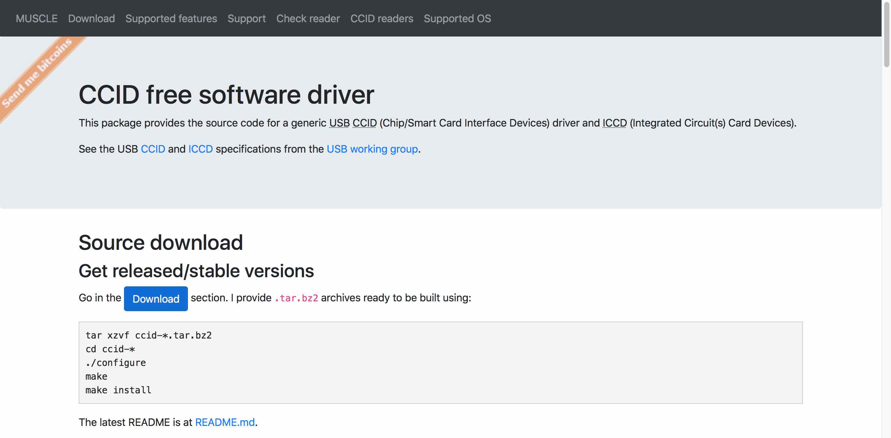
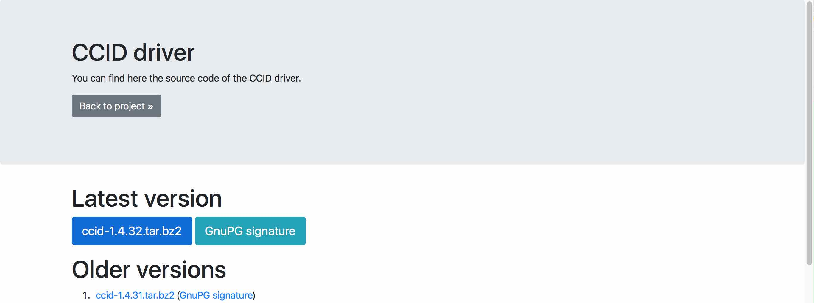
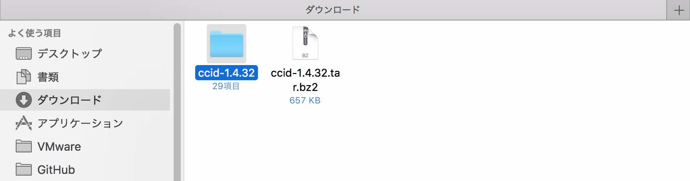
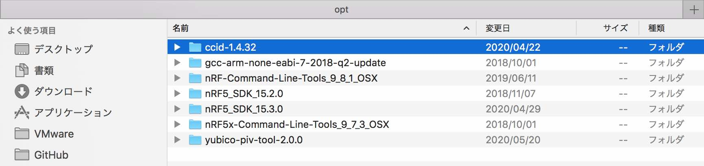
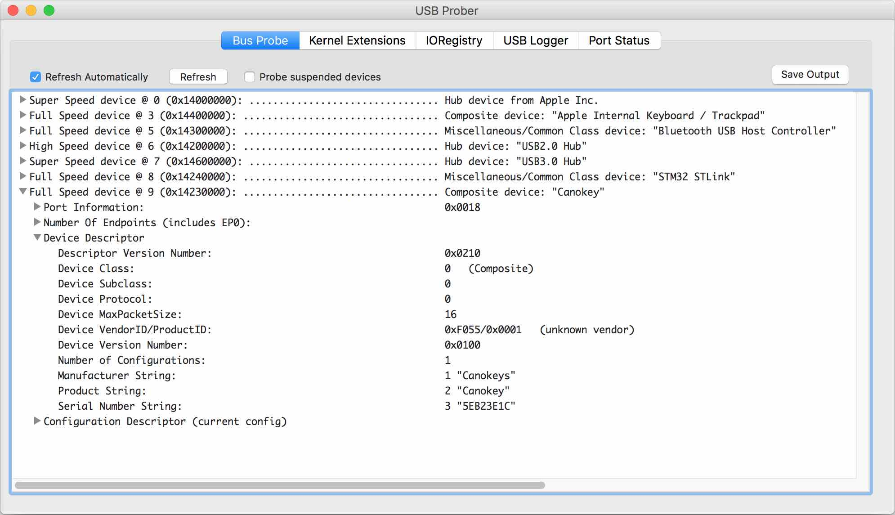

# CCIDドライバー修正ビルド手順

macOSでサポート外となっているCCIDデバイスを新たにサポートさせるため、macOSにプレインストールされているCCIDドライバーを修正ビルドする手順を掲載します。

## 作業手順

#### パッケージを導入

ビルド作業のために必要となるパッケージを、`brew`などで事前にインストールしておきます。<br>
当方の開発環境では`libusb`が導入されていないため、追加インストールしました。

```
MacBookPro-makmorit-jp:ccid-1.4.32 makmorit$ brew install libusb
Updating Homebrew...
==> Auto-updated Homebrew!
（中略）
==> Downloading https://github.com/libusb/libusb/releases/download/v1.0.23/libusb-1.0.23.tar.bz2
==> Downloading from https://github-production-release-asset-2e65be.s3.amazonaws.com/15120676/df4ea600-c99e-11e9-98f0-1f
######################################################################## 100.0%
Warning: Your Xcode (9.1) is outdated.
Please update to Xcode 9.2 (or delete it).
Xcode can be updated from the App Store.

==> ./configure --prefix=/usr/local/Cellar/libusb/1.0.23
==> make install
🍺  /usr/local/Cellar/libusb/1.0.23: 26 files, 473.6KB, built in 14 seconds
MacBookPro-makmorit-jp:ccid-1.4.32 makmorit$
```

`libusb`は、`/usr/local/Cellar/libusb/1.0.23/lib`に導入されます。

```
MacBookPro-makmorit-jp:ccid-1.4.32 makmorit$ ls -al /usr/local/Cellar/libusb/1.0.23/lib
total 416
drwxr-xr-x   6 makmorit  admin     204  5 26 14:46 .
drwxr-xr-x  13 makmorit  admin     442  5 26 14:46 ..
-r--r--r--   1 makmorit  admin   89824  5 26 14:46 libusb-1.0.0.dylib
-r--r--r--   1 makmorit  admin  116128  5 26 14:46 libusb-1.0.a
lrwxr-xr-x   1 makmorit  admin      18  5 26 14:46 libusb-1.0.dylib -> libusb-1.0.0.dylib
drwxr-xr-x   3 makmorit  admin     102  5 26 14:46 pkgconfig
MacBookPro-makmorit-jp:ccid-1.4.32 makmorit$
```

ビルド作業や、ビルド後のCCIDドライバー実行の際は、動的リンクが不要であるため、必ず`.dylib`ファイルをリネームしておくようにします。

```
MacBookPro-makmorit-jp:ccid-1.4.32 makmorit$ cd /usr/local/Cellar/libusb/1.0.23/lib
MacBookPro-makmorit-jp:lib makmorit$ mv libusb-1.0.0.dylib __libusb-1.0.0.dylib
MacBookPro-makmorit-jp:lib makmorit$ mv libusb-1.0.dylib __libusb-1.0.dylib
MacBookPro-makmorit-jp:lib makmorit$ ls -al
total 416
drwxr-xr-x   6 makmorit  admin     204  5 26 14:53 .
drwxr-xr-x  13 makmorit  admin     442  5 26 14:46 ..
-r--r--r--   1 makmorit  admin   89824  5 26 14:46 __libusb-1.0.0.dylib
lrwxr-xr-x   1 makmorit  admin      18  5 26 14:46 __libusb-1.0.dylib -> libusb-1.0.0.dylib
-r--r--r--   1 makmorit  admin  116128  5 26 14:46 libusb-1.0.a
drwxr-xr-x   3 makmorit  admin     102  5 26 14:46 pkgconfig
MacBookPro-makmorit-jp:lib makmorit$
```

#### ソースコードを取得

下記サイトから[ソースコード（`ccid-1.4.32.tar.bz2`）](https://ccid.apdu.fr/files/ccid-1.4.32.tar.bz2)をダウンロードします。
- <b>[CCID free software driver](https://ccid.apdu.fr)</b>

サイト[`https://ccid.apdu.fr`](https://ccid.apdu.fr)を表示し、青い「Download」ボタンをクリックします。



遷移先ページにある「`ccid-1.4.32.tar.bz2`」のリンクをクリックします。



ダウンロードした「`ccid-1.4.32.tar.bz2`」を解凍します。



解凍したフォルダー`ccid-1.4.32`を、`${HOME}/opt/`配下に移動します。



#### メイクファイルの生成

ソースコードフォルダー`ccid-1.4.32`に移動したら、シェル`./MacOSX/configure`を実行し、メイクファイルを生成します。

```
MacBookPro-makmorit-jp:~ makmorit$ cd /Users/makmorit/opt/ccid-1.4.32
MacBookPro-makmorit-jp:ccid-1.4.32 makmorit$ ./MacOSX/configure
+ ./configure 'CFLAGS= -DRESPONSECODE_DEFINED_IN_WINTYPES_H' PCSC_CFLAGS=-I/Users/makmorit/opt/ccid-1.4.32/MacOSX 'PCSC_LIBS=-framework PCSC' LIBUSB_CFLAGS=-I/usr/local/Cellar/libusb/1.0.23/include/libusb-1.0 'LIBUSB_LIBS=-L/usr/local/Cellar/libusb/1.0.23/lib -lusb-1.0 -lobjc -Wl,-framework,IOKit -Wl,-framework,CoreFoundation' LDFLAGS= --enable-usbdropdir=/usr/local/libexec/SmartCardServices/drivers --disable-dependency-tracking --enable-syslog --disable-static --disable-pcsclite --enable-composite-as-multislot
checking for a BSD-compatible install... /usr/bin/install -c
checking whether build environment is sane... yes
checking for a thread-safe mkdir -p... ./install-sh -c -d
（中略）
libccid has been configured with following options:

Version:             1.4.32
User binaries:       /usr/local/bin
Configuration files: /usr/local/etc


Host:                x86_64-apple-darwin16.7.0
Compiler:            gcc
Preprocessor flags:  
Compiler flags:       -DRESPONSECODE_DEFINED_IN_WINTYPES_H
Preprocessor flags:  
Linker flags:        
Libraries:           

PCSC_CFLAGS:         -I/Users/makmorit/opt/ccid-1.4.32/MacOSX
PCSC_LIBS:           -framework PCSC
PTHREAD_CFLAGS:      -D_THREAD_SAFE -pthread
PTHREAD_LIBS:        
BUNDLE_HOST:         MacOS
DYN_LIB_EXT:         dylib
LIBUSB_CFLAGS:       -I/usr/local/Cellar/libusb/1.0.23/include/libusb-1.0
LIBUSB_LIBS:         -L/usr/local/Cellar/libusb/1.0.23/lib -lusb-1.0 -lobjc -Wl,-framework,IOKit -Wl,-framework,CoreFoundation
SYMBOL_VISIBILITY:   -fvisibility=hidden
NOCLASS:             

libusb support:          yes
composite as multislot:  yes
multi threading:         yes
bundle directory name:   ifd-ccid.bundle
USB drop directory:      /usr/local/libexec/SmartCardServices/drivers
serial Twin support:     no
serial twin install dir: /usr/local/libexec/SmartCardServices/drivers/serial
serial config directory:
compiled for pcsc-lite:  no
syslog debug:            yes
class driver:            yes

checking that generated files are newer than configure... done
configure: creating ./config.status
config.status: creating Makefile
config.status: creating src/Makefile
config.status: creating readers/Makefile
config.status: creating contrib/Makefile
config.status: creating contrib/Kobil_mIDentity_switch/Makefile
config.status: creating contrib/RSA_SecurID/Makefile
config.status: creating examples/Makefile
config.status: creating config.h
config.status: executing depfiles commands
config.status: executing libtool commands
+ r=0
+ rm -f src/Info.plist
+ exit 0
MacBookPro-makmorit-jp:ccid-1.4.32 makmorit$ echo $?
0
MacBookPro-makmorit-jp:ccid-1.4.32 makmorit$
```

#### サポートデバイスリストの修正（手作業）

新たにmacOSでサポートさせたいデバイスの製品ID（VID／PID）を、サポートデバイスリストに追記します。

今回、新たにサポート対象とするデバイスは、下図の通り`VID=0xF055`、`PID=0x0001`となっています。



この値を、`readers/supported_readers.txt`というファイルに追記します。<br>
記述フォーマットは下記の通りです。

```
# <製造者名>
<VID>:<PID>:<製造者名> <製品名>
```

下記は設定例になります。
- 製造者名: `Diverta Inc.`
- 製品名: `Secure Dongle`
- VID: `0xF055`
- PID: `0x0001`


```
MacBookPro-makmorit-jp:ccid-1.4.32 makmorit$ cat readers/supported_readers.txt | grep Diverta
# Diverta Inc.
0xF055:0x0001:Diverta Inc. Secure Dongle
MacBookPro-makmorit-jp:ccid-1.4.32 makmorit$
```

#### サポートデバイスリストの修正（パッチ適用）
先述のサポートデバイスリスト`supported_readers.txt`を修正するためのパッチを用意しております。<br>
以下のコマンドを実行すると、エディター等を使用しなくても、サポートデバイスリストを修正することができます。

```
cd ${HOME}/opt/ccid-1.4.32
patch readers/supported_readers.txt < ${HOME}/GitHub/onecard-fido/CCID/macOSDriver/supported_readers.txt.patch
```

下記は実行例になります。

```
MacBookPro-makmorit-jp:ccid-1.4.32 makmorit$ pwd
/Users/makmorit/opt/ccid-1.4.32
MacBookPro-makmorit-jp:ccid-1.4.32 makmorit$ patch readers/supported_readers.txt < ${HOME}/GitHub/onecard-fido/CCID/macOSDriver/supported_readers.txt.patch
patching file readers/supported_readers.txt
MacBookPro-makmorit-jp:ccid-1.4.32 makmorit$ cat readers/supported_readers.txt | grep Diverta
# Diverta Inc.
0xF055:0x0001:Diverta Inc. Secure Dongle
MacBookPro-makmorit-jp:ccid-1.4.32 makmorit$
```

#### ビルドの実行

`make`コマンドを実行し、ビルドを実行します。

```
MacBookPro-makmorit-jp:ccid-1.4.32 makmorit$ make
/Applications/Xcode.app/Contents/Developer/usr/bin/make  all-recursive
Making all in readers
make[2]: Nothing to be done for `all'.
Making all in examples
  CC       scardcontrol-scardcontrol.o
  CC       scardcontrol-PCSCv2part10.o
  CCLD     scardcontrol
clang: warning: argument unused during compilation: '-pthread' [-Wunused-command-line-argument]
clang: warning: argument unused during compilation: '-pthread' [-Wunused-command-line-argument]
Making all in contrib
Making all in Kobil_mIDentity_switch
  CC       Kobil_mIDentity_switch-Kobil_mIDentity_switch.o
  CCLD     Kobil_mIDentity_switch
Making all in RSA_SecurID
  CC       RSA_SecurID_getpasswd-RSA_SecurID_getpasswd.o
  CCLD     RSA_SecurID_getpasswd
make[3]: Nothing to be done for `all-am'.
Making all in src
  CC       parse-parse.o
  CC       parse-debug.o
  CC       parse-ccid_usb.o
  CC       parse-tokenparser.o
  CC       parse-strlcpy.o
  CC       parse-simclist.o
  CCLD     parse
  CC       libccid_la-ccid.lo
  CC       libccid_la-commands.lo
  CC       libccid_la-ifdhandler.lo
  CC       libccid_la-utils.lo
  CC       libccid_la-ccid_usb.lo
  CC       libccid_la-tokenparser.lo
  CC       libccid_la-strlcpy.lo
  CC       libccid_la-simclist.lo
  CC       libccid_la-debug.lo
  CC       towitoko/libccid_la-atr.lo
  CC       towitoko/libccid_la-pps.lo
  CC       openct/libccid_la-buffer.lo
  CC       openct/libccid_la-checksum.lo
  CC       openct/libccid_la-proto-t1.lo
  CCLD     libccid.la
clang: warning: argument unused during compilation: '-pthread' [-Wunused-command-line-argument]
clang: warning: argument unused during compilation: '-pthread' [-Wunused-command-line-argument]
make[2]: Nothing to be done for `all-am'.
MacBookPro-makmorit-jp:ccid-1.4.32 makmorit$ echo $?
0
MacBookPro-makmorit-jp:ccid-1.4.32 makmorit$
```

以上でビルドは完了になります。

#### インストールの実行

動作確認を行うため、コマンド`sudo make install`を使用し、ビルドしたCCIDドライバーをシステム（macOS Sierra）にインストールします。

```
MacBookPro-makmorit-jp:~ makmorit$ cd /Users/makmorit/opt/ccid-1.4.32
MacBookPro-makmorit-jp:ccid-1.4.32 makmorit$ sudo make install
Password:
Making install in readers
make[2]: Nothing to be done for `install-exec-am'.
make[2]: Nothing to be done for `install-data-am'.
Making install in examples
make[2]: Nothing to be done for `install-exec-am'.
make[2]: Nothing to be done for `install-data-am'.
Making install in contrib
Making install in Kobil_mIDentity_switch
make[3]: Nothing to be done for `install-exec-am'.
make[3]: Nothing to be done for `install-data-am'.
Making install in RSA_SecurID
make[3]: Nothing to be done for `install-exec-am'.
make[3]: Nothing to be done for `install-data-am'.
make[3]: Nothing to be done for `install-exec-am'.
make[3]: Nothing to be done for `install-data-am'.
Making install in src
./create_Info_plist.pl ./../readers/supported_readers.txt ./Info.plist.src --target=libccid.dylib --version=1.4.32  > Info.plist
/bin/sh /Users/makmorit/opt/ccid-1.4.32/install-sh -d "/usr/local/libexec/SmartCardServices/drivers/ifd-ccid.bundle/Contents/MacOS/"
cp Info.plist "/usr/local/libexec/SmartCardServices/drivers/ifd-ccid.bundle/Contents/"
cp .libs/libccid.dylib "/usr/local/libexec/SmartCardServices/drivers/ifd-ccid.bundle/Contents/MacOS/libccid.dylib"
***************
copy the src/92_pcscd_ccid.rules file in udev directory (/etc/udev/rules.d/)
***************
make[2]: Nothing to be done for `install-exec-am'.
make[2]: Nothing to be done for `install-data-am'.
MacBookPro-makmorit-jp:ccid-1.4.32 makmorit$ echo $?
0
MacBookPro-makmorit-jp:ccid-1.4.32 makmorit$
```

この作業をおこなっても、macOSにプレインストールされたCCIDドライバー`/usr/libexec/SmartCardServices`は、上書き修正されません。<br>
本件インストール実行では、`/usr/local/libexec/SmartCardServices`という場所にインストールされます。

インストールされたCCIDドライバーのパッケージファイルを直接参照し、新たに追加したサポート対象デバイスが、サポートデバイスリストに記載されていることを為念確認します。

```
MacBookPro-makmorit-jp:~ makmorit$ cd /usr/local/libexec/SmartCardServices/drivers/ifd-ccid.bundle/Contents/
MacBookPro-makmorit-jp:Contents makmorit$ cat Info.plist | grep Diverta
		<string>Diverta Inc. Secure Dongle</string>
MacBookPro-makmorit-jp:Contents makmorit$
```

以上でインストールは完了になります。

#### 動作確認

PCを再起動し、インストールしたCCIDドライバーを有効化させます。<br>
その後、新たに追加したサポート対象デバイスを、PCのUSBポートに接続します。

コマンド`opensc-tool -a`を実行し、認識・接続されるかどうかを確認します。<br>
下記のように、新たに追加したサポート対象デバイスの名称が表示されれば、確認はOKです。

```
MacBookPro-makmorit-jp:~ makmorit$ opensc-tool -a
Using reader with a card: Diverta Inc. Secure Dongle
3b:f7:11:00:00:81:31:fe:65:43:61:6e:6f:6b:65:79:99
MacBookPro-makmorit-jp:~ makmorit$
```

以上で動作確認は完了です。

## インストーラーの作成

他のmacOSを搭載したPCに、上記手順で作成したCCIDドライバーをインストールするためのインストーラー（再頒布用パッケージ）を作成します。

#### インストーラー作成用媒体の配置

`${HOME}/GitHub/onecard-fido/CCID/macOSDriver`に、インストーラーを作成するためのファイルを配置します。

まずは、このフォルダーの直下に`CCIDDriver.plist`というファイルを以下の内容で生成します。

```
<?xml version="1.0" encoding="UTF-8"?>
<!DOCTYPE plist PUBLIC "-//Apple//DTD PLIST 1.0//EN" "http://www.apple.com/DTDs/PropertyList-1.0.dtd">
<plist version="1.0">
<array>
	<dict>
		<key>BundleHasStrictIdentifier</key>
		<true/>
		<key>BundleIsRelocatable</key>
		<false/>
		<key>BundleIsVersionChecked</key>
		<false/>
		<key>BundleOverwriteAction</key>
		<string>upgrade</string>
		<key>RootRelativeBundlePath</key>
		<string>ifd-ccid.bundle</string>
	</dict>
</array>
</plist>
```

次に、`bundle`というサブディレクトリーに、前述の手順で生成したドライバー`ifd-ccid.bundle`を、権限を変えずにコピーします。<br>
以下は実行例になります。

```
MacBookPro-makmorit-jp:~ makmorit$ cp -prv /usr/local/libexec/SmartCardServices/drivers/ifd-ccid.bundle ${HOME}/GitHub/onecard-fido/CCID/macOSDriver/bundle
/usr/local/libexec/SmartCardServices/drivers/ifd-ccid.bundle -> /Users/makmorit/GitHub/onecard-fido/CCID/macOSDriver/bundle/ifd-ccid.bundle
/usr/local/libexec/SmartCardServices/drivers/ifd-ccid.bundle/Contents -> /Users/makmorit/GitHub/onecard-fido/CCID/macOSDriver/bundle/ifd-ccid.bundle/Contents
/usr/local/libexec/SmartCardServices/drivers/ifd-ccid.bundle/Contents/Info.plist -> /Users/makmorit/GitHub/onecard-fido/CCID/macOSDriver/bundle/ifd-ccid.bundle/Contents/Info.plist
/usr/local/libexec/SmartCardServices/drivers/ifd-ccid.bundle/Contents/MacOS -> /Users/makmorit/GitHub/onecard-fido/CCID/macOSDriver/bundle/ifd-ccid.bundle/Contents/MacOS
/usr/local/libexec/SmartCardServices/drivers/ifd-ccid.bundle/Contents/MacOS/libccid.dylib -> /Users/makmorit/GitHub/onecard-fido/CCID/macOSDriver/bundle/ifd-ccid.bundle/Contents/MacOS/libccid.dylib
MacBookPro-makmorit-jp:~ makmorit$
```

#### インストーラーの作成

インストーラー作成のために必要なファイルが揃ったら、以下のコマンドを実行します。

```
cd ${HOME}/GitHub/onecard-fido/CCID/macOSDriver/
rm -rfv CCIDDriver.pkg
pkgbuild --root bundle --component-plist CCIDDriver.plist --identifier jp.co.diverta.CCIDDriver --install-location /usr/local/libexec/SmartCardServices/drivers CCIDDriver.pkg
```

下記は実行例になります。<br>
`CCIDDriver.pkg`というファイル（CCIDドライバーのインストーラー）が作成されます。<br>
この`CCIDDriver.pkg`を、適宜ほかのmacOS環境に配布し、CCIDドライバーをインストールすることになります。

```
MacBookPro-makmorit-jp:~ makmorit$ cd ${HOME}/GitHub/onecard-fido/CCID/macOSDriver/
MacBookPro-makmorit-jp:macOSDriver makmorit$ rm -rfv CCIDDriver.pkg
MacBookPro-makmorit-jp:macOSDriver makmorit$ pkgbuild --root bundle --component-plist CCIDDriver.plist --identifier jp.co.diverta.CCIDDriver --install-location /usr/local/libexec/SmartCardServices/drivers CCIDDriver.pkg
pkgbuild: Reading components from CCIDDriver.plist
pkgbuild: Adding component at ifd-ccid.bundle
pkgbuild: Wrote package to CCIDDriver.pkg
MacBookPro-makmorit-jp:macOSDriver makmorit$ ls -al *.pkg
-rw-r--r--  1 makmorit  staff  102064  7 20 15:04 CCIDDriver.pkg
MacBookPro-makmorit-jp:macOSDriver makmorit$
```


以上で、CCIDドライバーのインストーラー作成は完了です。
