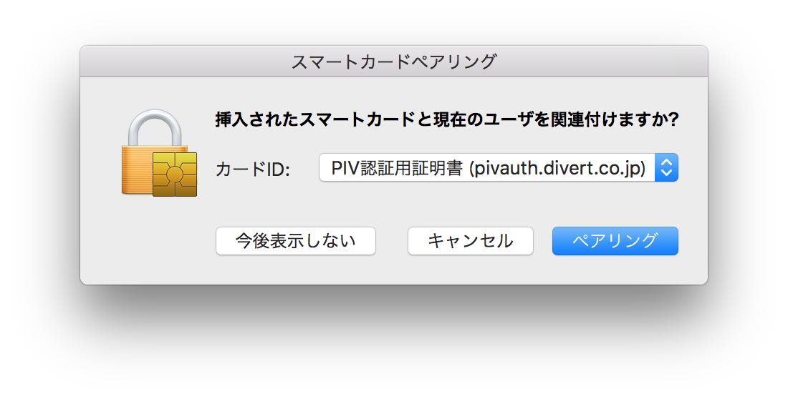

# Yubico PIV Toolによる初期データ導入手順

Yubico PIV Toolを使用して、PIVデバイスの参考実装「[canokeys/canokey-stm32](https://github.com/canokeys/canokey-stm32)」に対し、鍵・証明書・PINなどの機密データを初期導入する手順を掲載します。

Yubico PIV Tool (command line) を一部修正し、macOS環境上で使用できるようにするための手順は「<b>[参考：Yubico PIV Toolビルド手順](../../Research/CCID/BUILDYKPIV.md)</b>」をご参照願います。

## 作業手順

ユーティリティーツール`tool/yubico-piv-tool`の各種コマンドを実行し、各種導入作業を行います。

注意点としましては、PIVデバイス参考実装の「`canokey-stm32`」を書き込んであるNUCLEOのRESETボタンを押してから５秒以内に、コマンドを実行します。

#### 接続確認

コマンド`list-readers`を実行し、PIVデバイスの一覧を画面表示します。<br>
以下のコマンドを実行します。

```
cd ${HOME}/opt/yubico-piv-tool-2.0.0/
tool/yubico-piv-tool -v --reader="Kingtrust Multi-Reader" -a list-readers
```

以下は実行例になります。<br>
「`canokey-stm32`」と接続できたことが、メッセージにより確認できます。

```
MacBookPro-makmorit-jp:~ makmorit$ cd ${HOME}/opt/yubico-piv-tool-2.0.0/
MacBookPro-makmorit-jp:yubico-piv-tool-2.0.0 makmorit$ tool/yubico-piv-tool -v --reader="Kingtrust Multi-Reader" -a list-readers
Connect reader 'Kingtrust Multi-Reader' matching 'Kingtrust Multi-Reader'.
Action 'list-readers' does not need authentication.
Now processing for action 'list-readers'.
Kingtrust Multi-Reader
Disconnect card #1588739612.
MacBookPro-makmorit-jp:yubico-piv-tool-2.0.0 makmorit$
```


#### PINの設定

デフォルトのPIN`123456`を、`000000`に変更し、PIVデバイスに設定します。<br>
以下のコマンドを実行します。

```
tool/yubico-piv-tool -v --reader="Kingtrust Multi-Reader" --pin=123456 -a change-pin
```

以下は実行例になります。<br>
下記ログには表示されていないのですが、`Enter new pin:`、`Verifying - Enter new pin:`に続いて、`000000`を入力しています。

```
MacBookPro-makmorit-jp:yubico-piv-tool-2.0.0 makmorit$ tool/yubico-piv-tool -v --reader="Kingtrust Multi-Reader" --pin=123456 -a change-pin
Connect reader 'Kingtrust Multi-Reader' matching 'Kingtrust Multi-Reader'.
Action 'change-pin' does not need authentication.
Now processing for action 'change-pin'.
Enter new pin:
Verifying - Enter new pin:
Successfully changed the pin code.
Disconnect card #1588739612.
MacBookPro-makmorit-jp:yubico-piv-tool-2.0.0 makmorit$
```


#### デバイスIDを設定

CHUIDの生成を行い、PIVデバイスに設定します。<br>
以下のコマンドを実行します。

```
tool/yubico-piv-tool -v --reader="Kingtrust Multi-Reader" -a set-chuid
```

以下は実行例になります。

```
MacBookPro-makmorit-jp:yubico-piv-tool-2.0.0 makmorit$ tool/yubico-piv-tool -v --reader="Kingtrust Multi-Reader" -a set-chuid
Connect reader 'Kingtrust Multi-Reader' matching 'Kingtrust Multi-Reader'.
Authenticating since action 'set-chuid' needs that.
Successful application authentication.
Now processing for action 'set-chuid'.
Set the CHUID ID to: 7f 05 63 c8 09 a4 cf 5e 04 d6 18 af 5d 67 cb e8
Successfully set new CHUID.
Disconnect card #1588739612.
MacBookPro-makmorit-jp:yubico-piv-tool-2.0.0 makmorit$
```

続いてCCCの生成を行い、PIVデバイスに設定します。<br>
以下のコマンドを実行します。

```
tool/yubico-piv-tool -v --reader="Kingtrust Multi-Reader" -a set-ccc
```

以下は実行例になります。

```
MacBookPro-makmorit-jp:yubico-piv-tool-2.0.0 makmorit$ cd ${HOME}/opt/yubico-piv-tool-2.0.0/
MacBookPro-makmorit-jp:yubico-piv-tool-2.0.0 makmorit$ tool/yubico-piv-tool -v --reader="Kingtrust Multi-Reader" -a set-ccc
Connect reader 'Kingtrust Multi-Reader' matching 'Kingtrust Multi-Reader'.
Authenticating since action 'set-ccc' needs that.
Successful application authentication.
Now processing for action 'set-ccc'.
Set the CCC ID to: e2 77 1c e9 57 47 6a 8c 9f 40 ef dd 2e ce
Successfully set new CCC.
Disconnect card #1588739612.
MacBookPro-makmorit-jp:yubico-piv-tool-2.0.0 makmorit$
```

#### 管理用パスワードの設定

管理用パスワードを設定します。<br>
今回は`010203040506070801020304050607080102030405060708`というHEX文字列をパスワードに設定しました。

```
MacBookPro-makmorit-jp:yubico-piv-tool-2.0.0 makmorit$ tool/yubico-piv-tool -v --reader="Kingtrust Multi-Reader" --pin=000000 -a set-mgm-key
Connect reader 'Kingtrust Multi-Reader' matching 'Kingtrust Multi-Reader'.
Authenticating since action 'set-mgm-key' needs that.
Successful application authentication.
Now processing for action 'set-mgm-key'.
Enter new management key:
Verifying - Enter new management key:
Successfully set new management key.
Disconnect card #1588739612.
MacBookPro-makmorit-jp:yubico-piv-tool-2.0.0 makmorit$
```

#### 秘密鍵の生成

秘密鍵を生成し、PIVデバイスのスロット[注1]にインストールします。<br>
以下のコマンドを実行します。

```
tool/yubico-piv-tool -v --reader="Kingtrust Multi-Reader" -s 9a -A ECCP256 -a generate -o ecc_pub_9a.pem
tool/yubico-piv-tool -v --reader="Kingtrust Multi-Reader" -s 9c -A ECCP256 -a generate -o ecc_pub_9c.pem
tool/yubico-piv-tool -v --reader="Kingtrust Multi-Reader" -s 9d -A ECCP256 -a generate -o ecc_pub_9d.pem
```

以下は実行例になります。

```
MacBookPro-makmorit-jp:yubico-piv-tool-2.0.0 makmorit$ tool/yubico-piv-tool -v --reader="Kingtrust Multi-Reader" -s 9a -A ECCP256 -a generate -o ecc_pub_9a.pem
Connect reader 'Kingtrust Multi-Reader' matching 'Kingtrust Multi-Reader'.
Authenticating since action 'generate' needs that.
Successful application authentication.
Now processing for action 'generate'.
Successfully generated a new private key.
Disconnect card #1588739612.
MacBookPro-makmorit-jp:yubico-piv-tool-2.0.0 makmorit$
MacBookPro-makmorit-jp:yubico-piv-tool-2.0.0 makmorit$ tool/yubico-piv-tool -v --reader="Kingtrust Multi-Reader" -s 9c -A ECCP256 -a generate -o ecc_pub_9c.pem
Connect reader 'Kingtrust Multi-Reader' matching 'Kingtrust Multi-Reader'.
Authenticating since action 'generate' needs that.
Successful application authentication.
Now processing for action 'generate'.
Successfully generated a new private key.
Disconnect card #1588739612.
MacBookPro-makmorit-jp:yubico-piv-tool-2.0.0 makmorit$
MacBookPro-makmorit-jp:yubico-piv-tool-2.0.0 makmorit$ tool/yubico-piv-tool -v --reader="Kingtrust Multi-Reader" -s 9d -A ECCP256 -a generate -o ecc_pub_9d.pem
Connect reader 'Kingtrust Multi-Reader' matching 'Kingtrust Multi-Reader'.
Authenticating since action 'generate' needs that.
Successful application authentication.
Now processing for action 'generate'.
Successfully generated a new private key.
Disconnect card #1588739612.
MacBookPro-makmorit-jp:yubico-piv-tool-2.0.0 makmorit$
```

[注1] Slot 9a: PIV Authentication, Slot 9c: Digital Signature, 9d: Key Management

#### 自己署名証明書の作成

```
tool/yubico-piv-tool -v --reader="Kingtrust Multi-Reader" -a verify-pin -P 000000 -a selfsign-certificate -s 9a -S "/CN=pivauth.divert.co.jp/" -i ecc_pub_9a.pem -o ecc_cert_9a.pem
tool/yubico-piv-tool -v --reader="Kingtrust Multi-Reader" -a verify-pin -P 000000 -a selfsign-certificate -s 9c -S "/CN=digsign.divert.co.jp/" -i ecc_pub_9c.pem -o ecc_cert_9c.pem
tool/yubico-piv-tool -v --reader="Kingtrust Multi-Reader" -a verify-pin -P 000000 -a selfsign-certificate -s 9d -S "/CN=keymgmt.divert.co.jp/" -i ecc_pub_9d.pem -o ecc_cert_9d.pem
```

以下は実行例になります。

```
MacBookPro-makmorit-jp:yubico-piv-tool-2.0.0 makmorit$ tool/yubico-piv-tool -v --reader="Kingtrust Multi-Reader" -a verify-pin -P 000000 -a selfsign-certificate -s 9a -S "/CN=pivauth.divert.co.jp/" -i ecc_pub_9a.pem -o ecc_cert_9a.pem
Connect reader 'Kingtrust Multi-Reader' matching 'Kingtrust Multi-Reader'.
Action 'verify-pin' does not need authentication.
Action 'selfsign-certificate' does not need authentication.
Now processing for action 'verify-pin'.
Successfully verified PIN.
Now processing for action 'selfsign-certificate'.
Successfully generated a new self signed certificate.
Disconnect card #1588739612.
MacBookPro-makmorit-jp:yubico-piv-tool-2.0.0 makmorit$
MacBookPro-makmorit-jp:yubico-piv-tool-2.0.0 makmorit$ tool/yubico-piv-tool -v --reader="Kingtrust Multi-Reader" -a verify-pin -P 000000 -a selfsign-certificate -s 9c -S "/CN=digsign.divert.co.jp/" -i ecc_pub_9c.pem -o ecc_cert_9c.pem
Connect reader 'Kingtrust Multi-Reader' matching 'Kingtrust Multi-Reader'.
Action 'verify-pin' does not need authentication.
Action 'selfsign-certificate' does not need authentication.
Now processing for action 'verify-pin'.
Successfully verified PIN.
Now processing for action 'selfsign-certificate'.
Successfully generated a new self signed certificate.
Disconnect card #1588739612.
MacBookPro-makmorit-jp:yubico-piv-tool-2.0.0 makmorit$
MacBookPro-makmorit-jp:yubico-piv-tool-2.0.0 makmorit$ tool/yubico-piv-tool -v --reader="Kingtrust Multi-Reader" -a verify-pin -P 000000 -a selfsign-certificate -s 9d -S "/CN=keymgmt.divert.co.jp/" -i ecc_pub_9d.pem -o ecc_cert_9d.pem
Connect reader 'Kingtrust Multi-Reader' matching 'Kingtrust Multi-Reader'.
Action 'verify-pin' does not need authentication.
Action 'selfsign-certificate' does not need authentication.
Now processing for action 'verify-pin'.
Successfully verified PIN.
Now processing for action 'selfsign-certificate'.
Successfully generated a new self signed certificate.
Disconnect card #1588739612.
MacBookPro-makmorit-jp:yubico-piv-tool-2.0.0 makmorit$
```

#### 証明書の導入

自己署名証明書を生成し、PIVデバイスにインストールします。<br>
以下のコマンドを実行します。

```
tool/yubico-piv-tool -v --reader="Kingtrust Multi-Reader" -a import-certificate -s 9a -i ecc_cert_9a.pem
tool/yubico-piv-tool -v --reader="Kingtrust Multi-Reader" -a import-certificate -s 9c -i ecc_cert_9c.pem
tool/yubico-piv-tool -v --reader="Kingtrust Multi-Reader" -a import-certificate -s 9d -i ecc_cert_9d.pem
```

以下は実行例になります。<br>
まずはPIV認証用の証明書（9a）を導入します。

```
MacBookPro-makmorit-jp:yubico-piv-tool-2.0.0 makmorit$ tool/yubico-piv-tool -v --reader="Kingtrust Multi-Reader" -a import-certificate -s 9a -i ecc_cert_9a.pem
Connect reader 'Kingtrust Multi-Reader' matching 'Kingtrust Multi-Reader'.
Authenticating since action 'import-certificate' needs that.
Successful application authentication.
Now processing for action 'import-certificate'.
Successfully imported a new certificate.
Disconnect card #1588739612.
MacBookPro-makmorit-jp:yubico-piv-tool-2.0.0 makmorit$
```

ここまで済むと「`canokey-stm32`」を再起動した時に、以下のダイアログが出てきます。<br>
macOSに接続を横取りされてしまい、以降の作業が進まなくなってしまうため、ここでは「今後表示しない」をクリックしておきます。



[注] 再び「スマートカードペアリング」ダイアログを表示させたいときは、コマンド`sc_auth pairing_ui -s enable`を実行してください。

```
MacBookPro-makmorit-jp:yubico-piv-tool-2.0.0 makmorit$ sc_auth pairing_ui -s status
SmartCard Pairing dialog is disabled.
MacBookPro-makmorit-jp:yubico-piv-tool-2.0.0 makmorit$ sc_auth pairing_ui -s enable
MacBookPro-makmorit-jp:yubico-piv-tool-2.0.0 makmorit$ sc_auth pairing_ui -s status
SmartCard Pairing dialog is enabled.
MacBookPro-makmorit-jp:yubico-piv-tool-2.0.0 makmorit$
```

つづいて、署名用の証明書（9c）を導入します。

```
MacBookPro-makmorit-jp:yubico-piv-tool-2.0.0 makmorit$ tool/yubico-piv-tool -v --reader="Kingtrust Multi-Reader" -a import-certificate -s 9c -i ecc_cert_9c.pem
Connect reader 'Kingtrust Multi-Reader' matching 'Kingtrust Multi-Reader'.
Authenticating since action 'import-certificate' needs that.
Successful application authentication.
Now processing for action 'import-certificate'.
Successfully imported a new certificate.
Disconnect card #1588739612.
MacBookPro-makmorit-jp:yubico-piv-tool-2.0.0 makmorit$
MacBookPro-makmorit-jp:yubico-piv-tool-2.0.0 makmorit$ tool/yubico-piv-tool -v --reader="Kingtrust Multi-Reader" -a import-certificate -s 9d -i ecc_cert_9d.pem
Connect reader 'Kingtrust Multi-Reader' matching 'Kingtrust Multi-Reader'.
Authenticating since action 'import-certificate' needs that.
Successful application authentication.
Now processing for action 'import-certificate'.
Successfully imported a new certificate.
Disconnect card #1588739612.
MacBookPro-makmorit-jp:yubico-piv-tool-2.0.0 makmorit$
```

#### 導入結果の確認

上記まで実行したところで、コマンド`status`を実行してみます。<br>
インポートされた証明書に関する情報が、追加表示されるようになります。

```
MacBookPro-makmorit-jp:yubico-piv-tool-2.0.0 makmorit$ tool/yubico-piv-tool -v --reader="Kingtrust Multi-Reader" -a status
Connect reader 'Kingtrust Multi-Reader' matching 'Kingtrust Multi-Reader'.
Action 'status' does not need authentication.
Now processing for action 'status'.
Version:	5.0.0
Serial Number:	1588739612
CHUID:	3019d4e739da739ced39ce739d836858210842108421c84210c3eb34104c8d536a86aa98a5ce20d53557776e58350832303330303130313e00fe00
CCC:	f015a000000116ff02d4bfab488d66fa69ae507ee5f8daf10121f20121f300f40100f50110f600f700fa00fb00fc00fd00fe00
Slot 9a:
	Algorithm:	ECCP256
	Subject DN:	CN=pivauth.divert.co.jp
	Issuer DN:	CN=pivauth.divert.co.jp
	Fingerprint:	b09e815ff2b6ec828aaa0874c34b86aaf900e070808d13ef889b109a08a1ea9f
	Not Before:	Jul 27 03:37:32 2020 GMT
	Not After:	Jul 27 03:37:32 2021 GMT
Slot 9c:
	Algorithm:	ECCP256
	Subject DN:	CN=digsign.divert.co.jp
	Issuer DN:	CN=digsign.divert.co.jp
	Fingerprint:	af8e159c7870f07b2a68effea610f23b7f7a127dc548eed46b5da4019adf6160
	Not Before:	Jul 27 03:37:45 2020 GMT
	Not After:	Jul 27 03:37:45 2021 GMT
Slot 9d:
	Algorithm:	ECCP256
	Subject DN:	CN=keymgmt.divert.co.jp
	Issuer DN:	CN=keymgmt.divert.co.jp
	Fingerprint:	e5dc98d865dd6c8e5cd5487f18b0a9b1b597ad21cbc2f787b4dda8d5485844f6
	Not Before:	Jul 27 03:37:57 2020 GMT
	Not After:	Jul 27 03:37:57 2021 GMT
PIN tries left:	3
Disconnect card #1588739612.
MacBookPro-makmorit-jp:yubico-piv-tool-2.0.0 makmorit$
```

以上で、機密データの初期導入はひとまず終了となります。
