# canokey-stm32動作確認手順

## 概要
有志の方が無償公開しているセキュリティデバイスの参考実装「[canokeys/canokey-stm32](https://github.com/canokeys/canokey-stm32)」の動作確認手順を掲載します。

canokey-stm32は、USB CCIDインターフェースに関する調査に有効活用できるかと思われます。

## 使用環境

調査時に使用した環境は以下の通りです。

- <b>MacBook Pro（macOS Sierra）</b><br>
あらかじめ「[OpenSC 0.20.0](https://github.com/OpenSC/OpenSC)」というミドルウェア（ドライバーとライブラリー、各種コマンドのセット）がインストールしてあります。<br>
適宜、[OpenSCのWikiページ](https://github.com/OpenSC/OpenSC/wiki/)より、ファイル「OpenSC-0.20.0.dmg（macOS installer）」をダウンロードしてインストールすると、ドライバー（opensc-notify）がmacOSに常駐し、USB CCIDデバイスがスキャン可能になるようです。

- <b>NUCLEO-L432KC</b>

- <b>USBケーブル２本、USB 2.0ハブ</b>

ご参考までに、下図は上記３点を接続した様子になります。

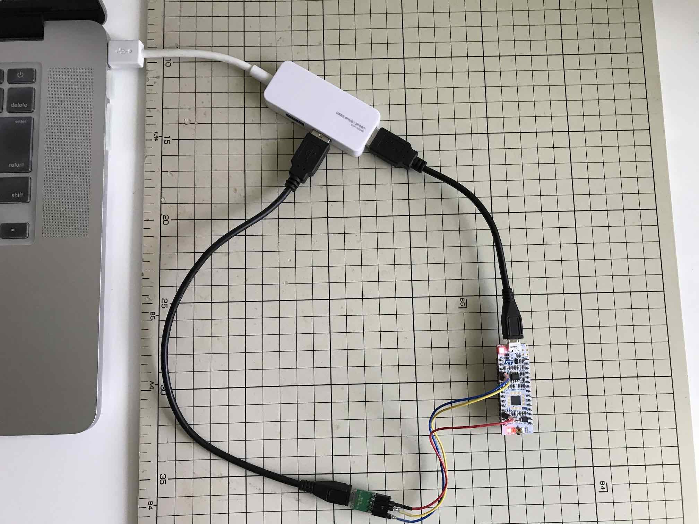

#### 接続要領

NUCLEO-L432KCとUSBケーブルを、下記表の通り接続します。<br>
USB CCIDインターフェースとして接続するピンの対応関係は以下の通りです。

|ピンの名前 |NUCLEO-L432KC | | USBポート|
|:--|:-:|:-:|:-:|
|USB GND |GND  | <--> |GND|
|USB D+ |D2 (PA12) | <--> |D+|
|USB D- |D10 (PA11) | <--> |D-|

接続するピン周りの様子は以下になります。

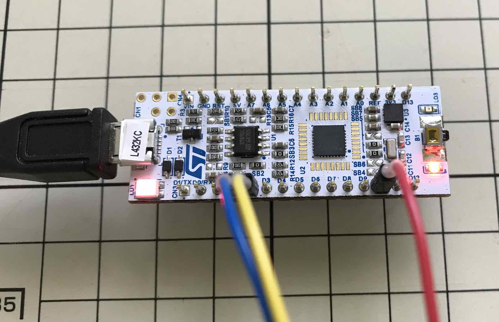

## ファームウェア作成

NetBeansを使用し、ファームウェア（canokey.bin）を作成します。

#### NetBeans環境の作成

あらかじめ、NetBeans環境をPCに作成しておきます。<br>
具体的な手順は、[NetBeansインストール手順](../../../nRF5_SDK_v15.3.0/NETBEANSINST.md)をご参照ください。

#### ソースコードの取得

GitHubリポジトリーからクローニングします。<br>
URLは[https://github.com/canokeys/canokey-stm32.git](https://github.com/canokeys/canokey-stm32.git)になります。

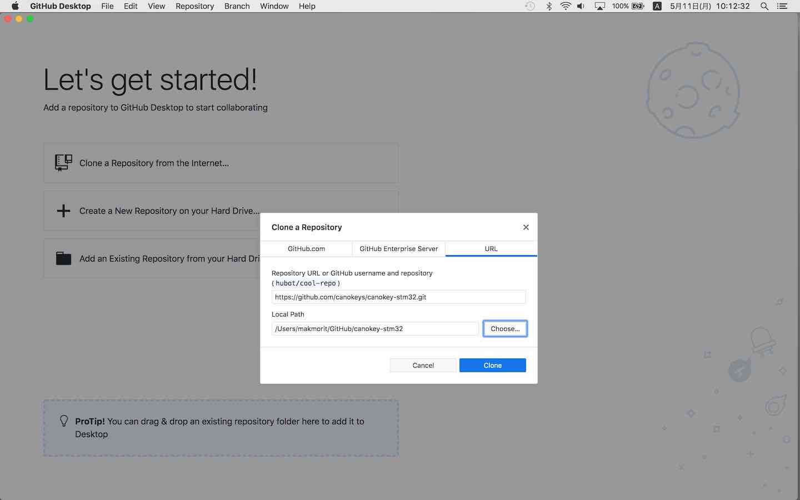

#### メイクファイルの作成

CMakeツールを使用して、macOS環境用のメイクファイルを生成します。<br>
以下のコマンドを使用します。

```
cd ${HOME}/GitHub/canokey-stm32
mkdir build
cd build
PATH="/Applications/CMake.app/Contents/bin":$PATH
TOOLCHAIN_DIR=${HOME}/opt/gcc-arm-none-eabi-7-2018-q2-update
cmake -DCROSS_COMPILE=${TOOLCHAIN_DIR}/bin/arm-none-eabi- -DCMAKE_TOOLCHAIN_FILE=../toolchain.cmake -DCMAKE_BUILD_TYPE=Release ..
```

下記は実行例になります。

```
MacBookPro-makmorit-jp:~ makmorit$ cd /Users/makmorit/GitHub/canokey-stm32
MacBookPro-makmorit-jp:canokey-stm32 makmorit$ pwd
/Users/makmorit/GitHub/canokey-stm32
MacBookPro-makmorit-jp:canokey-stm32 makmorit$ mkdir build
MacBookPro-makmorit-jp:canokey-stm32 makmorit$ cd build
MacBookPro-makmorit-jp:build makmorit$ PATH="/Applications/CMake.app/Contents/bin":$PATH
MacBookPro-makmorit-jp:build makmorit$ TOOLCHAIN_DIR=${HOME}/opt/gcc-arm-none-eabi-7-2018-q2-update
MacBookPro-makmorit-jp:build makmorit$ cmake -DCROSS_COMPILE=${TOOLCHAIN_DIR}/bin/arm-none-eabi- -DCMAKE_TOOLCHAIN_FILE=../toolchain.cmake -DCMAKE_BUILD_TYPE=Release ..
-- The C compiler identification is GNU 7.3.1
-- The ASM compiler identification is GNU
-- Found assembler: /Users/makmorit/opt/gcc-arm-none-eabi-7-2018-q2-update/bin/arm-none-eabi-gcc
-- Check for working C compiler: /Users/makmorit/opt/gcc-arm-none-eabi-7-2018-q2-update/bin/arm-none-eabi-gcc
-- Check for working C compiler: /Users/makmorit/opt/gcc-arm-none-eabi-7-2018-q2-update/bin/arm-none-eabi-gcc -- works
-- Detecting C compiler ABI info
-- Detecting C compiler ABI info - done
-- Detecting C compile features
-- Detecting C compile features - done
-- Found PkgConfig: /usr/local/bin/pkg-config (found version "0.29.2")
-- Found PythonInterp: /usr/bin/python (found version "2.7.10")
-- Found Perl: /usr/bin/perl (found version "5.18.2")
-- Configuring done
-- Generating done
-- Build files have been written to: /Users/makmorit/GitHub/canokey-stm32/build
MacBookPro-makmorit-jp:build makmorit$ ls -al
total 400
drwxr-xr-x   7 makmorit  staff     238  5 11 10:15 .
drwxr-xr-x  24 makmorit  staff     816  5 11 10:14 ..
-rw-r--r--   1 makmorit  staff   16642  5 11 10:15 CMakeCache.txt
drwxr-xr-x  21 makmorit  staff     714  5 11 10:15 CMakeFiles
-rw-r--r--   1 makmorit  staff  176657  5 11 10:15 Makefile
drwxr-xr-x   6 makmorit  staff     204  5 11 10:15 canokey-core
-rw-r--r--   1 makmorit  staff    1577  5 11 10:15 cmake_install.cmake
MacBookPro-makmorit-jp:build makmorit$
```

`canokey-stm32/build`配下に、メイクファイル`Makefile`が生成されていることが確認できれば、メイクファイル作成は完了です。

#### プロジェクトの新規作成〜ビルド実行

NetBeansを起動し、ファイル--->新規プロジェクトを実行します。<br>
新規プロジェクト画面が表示されますので、一覧から「既存のソースを使用するC/C++プロジェクト」を選択し「次 >」をクリックします。

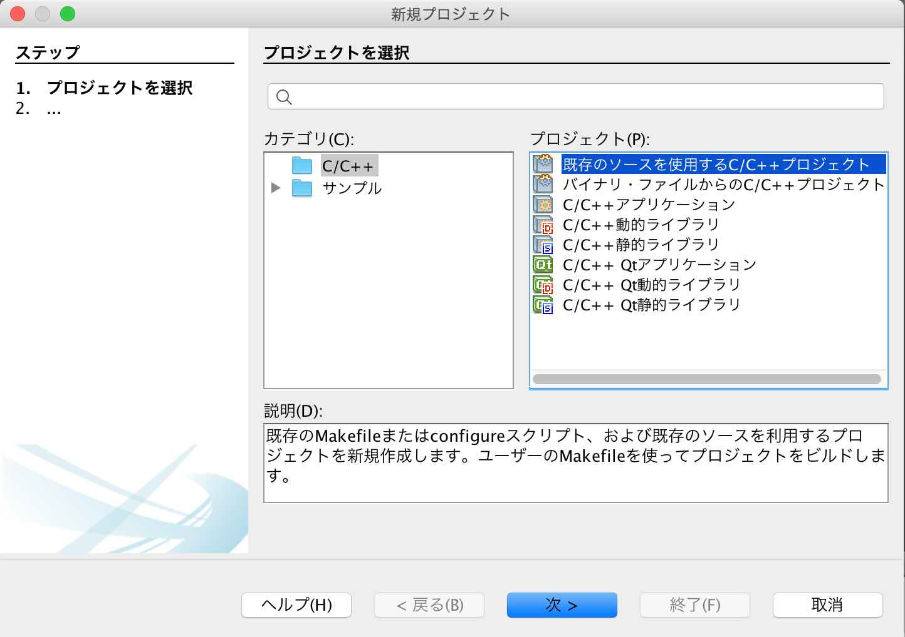

下図のような画面に遷移しますので、以下のように設定します。

- 既存のソースを含むフォルダを指定 - ソースコードが格納されているフォルダーを指定します。<br>
下図の例では「`/Users/makmorit/GitHub/canokey-stm32`」という文字列が設定されています。

- ツール・コレクションを選択 - 「GNU_ARM」を選択します。

- 構成モードを選択 - 「カスタム(C)」をチェックします。

設定が完了したら「次 >」をクリックします。

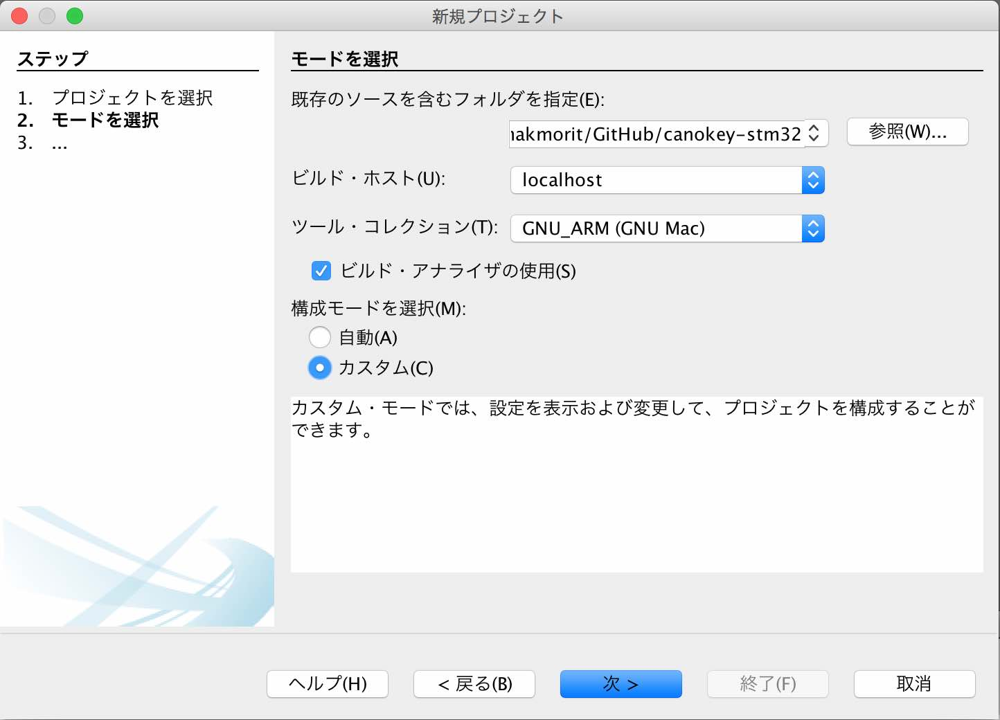

下図のような画面に遷移しますので、以下のように設定します。

- 「事前ビルド・ステップが必要」にチェック

- フォルダで実行(U) - Makefileが存在するフォルダー「`canokey-stm32/build`」を指定します。<br>
下図の例では「`/Users/makmorit/GitHub/canokey-stm32/build`」という文字列が設定されています。

- 「カスタム・コマンド」にチェック

- コマンド(O) - 「make」と入力します。

設定が完了したら「次 >」をクリックします。

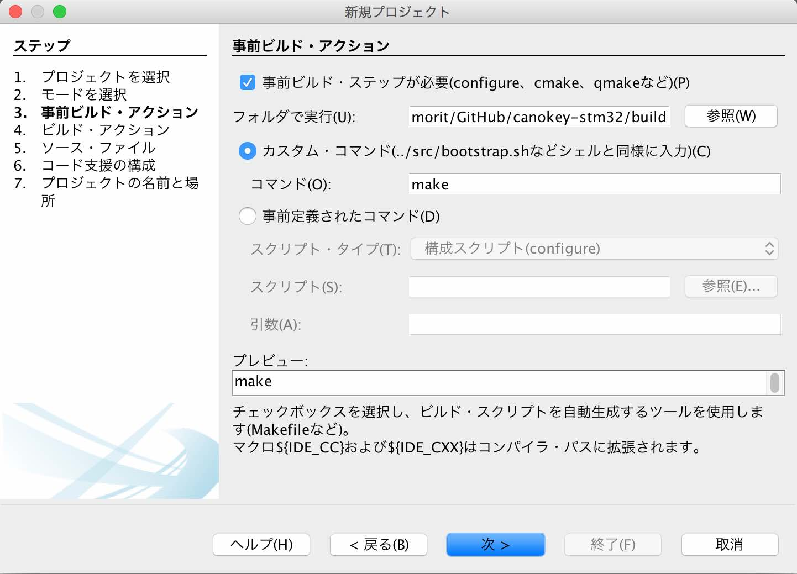

「4. ビルド・アクション」に遷移します。<br>
デフォルト設定のまま「次 >」をクリックします。


「5. ソース・ファイル」に遷移します。

NetBeans上でソースコードが閲覧できるようにするため、ソースコードが格納されたフォルダーを、一覧に追加指定します。<br>
（選択されたフォルダーは、NetBeans画面の左ペインにツリー表示されるようになります）

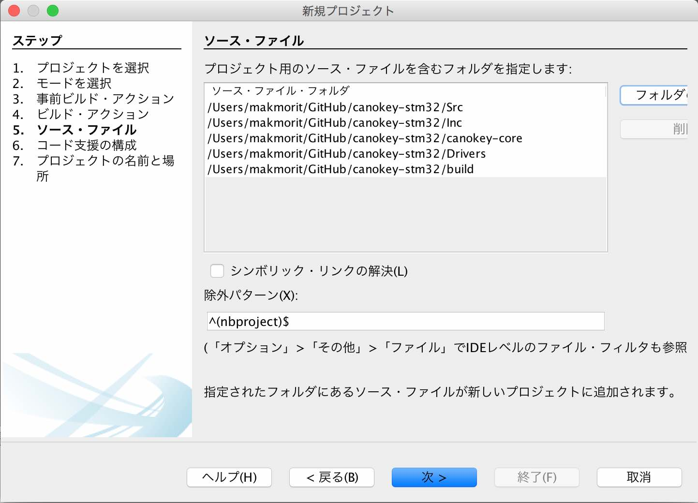

設定が完了したら「次 >」をクリックします。

「6. コード支援の構成」に遷移します。<br>
デフォルト設定のまま「次 >」をクリックします。


「7. プロジェクトの名前と場所」に遷移したら、プロジェクト名(P)を「open_bootloader」から「open_bootloader_proj」に変更しておきます。<br>
（オリジナルのプロジェクト「open_bootloader」を上書きしたくないための措置です）

設定が完了したら「終了(F)」をクリックします。

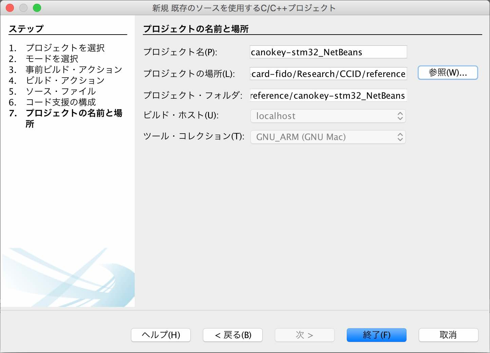

自動的にビルドがスタートしますので、しばらくそのまま待ちます。<br>
しばらくするとビルドが完了し「ビルド SUCCESSFUL」と表示されれば、ビルドは成功です。

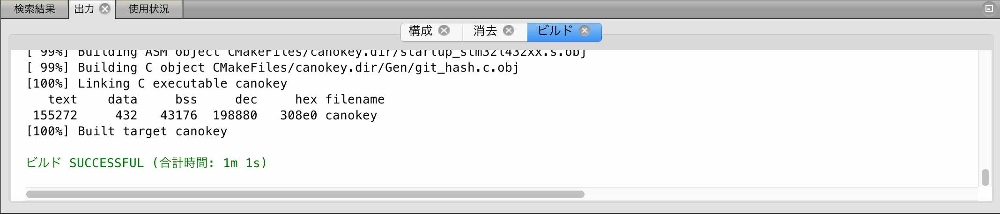

#### ビルド結果の確認

ビルドが完了したら、ファームウェア`canokey.bin`が正しく生成されているかどうか確認します。<br>
下記は`canokey.bin`(155KB)が生成されたことを確認したところです。

```
MacBookPro-makmorit-jp:~ makmorit$ ls -al cd ${HOME}/GitHub/canokey-stm32/build/canokey.bin
ls: cd: No such file or directory
-rwxr-xr-x  1 makmorit  staff  155808  5 11 11:18 /Users/makmorit/GitHub/canokey-stm32/build/canokey.bin
MacBookPro-makmorit-jp:~ makmorit$
```
以上で、ファームウェアのビルドは完了です。

## ファームウェア書込み

メイクファイルを事前に修正し、NetBeans画面から、ファームウェアの書込みを行うことができるようにします。

#### メイクファイルの修正（追記）

NetBeansプロジェクトから、ファームウェアの書き込みまでが一気に可能になるようにするため、メイクファイルに、ファームウェアファイル書込み用のコマンドを追記します。<br>
（コマンド＝`/bin/cp -p canokey.bin /Volumes/NODE_L432KC/`）

<b>修正前</b>
```
# Build rule for target.
canokey.bin: cmake_check_build_system
	$(MAKE) -f CMakeFiles/Makefile2 canokey.bin
.PHONY : canokey.bin
```

<b>修正後</b>
```
# Build rule for target.
canokey.bin: cmake_check_build_system
	$(MAKE) -f CMakeFiles/Makefile2 canokey.bin
	/bin/cp -p canokey.bin /Volumes/NODE_L432KC/
.PHONY : canokey.bin
```

#### ファームウェア書込み実行

NetBeans上でプロジェクト・プロパティ画面を開きます。<br>
「コマンドの実行」欄に、コマンド`make canokey.bin`を設定します。

設定が完了したら「適用」をクリックし、続けて「OK」をクリックします。

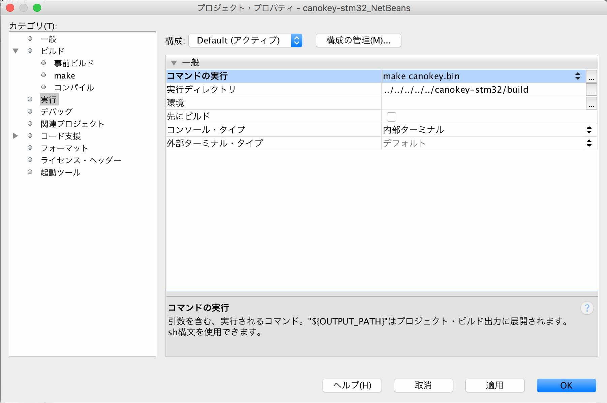

その後、画面上部の緑色のアイコン「プロジェクト(canokey-stm32_NetBeans)を実行」をクリックして、プロジェクトを実行します。<br>
自動的に、ファームウェアの書込みが実行されます。

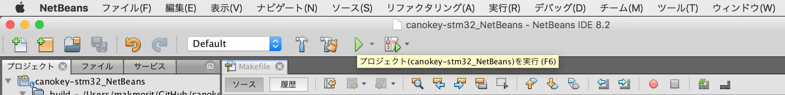

#### ファームウェアの初期動作確認

USBと接続されているNUCLEOから、UART経由でデバッグプリントが出力されることを確認します。<br>
下図は、screenコマンドで接続し、デバッグプリントを表示させている様子です。

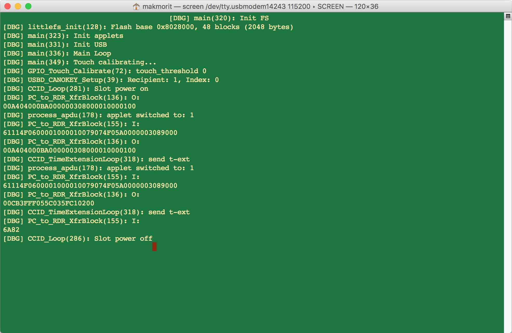


以上で、ファームウェアの書込みは完了です。
