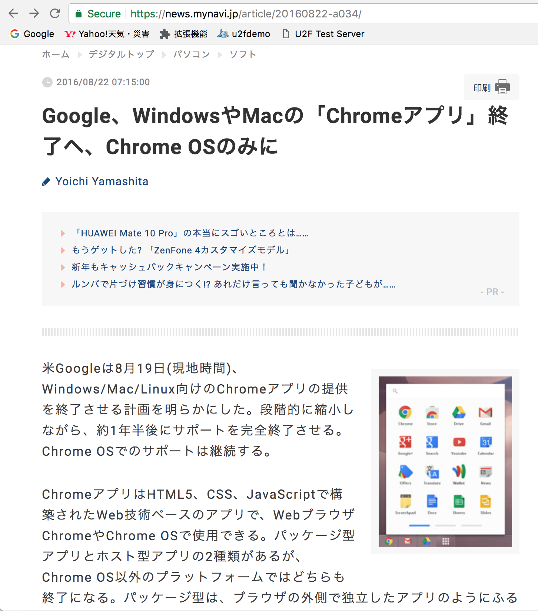
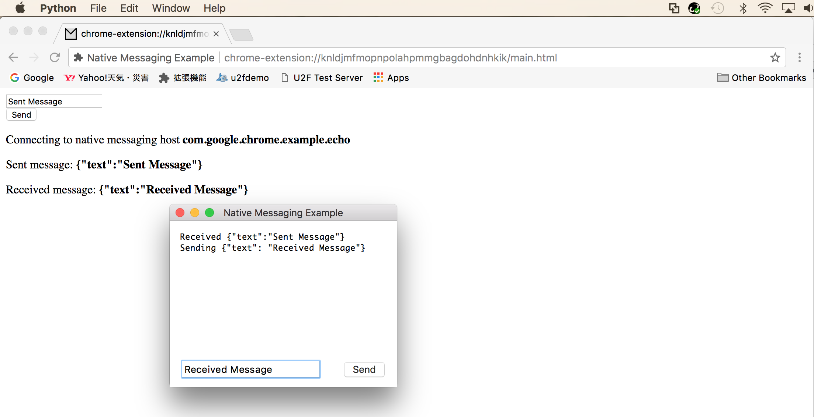

# ChromeアプリによるBLE U2F対応調査

PC環境で動作するFIDO U2F BLE対応を、Chromeアプリ（Chrome Apps）で実装できるかどうか調査しました。 
調査時の手順および結果を、以下に掲載いたします。

## 概要

Chromeアプリ<--->サブプロセス間で通信できる機能（Native Messaging）が、Google Chrome Appsで用意されていました。

参考URL： 
https://developer.chrome.com/extensions/nativeMessaging

具体的には、Chromeアプリから起動したサブプロセスと、エクステンションの間で、標準入出力（STDIO）経由でやり取りをすることができるようです。

ただし（動作確認中に発覚したのですが）確認用に使用したmacOS版Chromeアプリでは、2018年度以降サポートされなくなる（＝Chromeストアからの提供ができなくなってしまう）のことです。 
下記URLに、正式アナウンスがあります。

https://blog.chromium.org/2016/08/from-chrome-apps-to-web.html

ご参考までに、マイナビニュースというサイトが、[Googleアプリのサポート終了の旨を報じています](https://news.mynavi.jp/article/20160822-a034/)。

## サンプルによる動作確認

下記URLで公開されている、Chromeアプリのサンプルを使用して動作確認します。

https://developer.chrome.com/extensions/nativeMessaging#examples

#### サンプルの取得

こちらからダウンロードできます。 
[The examples/api/nativeMessaging directory](https://chromium.googlesource.com/chromium/src/+/master/chrome/common/extensions/docs/examples/api/nativeMessaging)

#### サブプロセスの導入

ダウンロードしたファイルを任意のフォルダーに展開します。

フォルダー「host」に格納されているインストール用スクリプト「install_host.sh」を実行して、サブプロセスをインストールします。

#### エクステンションの導入

拡張機能ページの「Load unpacked extension...」をクリックします。

先述のエクステンション配置フォルダー内の「app」を選択します。

拡張機能ページにエクステンション「Native Messaging Example」が追加されます。

#### Chromeアプリの実行

Chromeアプリページ（[chrome://apps](chrome://apps)）の「Native Messaging...」をクリックします。

HTMLページの「Connect」ボタンをクリックします。

HTMLページにテキストボックスと「Send」ボタンが表示されます。 
メッセージを入力し「Send」ボタンをクリックします。

HTMLページに実行結果が表示されます。

裏で立ち上がっているサブプロセス（PythonのGUIプログラム）の画面を見ると、先ほど「Send」したメッセージが表示されていることが確認できます。 
その後、サブプロセス側からメッセージを送信してみます。 
画面にメッセージを入力して「Send」ボタンをクリックします。

HTMLページ、サブプロセス画面の両方に実行結果が表示されます。

これで、Chromeアプリ<--->サブプロセス間で通信（Native Messaging）ができていることが確認できました。

## 確認結果からの考察

別途用意している[U2F管理ツール](../U2FMaintenanceTool/macOSApp)を改修することにより、ChromeアプリとNative Messagingを介した通信は可能と考えられます。

他方、先述の通り、macOS上でNative Messagingが使用できるChromeアプリが、2018年度以降Chromeストアで正式提供できなくなるとのことです。

なので、Native Messagingによる対応の検討は見送りとし、[他の代替え手段](https://developers.chrome.com/apps/migration)による検討を継続、とさせていただきます。
