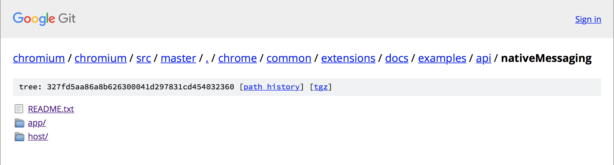
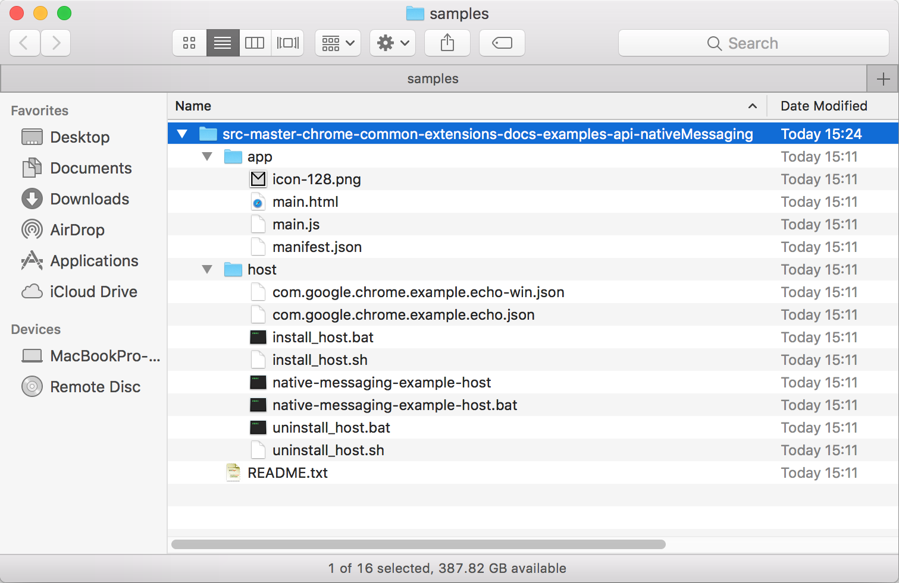
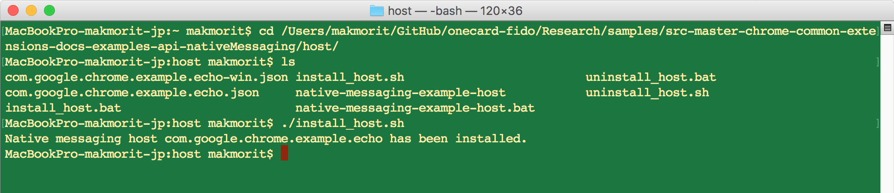
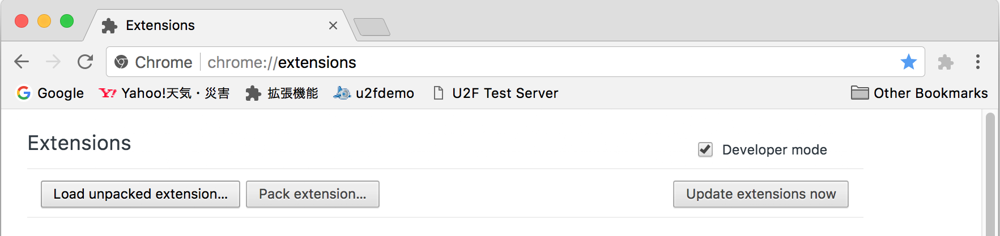
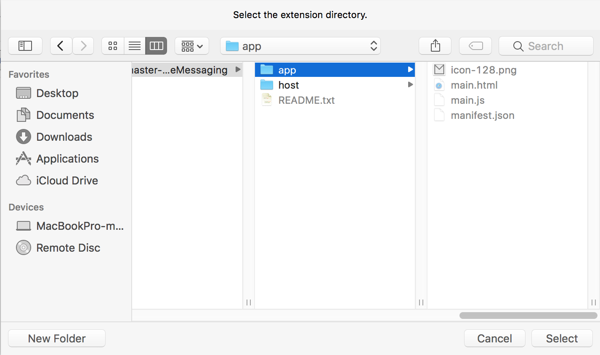
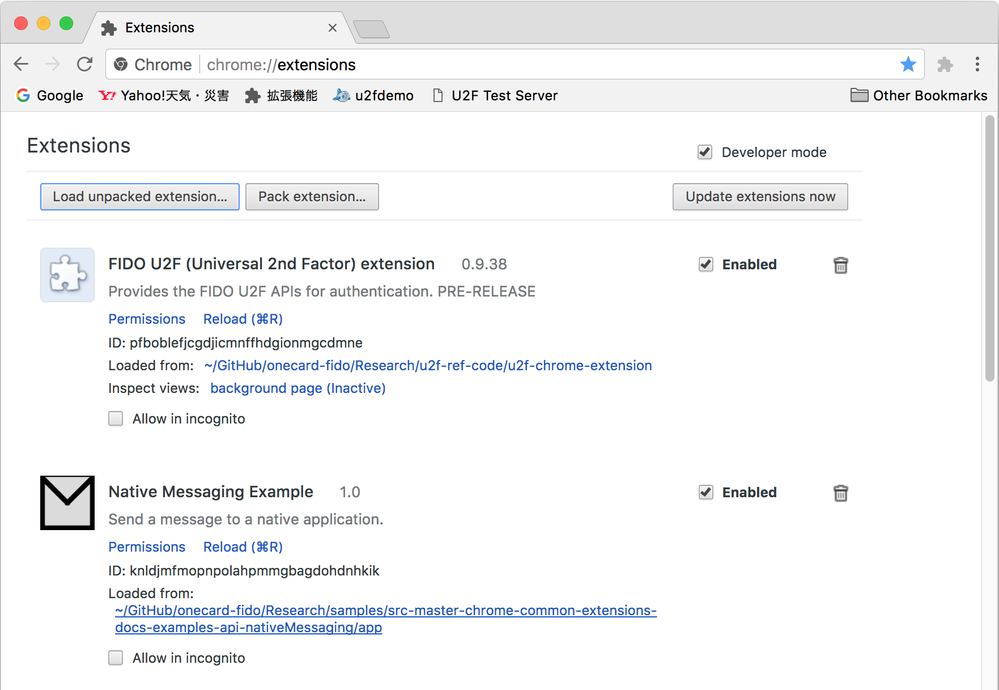
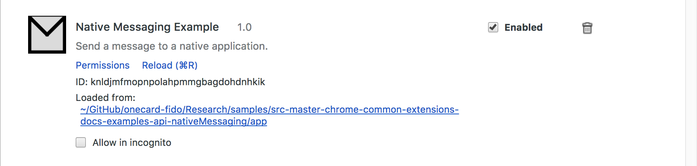
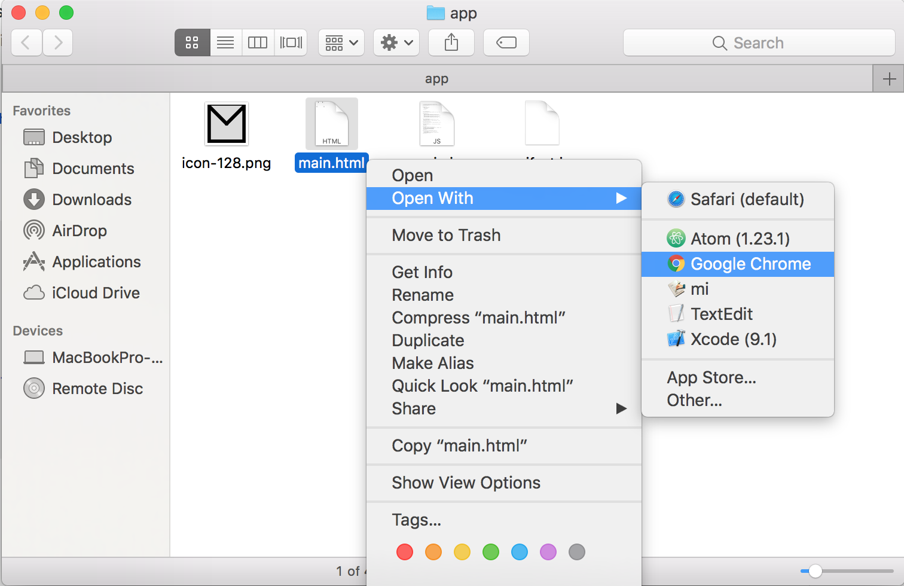
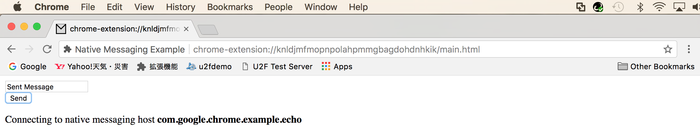
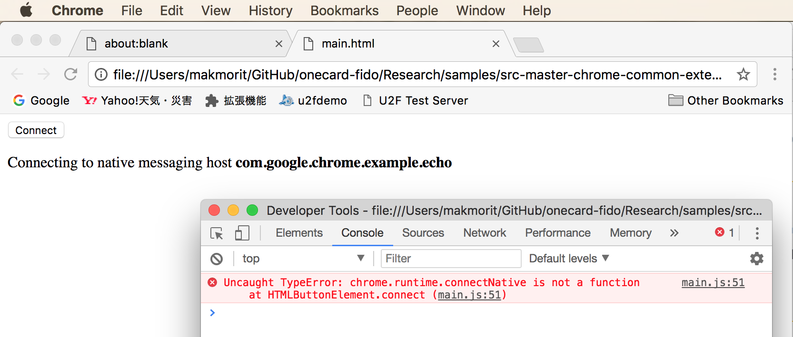

# [WIP] ブラウザーエクステンションの調査

PC環境で動作するFIDO U2F BLEエクステンションを、Chromeエクステンションで実装できるかどうかの継続調査です。<br>
調査時の手順および結果を、以下に掲載いたします。

## Native Messagingによるエクステンション実装 ---> 対応不可

Chrome<--->サブプロセス間通信（Native Messaging）がGoogle Chromeで用意されているようでした。

参考URL：<br>
https://developer.chrome.com/extensions/nativeMessaging

具体的には、Chromeから起動したサブプロセスと、エクステンションの間で、標準入出力（STDIO）経由でやり取りをすることができるようです。

ただし（動作確認中に発覚したのですが）確認用に使用したmacOSではすでにサポートされていないとのことで、後述のとおり、検証は失敗してしまいました。<br>


### サンプルにより動作確認

下記URLで公開されているサンプルを使用して動作確認します。<br>
https://developer.chrome.com/extensions/nativeMessaging#examples

#### サンプルの取得

こちらからダウンロードできます。<br>
[The examples/api/nativeMessaging directory](https://chromium.googlesource.com/chromium/src/+/master/chrome/common/extensions/docs/examples/api/nativeMessaging)


#### エクステンション配置

ダウンロードしたファイルを任意のフォルダーに展開します。<br>


フォルダー「host」に格納されているインストール用スクリプト「install_host.sh」を実行して、エクステンションをインストールします。<br>


#### Chromeのセットアップ

拡張機能ページの「Load unpacked extension...」をクリックします。<br>


先述のエクステンション配置フォルダー内の「app」を選択します。<br>


拡張機能ページにエクステンション「Native Messaging Example」が追加されます。<br>


#### エクステンションの実行

拡張機能ページの「Loaded from:」のリンクをクリックします。<br>


先述のエクステンションフォルダー「app」が開きますので、HTMLページ「main.html」をChromeで開きます。<br>


HTMLページの「Connect」ボタンをクリックします。<br>


#### 実行結果

HTMLページに「Connecting to〜」というメッセージが表示されたまま、ハングしてしまいます。<br>
デベロッパーツールで確認すると、エラーメッセージ「Uncaught TypeError」が表示されておりました。<br>


残念ながら、エラーが発生したmain.jsで実行された関数「chrome.runtime.connectNative」は、macOS版のChromeではサポートされていないことが確認されました。

```
function connect() {
    var hostName = "com.google.chrome.example.echo";
    appendMessage("Connecting to native messaging host <b>" + hostName + "</b>")
    port = chrome.runtime.connectNative(hostName);
    port.onMessage.addListener(onNativeMessage);
    port.onDisconnect.addListener(onDisconnected);
    updateUiState();
}
```
