# Chrome(macOS版)でのBLE U2F対応調査

macOS版Chromeブラウザーで、BLE U2F対応ができるかどうかの調査を行いました。

調査時の手順および結果を、以下に掲載いたします。

## Chromeアプリによる実装 ---> 対応不可

Chrome Appsから起動されたChromeアプリと、サブプロセス間で、Native Messaging機能を使って通信する方法です。<br>
動作確認中に発覚したのですが、macOS版Chromeアプリは、2018年度以降サポートされなくなる（＝Chrome Appsからロードできなくなってしまう）ため、対応不可と判断しました。

* 参考URL<br>
https://developer.chrome.com/extensions/nativeMessaging

* 調査レポートはこちら<br>
[ChromeアプリによるBLE U2F対応調査](CHROMEBLEAPP.md)

## Chromeエクステンションによる実装 ---> こちらで対応いたします

Chromeブラウザー上のWebページから呼び出されたChromeエクステンションと、サブプロセス間で、Native Messaging機能を使って通信する方法です。<br>
サブプロセスとしては、すでに実装済みの[macOS版U2F管理ツール](../U2FMaintenanceTool/README.md)を使用します。

確認手順／結果は以下の通りです。

### U2F管理ツールのインストール

[U2FMaintenanceTool.pkg](../U2FMaintenanceTool/macOSApp/U2FMaintenanceTool.pkg) をダウンロードします。

ダウンロードしたU2FMaintenanceTool.pkgを右クリックし、インストーラーで開きます。

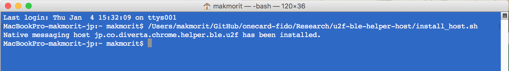

App Storeアプリでないため警告が出ますが、そのままOpenをクリックします。

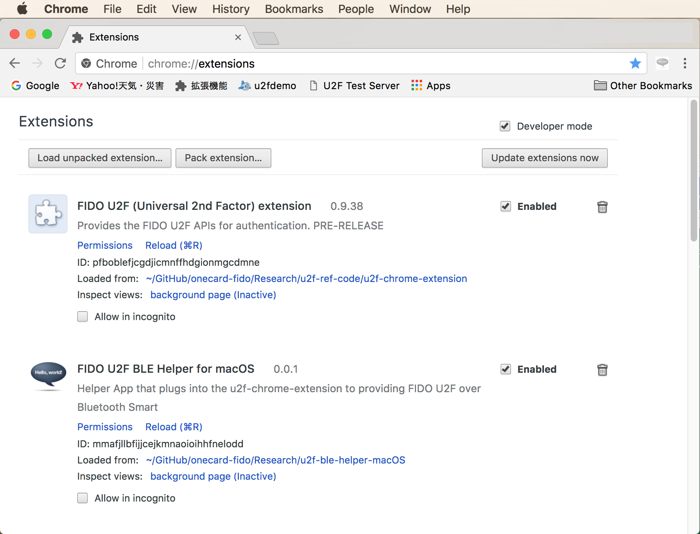

インストーラーの指示に従い、インストールを進めます。

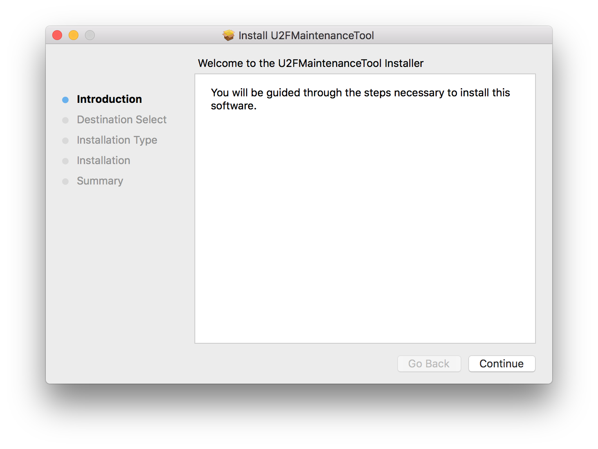

インストール成功のメッセージが表示されます。

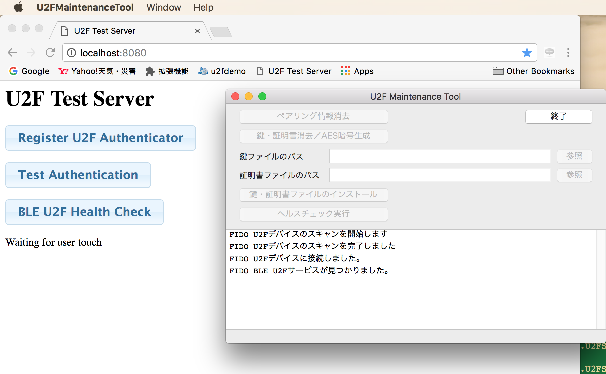

アプリケーションフォルダーの配下に、U2F管理ツールがコピーされていれば、インストールは完了です。


### Chrome Native Messagingの有効化設定

U2F管理ツールが、Chromeブラウザーのサブプロセスとして起動できるよう、Chromeに設定します。

U2F管理ツールをダブルクリックして画面を表示させ、右下部の「Chrome設定」ボタンをクリックします。

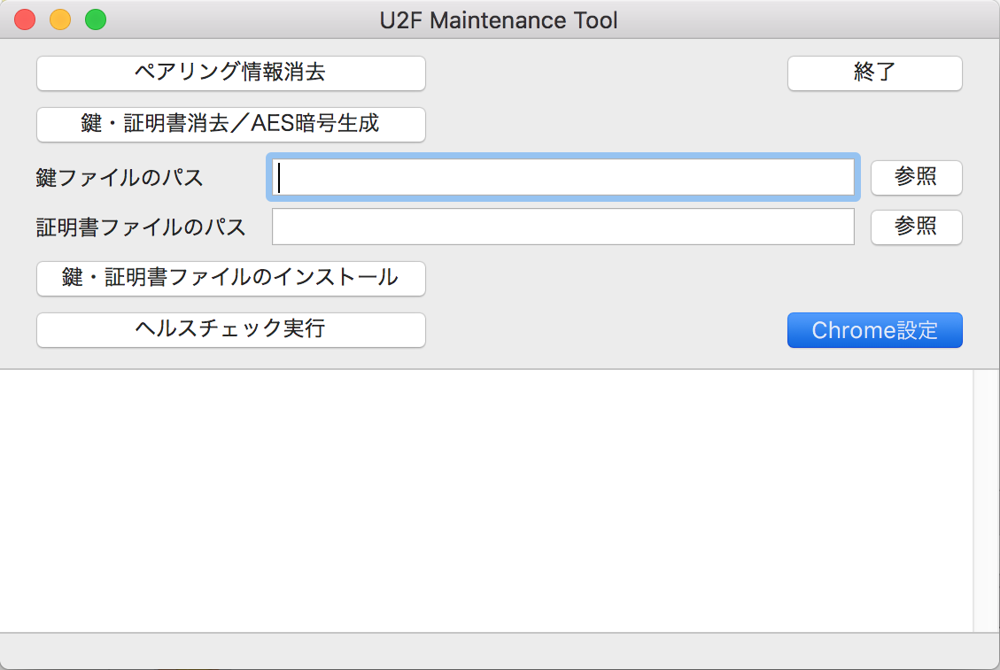

表示されたダイアログでYesをクリックすると、Chrome Native Messagingの有効化設定処理がスタートします。

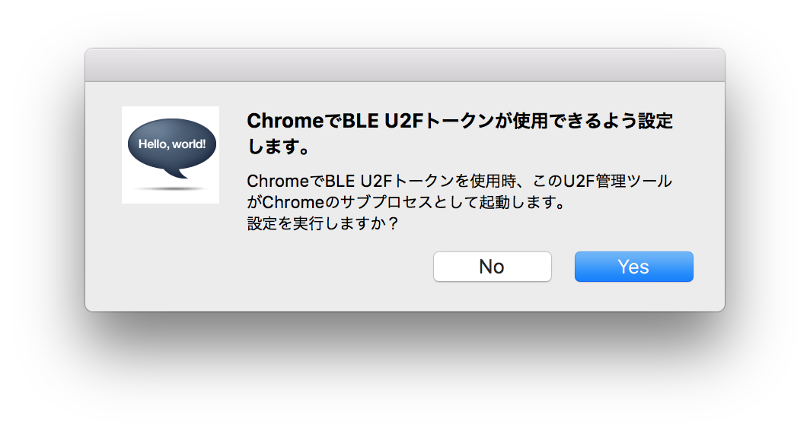

処理が成功すると、メッセージが表示されます。

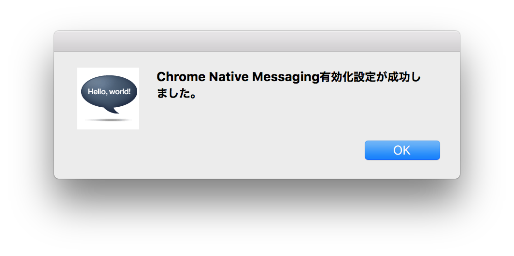

Chromeブラウザーの設定用ディレクトリー配下に、JSONファイルが１件出力されます。<br>
このJSONファイルの設定内容により、U2F管理ツールが、Chromeのサブプロセスとして動作し、ChromeエクステンションからNative MessagingによりU2F管理ツールの機能を実行することができるようになります。
```
MacBookPro-makmorit-jp:~ makmorit$ ls -al ~/Library/"Application Support"/Google/Chrome/NativeMessagingHosts/
total 8
drwxr-xr-x   3 makmorit  staff   102 Jan 23 10:09 .
drwx------  33 makmorit  staff  1122 Jan 22 16:14 ..
-rw-r--r--@  1 makmorit  staff   312 Jan 23 10:09 jp.co.diverta.chrome.helper.ble.u2f.json
MacBookPro-makmorit-jp:~ makmorit$ cat ~/Library/"Application Support"/Google/Chrome/NativeMessagingHosts/jp.co.diverta.chrome.helper.ble.u2f.json
{
  "path" : "/Applications/U2FMaintenanceTool.app/Contents/MacOS/U2FMaintenanceTool",
  "allowed_origins" : [
    "chrome-extension://pfboblefjcgdjicmnffhdgionmgcdmne/"
  ],
  "name" : "jp.co.diverta.chrome.helper.ble.u2f",
  "type" : "stdio",
  "description" : "BLE U2F Helper - Chrome Native Messaging Host"
}
```
これでChrome Native Messagingの有効化設定は完了です。

### Chrome U2Fエクステンション（カスタマイズ版）を導入

Chrome U2Fエクステンション「[u2f-chrome-extension](u2f-ref-code/u2f-chrome-extension)」をChromeブラウザーに導入します。<br>
使用するChrome U2Fエクステンションは、[Googleから提供されたオリジナル版](https://github.com/google/u2f-ref-code/tree/master/u2f-chrome-extension)をカスタマイズしたものです。

[Chromeのエクステンション・ページ](chrome://extensions/)の「パッケージされていない拡張機能をロード」（一番左のボタン）をクリックします。

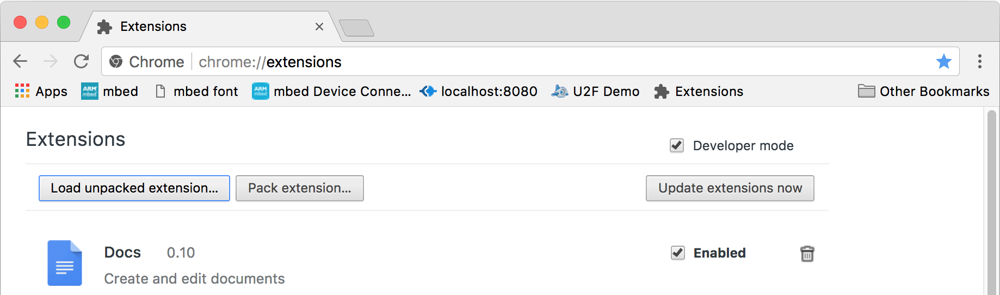

Chrome U2Fエクステンションが格納されているフォルダーを指定し、選択を実行します。

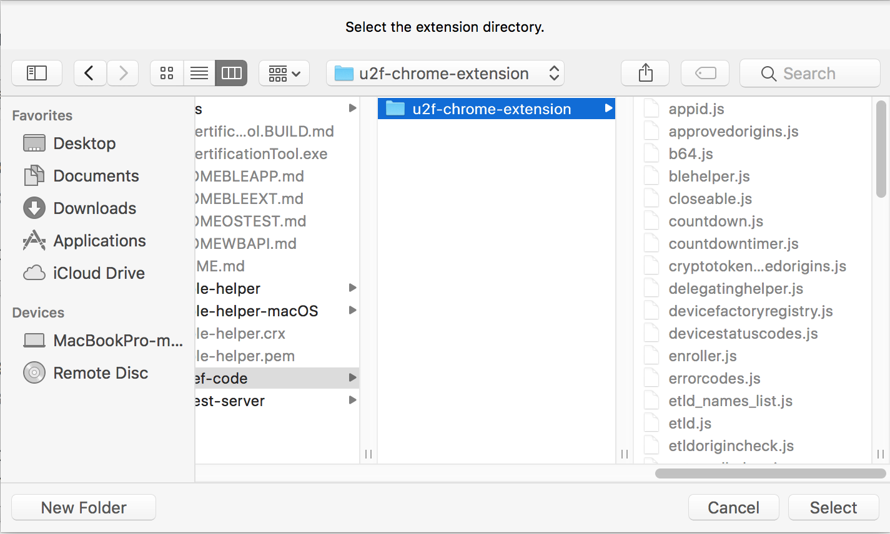

Chromeエクステンション・ページに、Chrome U2Fエクステンションが導入されます。<br>
エクステンションIDが「pfboblefjcgdjicmnffhdgionmgcdmne」であること（＝前述JSONファイルに記述されたものと同値）を確認します。


これでChrome U2Fエクステンション（カスタマイズ版）導入は完了です。

#### 参考：パッケージ済みエクステンションにしない理由

今回テストに使用した[U2Fデモサーバー](https://crxjs-dot-u2fdemo.appspot.com/)は、IDが「pfboblefjcgdjicmnffhdgionmgcdmne」であるエクステンションのみをサポートしています。

他方、[u2f-chrome-extension](u2f-ref-code/u2f-chrome-extension)をパッケージ済みエクステンション（.crx）にすると、エクステンションIDが「pfboblefjcgdjicmnffhdgionmgcdmne」から変わってしまい、結果としてエクステンションが実行できません。

したがって、今回は[u2f-chrome-extension](u2f-ref-code/u2f-chrome-extension)をパッケージされていない状態でChromeブラウザーに導入しております。

### U2FデモサーバーでEnroll

もしU2F管理ツールが起動中であれば、終了ボタンをクリックし、U2F管理ツール画面を閉じます。

その後、Chromeブラウザーで[U2Fデモサーバー](https://crxjs-dot-u2fdemo.appspot.com/)にアクセスし、U2Fデモページを表示させます。<br>
U2Fデモページの「Register U2F Authenticator」ボタンをクリックします。

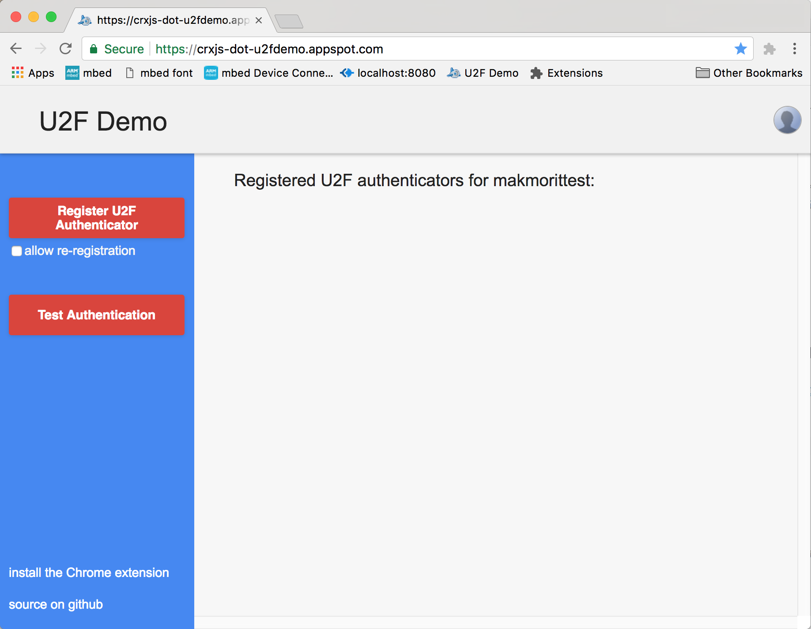

U2F Register処理がスタートします。

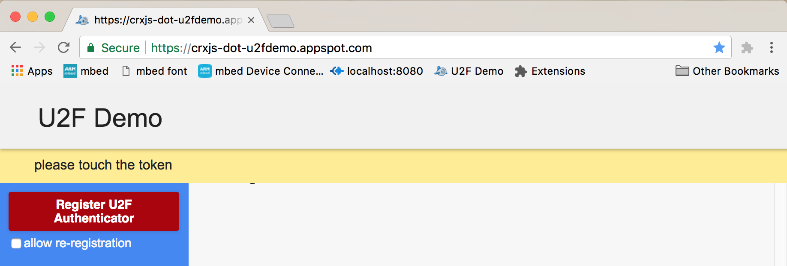

Chromeエクステンションにより、macOS版U2F管理ツールが、Chromeブラウザーのサブプロセスとして自動的に起動され、U2F管理ツール内に実装されているU2F Register処理がスタートします。<br>
（U2F管理ツール下部のテキストエリアには、処理ログが表示されます）

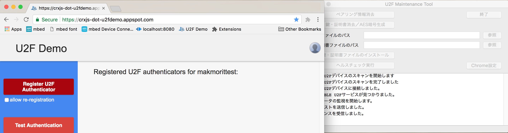

ほどなくU2F Register処理が完了し、HTMLにRegisterされた証明書等の内容が表示されます。

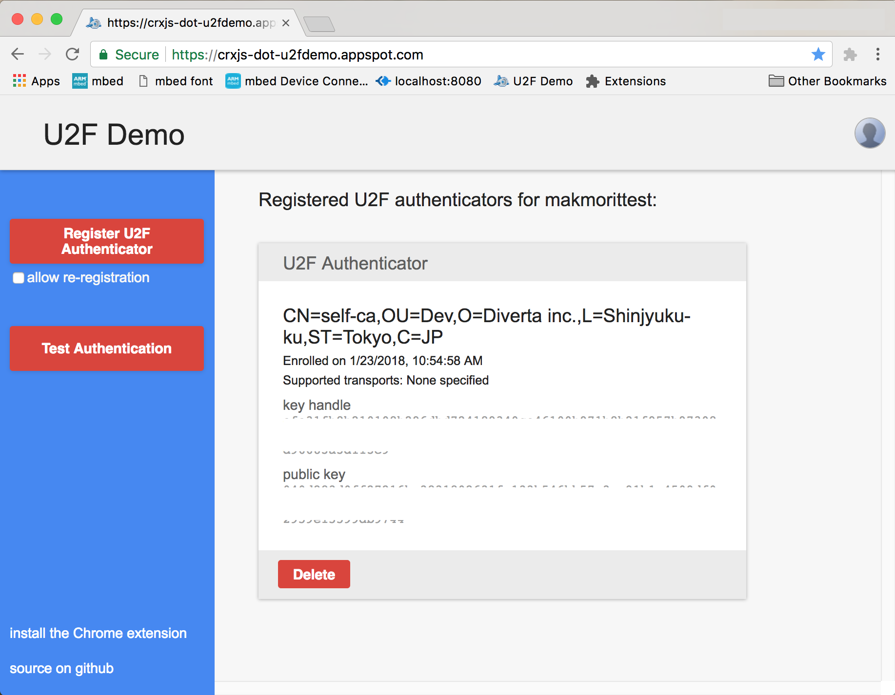

### U2FデモサーバーでSign

U2Fデモページの「Test Authentication」ボタンをクリックします。<br>
U2F Authenticate処理がスタートします。


U2F管理ツール内に実装されているU2F Authenticate処理がスタートします。<br>
（U2F管理ツール下部のテキストエリアには、処理ログが表示されます）

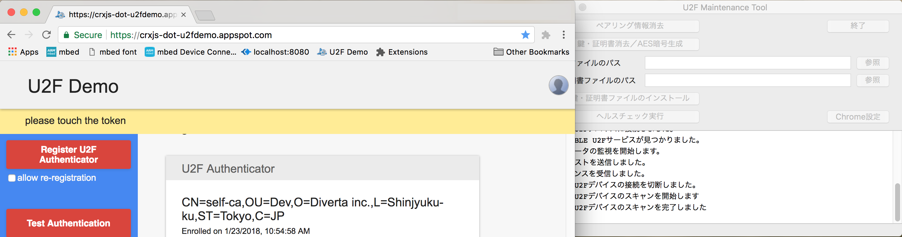

One Card上のユーザー所在確認LEDが点灯したら、MAIN SWを１回プッシュします。


ほどなくU2F Sign処理が完了し、HTML上の内容表示欄が緑色に変化します(１秒間程度)。

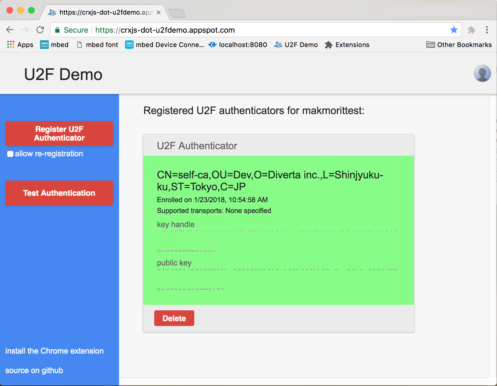

### テスト終了

テストが終了したら、Chromeブラウザーを閉じます。<br>
Chromeブラウザーが終了されることにより、U2F管理ツールは自動的に終了し、画面は閉じられます。
