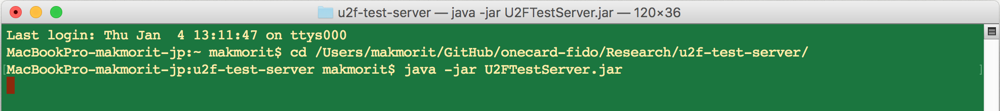

# [WIP] Chrome(macOS版)でのBLE U2F対応調査

PC環境で動作するFIDO U2F BLEエクステンションを、Chromeエクステンションで実装できるかどうかの継続調査です。 
調査時の手順および結果を、以下に掲載いたします。

## Chromeアプリによる実装 ---> 対応不可

Chrome Appsから起動されたChromeアプリと、サブプロセス間で、Native Messaging機能を使って通信する方法です。

動作確認中に発覚したのですが、macOS版Chromeアプリは、2018年度以降サポートされなくなる（＝Chrome Appsからロードできなくなってしまう）ため、対応不可と判断しました。

* 参考URL 
https://developer.chrome.com/extensions/nativeMessaging

* 調査レポートはこちら 
[ChromeアプリによるBLE U2F対応調査](CHROMEBLEAPP.md)

## Chromeエクステンションによる実装 ---> こちらで対応いたします

Chromeブラウザー上のWebページから呼び出されたChromeエクステンションと、サブプロセス間で、Native Messaging機能を使って通信する方法です。

2018/1/4現在、Chromeブラウザーから[U2F管理ツール](../U2FMaintenanceTool/macOSApp)を起動して、BLE経由でヘルスチェックを実行できるところまで確認ができております。

### 現状の確認手順／結果

Chromeブラウザーのサブプロセスとなる「u2f-ble-helper-host」をインストールします。 
（「[ChromeアプリによるBLE U2F対応調査](CHROMEBLEAPP.md#サブプロセスの導入)」ご参照）

「u2f-ble-helper-host」を呼び出すエクステンション「u2f-ble-helper-macOS」をChromeブラウザーに導入します。

U2Fローカルテストサーバーを起動します。

Chromeブラウザーを起動してローカルサーバーのインデックスページを表示します。 
ここで「BLE U2F Health Check」ボタンをクリックします。

Chromeエクステンションにより、U2F管理ツールが、Chromeブラウザーのサブプロセスとして自動的に起動され、U2F管理ツール内に実装されているヘルスチェック処理がスタートします。

ほどなくヘルスチェック処理が完了します。

この後、Chromeブラウザーを閉じる（終了させる）ことにより、U2F管理ツールは自動的に終了します。
