# Chrome(Windows版)でのBLE U2F対応調査

Windows版Chromeブラウザーで、ChromeエクステンションによるBLE U2F対応ができるかどうかの調査を行いました。

調査時の手順および結果を、以下に掲載いたします。

## 実装方法

Chromeブラウザー上のWebページから呼び出されたChromeエクステンションと、サブプロセス間で、Native Messaging機能を使って通信する方法を採用しています。 
サブプロセスとしては、すでに実装済みの[Windows版U2F管理ツール](../U2FMaintenanceTool/README.md)を使用します。

確認手順／結果は以下の通りです。

### U2F管理ツールのインストール

[Windows版U2F管理ツール](../U2FMaintenanceTool/WindowsExe/BLE/) をGitHubからチェックアウトして取得します。

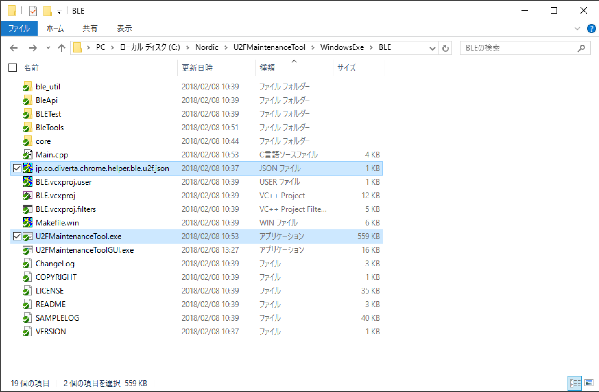

Chromeブラウザーで使用するのは、U2F管理コマンド（上図のU2FMaintenanceTool.exe）とJSONファイル（上図のjp.co.diverta.chrome.helper.ble.u2f.json）の２ファイルです。 
「U2FMaintenanceTool.exe」は、単体の実行可能ファイルですので、任意のフォルダーに配置すれば使用できます。

その後、[One Cardとのペアリング](../Usage/PAIRING.md)を済ませておきます。 
ペアリングがすんだ状態では、One CardがBluetooth設定画面の一覧に「ペアリング済み」と表示されます。

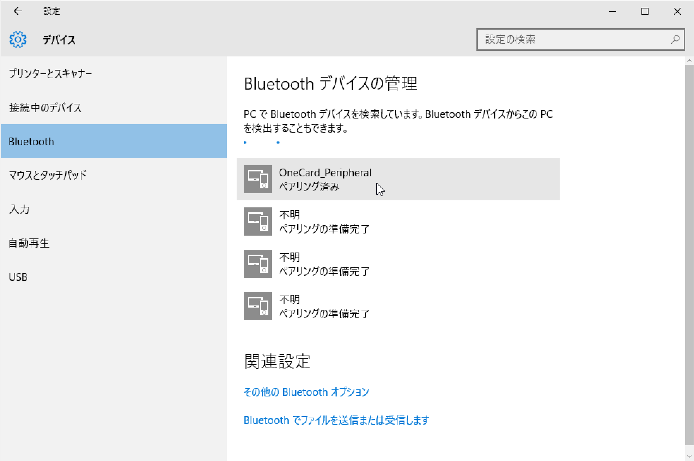

### Chrome Native Messagingの有効化設定

U2F管理コマンドが、Chromeブラウザーのサブプロセスとして起動できるよう、Chromeに設定します。

U2F管理ツール（下図のU2FMaintenanceToolGUI.exe）をダブルクリックして実行します。

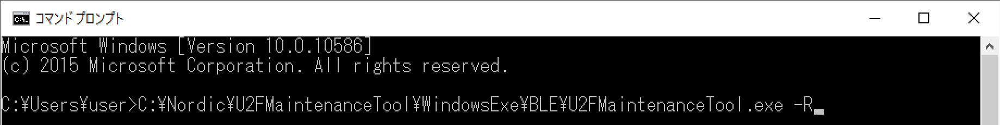

起動された画面の「Chrome設定」ボタンをクリックします。

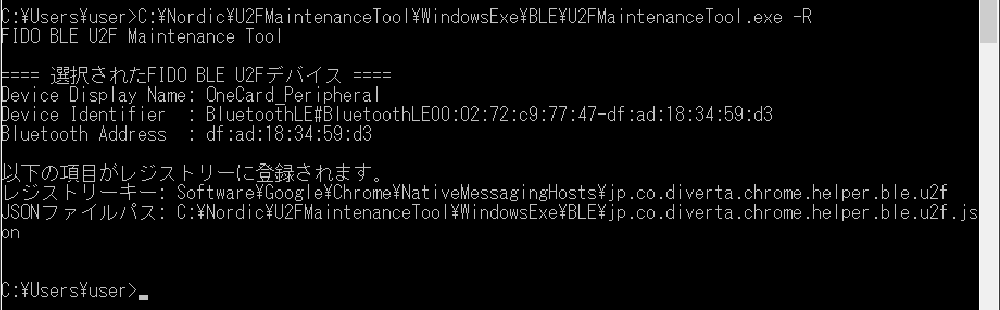

表示されたポップアップで「はい」ボタンをクリックします。

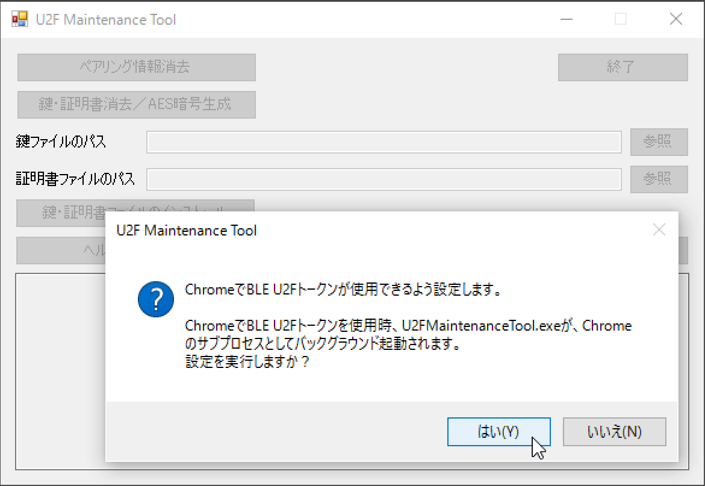

Chrome Native Messagingの有効化設定処理がスタートします。 
処理が成功すると、メッセージが表示されます。

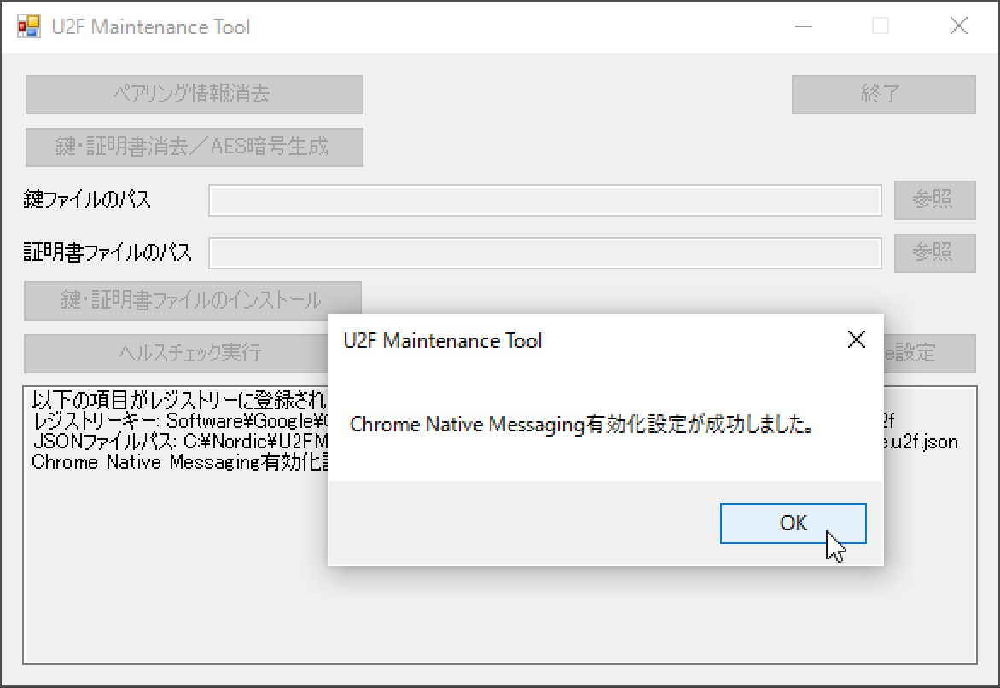

Chromeブラウザーの設定用レジストリー（下図ご参照）に、JSONファイルのパスが登録され、Chromeから参照できるようになります。 
JSONファイルの設定内容により、U2F管理コマンドが、Chromeのサブプロセスとして動作し、ChromeエクステンションからNative MessagingによりU2F管理コマンドの機能を実行することができるようになります。

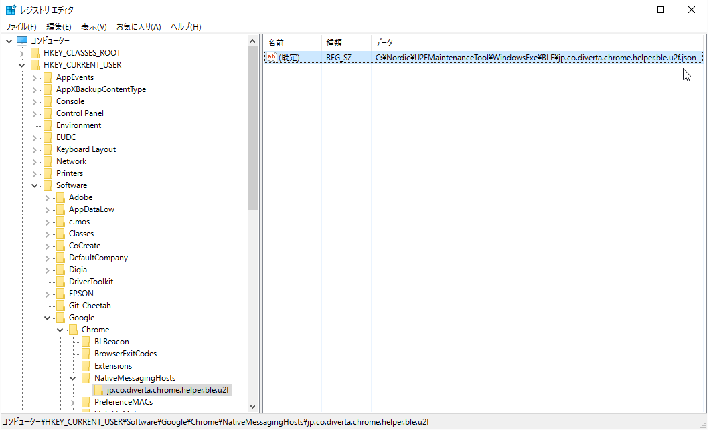

これでChrome Native Messagingの有効化設定は完了です。

### Chrome U2Fエクステンション（カスタマイズ版）を導入

Chrome U2Fエクステンション「[u2f-chrome-extension](u2f-ref-code/u2f-chrome-extension)」をChromeブラウザーに導入します。 
使用するChrome U2Fエクステンションは、[Googleから提供されたオリジナル版](https://github.com/google/u2f-ref-code/tree/master/u2f-chrome-extension)をカスタマイズしたものです。

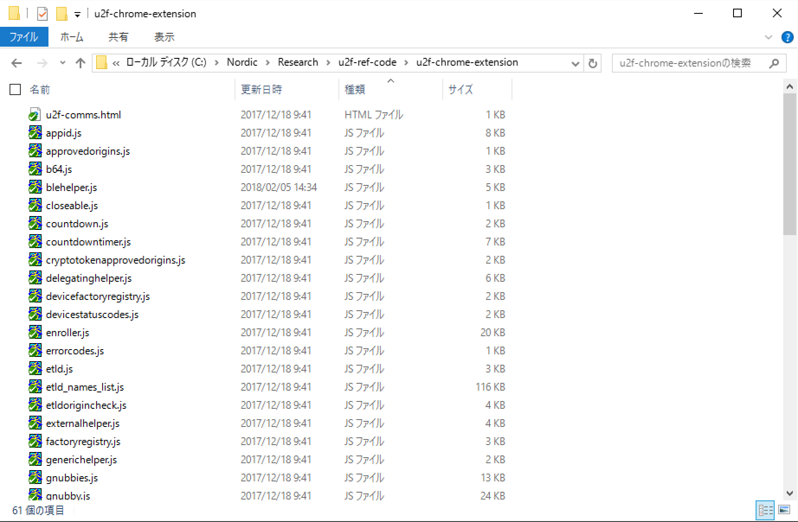

[Chromeのエクステンション・ページ](chrome://extensions/)の「パッケージされていない拡張機能を読み込む」（一番左のボタン）をクリックします。

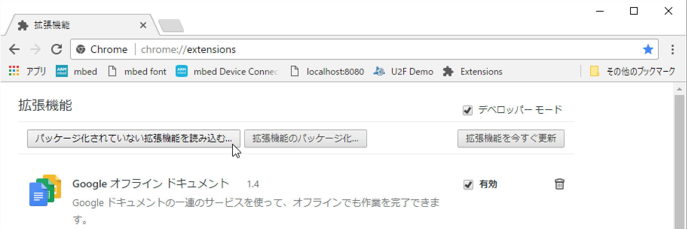

Chrome U2Fエクステンションが格納されているフォルダーを指定し、選択を実行します。

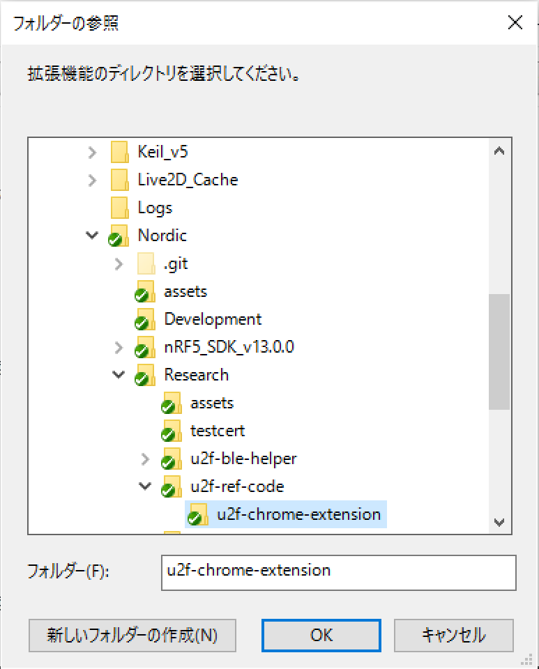

Chromeエクステンション・ページに、Chrome U2Fエクステンションが導入されます。 
エクステンションIDが「pfboblefjcgdjicmnffhdgionmgcdmne」であること（＝前述JSONファイルに記述されたものと同値）を確認します。

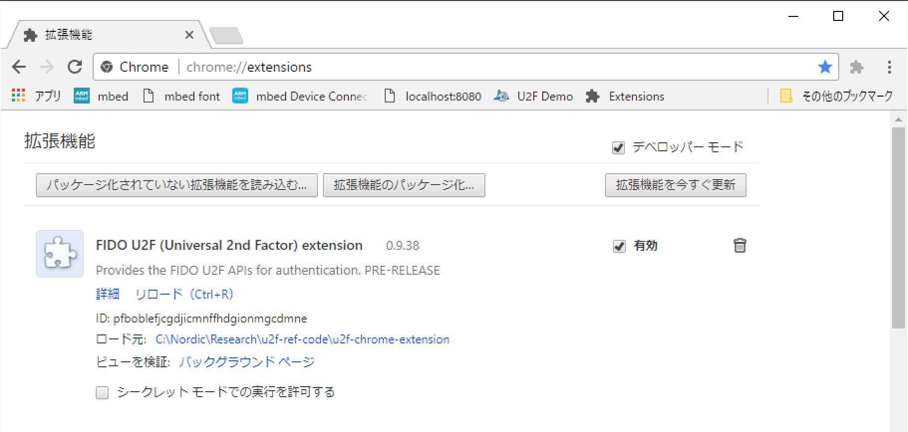

これでChrome U2Fエクステンション（カスタマイズ版）導入は完了です。

#### 参考：パッケージ済みエクステンションにしない理由

今回テストに使用した[U2Fデモサーバー](https://crxjs-dot-u2fdemo.appspot.com/)は、IDが「pfboblefjcgdjicmnffhdgionmgcdmne」であるエクステンションのみをサポートしています。

他方、[u2f-chrome-extension](u2f-ref-code/u2f-chrome-extension)をパッケージ済みエクステンション（.crx）にすると、エクステンションIDが「pfboblefjcgdjicmnffhdgionmgcdmne」から変わってしまい、結果としてエクステンションが実行できません。

したがって、今回は[u2f-chrome-extension](u2f-ref-code/u2f-chrome-extension)をパッケージされていない状態でChromeブラウザーに導入しております。

### U2FデモサーバーでEnroll

Chromeブラウザーで[U2Fデモサーバー](https://crxjs-dot-u2fdemo.appspot.com/)にアクセスし、U2Fデモページを表示させます。 
U2Fデモページの「Register U2F Authenticator」ボタンをクリックします。

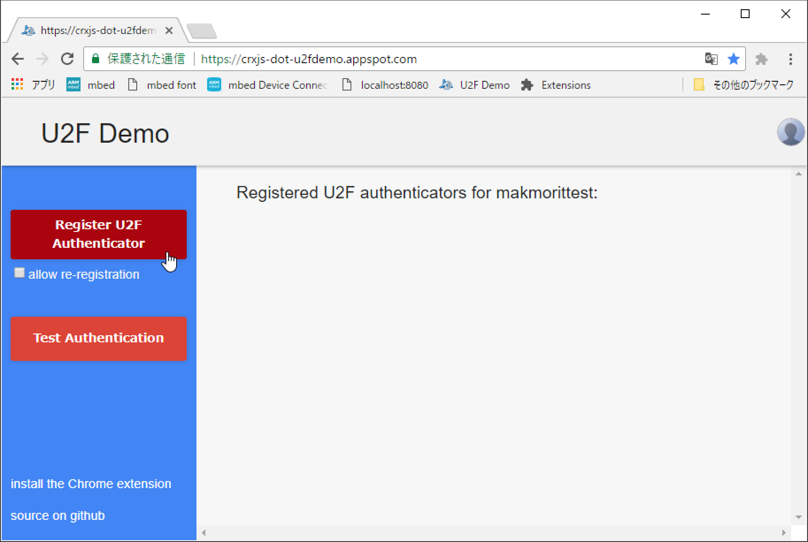

U2F Register処理がスタートします。 
（HTML上部に黄色いバー「please touch the token」が表示されますが、何もしないで待ちます）

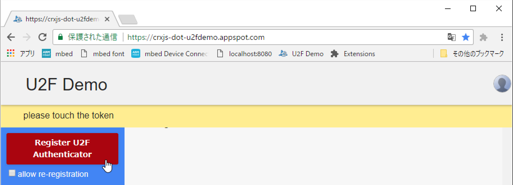

Chromeエクステンションにより、U2F管理コマンドが、Chromeブラウザーのサブプロセスとして自動的に起動され、U2F管理コマンドに実装されているU2F Register処理がスタートします。 
ほどなくU2F Register処理が完了し、HTMLにRegisterされた証明書等の内容が表示されます。

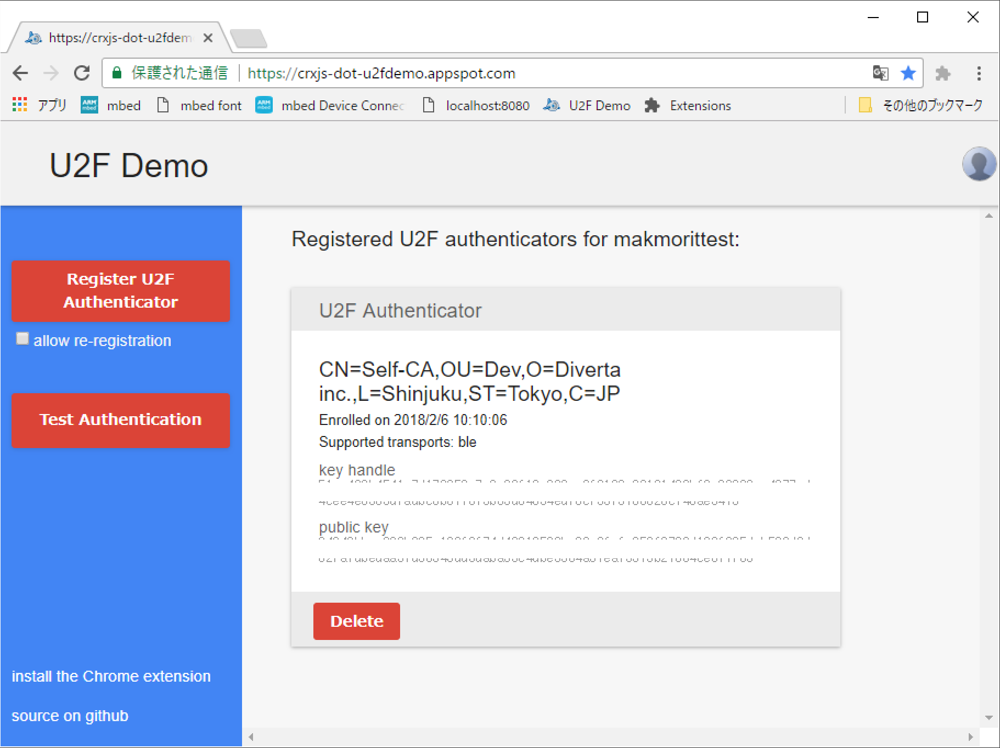

### U2FデモサーバーでSign

U2Fデモページの「Test Authentication」ボタンをクリックします。 
U2F Authenticate処理がスタートします。

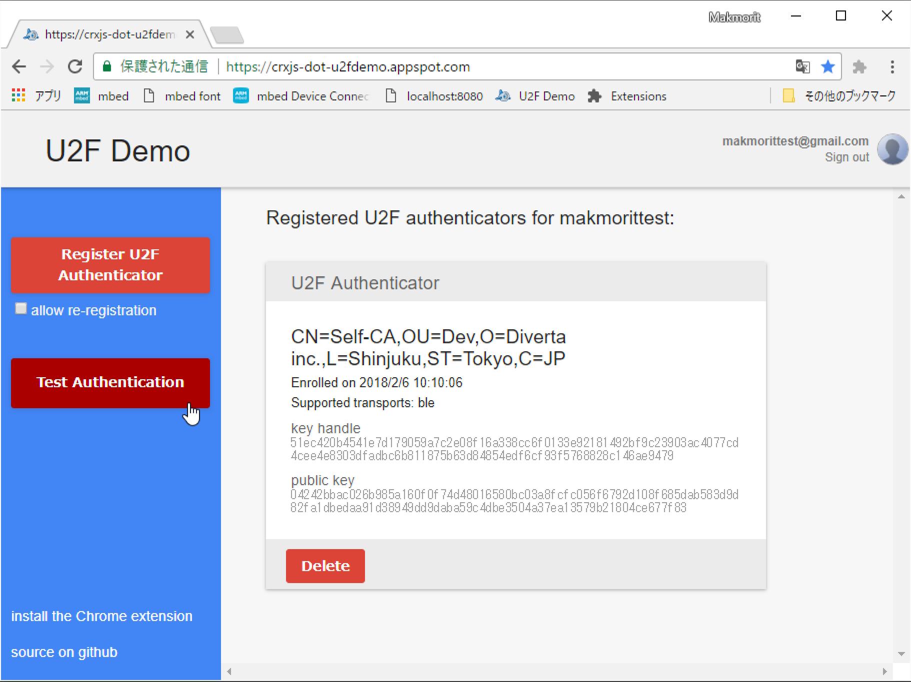

U2F管理コマンド内に実装されているU2F Authenticate処理がスタートします。 
（HTML上部に黄色いバー「please touch the token」が表示されます）

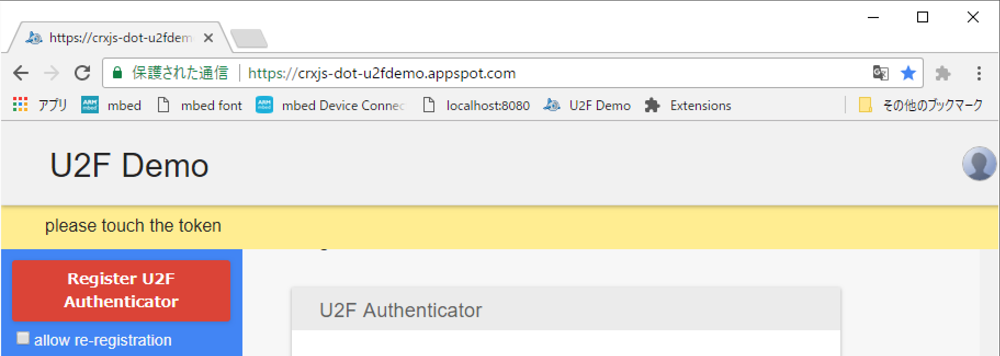

One Card上のユーザー所在確認LEDが点灯したら、MAIN SWを１回プッシュします。

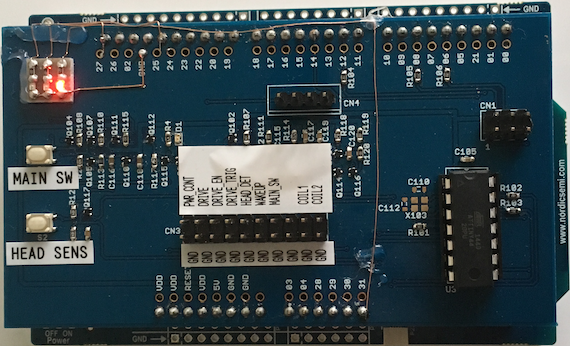

ほどなくU2F Sign処理が完了し、HTML上の内容表示欄が緑色に変化します(１秒間程度)。

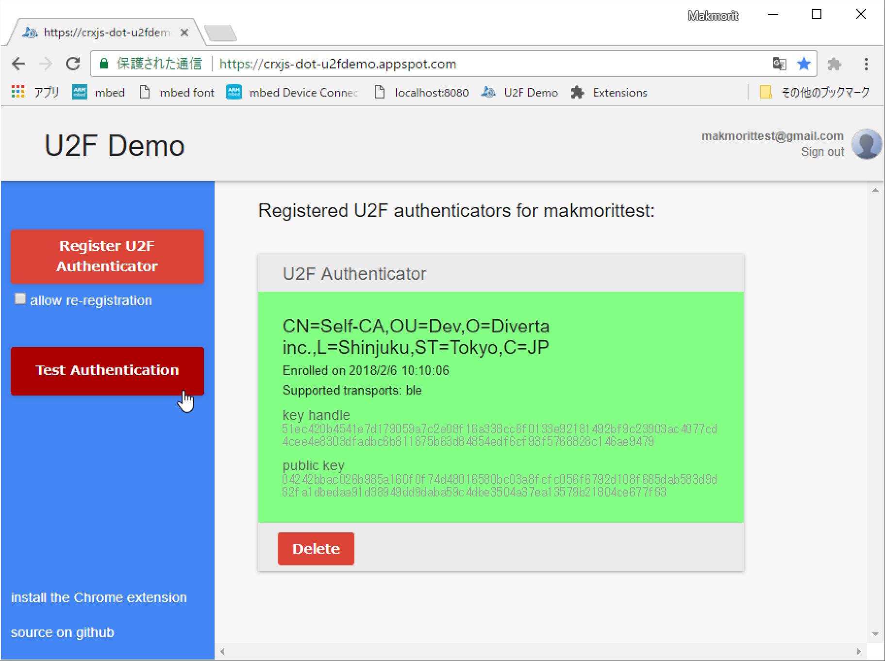

### テスト終了

テストが終了したら、Chromeブラウザーを閉じます。 
Chromeブラウザーが終了されることにより、U2F管理コマンドは自動的に終了します。
