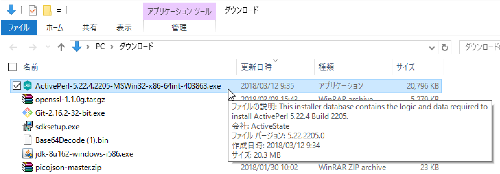
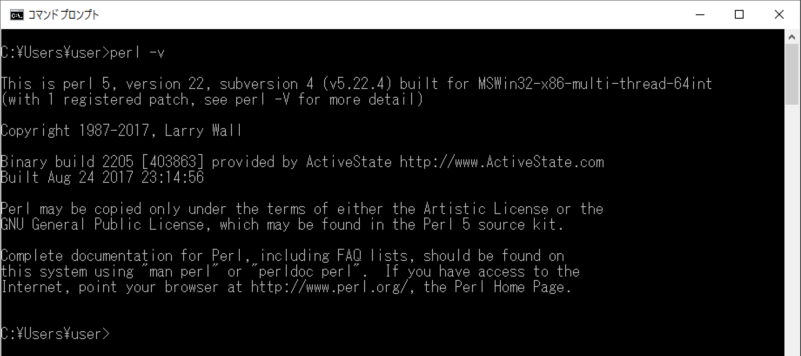

# ActivePerl導入手順

## 概要

Windows環境にOpenSSLを導入するためには、perlコマンドが必要です。

ActivePerlを導入すると、Windows環境でperlコマンドを使用することができるようになります。

## インストール

ブラウザーで[ActivePerlのダウンロードページ](https://www.activestate.com/activeperl/downloads)を開きます。 
開発環境に対応するリンクをクリックすると、ダウンロードが自動的に開始されます。

ダウンロードされたインストール媒体（openssl-1.1.0g.tar.gzというファイル）をダブルクリックします。

ActivePerlのインストーラーが起動しますので、指示に従い、インストール作業を進めます。

インストールが完了したら、Windowsのコマンドプロンプト画面を開き、「perl -v」を実行します。 
下図のようにバージョン情報が表示されれば、インストールは成功です。

