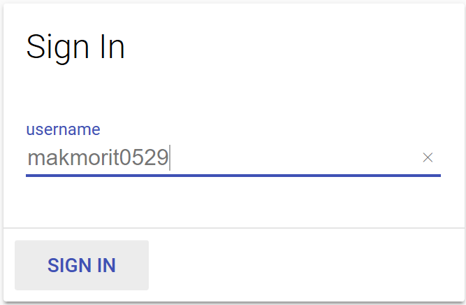
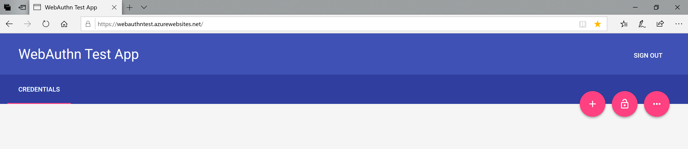
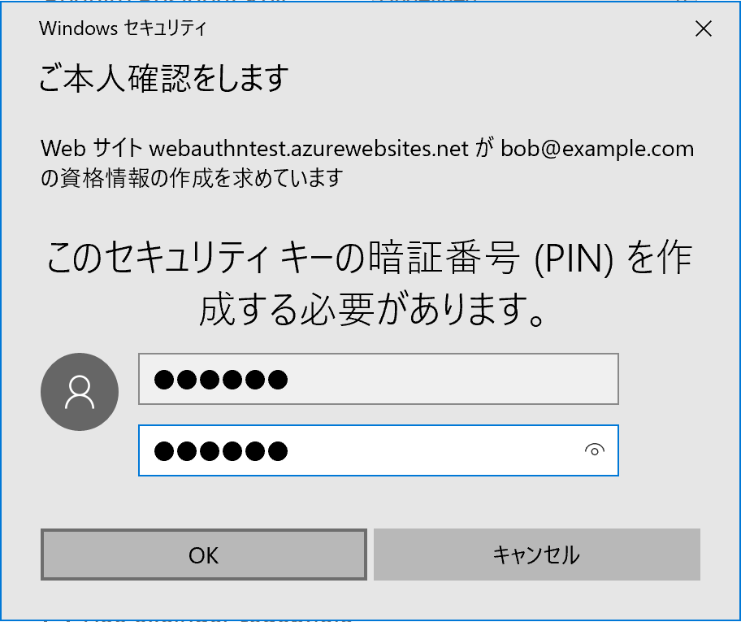
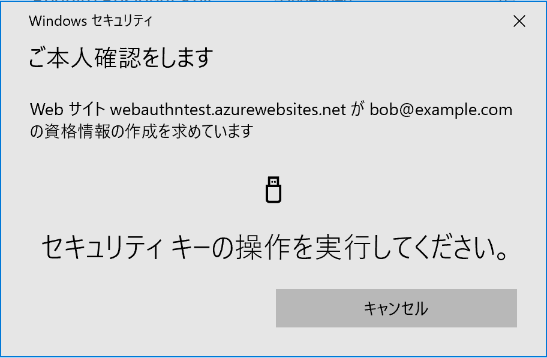

# Edgeブラウザーを使用したWebAuthnテスト手順

現在開発中の[FIDO2認証器](../../nRF5_SDK_v15.2.0)と、最新バージョンのEdgeブラウザーを使用し、WebAuthnユーザー登録／ログインをPIN番号により行う手順を掲載しています。


## ソフトウェアの導入

### 最新Edgeブラウザーの導入

WebAuthnをサポートしているEdgeブラウザーは、単体で導入できません。<br>
したがって、Windows 10のシステムを最新バージョンに移行させる必要があります。

具体的には、Windows PCに「Windows 10 October 2018 Update」を導入します。<br>
導入したら、Windows 10のバージョン情報を参照し、バージョンが「1809」になっていることを確認してください。


### ファームウェアの書込み

[FIDO2認証器](../../nRF5_SDK_v15.2.0)のファームウェアを、nRF52840 Dongleに書込みます。<br>
書込み手順につきましては、<b>[nRF52840 Dongleプログラミング手順](../../Development/nRF52840/NRFCONNECTINST.md)</b>をご参照ください。

ファームウェアは、GitHubリポジトリーの以下の場所に格納されています。
- ディレクトリー: onecard-fido/nRF5_SDK_v15.2.0/firmwares/
- アプリケーション: [nrf52840_xxaa.hex](../../nRF5_SDK_v15.2.0/firmwares/nrf52840_xxaa.hex)
- ソフトデバイス: [s140_nrf52_6.1.0_softdevice.hex](../../nRF5_SDK_v15.2.0/firmwares/s140_nrf52_6.1.0_softdevice.hex)

## 鍵・証明書の導入

nRF52840 Dongleにファームウェアを書き込んだら、[FIDO2認証器](../../nRF5_SDK_v15.2.0)に鍵・証明書を導入します。

#### 管理ツールを導入

まずは[管理ツール](../../MaintenanceTool/README.md)を、PC環境（macOS／Windows 10）に導入します。<br>
以下の手順書をご参照願います。

* <b>[インストール手順（macOS版）](../../MaintenanceTool/macOSApp/INSTALLPRG.md) </b><br>
* <b>[インストール手順（Windows版）](../../MaintenanceTool/WindowsExe/INSTALLPRG.md) </b><br>

#### 鍵・証明書を導入

PC環境に導入した管理ツールを使用し、鍵・証明書をインストールします。<br>
以下の手順書をご参照願います。

* <b>[鍵・証明書の導入手順（macOS版）](../../MaintenanceTool/macOSApp/INSTALLKEYCRT.md) </b><br>
* <b>[鍵・証明書の導入手順（Windows版）](../../MaintenanceTool/WindowsExe/INSTALLKEYCRT.md) </b><br>

## PINの作成

今回はPIN（暗証番号）として、`012345`という６けたの数字を使用するものとします。

### PIN作成ツールを実行

2019/03/25現在、Edgeブラウザーでは、認証器に対してPINを設定させることができないようです。<br>
従いまして、Yubico社から提供されているテストツール「[libfido2](https://github.com/Yubico/libfido2)」を使用し、[FIDO 2.0 Authenticator](../../nRF5_SDK_v15.2.0)にPINを設定するようにします。

（[管理ツール](../../U2FMaintenanceTool/README.md)からPINを設定できるよう、後日対応予定となっています。しばらくお待ちいただければと存じます）

### PIN作成ツール実行手順

まずは「libfido2」を、[こちらの手順書](https://github.com/diverta/onecard-fido/blob/master/Research/FIDO_2_0/LIBFIDO2.md)にしたがって導入します。

その後、PCのUSBポートにnRF52840 Dongleを装着し、下記コマンド [注1] を順に実行します。
```
fido2-token
${HOME}/GitHub/libfido2/build/examples/setpin <pin> <device>

`<pin>`には、暗証番号`012345`を指定します。
`<device>`には、`fido2-token`コマンドで表示されたFIDO2認証器の名称を指定します。
```
[注1] [前述の手順書](https://github.com/diverta/onecard-fido/blob/master/Research/FIDO_2_0/LIBFIDO2.md)に従うと、PIN作成コマンドは、`${HOME}/GitHub/libfido2/build/examples/setpin`に導入されます。


実行例は下記になります。
```
MacBookPro-makmorit-jp:~ makmorit$ fido2-token -L
USB_f055_0001_14200000: vendor=0xfffff055, product=0x0001 (Diverta Inc. U2F USB HID Authenticator)
MacBookPro-makmorit-jp:~ makmorit$ ${HOME}/GitHub/libfido2/build/examples/setpin 012345 USB_f055_0001_14200000
MacBookPro-makmorit-jp:~ makmorit$ echo $?
0
MacBookPro-makmorit-jp:~ makmorit$
```

これで、PINの作成作業は完了です。

## WebAuthn機能テストの実行

nRF52840 DongleとEdgeブラウザーを使用し、WebAuthn機能（ユーザー登録／ログイン）のテストを実施します。

### ユーザー登録

Edgeブラウザーを起動し、URL「[https://webauthn.org](https://webauthn.org)」を実行すると、WebAuthn機能のデモページが表示されます。

nRF52840 Dongleは、PCのUSBポートに装着しておきます。

ページ内の「Register」タブをクリックし「Create a New Account」画面を表示させます。<br>
テキストボックスに、任意のユーザー名を入力して、Registerボタンをクリックします。


程なく、Edge上にPINを入力する画面が表示されます。<br>
テキストボックスに、先ほど作成したPIN（暗証番号）`012345`を入力し、OKをクリックします。



下図のような、ユーザー所在確認を求める画面が表示されます。



nRF52840 Dongle上の緑色LEDが点滅し始めますので、基板上のボタンを１回プッシュします。


nRF52840 Dongleからレスポンスが戻り、しばらくすると、下図のようにユーザー登録処理が成功したことを通知する画面が表示されます。



これで、ユーザー登録のテストは完了です。

### ログイン

前述のWebAuthn機能のデモページを表示し、nRF52840 DongleをPCのUSBポートに装着しておきます。

ページ内の「Login」タブをクリックし「Log in Account Using WebAuthn」画面を表示させます。<br>
テキストボックスに、ユーザー登録時に入力したユーザー名を入力して、Loginボタンをクリックします。



程なく、Edge上にPINを入力する画面が表示されます。<br>
テキストボックスに、先ほど作成したPIN（暗証番号）`012345`を入力し、OKをクリックします。


下図のような、ユーザー所在確認を求める画面が表示されます。


nRF52840 Dongle上の緑色LEDが点滅し始めますので、基板上のボタンを１回プッシュします。


nRF52840 Dongleからレスポンスが戻り、しばらくすると、下図のようにログイン処理が成功したことを通知する画面が表示されます。


これで、ログインのテストは完了です。
