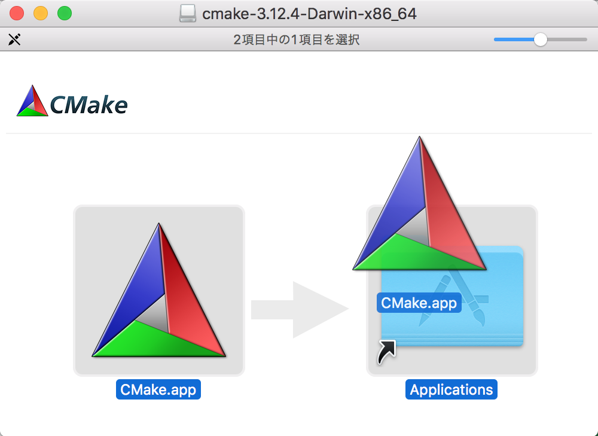
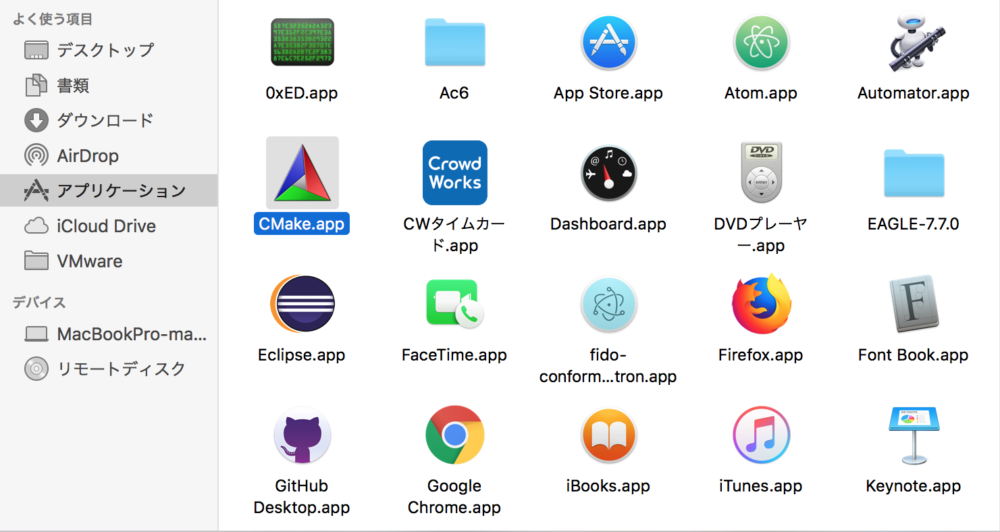
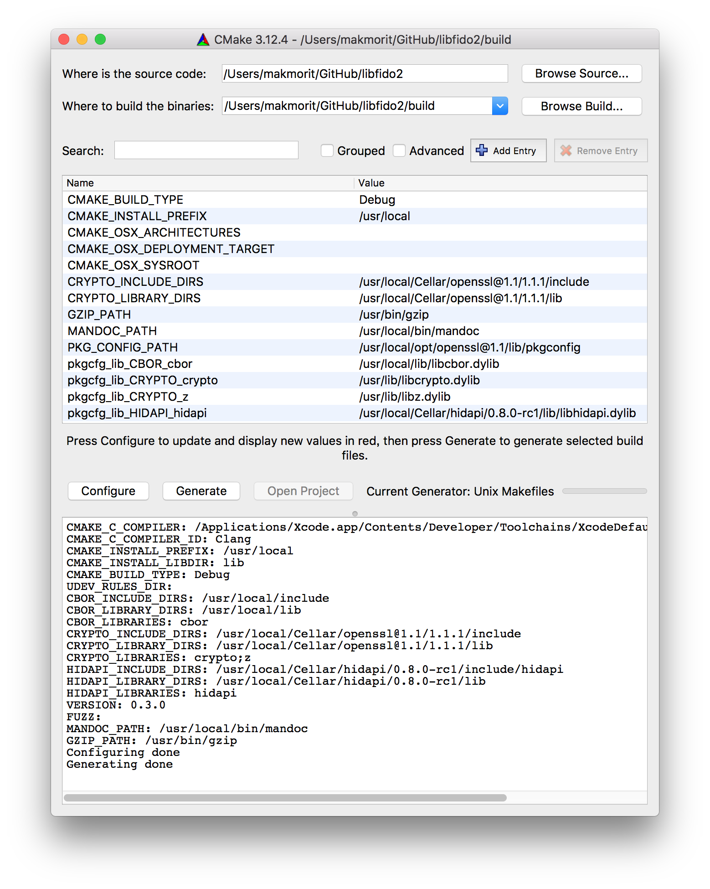
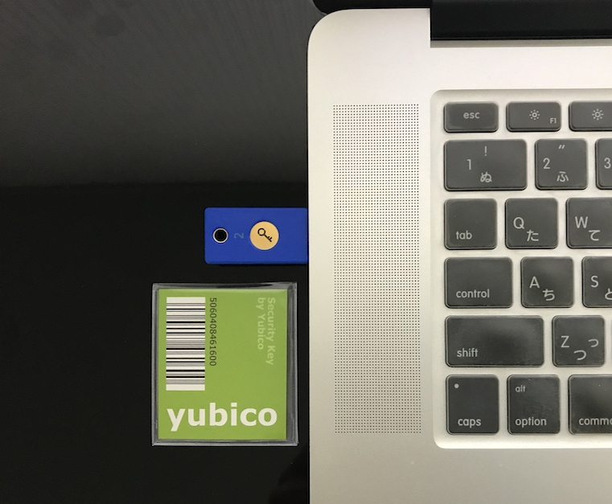

# libfido2導入手順

Yubico社が無償公開しているlibfido2の導入手順について掲載しています。

## 前提ソフトウェアの導入

### CMakeの導入

libfido2導入前のビルド作業には、CMakeが必要となります。<br>
下図のような[ダウンロードページ](https://cmake.org/download/)からバイナリーをダウンロードして、インストールするのが安全かと思われます。


ダウンロードした `cmake-3.12.4-Darwin-x86_64.dmg` をダブルクリックしてインストールします。



アプリケーションフォルダーにCMakeのアイコンができていれば、インストールは完了です。



### 前提ライブラリー／ツールの導入

HomeBrewを使用し、以下のライブラリー／ツールを導入します。
- hidapi
- mandoc
- OpenSSL 1.1
- pkg-config

以下は実行例です。

```
MacBookPro-makmorit-jp:~ makmorit$ brew install hidapi
==> Downloading https://homebrew.bintray.com/bottles/hidapi-0.8.0-rc1.sierra.bottle.2.tar.gz
######################################################################## 100.0%
==> Pouring hidapi-0.8.0-rc1.sierra.bottle.2.tar.gz
🍺  /usr/local/Cellar/hidapi/0.8.0-rc1: 16 files, 129.8KB
MacBookPro-makmorit-jp:~ makmorit$ brew install mandoc
==> Downloading https://homebrew.bintray.com/bottles/mandoc-1.14.3.sierra.bottle.tar.gz
######################################################################## 100.0%
==> Pouring mandoc-1.14.3.sierra.bottle.tar.gz
🍺  /usr/local/Cellar/mandoc/1.14.3: 29 files, 2.5MB
MacBookPro-makmorit-jp:~ makmorit$ brew upgrade openssl@1.1
Error: openssl@1.1 not installed
MacBookPro-makmorit-jp:~ makmorit$ brew install openssl@1.1
==> Downloading https://homebrew.bintray.com/bottles/openssl@1.1-1.1.1.sierra.bottle.tar.gz
######################################################################## 100.0%
==> Pouring openssl@1.1-1.1.1.sierra.bottle.tar.gz
==> Caveats
A CA file has been bootstrapped using certificates from the system
keychain. To add additional certificates, place .pem files in
  /usr/local/etc/openssl@1.1/certs

and run
  /usr/local/opt/openssl@1.1/bin/c_rehash

openssl@1.1 is keg-only, which means it was not symlinked into /usr/local,
because this is an alternate version of another formula.

If you need to have openssl@1.1 first in your PATH run:
  echo 'export PATH="/usr/local/opt/openssl@1.1/bin:$PATH"' >> ~/.bash_profile

For compilers to find openssl@1.1 you may need to set:
  export LDFLAGS="-L/usr/local/opt/openssl@1.1/lib"
  export CPPFLAGS="-I/usr/local/opt/openssl@1.1/include"

==> Summary
🍺  /usr/local/Cellar/openssl@1.1/1.1.1: 7,821 files, 18.1MB
MacBookPro-makmorit-jp:~ makmorit$ brew switch openssl@1.1 1.1.1
Cleaning /usr/local/Cellar/openssl@1.1/1.1.1
Opt link created for /usr/local/Cellar/openssl@1.1/1.1.1
MacBookPro-makmorit-jp:~ makmorit$
MacBookPro-makmorit-jp:~ makmorit$ brew info pkg-config
pkg-config: stable 0.29.2 (bottled)
Manage compile and link flags for libraries
https://freedesktop.org/wiki/Software/pkg-config/
Not installed
From: https://github.com/Homebrew/homebrew-core/blob/master/Formula/pkg-config.rb
==> Analytics
install: 121,173 (30 days), 335,745 (90 days), 1,405,071 (365 days)
install_on_request: 26,590 (30 days), 81,256 (90 days), 337,162 (365 days)
build_error: 0 (30 days)
MacBookPro-makmorit-jp:libfido2 makmorit$ brew install pkg-config
==> Downloading https://homebrew.bintray.com/bottles/pkg-config-0.29.2.sierra.bottle.tar.gz
######################################################################## 100.0%
==> Pouring pkg-config-0.29.2.sierra.bottle.tar.gz
🍺  /usr/local/Cellar/pkg-config/0.29.2: 11 files, 627.1KB
MacBookPro-makmorit-jp:~ makmorit$
```

### libcborの導入

こちらからリポジトリーをチェックアウトします。<br>
https://github.com/PJK/libcbor.git

リポジトリーのルートディレクトリー配下に移動し、buildというサブディレクトリーを事前に作成しておきます。<br>
その後、CMakeでメイクファイルを作成します。<br>
buildディレクトリー配下に `Makefile` というファイルができます。

その後、リポジトリールートで `make -C build` を実行してビルドします。<br>
成功したら、同じくリポジトリールートで `sudo make -C build install` を実行してインストールします。

```
MacBookPro-makmorit-jp:GitHub makmorit$ cd libcbor
MacBookPro-makmorit-jp:libcbor makmorit$
MacBookPro-makmorit-jp:libcbor makmorit$ make -C build
Scanning dependencies of target cbor_shared
[  2%] Building C object src/CMakeFiles/cbor_shared.dir/cbor.c.o
[  5%] Building C object src/CMakeFiles/cbor_shared.dir/cbor/streaming.c.o
（中略）
[ 97%] Building C object src/CMakeFiles/cbor.dir/cbor/ints.c.o
[100%] Linking C static library libcbor.a
[100%] Built target cbor
MacBookPro-makmorit-jp:libcbor makmorit$
MacBookPro-makmorit-jp:libcbor makmorit$ sudo make -C build install
Password:
Install the project...
-- Install configuration: "Release"
-- Installing: /usr/local/include/cbor/configuration.h
（中略）
-- Installing: /usr/local/include/cbor.h
-- Installing: /usr/local/lib/pkgconfig/libcbor.pc
MacBookPro-makmorit-jp:libcbor makmorit$
```

インストールが終わったら、不要なリポジトリーは削除するようにします。
コマンド `rm -rfv libcbor` を実行します。

```
MacBookPro-makmorit-jp:libcbor makmorit$ cd ..
MacBookPro-makmorit-jp:GitHub makmorit$ rm -rfv libcbor
libcbor/.DS_Store
libcbor/.git/branches
（中略）
libcbor/test/unicode_test.c
libcbor/test
libcbor
MacBookPro-makmorit-jp:GitHub makmorit$
```


## libfido2の導入

### ビルドの準備

GitHubに公開されているリポジトリー（[https://github.com/Yubico/libfido2.git](https://github.com/Yubico/libfido2.git)）から、ソース全量をダウンロードします。

リポジトリーのルートディレクトリー配下に移動し、buildというサブディレクトリーを事前に作成しておきます。<br>
その後、CMakeを起動します。

CMake画面で下図のように設定してから、Configure-->Generateの順にクリックします。<br>
それぞれ `Configuring done`、`Generating done` と表示されれば、メイクファイルがbuild配下に生成されます。



### ビルド

リポジトリーのルートディレクトリー配下に移動し、コマンド `make -C build` を実行します。

```
MacBookPro-makmorit-jp:libfido2 makmorit$ pwd
/Users/makmorit/GitHub/libfido2
MacBookPro-makmorit-jp:libfido2 makmorit$ make -C build
/Applications/CMake.app/Contents/bin/cmake -H/Users/makmorit/GitHub/libfido2 -B/Users/makmorit/GitHub/libfido2/build --check-build-system CMakeFiles/Makefile.cmake 0
/Applications/CMake.app/Contents/bin/cmake -E cmake_progress_start /Users/makmorit/GitHub/libfido2/build/CMakeFiles /Users/makmorit/GitHub/libfido2/build/CMakeFiles/progress.marks
（中略）
Scanning dependencies of target man
/Applications/Xcode.app/Contents/Developer/usr/bin/make -f man/CMakeFiles/man.dir/build.make man/CMakeFiles/man.dir/build
make[2]: Nothing to be done for `man/CMakeFiles/man.dir/build'.
[100%] Built target man
/Applications/CMake.app/Contents/bin/cmake -E cmake_progress_start /Users/makmorit/GitHub/libfido2/build/CMakeFiles 0
MacBookPro-makmorit-jp:libfido2 makmorit$
```

### インストール

リポジトリーのルートディレクトリー配下で、コマンド `sudo make -C build install` を実行します。

```
MacBookPro-makmorit-jp:libfido2 makmorit$ sudo make -C build install
Password:
/Applications/CMake.app/Contents/bin/cmake -H/Users/makmorit/GitHub/libfido2 -B/Users/makmorit/GitHub/libfido2/build --check-build-system CMakeFiles/Makefile.cmake 0
/Applications/CMake.app/Contents/bin/cmake -E cmake_progress_start /Users/makmorit/GitHub/libfido2/build/CMakeFiles /Users/makmorit/GitHub/libfido2/build/CMakeFiles/progress.marks
（中略）
-- Installing: /usr/local/share/man/man1/fido2-assert.1.gz
-- Installing: /usr/local/share/man/man1/fido2-cred.1.gz
-- Installing: /usr/local/share/man/man1/fido2-token.1.gz
MacBookPro-makmorit-jp:libfido2 makmorit$
```

以上で、libfido2のインストールは完了です。

### 動作確認

FIDO 2.0 Authenticatorである「[Yubico セキュリティキー](
https://www.amazon.co.jp/Yubico-セキュリティキー-FIDO2-USB-2段階認証/dp/B07BYSB7FK)」を、PCのUSBポートに挿入します。



その後、ターミナルからコマンド `fido2-token -L` を実行させます。

```
MacBookPro-makmorit-jp:~ makmorit$ fido2-token -L
USB_1050_0120_14100000: vendor=0x1050, product=0x0120 (Yubico Security Key by Yubico)
MacBookPro-makmorit-jp:~ makmorit$
```

「Yubico セキュリティキー」が表示されれば、導入は正常に完了したことになります。
