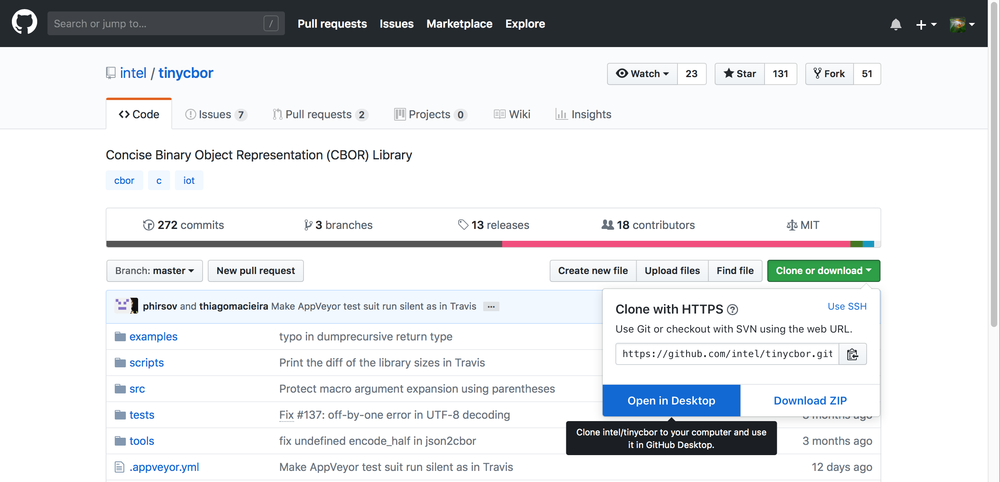
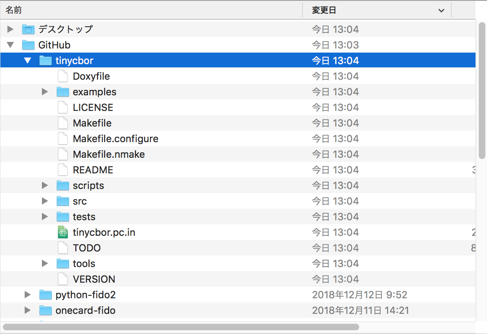
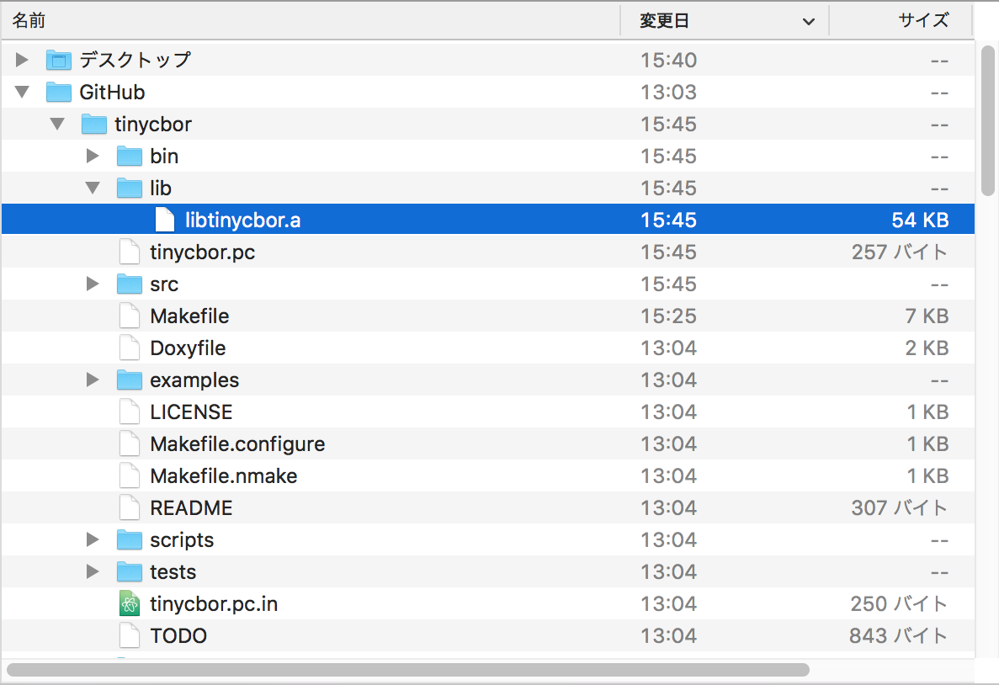
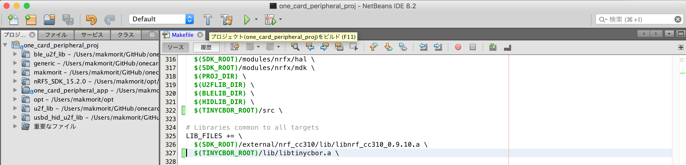
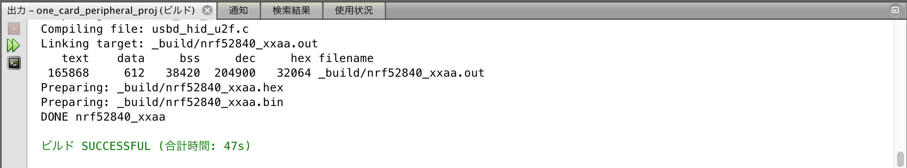

# tinycbor導入手順

Intel社が無償公開しているCBORライブラリー「<b>[tinycbor](https://github.com/intel/tinycbor)</b>」を、NetBeansプロジェクトに導入する手順について掲載しています。

## CBORライブラリーの作成

CBORライブラリーファイル「libtinycbor.a」を作成する手順は下記になります。

### tinycborのソースコード取得

tinycborのソースコードを、GitHubリポジトリー（[https://github.com/intel/tinycbor](https://github.com/intel/tinycbor)）からチェックアウトします。



チェックアウトされたフォルダー「tinycbor」が、本プロジェクトフォルダー「onecard-fido」と同じディレクトリー配下にあることを確認します。<br>
下記例では「<ユーザーディレクトリー>/GitHub/tinycbor」となっています。



### tinycborのビルド

以下のコマンドを実行します。

```
cd ${HOME}/GitHub/tinycbor
make clean

export GNU_COMMAND_PREFIX="${HOME}/opt/gcc-arm-none-eabi-7-2018-q2-update/bin/arm-none-eabi"
make CC="${GNU_COMMAND_PREFIX}-gcc" AR="${GNU_COMMAND_PREFIX}-ar" LDFLAGS="-lc -lnosys --specs=nosys.specs -mcpu=cortex-m4 -mfloat-abi=hard -mfpu=fpv4-sp-d16 -mthumb -mabi=aapcs" CFLAGS="-mcpu=cortex-m4 -mfloat-abi=hard -mfpu=fpv4-sp-d16 -mthumb -mabi=aapcs -DFLOAT_ABI_HARD -std=gnu11 -D__GLIBC__"
```

下記は実行例になります。

```
MacBookPro-makmorit-jp:~ makmorit$ cd ${HOME}/GitHub/tinycbor
MacBookPro-makmorit-jp:tinycbor makmorit$ make clean
rm -f src/cborerrorstrings.o src/cborencoder.o src/cborencoder_close_container_checked.o src/cborparser.o src/cborpretty.o src/cborparser_dup_string.o src/cborpretty_stdio.o src/cbortojson.o src/cborvalidation.o src/open_memstream.o
rm -f src/cborerrorstrings.pic.o src/cborencoder.pic.o src/cborencoder_close_container_checked.pic.o src/cborparser.pic.o src/cborpretty.pic.o src/cborparser_dup_string.pic.o src/cborpretty_stdio.pic.o src/cbortojson.pic.o src/cborvalidation.pic.o src/open_memstream.pic.o
rm -f tools/cbordump/cbordump.o
rm -f bin/cbordump
rm -f bin/json2cbor
rm -f lib/libtinycbor.a
rm -f lib/libtinycbor-freestanding.a
rm -f tinycbor.pc
rm -f lib/libtinycbor.so*
test -e tests/Makefile && /Applications/Xcode.app/Contents/Developer/usr/bin/make -C tests clean || :
MacBookPro-makmorit-jp:tinycbor makmorit$
MacBookPro-makmorit-jp:tinycbor makmorit$ export GNU_COMMAND_PREFIX="${HOME}/opt/gcc-arm-none-eabi-7-2018-q2-update/bin/arm-none-eabi"
MacBookPro-makmorit-jp:tinycbor makmorit$ make CC="${GNU_COMMAND_PREFIX}-gcc" AR="${GNU_COMMAND_PREFIX}-ar" LDFLAGS="-lc -lnosys --specs=nosys.specs -mcpu=cortex-m4 -mfloat-abi=hard -mfpu=fpv4-sp-d16 -mthumb -mabi=aapcs" CFLAGS="-mcpu=cortex-m4 -mfloat-abi=hard -mfpu=fpv4-sp-d16 -mthumb -mabi=aapcs -DFLOAT_ABI_HARD -std=gnu11 -D__GLIBC__"
/Users/makmorit/opt/gcc-arm-none-eabi-7-2018-q2-update/bin/arm-none-eabi-gcc  -I./src -std=gnu99 -mcpu=cortex-m4 -mfloat-abi=hard -mfpu=fpv4-sp-d16 -mthumb -mabi=aapcs -DFLOAT_ABI_HARD -std=gnu11 -D__GLIBC__  -c -o src/cborerrorstrings.o src/cborerrorstrings.c
/Users/makmorit/opt/gcc-arm-none-eabi-7-2018-q2-update/bin/arm-none-eabi-gcc  -I./src -std=gnu99 -mcpu=cortex-m4 -mfloat-abi=hard -mfpu=fpv4-sp-d16 -mthumb -mabi=aapcs -DFLOAT_ABI_HARD -std=gnu11 -D__GLIBC__  -c -o src/cborencoder.o src/cborencoder.c
/Users/makmorit/opt/gcc-arm-none-eabi-7-2018-q2-update/bin/arm-none-eabi-gcc  -I./src -std=gnu99 -mcpu=cortex-m4 -mfloat-abi=hard -mfpu=fpv4-sp-d16 -mthumb -mabi=aapcs -DFLOAT_ABI_HARD -std=gnu11 -D__GLIBC__  -c -o src/cborencoder_close_container_checked.o src/cborencoder_close_container_checked.c
/Users/makmorit/opt/gcc-arm-none-eabi-7-2018-q2-update/bin/arm-none-eabi-gcc  -I./src -std=gnu99 -mcpu=cortex-m4 -mfloat-abi=hard -mfpu=fpv4-sp-d16 -mthumb -mabi=aapcs -DFLOAT_ABI_HARD -std=gnu11 -D__GLIBC__  -c -o src/cborparser.o src/cborparser.c
/Users/makmorit/opt/gcc-arm-none-eabi-7-2018-q2-update/bin/arm-none-eabi-gcc  -I./src -std=gnu99 -mcpu=cortex-m4 -mfloat-abi=hard -mfpu=fpv4-sp-d16 -mthumb -mabi=aapcs -DFLOAT_ABI_HARD -std=gnu11 -D__GLIBC__  -c -o src/cborpretty.o src/cborpretty.c
/Users/makmorit/opt/gcc-arm-none-eabi-7-2018-q2-update/bin/arm-none-eabi-gcc  -I./src -std=gnu99 -mcpu=cortex-m4 -mfloat-abi=hard -mfpu=fpv4-sp-d16 -mthumb -mabi=aapcs -DFLOAT_ABI_HARD -std=gnu11 -D__GLIBC__  -c -o src/cborparser_dup_string.o src/cborparser_dup_string.c
/Users/makmorit/opt/gcc-arm-none-eabi-7-2018-q2-update/bin/arm-none-eabi-gcc  -I./src -std=gnu99 -mcpu=cortex-m4 -mfloat-abi=hard -mfpu=fpv4-sp-d16 -mthumb -mabi=aapcs -DFLOAT_ABI_HARD -std=gnu11 -D__GLIBC__  -c -o src/cborpretty_stdio.o src/cborpretty_stdio.c
/Users/makmorit/opt/gcc-arm-none-eabi-7-2018-q2-update/bin/arm-none-eabi-gcc  -I./src -std=gnu99 -mcpu=cortex-m4 -mfloat-abi=hard -mfpu=fpv4-sp-d16 -mthumb -mabi=aapcs -DFLOAT_ABI_HARD -std=gnu11 -D__GLIBC__  -c -o src/cbortojson.o src/cbortojson.c
/Users/makmorit/opt/gcc-arm-none-eabi-7-2018-q2-update/bin/arm-none-eabi-gcc  -I./src -std=gnu99 -mcpu=cortex-m4 -mfloat-abi=hard -mfpu=fpv4-sp-d16 -mthumb -mabi=aapcs -DFLOAT_ABI_HARD -std=gnu11 -D__GLIBC__  -c -o src/cborvalidation.o src/cborvalidation.c
/Users/makmorit/opt/gcc-arm-none-eabi-7-2018-q2-update/bin/arm-none-eabi-gcc  -I./src -std=gnu99 -mcpu=cortex-m4 -mfloat-abi=hard -mfpu=fpv4-sp-d16 -mthumb -mabi=aapcs -DFLOAT_ABI_HARD -std=gnu11 -D__GLIBC__  -c -o src/open_memstream.o src/open_memstream.c
/Users/makmorit/opt/gcc-arm-none-eabi-7-2018-q2-update/bin/arm-none-eabi-ar cqs lib/libtinycbor.a src/cborerrorstrings.o src/cborencoder.o src/cborencoder_close_container_checked.o src/cborparser.o src/cborpretty.o src/cborparser_dup_string.o src/cborpretty_stdio.o src/cbortojson.o src/cborvalidation.o src/open_memstream.o
/Users/makmorit/opt/gcc-arm-none-eabi-7-2018-q2-update/bin/arm-none-eabi-gcc  -I./src -std=gnu99 -mcpu=cortex-m4 -mfloat-abi=hard -mfpu=fpv4-sp-d16 -mthumb -mabi=aapcs -DFLOAT_ABI_HARD -std=gnu11 -D__GLIBC__  -c -o tools/cbordump/cbordump.o tools/cbordump/cbordump.c
/Users/makmorit/opt/gcc-arm-none-eabi-7-2018-q2-update/bin/arm-none-eabi-gcc -o bin/cbordump -lc -lnosys --specs=nosys.specs -mcpu=cortex-m4 -mfloat-abi=hard -mfpu=fpv4-sp-d16 -mthumb -mabi=aapcs tools/cbordump/cbordump.o lib/libtinycbor.a -lm
sed > tinycbor.pc < tinycbor.pc.in \
		-e 's,@prefix@,/usr/local,' \
		-e 's,@exec_prefix@,/usr/local,' \
		-e 's,@libdir@,/usr/local/lib,' \
		-e 's,@includedir@,/usr/local/include,' \
		-e 's,@version@,0.5.3,'
MacBookPro-makmorit-jp:tinycbor makmorit$
```

CBORライブラリーファイル「libtinycbor.a」が、サブディレクトリー「lib」配下に作成されていることを確認します。




以上で、CBORライブラリーファイル「libtinycbor.a」作成は完了です。

## CBORライブラリーの導入

### メイクファイルの編集

NetBeansを起動して、メイクファイルを開き、以下の２点を追加記述します。

- インクルードファイルディレクトリー `$(TINYCBOR_ROOT)/src` の指定
- リンクするライブラリーファイル `$(TINYCBOR_ROOT)/lib/libtinycbor.a` の指定

具体的には下記のような記述になります。

```
PROJECT_NAME     := one_card_peripheral_app_pca10056_s140
TARGETS          := nrf52840_xxaa
:
# tinycbor root directory
TINYCBOR_ROOT := $(HOME)/GitHub/tinycbor
:
# Include folders common to all targets
INC_FOLDERS += \
  ../config \
  :
  $(TINYCBOR_ROOT)/src \

# Libraries common to all targets
LIB_FILES += \
  $(SDK_ROOT)/external/nrf_cc310/lib/libnrf_cc310_0.9.10.a \
  $(TINYCBOR_ROOT)/lib/libtinycbor.a \
```

### ビルドの実行

メイクファイルの編集が終わったら、NetBeans上でビルドを実行します。




下図のように「ビルド SUCCESSFUL」と表示されれば成功です。




以上で、tinycborのNetBeansプロジェクト導入は完了です。
