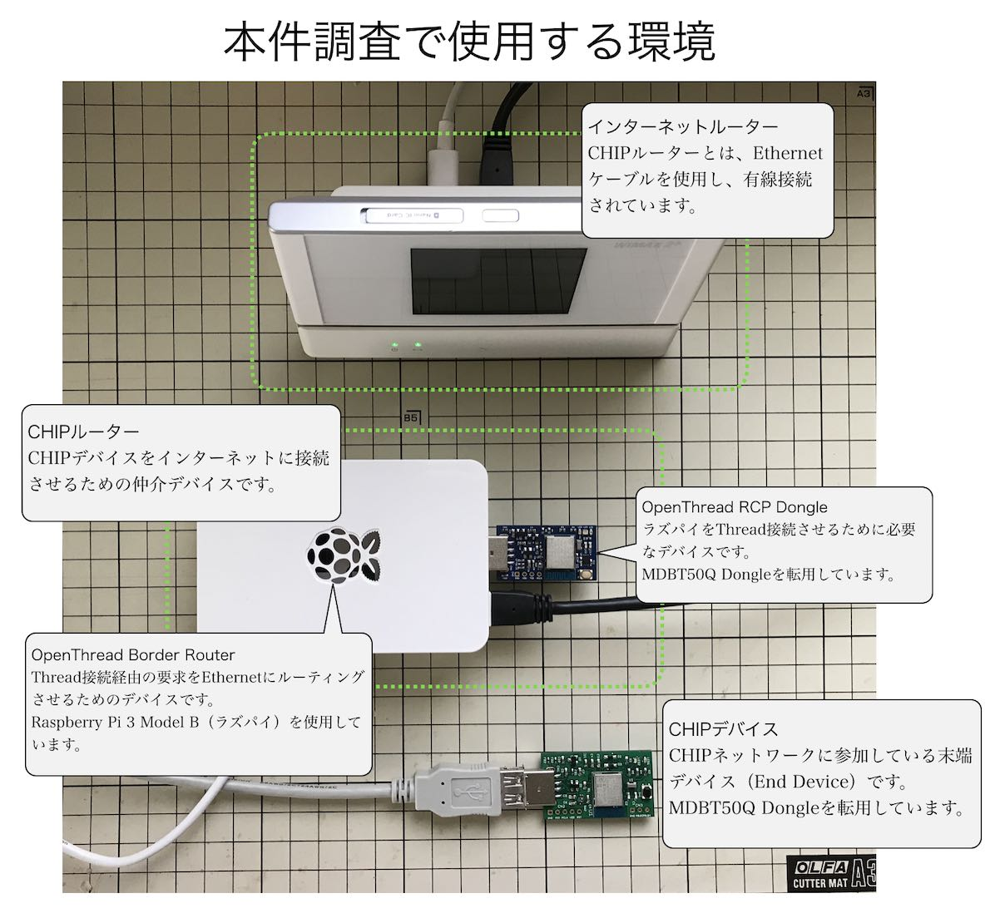
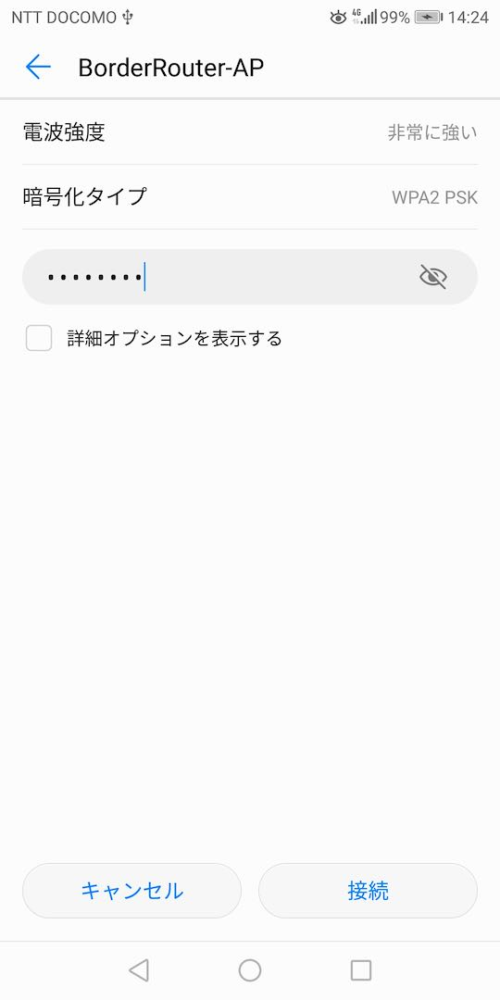
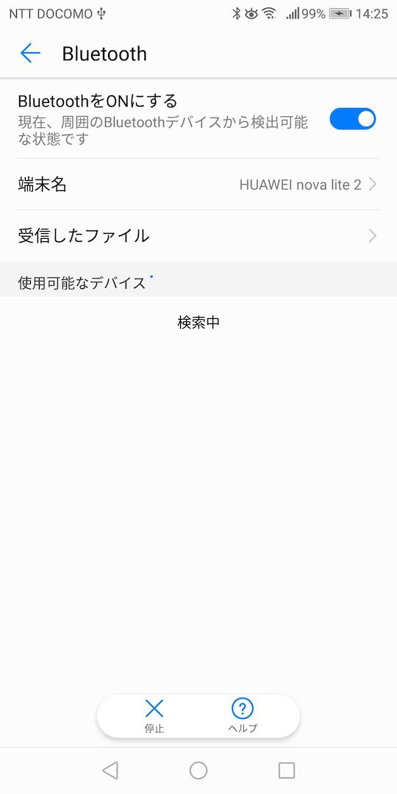

# CHIPネットワーク設定手順

最終更新日：2021/06/10

別途設定した、OpenThread Border Router、OpenThread Dongleを使用し、CHIPネットワークを設定する手順について掲載します。

## 使用環境イメージ

最終更新日現在、アライアンス提供のツールには、CHIPデバイスにMatterコマンドを送信する機能が実装されていません。

したがって本手順書では、Matterコマンドの疎通確認ではなく、CHIPルーター（Ethernet）経由で、任意のPC〜CHIPデバイス間が疎通できることを確認するものといたします。



## CHIPルーターの設定

別途手順書により設定が完了している、下記機材を用意します。

- OpenThread Border Routerとして設定が完了している「Raspberry Pi 3 Model B（ラズパイ）」

- OpenThread RCP Dongleとして設定が完了している「MDBT50Q Dongle」

#### CHIPルーター始動

ラズパイに電源を投入し、システムを始動させます。<br>
この時点で、MDBT50Q Dongleはラズパイに装着させないでおきます。

システムが始動したら、ラズパイのシステムプロセスが全て正常起動したことを確認します。<br>
コマンド`sudo systemctl status`を実行します。

正常起動すると、以下のようなメッセージが表示されます。

```
pi@raspberrypi:~ $ sudo systemctl status
● raspberrypi
    State: running
     Jobs: 0 queued
   Failed: 0 units
    Since: Thu 1970-01-01 09:00:03 JST; 51 years 5 months ago
   CGroup: /
           ├─user.slice
           ：
```

ここで、`bind9.service`というサービスは不要となるため、停止させておきます。<br>
為念で、`bind9`がいなくなっても、DNS自体は稼働していることを確認します。<br>
（適宜、インターネット・アドレスをPingします）

```
pi@raspberrypi:~ $ sudo systemctl stop bind9.service
pi@raspberrypi:~ $
pi@raspberrypi:~ $ ping yahoo.co.jp
PING yahoo.co.jp (183.79.135.206) 56(84) bytes of data.
64 bytes from f1.top.vip.kks.yahoo.co.jp (183.79.135.206): icmp_seq=1 ttl=47 time=82.2 ms
64 bytes from f1.top.vip.kks.yahoo.co.jp (183.79.135.206): icmp_seq=2 ttl=47 time=81.1 ms
^C
--- yahoo.co.jp ping statistics ---
2 packets transmitted, 2 received, 0% packet loss, time 3ms
rtt min/avg/max/mdev = 81.149/81.692/82.235/0.543 ms
pi@raspberrypi:~ $
```

以上でCHIPルーターが準備できました。

#### エージェントサービス再始動

`OpenThread Border Router`設定時に`On-Mesh Prefix`として設定したアドレス（`fd11:22::`）が、システム（ラズパイ）再起動により失われてしまうようです。

こちらを再設定した上で、`OpenThread Border Router`のエージェントサービス`otbr-agent.service`を再始動します。

##### Prefix再設定

再度、`On-Mesh Prefix`設定を行います。<br>
以下は実行例になります。

```
pi@raspberrypi:~ $ sudo ot-ctl netdata show
Prefixes:
fd1e:ff70:a47d:e129::/64 paos med 8400
Routes:
2001:268:c1c6:7ca8::/64 s med 8400
Services:
44970 5d fd6a32cace204ad62235de584291c49dc001 s 8400
44970 01 f004b000000e10 s 8400
Done
pi@raspberrypi:~ $ sudo ot-ctl prefix add fd11:22::/64 pasor
Done
pi@raspberrypi:~ $
```

##### エージェントサービス再始動

`On-Mesh Prefix`設定は、自力では反映されないため、エージェントサービスを再始動します。<br>
以下は実行例になります。

```
pi@raspberrypi:~ $ sudo ot-ctl br disable
Done
pi@raspberrypi:~ $ sudo ot-ctl br enable
Done
pi@raspberrypi:~ $ sudo ot-ctl netdata show
Prefixes:
fd11:22:0:0::/64 paros med 8400
Routes:
2001:268:c1c6:7ca8::/64 s med 8400
Services:
44970 5d fd6a32cace204ad62235de584291c49dc001 s 8400
44970 01 f004b000000e10 s 8400
Done
pi@raspberrypi:~ $
```

エージェントサービス再始動後、Prefixを参照すると、設定値`fd11:22:0:0::`が反映されていることが確認できます。

以上でエージェントサービス再始動は完了です。

## CHIPデバイスの設定

CHIPデバイスを、CHIPネットワークに参加させるためには、CHIPルーターが保持しているネットワーク設定情報を取得し、CHIPデバイス自らに設定を行う必要があります。<br>
（このCHIPデバイス設定処理を、`Commissioning`と呼んでいます）

コミッショニングは、当面Androidスマートフォンのアプリ（[`Android CHIPTool`](https://github.com/project-chip/connectedhomeip/tree/master/src/android/CHIPTool)）により実行させます。

#### CHIPToolの準備

CHIPToolをAndroidスマートフォンにインストールします。

まずはアプリのバイナリー`app-debug.apk`を、Android File Transferにより、Download配下に転送します。<br>
転送した`app-debug.apk`をタップすると、インストールがスタートします。


下図のようなポップアップが表示されたら「続行」をタップします。


下図のような画面に遷移したら「インストール」をタップします。


下図のような画面に遷移したら「インストールする」をタップします。


「完了」をタップします。


Androidのアプリ設定から、CHIPToolのアプリ情報画面を表示させます。<br>
権限を追加付与するため「権限」をタップします。


「アプリの権限」画面に遷移するので「カメラ」「現在地」の両方をOnに設定します。


以上でCHIPToolの準備は完了です。

#### ペアリングの準備

ペアリングのためには、Wi-Fiにより、CHIPネットワークにアクセスできる必要があります。<br>
また、BluetoothをOnにしておく必要があります。

まずはWi-Fi設定画面から、`BorderRouter-AP`というアクセスポイントを選択します。


パスワードを入力し「接続」をタップします。<br>
（パスワードは、ラズパイの`/etc/hostapd/hostapd.conf`に記述されている`wpa_passphrase`になります）



Wi-Fi設定画面の`BorderRouter-AP`が接続ずみに変化します。


次に、BluetoothをOnにしておきます。



以上でペアリングの準備は完了です。

#### ペアリングの実行

まず最初に、ペアリングに必要な情報を含むQRコードを、Webブラウザーに表示させます。<br>
URLは`https://dhrishi.github.io/connectedhomeip/qrcode.html?data=MT%3AW0GU2OTB00KA0648G00`になります。


CHIPToolを起動させ、メニュー画面の「PROVISION CHIP DEVICE WITH THREAD」をタップします。


AndroidスマートフォンをQRコードに向けスキャンさせます。


白い画面に遷移し、下部に小さく「Scanning for BLE device 3840」というメッセージが表示されたら、しばらくそのまま待ちます。


下図のような画面に遷移したら、入力内容をそのままにして「SAVE NETWORK」をタップします。


下図のような画面に遷移します。<br>
残念ながら、最終更新日現在、この画面は機能しないため、ここでCHIPToolを終了させてください。


以上で、ペアリングは完了し、CHIPデバイスはCHIPルーターと通信可能になりました。

## CHIPデバイスの疎通確認

最終更新日現在、CHIPデバイス〜CHIPルーター間で、Matterコマンドをはじめとするコマンド投入機能が実装されたツールがないようです。<br>
したがって、CHIPルーターから、CHIPデバイスに向けてPingを投入することにより、CHIPデバイスの疎通確認を実行するものといたします。

#### 事前確認

CHIPデバイス、CHIPルーターの両者間で、IPv6アドレスが設定されていることを確認します。

まずはCHIPデバイス側を確認します。<br>
あらかじめ用意されているCLIで、以下のようなコマンドを実行します。

Prefix（`fd11:22:0:0:`）が設定されていればOKです。

```
uart:~$ ot ipaddr
fd11:22:0:0:86c7:123c:259e:774b
fd6a:32ca:ce20:4ad6:0:ff:fe00:8401
fd6a:32ca:ce20:4ad6:12fb:a307:946a:7dda
fe80:0:0:0:1c9b:bbcc:856d:6532
Done
uart:~$ ot netdata show
Prefixes:
fd11:22:0:0::/64 paros med fffe
Routes:
2001:268:c1c6:7ca8::/64 s med fffe
Services:
44970 5d fd6a32cace204ad62235de584291c49dc001 s fc10
44970 01 f004b000000e10 s fc11
Done
uart:~$ 
```

また、サービス名、ホスト名も同時に確認しておきます。<br>
下記例ではサービス名=`_chip._tcp`、ホスト名=`1E9BBBCC856D6532`であることが確認できます。

```
uart:~$ ot srp client host
name:"1E9BBBCC856D6532", state:Registered, addrs:[fd11:22:0:0:86c7:123c:259e:774b]
Done
uart:~$ ot srp client service
instance:"000000014A77CBB3-0000000000000006", name:"_chip._tcp", state:Registered, port:11097, priority:0, weight:0
Done
uart:~$
```

次に、CHIPルーター側を確認します。<br>
ターミナルで、以下のようなコマンドを実行します。

こちらもPrefix（`fd11:22:0:0:`）が設定されていればOKです。

```
pi@raspberrypi:~ $ sudo ot-ctl ipaddr
fd11:22:0:0:9155:fd06:1c13:7720
fd6a:32ca:ce20:4ad6:0:ff:fe00:fc11
fd6a:32ca:ce20:4ad6:0:ff:fe00:fc38
fd6a:32ca:ce20:4ad6:0:ff:fe00:fc10
fd6a:32ca:ce20:4ad6:0:ff:fe00:fc00
fd6a:32ca:ce20:4ad6:0:ff:fe00:8400
fd6a:32ca:ce20:4ad6:2235:de58:4291:c49d
fe80:0:0:0:b4d3:4322:3bc7:d833
Done
pi@raspberrypi:~ $ sudo ot-ctl netdata show
Prefixes:
fd11:22:0:0::/64 paros med 8400
Routes:
2001:268:c1c6:7ca8::/64 s med 8400
Services:
44970 5d fd6a32cace204ad62235de584291c49dc001 s 8400
44970 01 f004b000000e10 s 8400
Done
pi@raspberrypi:~ $
```

#### ホスト名の確認

次に、Pingに使用するホスト名の確認を行います。<br>
下記はmacOSで`dns-sd`を実行したところです。

サービス`_chip._tcp`で、前項で確認した`1E9BBBCC856D6532.local.`というホスト名が参照できていることが確認できます。

```
bash-3.2$ dns-sd -Z _chip._tcp local.
Browsing for _chip._tcp.local.
DATE: ---Thu 10 Jun 2021---
14:21:39.563  ...STARTING...

; To direct clients to browse a different domain, substitute that domain in place of '@'
lb._dns-sd._udp                                 PTR     @

; In the list of services below, the SRV records will typically reference dot-local Multicast DNS names.
; When transferring this zone file data to your unicast DNS server, you'll need to replace those dot-local
; names with the correct fully-qualified (unicast) domain name of the target host offering the service.

_chip._tcp                                      PTR     000000014A77CBB3-0000000000000006._chip._tcp
000000014A77CBB3-0000000000000006._chip._tcp    SRV     0 0 11097 1E9BBBCC856D6532.local. ; Replace with unicast FQDN of target host
000000014A77CBB3-0000000000000006._chip._tcp    TXT     "CRI=300" "CRA=300"
```


#### Pingの実行

ラズパイのターミナルで、Pingを実行します。<br>
下記の通り、CHIPデバイスのホスト名`1E9BBBCC856D6532.local.`に対し、パケットが送受信されていればOKです。

```
pi@raspberrypi:~ $ ping -6 1E9BBBCC856D6532.local.
PING 1E9BBBCC856D6532.local.(fd11:22::86c7:123c:259e:774b (fd11:22::86c7:123c:259e:774b)) 56 data bytes
64 bytes from fd11:22::86c7:123c:259e:774b (fd11:22::86c7:123c:259e:774b): icmp_seq=1 ttl=64 time=19.6 ms
64 bytes from fd11:22::86c7:123c:259e:774b (fd11:22::86c7:123c:259e:774b): icmp_seq=2 ttl=64 time=16.2 ms
64 bytes from fd11:22::86c7:123c:259e:774b (fd11:22::86c7:123c:259e:774b): icmp_seq=3 ttl=64 time=17.6 ms
64 bytes from fd11:22::86c7:123c:259e:774b (fd11:22::86c7:123c:259e:774b): icmp_seq=4 ttl=64 time=18.1 ms
64 bytes from fd11:22::86c7:123c:259e:774b (fd11:22::86c7:123c:259e:774b): icmp_seq=5 ttl=64 time=18.6 ms
^C
--- 1E9BBBCC856D6532.local. ping statistics ---
5 packets transmitted, 5 received, 0% packet loss, time 10ms
rtt min/avg/max/mdev = 16.233/18.029/19.608/1.111 ms
pi@raspberrypi:~ $
```

[注]macOS（version 10.15）では、`ping6 1E9BBBCC856D6532.local.`を実行しても、Pingパケットを送ることができないようです（`1E9BBBCC856D6532.local.`の名前解決はできるようです）。
