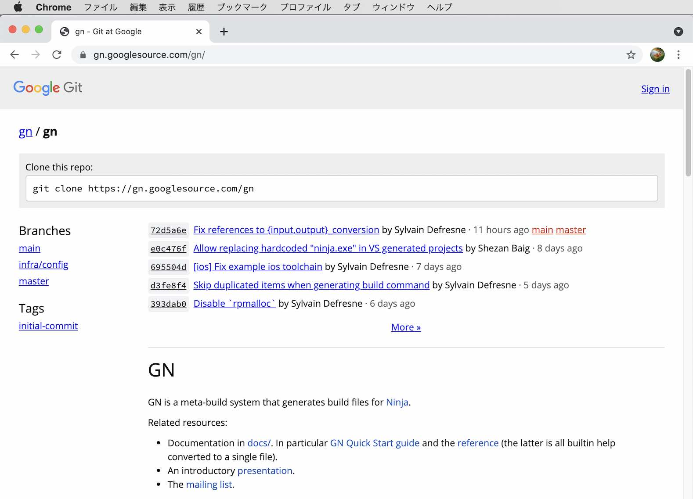
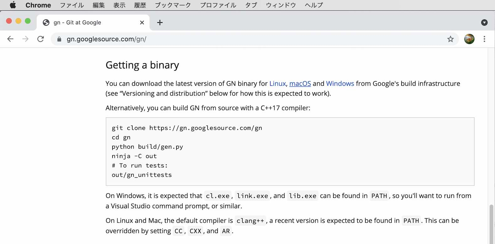
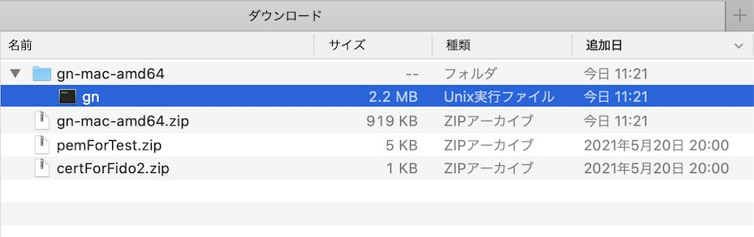
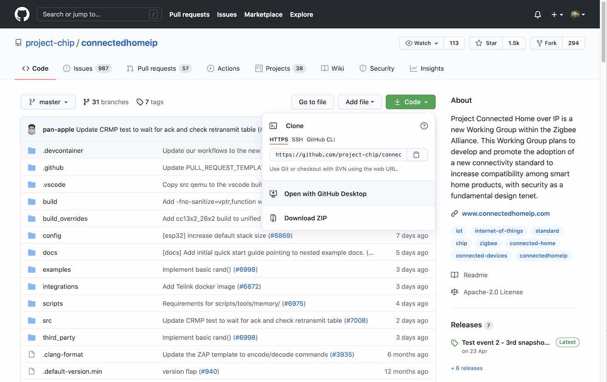
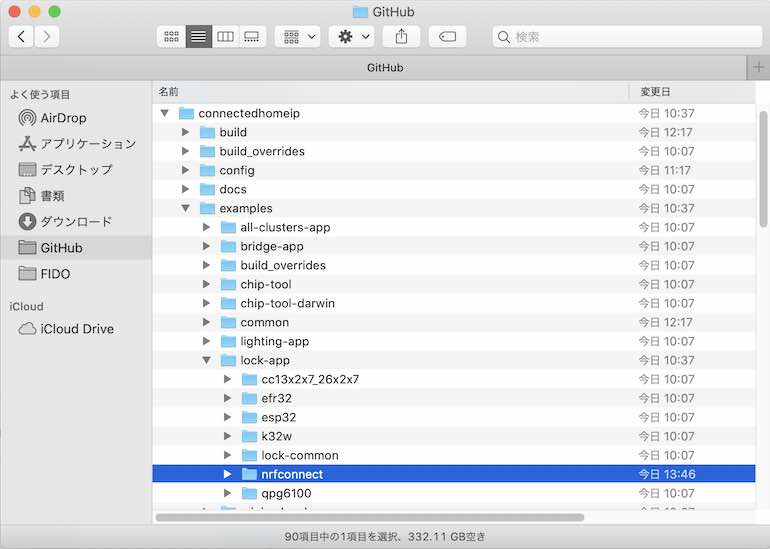
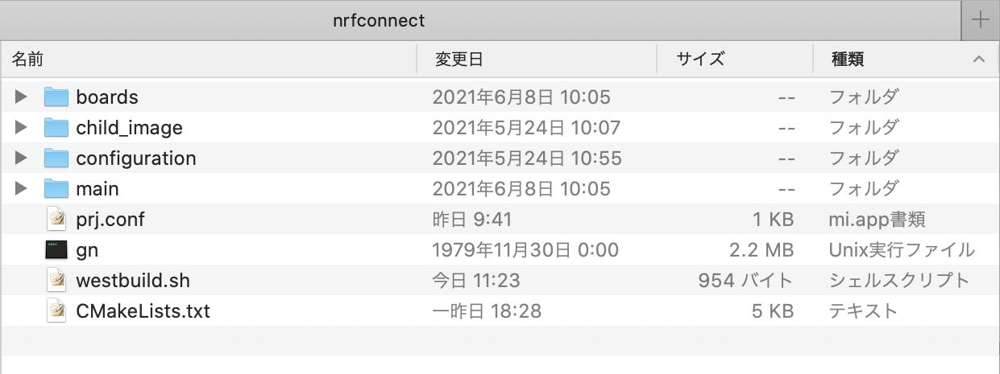
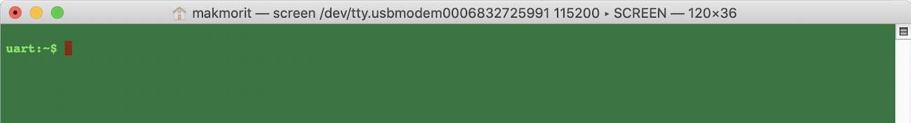
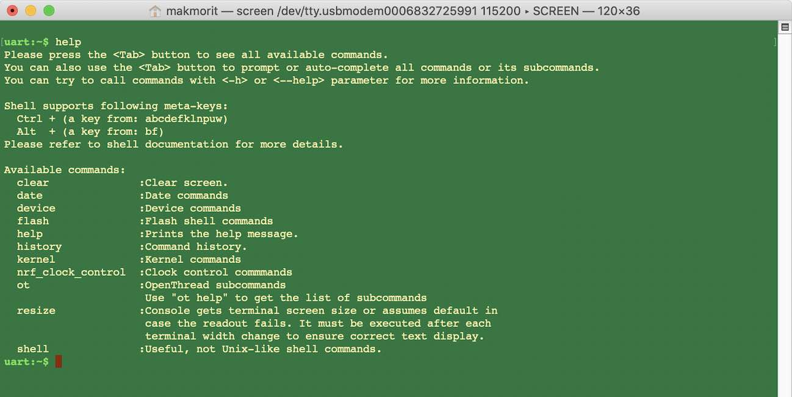

# nRF52840 Lockアプリ導入手順

サンプルアプリ[`CHIP nRF Connect Lock Example Application`](https://github.com/project-chip/connectedhomeip/blob/master/examples/lock-app/nrfconnect/README.md)をビルドし、nRF52840に書込みを行う手順を記載しています。

## 前提ソフトウェアの準備

サンプルアプリのビルドに必要なソフトウェアを取得します。

#### gnの取得

Googleの開発ツール`gn`を開発元から取得します。

リポジトリー[`https://gn.googlesource.com/gn/`](https://gn.googlesource.com/gn/)をWebブラウザーで開きます。<br>
下図のようなページが表示されます。



下の方にスクロールし「Getting a binary」の「macOS」というリンク（下図参照）をクリックすると、`gn`のバイナリーファイルを格納した`gn-mac-amd64.zip`がダウンロードされます。



`gn-mac-amd64.zip`を解凍して、実行可能ファイル`gn`を取り出します。



## ソースコードの準備

#### ファイルをコピー

GitHubのリポジトリー[`connectedhomeip`](https://github.com/project-chip/connectedhomeip)からファイルをダウンロードします。



本件サンプルアプリは、ダウンロードしたリポジトリーのディレクトリー`connectedhomeip/examples/nrfconnect/`に格納されています。<br>
これを適宜、別の場所にコピーします。



今回の例では、nRF Connect SDKが導入されている配下の`${HOME}/GitHub/onecard-fido/pyvenvs/ncs/research/`というディレクトリーにコピーしました。


#### ファイルの修正

このサンプルアプリは、Linuxシステム上の仮想環境でビルドすることを前提としています。<br>
今回の例では、システムはmacOSを使用したので、環境に合わせて若干の修正を施す必要があります。

##### `CMakeLists.txt`
- リポジトリー`connectedhomeip`のパスを絶対指定に変更
- `set(CONF_FILE)`-->`find_package`-->`include`の順で実行するよう修正

以下は記述修正例です。
```
# Load NCS/Zephyr build system
set(CONF_FILE ${CHIP_ROOT}/config/nrfconnect/app/sample-defaults.conf prj.conf)
find_package(Zephyr HINTS $ENV{ZEPHYR_BASE})
include(${CHIP_ROOT}/config/nrfconnect/app/check-nrfconnect-version.cmake)
```

##### `prj.conf`
- `CONFIG_CHIP_NFC_COMMISSIONING=n`を追加（NFCを使用しないため）

以下は記述修正例です。
```
# CHIP configuration
CONFIG_CHIP_PROJECT_CONFIG="main/include/CHIPProjectConfig.h"
CONFIG_CHIP_NFC_COMMISSIONING=n
```

#### ビルドスクリプトを作成

`west`コマンドをカスタマイズするためのビルドスクリプトを作成します。<br>
内容は以下になります。

```
#!/bin/bash

# Environment variables for the GNU Arm Embedded toolchain
export ZEPHYR_TOOLCHAIN_VARIANT=gnuarmemb
export GNUARMEMB_TOOLCHAIN_PATH="${HOME}/opt/gcc-arm-none-eabi-9-2020-q2-update"

# Paths for command
export PATH=${PATH}:/Applications/CMake.app/Contents/bin
export PATH=${PATH}:${HOME}/opt/nRF-Command-Line-Tools_10_9_0_OSX/nrfjprog
export PATH=${PATH}:.

# bash completion
export REPO_HOME=${HOME}/GitHub/onecard-fido
export NCS_HOME=${REPO_HOME}/pyvenvs/ncs
source ${NCS_HOME}/west-completion.bash

# Enter Python3 venv
source ${NCS_HOME}/bin/activate

if [ "$1" == "-f" ]; then
    # Flash for nRF52840 DK
    ${NCS_HOME}/bin/west -v flash -d build
    if [ `echo $?` -ne 0 ]; then
        deactivate
        exit 1
    fi
else
    # Build for nRF52840 DK
    rm -rfv build
    ${NCS_HOME}/bin/west build -c -b nrf52840dk_nrf52840 -d build
    if [ `echo $?` -ne 0 ]; then
        deactivate
        exit 1
    fi
fi

deactivate
exit 0
```

`westbuild.sh`は、プロジェクトディレクトリー配下に配置するのが良いと思われます。

#### 不要ファイルの削除

`third_party`というフォルダーは不要なので、適宜削除しておきます。

#### gnを配置

前述の手順で取得した実行可能ファイル`gn`を、プロジェクトディレクトリー配下に配置します。

以上の準備を行ったプロジェクトディレクトリーのイメージは下図の通りになります。



## ファームウェアのビルドと書込み

#### ビルドの実行

プロジェクトディレクトリー配下に移動し`westbuild.sh`を実行します。<br>
下記は実行例になります。

```
bash-3.2$ ./westbuild.sh
-- west build: generating a build system
Including boilerplate (Zephyr base): /Users/makmorit/GitHub/onecard-fido/pyvenvs/ncs/zephyr/cmake/app/boilerplate.cmake
-- Application: /Users/makmorit/GitHub/onecard-fido/pyvenvs/ncs/research/nrfconnect
-- Zephyr version: 2.5.99 (/Users/makmorit/GitHub/onecard-fido/pyvenvs/ncs/zephyr)
-- Found Python3: /Users/makmorit/GitHub/onecard-fido/pyvenvs/ncs/bin/python3 (found suitable exact version "3.7.3") found components: Interpreter
-- Found west (found suitable version "0.10.1", minimum required is "0.7.1")
-- Board: nrf52840dk_nrf52840
-- Cache files will be written to: /Users/makmorit/Library/Caches/zephyr
-- Found toolchain: gnuarmemb (/Users/makmorit/opt/gcc-arm-none-eabi-9-2020-q2-update)
-- Found BOARD.dts: /Users/makmorit/GitHub/onecard-fido/pyvenvs/ncs/zephyr/boards/arm/nrf52840dk_nrf52840/nrf52840dk_nrf52840.dts
-- Found devicetree overlay: /Users/makmorit/GitHub/onecard-fido/pyvenvs/ncs/research/nrfconnect/boards/nrf52840dk_nrf52840.overlay
-- Generated zephyr.dts: /Users/makmorit/GitHub/onecard-fido/pyvenvs/ncs/research/nrfconnect/build/zephyr/zephyr.dts
-- Generated devicetree_unfixed.h: /Users/makmorit/GitHub/onecard-fido/pyvenvs/ncs/research/nrfconnect/build/zephyr/include/generated/devicetree_unfixed.h
-- Generated device_extern.h: /Users/makmorit/GitHub/onecard-fido/pyvenvs/ncs/research/nrfconnect/build/zephyr/include/generated/device_extern.h
Parsing /Users/makmorit/GitHub/onecard-fido/pyvenvs/ncs/zephyr/Kconfig
Loaded configuration '/Users/makmorit/GitHub/onecard-fido/pyvenvs/ncs/zephyr/boards/arm/nrf52840dk_nrf52840/nrf52840dk_nrf52840_defconfig'
Merged configuration '/Users/makmorit/GitHub/connectedhomeip/config/nrfconnect/app/sample-defaults.conf'
Merged configuration 'prj.conf'
Configuration saved to '/Users/makmorit/GitHub/onecard-fido/pyvenvs/ncs/research/nrfconnect/build/zephyr/.config'
Kconfig header saved to '/Users/makmorit/GitHub/onecard-fido/pyvenvs/ncs/research/nrfconnect/build/zephyr/include/generated/autoconf.h'
-- The C compiler identification is GNU 9.3.1
-- The CXX compiler identification is GNU 9.3.1
-- The ASM compiler identification is GNU
-- Found assembler: /Users/makmorit/opt/gcc-arm-none-eabi-9-2020-q2-update/bin/arm-none-eabi-gcc
-- Check if the system is big endian
-- Searching 16 bit integer
-- Looking for sys/types.h
-- Looking for sys/types.h - found
-- Looking for stdint.h
-- Looking for stdint.h - found
-- Looking for stddef.h
-- Looking for stddef.h - found
-- Check size of unsigned short
-- Check size of unsigned short - done
-- Searching 16 bit integer - Using unsigned short
-- Check if the system is big endian - little endian
-- CMake build type: Debug
-- Version: gfd27fc3a7
-- Found Python3: /Users/makmorit/GitHub/onecard-fido/pyvenvs/ncs/bin/python3 (found version "3.7.3") found components: Interpreter
CMake Warning at /Users/makmorit/GitHub/onecard-fido/pyvenvs/ncs/zephyr/CMakeLists.txt:1406 (message):
  __ASSERT() statements are globally ENABLED


CMake Warning at /Users/makmorit/GitHub/onecard-fido/pyvenvs/ncs/zephyr/CMakeLists.txt:1434 (message):


        The CMake build type was set to 'Debug', but the optimization flag was set to '-Os'.
        This may be intentional and the warning can be turned off by setting the CMake variable 'NO_BUILD_TYPE_WARNING'


-- Configuring done
-- Generating done
-- Build files have been written to: /Users/makmorit/GitHub/onecard-fido/pyvenvs/ncs/research/nrfconnect/build
-- west build: building application
[0/628] cd /Users/makmorit/GitHub/connectedhomeip && /User...tup/nrfconnect/update_ncs.py --check --quiet || ( exit 0 )
[1/628] Preparing syscall dependency handling

[18/628] cd /Users/makmorit/GitHub/onecard-fido/pyvenvs/nc...o/pyvenvs/ncs/modules/lib/openthread/etc/cmake/print.cmake
OPENTHREAD_CONFIG_ASSERT_ENABLE=1
OPENTHREAD_CONFIG_BACKBONE_ROUTER_DUA_NDPROXYING_ENABLE=0
OPENTHREAD_CONFIG_BACKBONE_ROUTER_MULTICAST_ROUTING_ENABLE=0
OPENTHREAD_CONFIG_ENABLE_BUILTIN_MBEDTLS=0
OPENTHREAD_CONFIG_ENABLE_BUILTIN_MBEDTLS_MANAGEMENT=0
OPENTHREAD_CONFIG_DHCP6_CLIENT_ENABLE=1
OPENTHREAD_CONFIG_DNS_CLIENT_ENABLE=1
OPENTHREAD_CONFIG_ECDSA_ENABLE=1
OPENTHREAD_CONFIG_SRP_CLIENT_ENABLE=1
OPENTHREAD_CONFIG_TMF_NETWORK_DIAG_MTD_ENABLE=1
OPENTHREAD_CONFIG_TMF_NETDATA_SERVICE_ENABLE=1
OPENTHREAD_CONFIG_IP6_SLAAC_ENABLE=1
OPENTHREAD_CONFIG_SNTP_CLIENT_ENABLE=1
OPENTHREAD_SPINEL_CONFIG_RCP_RESTORATION_MAX_COUNT=0
PACKAGE_NAME=OPENTHREAD
PACKAGE_VERSION=gfd27fc3a7
OPENTHREAD_CONFIG_THREAD_VERSION=OT_THREAD_VERSION_1_1
OPENTHREAD_CONFIG_NCP_UART_ENABLE=1
KERNEL
__ZEPHYR__=1
_FORTIFY_SOURCE=2
BUILD_VERSION=v2.4.99-ncs1-1830-g6a1d340b632e
__LINUX_ERRNO_EXTENSIONS__
USE_PARTITION_MANAGER=0
__PROGRAM_START
NRF52840_XXAA
NRF_802154_USE_RAW_API=1
NRF_802154_PENDING_SHORT_ADDRESSES=16
NRF_802154_PENDING_EXTENDED_ADDRESSES=16
NRF_802154_RX_BUFFERS=16
NRF_802154_CCA_CORR_LIMIT_DEFAULT=2
NRF_802154_CCA_CORR_THRESHOLD_DEFAULT=45
NRF_802154_CCA_ED_THRESHOLD_DEFAULT=45
NRF_802154_CSMA_CA_ENABLED=1
NRF_802154_TX_STARTED_NOTIFY_ENABLED=1
NRF_802154_ACK_TIMEOUT_ENABLED=1
NRF_802154_CCA_MODE_DEFAULT=NRF_RADIO_CCA_MODE_ED
NRF_802154_INTERNAL_RADIO_IRQ_HANDLING=0
OPENTHREAD_CONFIG_CLI_TRANSPORT=OT_CLI_TRANSPORT_CONSOLE
MBEDTLS_CONFIG_FILE=nrf-config.h
[571/628] Performing configure step for 'chip-gn'
Generating compile_commands took 5ms
Done. Made 60 targets from 67 files in 30ms
[572/628] Performing build step for 'chip-gn'
[247/247] stamp obj/ABS_PATH/Users/makmorit/GitHub/connectedhomeip/config/nrfconnect/chip-gn/default.stamp
[621/628] Linking CXX executable zephyr/zephyr_prebuilt.elf

[628/628] Linking CXX executable zephyr/zephyr.elf
Memory region         Used Size  Region Size  %age Used
           FLASH:      594768 B         1 MB     56.72%
            SRAM:      175329 B       256 KB     66.88%
        IDT_LIST:          0 GB         2 KB      0.00%

bash-3.2$
```

#### ファームウェアの書込み

前述`westbuild.sh`実行により生成されたファームウェア（`build/zephyr/zephyr.hex`）を、nRF52840に書込みます。<br>
下記は実行例になります。

```
bash-3.2$ ./westbuild.sh -f
ZEPHYR_BASE=/Users/makmorit/GitHub/onecard-fido/pyvenvs/ncs/zephyr (origin: configfile)
-- west flash: rebuilding
cmake version 3.18.0 is OK; minimum version is 3.13.1
Running CMake: /Applications/CMake.app/Contents/bin/cmake --build build
[0/6] cd /Users/makmorit/GitHub/connectedhomeip && /Users/...tup/nrfconnect/update_ncs.py --check --quiet || ( exit 0 )
[1/6] Performing build step for 'chip-gn'
ninja: no work to do.
[3/4] cd /Users/makmorit/GitHub/onecard-fido/pyvenvs/ncs/r...o/pyvenvs/ncs/modules/lib/openthread/etc/cmake/print.cmake
OPENTHREAD_CONFIG_ASSERT_ENABLE=1
OPENTHREAD_CONFIG_BACKBONE_ROUTER_DUA_NDPROXYING_ENABLE=0
OPENTHREAD_CONFIG_BACKBONE_ROUTER_MULTICAST_ROUTING_ENABLE=0
OPENTHREAD_CONFIG_ENABLE_BUILTIN_MBEDTLS=0
OPENTHREAD_CONFIG_ENABLE_BUILTIN_MBEDTLS_MANAGEMENT=0
OPENTHREAD_CONFIG_DHCP6_CLIENT_ENABLE=1
OPENTHREAD_CONFIG_DNS_CLIENT_ENABLE=1
OPENTHREAD_CONFIG_ECDSA_ENABLE=1
OPENTHREAD_CONFIG_SRP_CLIENT_ENABLE=1
OPENTHREAD_CONFIG_TMF_NETWORK_DIAG_MTD_ENABLE=1
OPENTHREAD_CONFIG_TMF_NETDATA_SERVICE_ENABLE=1
OPENTHREAD_CONFIG_IP6_SLAAC_ENABLE=1
OPENTHREAD_CONFIG_SNTP_CLIENT_ENABLE=1
OPENTHREAD_SPINEL_CONFIG_RCP_RESTORATION_MAX_COUNT=0
PACKAGE_NAME=OPENTHREAD
PACKAGE_VERSION=gfd27fc3a7
OPENTHREAD_CONFIG_THREAD_VERSION=OT_THREAD_VERSION_1_1
OPENTHREAD_CONFIG_NCP_UART_ENABLE=1
KERNEL
__ZEPHYR__=1
_FORTIFY_SOURCE=2
BUILD_VERSION=v2.4.99-ncs1-1830-g6a1d340b632e
__LINUX_ERRNO_EXTENSIONS__
USE_PARTITION_MANAGER=0
__PROGRAM_START
NRF52840_XXAA
NRF_802154_USE_RAW_API=1
NRF_802154_PENDING_SHORT_ADDRESSES=16
NRF_802154_PENDING_EXTENDED_ADDRESSES=16
NRF_802154_RX_BUFFERS=16
NRF_802154_CCA_CORR_LIMIT_DEFAULT=2
NRF_802154_CCA_CORR_THRESHOLD_DEFAULT=45
NRF_802154_CCA_ED_THRESHOLD_DEFAULT=45
NRF_802154_CSMA_CA_ENABLED=1
NRF_802154_TX_STARTED_NOTIFY_ENABLED=1
NRF_802154_ACK_TIMEOUT_ENABLED=1
NRF_802154_CCA_MODE_DEFAULT=NRF_RADIO_CCA_MODE_ED
NRF_802154_INTERNAL_RADIO_IRQ_HANDLING=0
OPENTHREAD_CONFIG_CLI_TRANSPORT=OT_CLI_TRANSPORT_CONSOLE
MBEDTLS_CONFIG_FILE=nrf-config.h
[4/4] Linking CXX executable zephyr/zephyr.elf
Memory region         Used Size  Region Size  %age Used
           FLASH:      594768 B         1 MB     56.72%
            SRAM:      175329 B       256 KB     66.88%
        IDT_LIST:          0 GB         2 KB      0.00%

-- west flash: using runner nrfjprog
runners.nrfjprog: nrfjprog --ids
Using board 683272599
-- runners.nrfjprog: Flashing file: build/zephyr/zephyr.hex
runners.nrfjprog: nrfjprog --program build/zephyr/zephyr.hex --sectoranduicrerase -f NRF52 --snr 683272599
Parsing hex file.
Erasing page at address 0x0.
Erasing page at address 0x1000.
Erasing page at address 0x2000.
（中略）
Erasing page at address 0x8F000.
Erasing page at address 0x90000.
Erasing page at address 0x91000.
Applying system reset.
Checking that the area to write is not protected.
Programming device.
runners.nrfjprog: nrfjprog --pinresetenable -f NRF52 --snr 683272599
Enabling pin reset.
runners.nrfjprog: nrfjprog --pinreset -f NRF52 --snr 683272599
Applying pin reset.
-- runners.nrfjprog: Board with serial number 683272599 flashed successfully.
bash-3.2$
```

## ファームウェアの動作確認

このサンプルアプリでは、UARTによるコマンドラインインターフェースが提供されています。<br>
macOSのターミナルで、screenコマンドを実行します。

```
bash-3.2$ ls -al /dev/tty.usbmodem*　<-- nRF52840のUARTポートを探す
crw-rw-rw-  1 root  wheel    9,   6  5 24 14:57 /dev/tty.usbmodem0006832725991
bash-3.2$ screen /dev/tty.usbmodem0006832725991 115200　<-- UARTポートを指定し、screenコマンドを実行
```

screenが立ち上がったら、[Enter]キーを１回押します。<br>
下図のようなコマンドプロンプトが表示されます。



コマンドプロンプトで`help`を入力し実行します。<br>
下図のように、コマンドヘルプが表示されます。



以上で、nRF52840 Lockアプリの導入は完了です。
