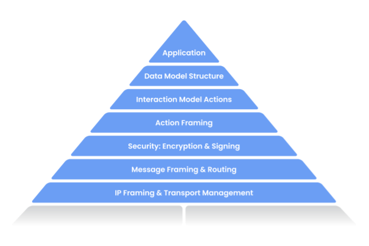

# Matterについて

新しいスマートホーム共通規格「Matter」についての概要を記述しています。

下記リンクの翻訳まとめたドキュメントになります。 
[GitHub - project-chip/connectedhomeip](https://github.com/project-chip/connectedhomeip)

## Matterプロジェクトについて
（Matter＝旧称「Connected Home over IP」）

Matterプロジェクトは、Zigbee Alliance内の新しいワーキンググループです。 
このワーキンググループは、セキュリティを基本理念とし、スマートホーム製品間の互換性を高めるために、新しいロイヤリティフリーの接続規格を開発し、採用を推進することをプランとしています。

Matterプロジェクトの目標は、メーカーの開発を簡素化し、購買製品の互換性を高めることです。 
このプロジェクトでは、スマートホームデバイスは安全で信頼性が高く、シームレスに使用できるべきであるという共通理念があります。

Matterはインターネットプロトコル (IP) をベースとするため、スマートホームデバイス、モバイルアプリ、クラウドサービス間の通信を可能にし、デバイス認証のためのIPベースのネットワーク技術要件を定義しようとするものです。

Zigbee Allianceは、2020年1月17日にワーキンググループ「Connected Home over IP」を正式に開設し、仕様の草案作成を続けています。

## プロジェクト概要

#### 開発目標

下記の目標・原則に基づき開発しています。

|#|項目|説明|
|:---:|:---|:---|
|1|Unifying|マーケットでテストされた既存技術をベースに、新しい仕様を策定しています。|
|2|Interoperable|Matter認定デバイス間の通信のためには、ユーザーの許可を必要とします。|
|3|Secure|最新のセキュリティー要件・プロトコルを活用した仕様です。|
|4|User Control|エンドユーザーはデバイスに対し対話型の認証ができます。|
|5|Federated|構成要素一つ一つが、単一障害点等になることを回避します。|
|6|Robust|運用開始が早く、シームレスな操作ができ、機能変更に対応可能な管理機能を有する、デバイスのライフサイクルを考慮した仕様です。|
|7|Low Overhead|MCUなどのリソースが小さいデバイスに実装出来るプロトコルです。|
|8|Pervasive|IPを活用し、低機能のデバイスに実装できるため、プロトコルは幅広く展開・アクセスが可能です。|
|9|Ecosystem-Flexible|プロトコルは、ポリシーが異なるエコシステムでの展開に対応できるよう、十分に柔軟である必要があります。|
|10|Easy to Use|プロトコルは、スムーズで統一感のある導入手順と、やさしい操作性を提供する必要があります。|
|11|Open|プロジェクトの設計・開発プロセスは、可能な限り一般の人々に対してオープンかつ透明であるべきです。|

#### アーキテクチャー

Matterは上図のように、デバイス／コントローラーに搭載するアプリケーション層と、相互運用可能なアーキテクチャーを実現できるよう、IPv6ネットワークを定義・サポートしています。 
また、主要トランスポート・運用トランスポートとしてWi-Fi・Thread、およびデバイス導入・セットアップを容易にするために使用するBLEを、最初からサポートします。

アプリケーション層は下図のように、さらに７点の主要コンポーネントに分類できます。

|#|項目|説明|
|:---:|:---|:---|
|1|Application|デバイスの高度ビジネスロジック。 たとえば、照明関連操作を行うアプリケーションには、電球のOn/Offや、照明の色彩を操作するロジックを含むことがあります。|
|2|Data Model|デバイスの様々な機能を記述するのに用いられるデータプリミティブ。 アプリケーションは、デバイスと対話しようとする場合、このデータ構造体を使用し動作します。|
|3|Interaction Model|デバイスと対話するために実行可能な一連のアクションを表します。 デバイス対話時は例として、デバイス上のread属性またはwrite属性が使用されたりします。 これらのアクションは、データモデルで定義された構造体を使用して動作します。|
|4|Action Framing|アクションが対話モデルを使用して構築されると、`wire`で適切に表現できるように、ルールに基づいたバイナリ形式にフレーム化されます。|
|5|Security|エンコードされたアクションフレームは、その後セキュリティレイヤーに送信され、データ内容が暗号化／署名され、パケット送信側／受信側の両方でデータが保護／認証されます。|
|6|Message Framing & Routing|暗号化／署名された対話により、メッセージレイヤーでは必須／オプションのヘッダーフィールドを含む送信データ(payload)形式を構築します。 ヘッダーフィールドでは、メッセージプロパティと、いくつかのルーティング情報を指定します。|
|7|IP Framing & Transport Management|最終的な送信データ(payload)が構築された後、送信データで指定されたIP情報を基に、所定の通信プロトコルを用いて送信されます。|

## プロジェクトの現状

プロジェクトの設計・技術プロセスは、可能な限りワークグループの非メンバーを含む、一般の人々に公開され、透明になることを目的としています。 
Apache v2ライセンスの下でGitHubリポジトリ[`project-chip/connectedhomeip`](https://github.com/project-chip/connectedhomeip#architecture-overview)とそのソースコードを利用いただくことは、前述目的を達成するための重要かつ実証的なステップになります。

このプロジェクトは、市場でテストされた技術の最善点をまとめ、統合された統一感のあるシステム全体のソリューションとして再展開するよう努めています。 
このアプローチの全体的な目標は、プロジェクトの利点をできるだけ早く製品購買者と製造業者にもたらすことです。 
その結果、このリポジトリで、実際の統合を精査し、技術仕様に対する実装優先のアプローチを確認することが出来ます。

Projectリポジトリは、全体アーキテクチャを実装するために成長・進化しています。 
リポジトリには現在、セキュリティ基盤、メッセージフレーミングとディスパッチ、対話モデル、データモデルの実装が含まれています。

サンプルコードでは簡単な相互通信が出来、プロジェクトのスケーラビリティを確保するために、リソースに制約のあるマイコンプラットフォームから実装可能で、Wi-Fi／Threadトランスポートをサポートしています。
