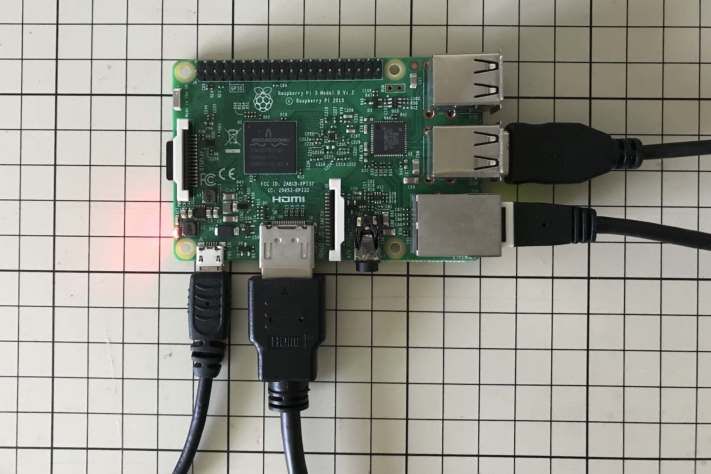
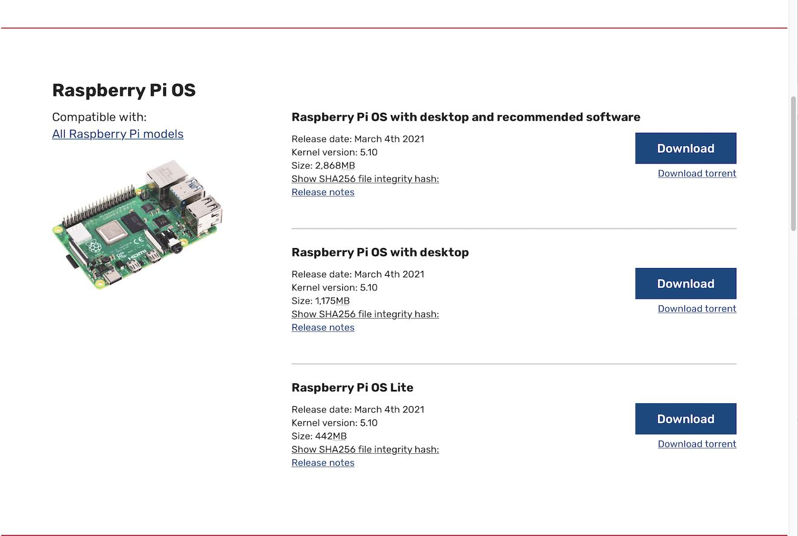
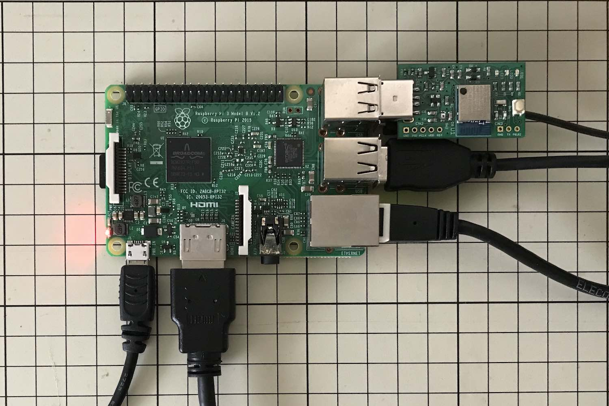
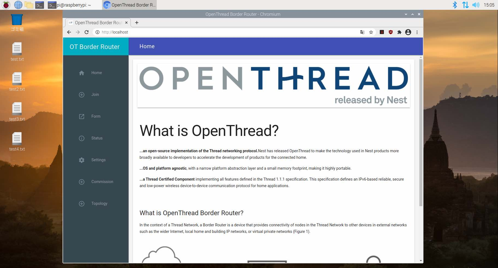
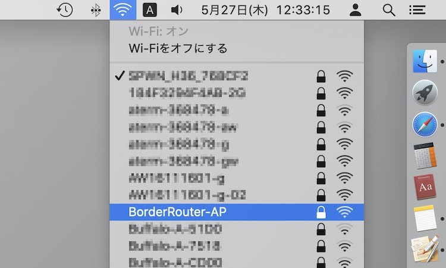

# OpenThread Border Router導入手順

`Raspberry Pi 3 Type B`を使用し、OpenThread Border Router（以下、本ドキュメントにおいて <b>OTBR</b> と略します。）として構築する手順を記載しています。

## Linuxシステム（ラズベリーパイ）の準備

EthernetとWi-Fiが同時に使用できるPCに、Linuxシステムを構築します。

今回の例では、`Raspberry Pi 3 Model B`（ラズベリーパイ）という基板を使用します。



#### システムイメージのコピー

下記サイトから`Raspberry Pi OS with desktop`をダウンロードします。<br>
[https://www.raspberrypi.org/software/operating-systems/](https://www.raspberrypi.org/software/operating-systems/)



ダウンロードしたOSのイメージファイルを、SDカードにコピーします。<br>
以下のコマンドを実行します。

```
diskutil list
diskutil unmountDisk /dev/disk2
sudo dd bs=1m if=/Users/makmorit/Downloads/2021-03-04-raspios-buster-armhf.img of=/dev/rdisk2; sync
sudo diskutil eject /dev/rdiskN
```

下記は実行例になります。

```
bash-3.2$ diskutil list
/dev/disk0 (internal, physical):
   #:                       TYPE NAME                    SIZE       IDENTIFIER
   0:      GUID_partition_scheme                        *500.3 GB   disk0
   1:                        EFI EFI                     314.6 MB   disk0s1
   2:                 Apple_APFS Container disk1         500.0 GB   disk0s2

/dev/disk1 (synthesized):
   #:                       TYPE NAME                    SIZE       IDENTIFIER
   0:      APFS Container Scheme -                      +500.0 GB   disk1
                                 Physical Store disk0s2
   1:                APFS Volume Macintosh HD            11.0 GB    disk1s1
   2:                APFS Volume Macintosh HD - Data     161.9 GB   disk1s2
   3:                APFS Volume Preboot                 82.6 MB    disk1s3
   4:                APFS Volume Recovery                525.4 MB   disk1s4
   5:                APFS Volume VM                      2.1 GB     disk1s5

/dev/disk2 (external, physical):
   #:                       TYPE NAME                    SIZE       IDENTIFIER
   0:                            NO NAME                *15.5 GB    disk2

bash-3.2$ diskutil unmountDisk /dev/disk2
Unmount of all volumes on disk2 was successful
bash-3.2$ sudo dd bs=1m if=/Users/makmorit/Downloads/2021-03-04-raspios-buster-armhf.img of=/dev/rdisk2; sync
Password:
3784+0 records in
3784+0 records out
3967811584 bytes transferred in 348.658687 secs (11380217 bytes/sec)
bash-3.2$
bash-3.2$ sudo diskutil eject /dev/rdisk2
Password:
Disk /dev/rdisk2 ejected
bash-3.2$
```

イメージのコピーが完了したら、SDカードをラズベリーパイの基板にセット後、電源を入れてシステムを起動します。<br>
システムが起動したら、為念でgitのインストールを実行します。

```
sudo apt install git
```

下記は実行例になります。

```
pi@raspberrypi:~ $
pi@raspberrypi:~ $ sudo apt install git
パッケージリストを読み込んでいます... 完了
依存関係ツリーを作成しています                
状態情報を読み取っています... 完了
git はすでに最新バージョン (1:2.20.1-2+deb10u3) です。
アップグレード: 0 個、新規インストール: 0 個、削除: 0 個、保留: 0 個。
pi@raspberrypi:~ $
```

## OTBRのインストール

下記サイトの指示に従い、インストールを進めます。<br>
[https://openthread.io/guides/border-router/raspberry-pi](https://openthread.io/guides/border-router/raspberry-pi)

#### ソースコードの取得

GitHubから、OTBRのソースコードを取得します。<br>
下記コマンドを実行します。

```
git clone https://github.com/openthread/ot-br-posix
```

下記は実行例になります。

```
pi@raspberrypi:~ $ pwd
/home/pi
pi@raspberrypi:~ $ git clone https://github.com/openthread/ot-br-posix
Cloning into 'ot-br-posix'...
remote: Enumerating objects: 76983, done.
remote: Counting objects: 100% (10297/10297), done.
remote: Compressing objects: 100% (471/471), done.
remote: Total 76983 (delta 10001), reused 9979 (delta 9825), pack-reused 66686
Receiving objects: 100% (76983/76983), 46.32 MiB | 3.11 MiB/s, done.
Resolving deltas: 100% (52171/52171), done.
pi@raspberrypi:~ $
```

#### インストールの準備

依存ライブラリー／パッケージの導入を実行します。<br>
下記コマンドを実行します。

```
cd ot-br-posix
./script/bootstrap
```

下記は実行例になります。

```
pi@raspberrypi:~ $ cd ot-br-posix
pi@raspberrypi:~/ot-br-posix $
pi@raspberrypi:~/ot-br-posix $ ./script/bootstrap
+++ dirname ./script/bootstrap
++ cd ./script/..
++ [[ ! -n '' ]]
++ grep -s 'BeagleBone Black' /sys/firmware/devicetree/base/model
++ case "${OSTYPE}" in
++ have_or_die lsb_release
++ have lsb_release
++ command -v lsb_release
：
+ main
+ . /dev/null
+ git submodule update --init --recursive --depth 1
Submodule 'third_party/cJSON/repo' (https://github.com/DaveGamble/cJSON.git) registered for path 'third_party/cJSON/repo'
Submodule 'third_party/http-parser/repo' (https://github.com/nodejs/http-parser.git) registered for path 'third_party/http-parser/repo'
Submodule 'third_party/openthread/repo' (https://github.com/openthread/openthread.git) registered for path 'third_party/openthread/repo'
Cloning into '/home/pi/ot-br-posix/third_party/cJSON/repo'...
Cloning into '/home/pi/ot-br-posix/third_party/http-parser/repo'...
Cloning into '/home/pi/ot-br-posix/third_party/openthread/repo'...
：
node-cacache (11.3.2-2) を設定しています ...
node-gyp (3.8.0-6) を設定しています ...
node-libnpx (10.2.0+repack-1) を設定しています ...
npm (5.8.0+ds6-4+deb10u2) を設定しています ...
man-db (2.8.5-2) のトリガを処理しています ...
libc-bin (2.28-10+rpi1) のトリガを処理しています ...
+ . examples/platforms/raspbian/after_bootstrap
++ . /etc/os-release
+++ PRETTY_NAME='Raspbian GNU/Linux 10 (buster)'
+++ NAME='Raspbian GNU/Linux'
+++ VERSION_ID=10
+++ VERSION='10 (buster)'
+++ VERSION_CODENAME=buster
+++ ID=raspbian
+++ ID_LIKE=debian
+++ HOME_URL=http://www.raspbian.org/
+++ SUPPORT_URL=http://www.raspbian.org/RaspbianForums
+++ BUG_REPORT_URL=http://www.raspbian.org/RaspbianBugs
++ [[ 10 -ge 10 ]]
pi@raspberrypi:~/ot-br-posix $
```

#### インストールの実行

OTBRのビルド／インストールを実行します。<br>
下記コマンドを実行します。

```
INFRA_IF_NAME=eth0 ./script/setup
```

下記は実行例になります。

```
pi@raspberrypi:~/ot-br-posix $ INFRA_IF_NAME=eth0 ./script/setup
+++ dirname ./script/setup
++ cd ./script/..
++ [[ ! -n '' ]]
++ grep -s 'BeagleBone Black' /sys/firmware/devicetree/base/model
++ case "${OSTYPE}" in
++ have_or_die lsb_release
++ have lsb_release
：
+ ./script/cmake-build -DBUILD_TESTING=OFF -DCMAKE_INSTALL_PREFIX=/usr -DOTBR_DBUS=ON -DOTBR_DNSSD_DISCOVERY_PROXY=ON -DOTBR_SRP_ADVERTISING_PROXY=ON -DOTBR_MDNS=mDNSResponder -DOTBR_INFRA_IF_NAME=eth0 -DOTBR_WEB=ON -DOTBR_BORDER_ROUTING=ON -DOTBR_REST=ON -DOTBR_BACKBONE_ROUTER=ON
+++ dirname ./script/cmake-build
++ cd ./script/..
++ [[ ! -n '' ]]
++ grep -s 'BeagleBone Black' /sys/firmware/devicetree/base/model
++ case "${OSTYPE}" in
++ have_or_die lsb_release
++ have lsb_release
++ command -v lsb_release
+++ lsb_release -i
+++ cut -c17-
：
[6/7] Install the project...
-- Install configuration: ""
-- Installing: /usr/sbin/otbr-agent
-- Installing: /usr/sbin/ot-ctl
-- Installing: /etc/dbus-1/system.d/otbr-agent.conf
-- Installing: /lib/systemd/system/otbr-agent.service
-- Installing: /etc/default/otbr-agent
：
+++ WEB_GUI=1
+++ REST_API=1
++ eval echo '${WEB_GUI-}'
+++ echo 1
+ value=1
+ [[ 1 == 1 ]]
+ sudo systemctl is-enabled otbr-web
enabled
+ [[ 0 == \1 ]]
+ . /dev/null
pi@raspberrypi:~/ot-br-posix $
```

#### RCPの設定

別途、nRF52840を使いセットアップしたRCP（Radio Co-Processor）を、ラズパイのOTBRに割り当てます。<br>
今回の例では、nRF52840デバイスとして、以前に製作した「MDBT50Q Dongle」を使用しております。

まずはラズパイのUSBポートに、nRF52840を装着します。



ラズパイに装着されたnRF52840のデバイス名を取得します。<br>
以下は、nRF52840が`/dev/ttyACM0`として認識された例です。

```
pi@raspberrypi:~ $ ls -al /dev/tty*0
crw--w---- 1 root tty       4,  0  5月 25 14:57 /dev/tty0
crw--w---- 1 root tty       4, 10  5月 25 14:57 /dev/tty10
crw--w---- 1 root tty       4, 20  5月 25 14:57 /dev/tty20
crw--w---- 1 root tty       4, 30  5月 25 14:57 /dev/tty30
crw--w---- 1 root tty       4, 40  5月 25 14:57 /dev/tty40
crw--w---- 1 root tty       4, 50  5月 25 14:57 /dev/tty50
crw--w---- 1 root tty       4, 60  5月 25 14:57 /dev/tty60
crw-rw---- 1 root dialout 166,  0  5月 25 15:45 /dev/ttyACM0
crw-rw---- 1 root dialout 204, 64  5月 25 14:57 /dev/ttyAMA0
pi@raspberrypi:~ $
```

`/etc/default/otbr-agent`というファイルの内容を確認し、記述されているデバイス名が、上記のデバイス名と整合していることを確認します。

```
pi@raspberrypi:~ $ cat /etc/default/otbr-agent
# Default settings for otbr-agent. This file is sourced by systemd

# Options to pass to otbr-agent
OTBR_AGENT_OPTS="-I wpan0 -B eth0 spinel+hdlc+uart:///dev/ttyACM0 trel://eth0"
pi@raspberrypi:~ $
```

ここまで確認できたら、nRF52840をUSBポートに装着したまま、ラズパイを再起動します。

```
sudo reboot
```

#### 各サービスの稼働確認

再起動が完了したら、RCP（nRF52840）および各サービス（`otbr-agent.service`、`otbr-web.service`）の稼働状況を確認します。<br>
以下は実行例になります。

```
pi@raspberrypi:~ $ sudo systemctl status
● raspberrypi
    State: running
     Jobs: 0 queued
   Failed: 0 units
    Since: Thu 1970-01-01 09:00:03 JST; 51 years 4 months ago
   CGroup: /
           ├─user.slice
           │ └─user-1000.slice
           │   ├─session-3.scope
           │   │ ├─ 695 lightdm --session-child 14 17
           │   │ ├─ 699 /usr/bin/lxsession -s LXDE-pi -e LXDE
           ：
           ├─init.scope
           │ └─1 /sbin/init splash
           └─system.slice
             ├─lightdm.service
             │ ├─531 /usr/sbin/lightdm
             │ └─574 /usr/lib/xorg/Xorg :0 -seat seat0 -auth /var/run/lightdm/root/:0 -nolisten tcp
             ：
             ├─avahi-daemon.service
             │ ├─413 avahi-daemon: running [raspberrypi.local]
             │ └─455 avahi-daemon: chroot helper
             ├─otbr-web.service
             │ └─384 /usr/sbin/otbr-web
             ├─wpa_supplicant.service
             │ └─407 /sbin/wpa_supplicant -u -s -O /run/wpa_supplicant
             ├─triggerhappy.service
             │ └─412 /usr/sbin/thd --triggers /etc/triggerhappy/triggers.d/ --socket /run/thd.socket --user nobody --deviceglob /dev/input/event*
             ├─systemd-logind.service
             │ └─390 /lib/systemd/systemd-logind
             ├─rtkit-daemon.service
             │ └─769 /usr/lib/rtkit/rtkit-daemon
             ├─cups.service
             │ ├─381 /usr/sbin/cupsd -l
             │ └─941 /usr/lib/cups/notifier/dbus dbus://
             ├─polkit.service
             │ └─507 /usr/lib/policykit-1/polkitd --no-debug
             ├─otbr-agent.service
             │ └─383 /usr/sbin/otbr-agent -I wpan0 -B eth0 spinel+hdlc+uart:///dev/ttyACM0 trel://eth0
             ：
pi@raspberrypi:~ $
```

以下は個別の動作確認になります。<br>
まずはRCPの状況確認を実行します。

```
sudo ot-ctl state
```

以下は実行例です。<br>
`disable`の文言は、RCPおよび`otbr-agent.service`は正常に稼働しているが、Threadネットワークには参加されていない状態であることを示します。

```
pi@raspberrypi:~ $ sudo ot-ctl state
disabled
Done
pi@raspberrypi:~ $
```

次に、Webブラウザーを起動し、`http://localhost/`を実行します。<br>
下図のような管理画面が表示されれば、`otbr-web.service`が正常に稼働していることを示します。



以上で、OpenThread Border Router（OTBR）の構築は完了です。

## Wi-Fi APのセットアップ

OTBRと、Thread設定用スマートフォンを接続させるために必要となる、Wi-Fi AP（アクセスポイント）のセットアップを実行します。

#### 依存パッケージの導入

下記コマンドを実行します。

```
sudo apt-get install hostapd dnsmasq tayga
```

下記は実行例になります。

```
pi@raspberrypi:~ $ sudo apt-get install hostapd dnsmasq tayga
パッケージリストを読み込んでいます... 完了
依存関係ツリーを作成しています                
状態情報を読み取っています... 完了
tayga はすでに最新バージョン (0.9.2-8) です。
以下のパッケージが新たにインストールされます:
  dnsmasq dnsmasq-base hostapd
アップグレード: 0 個、新規インストール: 3 個、削除: 0 個、保留: 115 個。
1,048 kB のアーカイブを取得する必要があります。
この操作後に追加で 2,649 kB のディスク容量が消費されます。
取得:1 http://archive.raspberrypi.org/debian buster/main armhf dnsmasq-base armhf 2.80-1+rpt1+deb10u1 [400 kB]
取得:2 http://ftp.jaist.ac.jp/pub/Linux/raspbian-archive/raspbian buster/main armhf hostapd armhf 2:2.7+git20190128+0c1e29f-6+deb10u3 [632 kB]
取得:3 http://archive.raspberrypi.org/debian buster/main armhf dnsmasq all 2.80-1+rpt1+deb10u1 [16.5 kB]
1,048 kB を 3秒 で取得しました (362 kB/s)
以前に未選択のパッケージ hostapd を選択しています。
(データベースを読み込んでいます ... 現在 121579 個のファイルとディレクトリがインストールされています。)
.../hostapd_2%3a2.7+git20190128+0c1e29f-6+deb10u3_armhf.deb を展開する準備をしています ...
hostapd (2:2.7+git20190128+0c1e29f-6+deb10u3) を展開しています...
以前に未選択のパッケージ dnsmasq-base を選択しています。
.../dnsmasq-base_2.80-1+rpt1+deb10u1_armhf.deb を展開する準備をしています ...
dnsmasq-base (2.80-1+rpt1+deb10u1) を展開しています...
以前に未選択のパッケージ dnsmasq を選択しています。
.../dnsmasq_2.80-1+rpt1+deb10u1_all.deb を展開する準備をしています ...
dnsmasq (2.80-1+rpt1+deb10u1) を展開しています...
dnsmasq-base (2.80-1+rpt1+deb10u1) を設定しています ...
dnsmasq (2.80-1+rpt1+deb10u1) を設定しています ...
Created symlink /etc/systemd/system/multi-user.target.wants/dnsmasq.service → /lib/systemd/system/dnsmasq.service.
Job for dnsmasq.service failed because the control process exited with error code.
See "systemctl status dnsmasq.service" and "journalctl -xe" for details.
invoke-rc.d: initscript dnsmasq, action "start" failed.
● dnsmasq.service - dnsmasq - A lightweight DHCP and caching DNS server
   Loaded: loaded (/lib/systemd/system/dnsmasq.service; enabled; vendor preset: enabled)
   Active: failed (Result: exit-code) since Thu 2021-05-27 10:51:00 JST; 41ms ago
  Process: 1129 ExecStartPre=/usr/sbin/dnsmasq --test (code=exited, status=0/SUCCESS)
  Process: 1130 ExecStart=/etc/init.d/dnsmasq systemd-exec (code=exited, status=2)

 5月 27 10:51:00 raspberrypi systemd[1]: Starting dnsmasq - A lightweight DHCP and caching DNS server...
 5月 27 10:51:00 raspberrypi dnsmasq[1129]: dnsmasq: syntax check OK.
 5月 27 10:51:00 raspberrypi dnsmasq[1130]: dnsmasq: failed to create listening socket for port 53: アドレスは既に使用中です
 5月 27 10:51:00 raspberrypi dnsmasq[1130]: failed to create listening socket for port 53: アドレスは既に使用中です
 5月 27 10:51:00 raspberrypi dnsmasq[1130]: FAILED to start up
 5月 27 10:51:00 raspberrypi systemd[1]: dnsmasq.service: Control process exited, code=exited, status=2/INVALIDARGUMENT
 5月 27 10:51:00 raspberrypi systemd[1]: dnsmasq.service: Failed with result 'exit-code'.
 5月 27 10:51:00 raspberrypi systemd[1]: Failed to start dnsmasq - A lightweight DHCP and caching DNS server.
hostapd (2:2.7+git20190128+0c1e29f-6+deb10u3) を設定しています ...
Created symlink /etc/systemd/system/multi-user.target.wants/hostapd.service → /lib/systemd/system/hostapd.service.
Job for hostapd.service failed because the control process exited with error code.
See "systemctl status hostapd.service" and "journalctl -xe" for details.
Created symlink /etc/systemd/system/hostapd.service → /dev/null.
systemd (241-7~deb10u6+rpi1) のトリガを処理しています ...
man-db (2.8.5-2) のトリガを処理しています ...
dbus (1.12.20-0+deb10u1) のトリガを処理しています ...
pi@raspberrypi:~ $
```

途中、`dnsmasq: failed to create listening socket for port 53: アドレスは既に使用中です`というメッセージが表示されますが、手順上は問題ありません。

#### IPv4アドレスの設定

まずは`wlan0`に対するDHCPを無効化します。<br>
`/etc/dhcpcd.conf`に、下記エントリーを追加します。

```
denyinterfaces wlan0
```

次に、`wlan0`に対し、固定IPアドレスを割り当てます。<br>
`/etc/network/interfaces.d/wlan0`に、下記エントリーを追加します。

```
allow-hotplug wlan0
iface wlan0 inet static
    address 192.168.1.2
    netmask 255.255.255.0
    network 192.168.1.0
    broadcast 192.168.1.255
```

#### `hostapd`の設定

`hostapd`（Wi-Fi APプロセス）の設定を行います。<br>
`/etc/hostapd/hostapd.conf`に、下記エントリーを追加します。

```
# The Wi-Fi interface configured for static IPv4 addresses
interface=wlan0

# Use the 802.11 Netlink interface driver
driver=nl80211

# The user-defined name of the network
ssid=BorderRouter-AP

# Use the 2.4GHz band
hw_mode=g

# Use channel 6
channel=6

# Enable 802.11n
ieee80211n=1

# Enable WMM
wmm_enabled=1

# Enable 40MHz channels with 20ns guard interval
ht_capab=[HT40][SHORT-GI-20][DSSS_CCK-40]

# Accept all MAC addresses
macaddr_acl=0

# Use WPA authentication
auth_algs=1

# Require clients to know the network name
ignore_broadcast_ssid=0

# Use WPA2
wpa=2

# Use a pre-shared key
wpa_key_mgmt=WPA-PSK

# The network passphrase
wpa_passphrase=12345678

# Use AES, instead of TKIP
rsn_pairwise=CCMP
```

Wi-Fi APプロセスをバックグラウンド稼働させるようにします。<br>
`/etc/default/hostapd`に、以下のエントリーを記述します。

```
DAEMON_CONF="/etc/hostapd/hostapd.conf"
```

Wi-Fi APプロセスが、システム始動時に自動的に起動するよう設定します。<br>
以下のコマンドを実行します。
```
sudo systemctl unmask hostapd
sudo systemctl start hostapd
```

`/etc/systemd/system/hostapd.service`に、以下のエントリーを記述します。

```
[Unit]
Description=Hostapd IEEE 802.11 Access Point
After=sys-subsystem-net-devices-wlan0.device
BindsTo=sys-subsystem-net-devices-wlan0.device

[Service]
Type=forking
PIDFile=/var/run/hostapd.pid
ExecStart=/usr/sbin/hostapd -B /etc/hostapd/hostapd.conf -P /var/run/hostapd.pid

[Install]
WantedBy=multi-user.target
```

`/etc/rc.local`の最後に、以下のエントリーを記述します。

```
sudo service hostapd start
```

以上が完了したら、ラズパイを再起動させます。
```
sudo reboot
```

ラズパイが起動したら、任意のPCから、Wi-FiのSSID`BorderRouter-AP`が参照できることを確認します。



これで`hostapd`の設定は完了です。

#### `dnsmasq`の設定

`/etc/dnsmasq.conf`を、以下のエントリーで置き換えます。

```
# The Wi-Fi interface configured for static IPv4 addresses
interface=wlan0

# Explicitly specify the address to listen on
listen-address=192.168.1.2

# Bind to the interface to make sure we aren't sending things elsewhere
bind-dynamic

# Forward DNS requests to the Google DNS
server=8.8.8.8

# Don't forward short names
domain-needed

# Never forward addresses in non-routed address spaces
bogus-priv

# Assign IP addresses between 192.168.1.50 and 192.168.1.150 with a 12 hour lease time
dhcp-range=192.168.1.50,192.168.1.150,12h
```

`/lib/systemd/system/bind9.service`の次のエントリーを修正します。

```
【修正前】
After=network.target

【修正後】
After="network.target dnsmasq.service"
```

#### NATの設定

`/etc/tayga.conf`に、以下のエントリーを追加します。

```
prefix 64:ff9b::/96
dynamic-pool 192.168.255.0/24
ipv6-addr 2001:db8:1::1
ipv4-addr 192.168.255.1
```

`/etc/default/tayga`に、以下のエントリーを追加します。

```
RUN="yes"
```

#### IP転送設定

以下のコマンドを実行します。
```
sudo sh -c "echo 1 > /proc/sys/net/ipv4/ip_forward"
sudo sh -c "echo 1 > /proc/sys/net/ipv6/conf/all/forwarding"
```

`/etc/sysctl.conf`に、以下のエントリーを追加します。

```
net.ipv4.ip_forward=1
```

以下のコマンドを実行します
```
sudo iptables -t nat -A POSTROUTING -o eth0 -j MASQUERADE
sudo iptables -A FORWARD -i eth0 -o wlan0 -m state --state RELATED,ESTABLISHED -j ACCEPT
sudo iptables -A FORWARD -i wlan0 -o eth0 -j ACCEPT

sudo sh -c "iptables-save > /etc/iptables.ipv4.nat"
```

続いて`/etc/rc.local`の最後に、以下のエントリーを追加します。

```
iptables-restore < /etc/iptables.ipv4.nat
```

以上が完了したら、ラズパイを再起動します。
```
sudo reboot
```

#### Wi-Fi APの動作確認

ラズパイが再始動したら、サービスの稼働状況を為念確認します。<br>
以下は実行例になります。

```
pi@raspberrypi:~ $ sudo systemctl status
● raspberrypi
    State: running
     Jobs: 0 queued
   Failed: 0 units
    Since: Thu 1970-01-01 09:00:03 JST; 51 years 4 months ago
   CGroup: /
           ├─user.slice
           │ └─user-1000.slice
                ：
           │     ├─1149 sudo systemctl status
           │     ├─1150 systemctl status
           │     └─1151 pager
           ├─init.scope
           │ └─1 /sbin/init splash
           └─system.slice
             ├─lightdm.service
             │ ├─568 /usr/sbin/lightdm
             │ └─595 /usr/lib/xorg/Xorg :0 -seat seat0 -auth /var/run/lightdm/root/:0 -nolisten tcp vt7 -nov
             ：
             ├─tayga.service
             │ └─640 /usr/sbin/tayga --pidfile /var/run/tayga.pid
             ├─hostapd.service
             │ └─531 /usr/sbin/hostapd -B /etc/hostapd/hostapd.conf -P /var/run/hostapd.pid
             ├─dbus.service
             │ └─447 /usr/bin/dbus-daemon --system --address=systemd: --nofork --nopidfile --systemd-activat
             ├─hciuart.service
             │ └─643 /usr/bin/hciattach /dev/serial1 bcm43xx 921600 noflow - b8:27:eb:dc:c8:26
             ├─udisks2.service
             │ └─460 /usr/lib/udisks2/udisksd
             ├─dnsmasq.service
             │ └─604 /usr/sbin/dnsmasq -x /run/dnsmasq/dnsmasq.pid -u dnsmasq -r /run/dnsmasq/resolv.conf -7
             ├─avahi-daemon.service
             │ ├─445 avahi-daemon: running [raspberrypi.local]
             │ └─479 avahi-daemon: chroot helper
             ├─otbr-web.service
             │ └─497 /usr/sbin/otbr-web
             ├─wpa_supplicant.service
             │ └─452 /sbin/wpa_supplicant -u -s -O /run/wpa_supplicant
             ├─triggerhappy.service
             │ └─492 /usr/sbin/thd --triggers /etc/triggerhappy/triggers.d/ --socket /run/thd.socket --user
             ├─systemd-logind.service
             │ └─482 /lib/systemd/systemd-logind
             ├─rtkit-daemon.service
             │ └─932 /usr/lib/rtkit/rtkit-daemon
             ├─cups.service
             │ ├─ 464 /usr/sbin/cupsd -l
             │ └─1063 /usr/lib/cups/notifier/dbus dbus://
             ├─polkit.service
             │ └─548 /usr/lib/policykit-1/polkitd --no-debug
             ├─otbr-agent.service
             │ └─476 /usr/sbin/otbr-agent -I wpan0 -B eth0 spinel+hdlc+uart:///dev/ttyACM0 trel://eth0
             ├─cron.service
             │ └─438 /usr/sbin/cron -f
             ├─systemd-udevd.service
             │ └─169 /lib/systemd/systemd-udevd
             ├─rsyslog.service
             │ └─443 /usr/sbin/rsyslogd -n -iNONE
             ├─bluetooth.service
             │ └─681 /usr/lib/bluetooth/bluetoothd
             ├─mdns.service
             │ └─741 /usr/sbin/mdnsd
             ├─systemd-journald.service
             │ └─110 /lib/systemd/systemd-journald
             ├─bind9.service
             │ └─524 /usr/sbin/named -u bind
             ├─rng-tools.service
             │ └─472 /usr/sbin/rngd -r /dev/hwrng
             ├─dhcpcd.service
             │ └─532 /sbin/dhcpcd -q -b
             └─cups-browsed.service
               └─549 /usr/sbin/cups-browsed
pi@raspberrypi:~ $
```

次に、任意のPCから、SSID`BorderRouter-AP`に接続し、インターネット上の任意のサイトをWebブラウザーで開きます。<br>
ブラウザーにサイトが表示されたら、Wi-Fi APは正常動作していることになります。


以上で、Wi-Fi APのセットアップは完了です。
