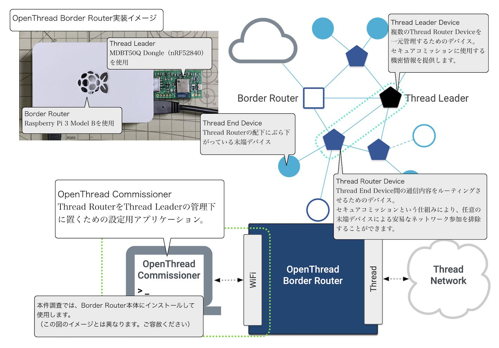

# OpenThread Commissioner導入手順

`OpenThread Commissioner`（以下、本ドキュメントにおいて「ツール」と略します。）をRaspberry Pi 3（以下「ラズパイ」と略します。）にインストールする手順を記載しています。

## 概要

`OpenThread Commissioner`は、Thread Routerデバイスを、Thread Leaderデバイスの管理下に配備（Join）させるために必要となる設定用アプリケーションです。



#### 参考文献

- <b>[OpenThread Commissioner Build and Configuration](https://openthread.io/guides/commissioner/build)</b>

## ビルドの準備

#### ソースコードのダウンロード

GitHubのリポジトリー[`OpenThread Commissioner`](https://github.com/openthread/ot-commissioner)から、ソースコードをダウンロードします。


ラズパイにダウンロードするためには、`git clone https://github.com/openthread/ot-commissioner`を実行します。<br>
以下は実行例になります。

```
pi@raspberrypi:~ $ git clone https://github.com/openthread/ot-commissioner
Cloning into 'ot-commissioner'...
remote: Enumerating objects: 2080, done.
remote: Counting objects: 100% (149/149), done.
remote: Compressing objects: 100% (92/92), done.
remote: Total 2080 (delta 79), reused 103 (delta 51), pack-reused 1931
Receiving objects: 100% (2080/2080), 954.93 KiB | 1.45 MiB/s, done.
Resolving deltas: 100% (1423/1423), done.
pi@raspberrypi:~ $
```

今回の例では、ソースコードはフォルダー`${HOME}/ot-commissioner/`にダウンロードされました。

#### ビルドの準備

`${HOME}/ot-commissioner/script/bootstrap.sh`を実行し、ビルドの準備を行います。<br>
以下は実行例になります。

```
pi@raspberrypi:~ $ cd ot-commissioner
pi@raspberrypi:~/ot-commissioner $ ./script/bootstrap.sh
OS is Linux
取得:1 http://archive.raspberrypi.org/debian buster InRelease [32.7 kB]                                  
取得:2 http://raspbian.raspberrypi.org/raspbian buster InRelease [15.0 kB]
取得:3 http://archive.raspberrypi.org/debian buster/main armhf Packages [376 kB]
取得:4 http://raspbian.raspberrypi.org/raspbian buster/main armhf Packages [13.0 MB]
13.4 MB を 18秒 で取得しました (736 kB/s)                                                                  
パッケージリストを読み込んでいます... 完了
パッケージリストを読み込んでいます... 完了
依存関係ツリーを作成しています                
状態情報を読み取っています... 完了
build-essential はすでに最新バージョン (12.6) です。
libreadline-dev はすでに最新バージョン (7.0-5) です。
cmake はすでに最新バージョン (3.16.3-3~bpo10+1) です。
ninja-build はすでに最新バージョン (1.10.1-1~bpo10+1) です。
以下の追加パッケージがインストールされます:
  libgd-perl swig3.0
：
From https://github.com/nlohmann/json
 * branch            bde57124187c5732c026ffb9357c0491344c45e7 -> FETCH_HEAD
Submodule path 'third_party/json/repo': checked out 'bde57124187c5732c026ffb9357c0491344c45e7'
remote: Total 0 (delta 0), reused 0 (delta 0), pack-reused 0
remote: Enumerating objects: 245, done.
remote: Counting objects: 100% (245/245), done.
remote: Compressing objects: 100% (130/130), done.
remote: Total 131 (delta 110), reused 9 (delta 0), pack-reused 0
Receiving objects: 100% (131/131), 89.08 KiB | 1.51 MiB/s, done.
Resolving deltas: 100% (110/110), completed with 109 local objects.
From https://github.com/libevent/libevent
 * branch            4c908dde58ef780eeefcc9df4db3063ca62ea862 -> FETCH_HEAD
Submodule path 'third_party/libevent/repo': checked out '4c908dde58ef780eeefcc9df4db3063ca62ea862'
remote: Total 0 (delta 0), reused 0 (delta 0), pack-reused 0
remote: Enumerating objects: 969, done.
remote: Counting objects: 100% (969/969), done.
remote: Compressing objects: 100% (491/491), done.
remote: Total 533 (delta 444), reused 70 (delta 40), pack-reused 0
Receiving objects: 100% (533/533), 483.37 KiB | 851.00 KiB/s, done.
Resolving deltas: 100% (444/444), completed with 366 local objects.
From https://github.com/ARMmbed/mbedtls
 * branch            d81c11b8ab61fd5b2da8133aa73c5fe33a0633eb -> FETCH_HEAD
Submodule path 'third_party/mbedtls/repo': checked out 'd81c11b8ab61fd5b2da8133aa73c5fe33a0633eb'
Submodule path 'third_party/mdns/repo': checked out 'a6eb0c5d5ad91f6f834a1c90798e651e0a5c3602'
/home/pi/ot-commissioner
pi@raspberrypi:~/ot-commissioner $ echo $?
0
pi@raspberrypi:~/ot-commissioner $
```

[注1]スクリプト終了時、警告を出力することがありますが、`echo $?`コマンドの戻りが`0`であれば、正常終了と判断します。

## ビルドの実行

#### ビルド対象の生成

`build`ディレクトリー配下で`cmake -DCMAKE_INSTALL_PREFIX=/usr/local -GNinja ..`を実行します。<br>
以下は実行例になります。

```
pi@raspberrypi:~/ot-commissioner $ mkdir build
pi@raspberrypi:~/ot-commissioner $ cd build
pi@raspberrypi:~/ot-commissioner/build $
pi@raspberrypi:~/ot-commissioner/build $ cmake -DCMAKE_INSTALL_PREFIX=/usr/local -GNinja ..
-- The C compiler identification is GNU 8.3.0
-- The CXX compiler identification is GNU 8.3.0
-- Check for working C compiler: /usr/bin/cc
-- Check for working C compiler: /usr/bin/cc -- works
-- Detecting C compiler ABI info
-- Detecting C compiler ABI info - done
-- Detecting C compile features
-- Detecting C compile features - done
-- Check for working CXX compiler: /usr/bin/c++
-- Check for working CXX compiler: /usr/bin/c++ -- works
-- Detecting CXX compiler ABI info
-- Detecting CXX compiler ABI info - done
-- Detecting CXX compile features
-- Detecting CXX compile features - done
fatal: --dirty is incompatible with commit-ishes
-- Version: 0.2.0
Build type: Debug
-- adding GCC/Clang options
-- Version: 6.1.2
-- Build type: Debug
-- CXX_STANDARD: 11
：
--
--         ---( Libevent 2.1.11-stable )---
--
-- Available event backends:
-- CMAKE_BINARY_DIR:         /home/pi/ot-commissioner/build
-- CMAKE_CURRENT_BINARY_DIR: /home/pi/ot-commissioner/build/third_party/libevent/repo
-- CMAKE_SOURCE_DIR:         /home/pi/ot-commissioner
-- CMAKE_CURRENT_SOURCE_DIR: /home/pi/ot-commissioner/third_party/libevent/repo
-- PROJECT_BINARY_DIR:       /home/pi/ot-commissioner/build/third_party/libevent/repo
-- PROJECT_SOURCE_DIR:       /home/pi/ot-commissioner/third_party/libevent/repo
-- CMAKE_MODULE_PATH:        /home/pi/ot-commissioner/third_party/libevent/repo/cmake/
-- CMAKE_COMMAND:            /usr/bin/cmake
-- CMAKE_ROOT:               /usr/share/cmake-3.16
-- CMAKE_SYSTEM:             Linux-5.10.17-v7+
-- CMAKE_SYSTEM_NAME:        Linux
-- CMAKE_SYSTEM_VERSION:     5.10.17-v7+
-- CMAKE_SYSTEM_PROCESSOR:   armv7l
-- CMAKE_SKIP_RPATH:         NO
-- CMAKE_VERBOSE_MAKEFILE:   FALSE
-- CMAKE_C_FLAGS:             -fdiagnostics-color=always -Wall -Wextra -Wno-unused-parameter -Wstrict-aliasing -Wstrict-prototypes -fno-strict-aliasing -Wmissing-prototypes -Winit-self -Wmissing-field-initializers -Wdeclaration-after-statement -Waddress -Wnormalized=id -Woverride-init -Wlogical-op -Wwrite-strings
-- CMAKE_BUILD_TYPE:         Debug
-- CMAKE_C_COMPILER:         /usr/bin/cc (id GNU, clang 0, GNUC 1)
-- CMAKE_AR:                 /usr/bin/ar
-- CMAKE_RANLIB:             /usr/bin/ranlib
--
CMake Warning (dev) at third_party/mbedtls/repo/CMakeLists.txt:5 (project):
  Policy CMP0048 is not set: project() command manages VERSION variables.
  Run "cmake --help-policy CMP0048" for policy details.  Use the cmake_policy
  command to set the policy and suppress this warning.

  The following variable(s) would be set to empty:

    PROJECT_VERSION
    PROJECT_VERSION_MAJOR
    PROJECT_VERSION_MINOR
    PROJECT_VERSION_PATCH
This warning is for project developers.  Use -Wno-dev to suppress it.

-- Found PythonInterp: /usr/bin/python (found version "2.7.16")
-- Found Perl: /usr/bin/perl (found version "5.28.1")
-- Configuring done
-- Generating done
-- Build files have been written to: /home/pi/ot-commissioner/build
pi@raspberrypi:~/ot-commissioner/build $ echo $?
0
pi@raspberrypi:~/ot-commissioner/build $
```

#### ビルドの実行

`build`ディレクトリー配下で`ninja -j1`を実行します。<br>
以下は実行例になります。

```
pi@raspberrypi:~/ot-commissioner/build $ ninja -j1
[3/180] Building CXX object src/app/CMakeFiles/commissioner-app.dir/commissioner_app.cpp.o
：
[29/180] Building CXX object src/library/CMakeFiles/commissioner.dir/coap.cpp.o
[30/180] Building CXX object src/library/CMakeFiles/commissioner.dir/commissioner_impl.cpp.o
：
[180/180] Linking CXX executable tests/commissioner-test
pi@raspberrypi:~/ot-commissioner/build $
pi@raspberrypi:~/ot-commissioner/build $ echo $?
0
pi@raspberrypi:~/ot-commissioner/build $
```

## 動作確認

ツールのユニットテストを実行後、問題がなければインストールを行い、コマンドを単体実行します。

#### ユニットテストの実行

プロジェクトにより、あらかじめ用意されているユニットテストケースを実行します。<br>
以下は実行例になります。

```
pi@raspberrypi:~/ot-commissioner/build $ ./tests/commissioner-test
===============================================================================
All tests passed (388 assertions in 25 test cases)

pi@raspberrypi:~/ot-commissioner/build $
```

#### インストール

`build`ディレクトリー配下で`sudo ninja install`を実行します。<br>
以下は実行例になります。

```
pi@raspberrypi:~/ot-commissioner/build $ sudo ninja install
[0/1] Install the project...
-- Install configuration: "Debug"
-- Installing: /usr/local/etc/commissioner
-- Installing: /usr/local/etc/commissioner/credentials
-- Installing: /usr/local/etc/commissioner/credentials/trust-anchor.pem
-- Installing: /usr/local/etc/commissioner/credentials/certificate.pem
-- Installing: /usr/local/etc/commissioner/credentials/private-key.pem
-- Installing: /usr/local/etc/commissioner/credentials/token.hex
-- Installing: /usr/local/etc/commissioner/ccm-config.json
-- Installing: /usr/local/etc/commissioner/README.md
-- Installing: /usr/local/etc/commissioner/non-ccm-config.json
-- Installing: /usr/local/etc/commissioner/pending-dataset.json
-- Installing: /usr/local/etc/commissioner/active-dataset.json
-- Installing: /usr/local/bin/commissioner-cli
-- Installing: /usr/local/lib/libcommissioner-common.a
-- Installing: /usr/local/lib/libcommissioner.a
-- Installing: /usr/local/lib/libcn-cbor.a
-- Installing: /usr/local/lib/libcose.a
-- Installing: /usr/local/lib/libmdns.a
-- Installing: /usr/local/lib/libmbedtls.a
-- Installing: /usr/local/lib/libmbedx509.a
-- Installing: /usr/local/lib/libmbedcrypto.a
-- Installing: /usr/local/lib/libfmtd.a
-- Installing: /usr/local/lib/libevent_core.a
-- Installing: /usr/local/lib/libevent_pthreads.a
-- Installing: /usr/local/include/commissioner
-- Installing: /usr/local/include/commissioner/error.hpp
-- Installing: /usr/local/include/commissioner/defines.hpp
-- Installing: /usr/local/include/commissioner/network_data.hpp
-- Installing: /usr/local/include/commissioner/commissioner.hpp
-- Installing: /usr/local/bin/commissionerd.py
-- Installing: /usr/local/bin/commissioner_ctl.py
-- Installing: /etc/systemd/system/commissionerd.service
pi@raspberrypi:~/ot-commissioner/build $
```

#### コマンド単体実行

インストールされたコマンドを単体実行します。<br>
以下は実行例になります。

```
pi@raspberrypi:~/ot-commissioner/build $ commissioner-cli -h
usage:
    commissioner-cli <config-file>
pi@raspberrypi:~/ot-commissioner/build $
```

以上で、`OpenThread Commissioner`の導入は完了になります。
