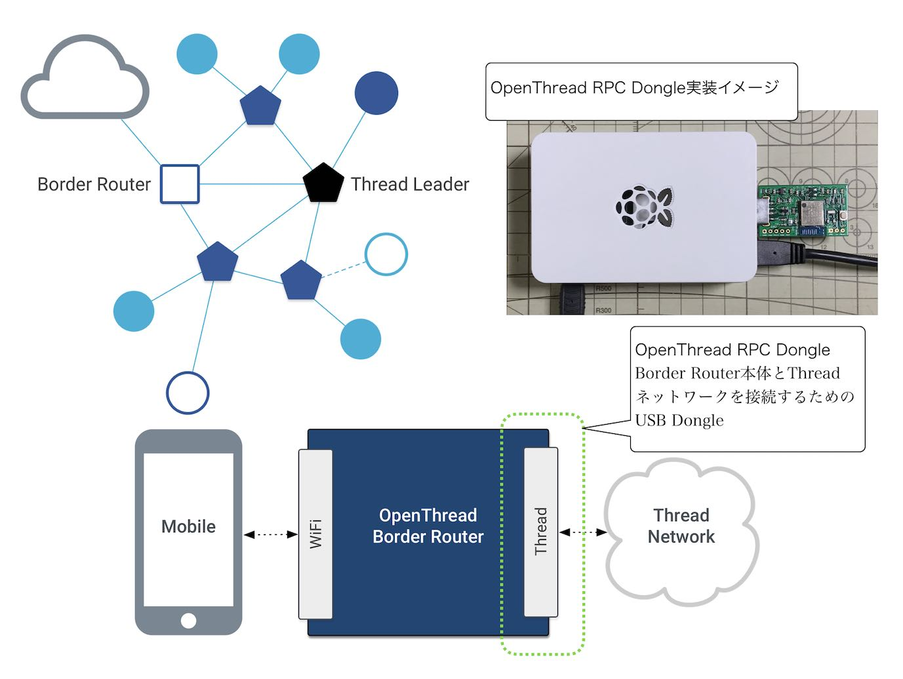
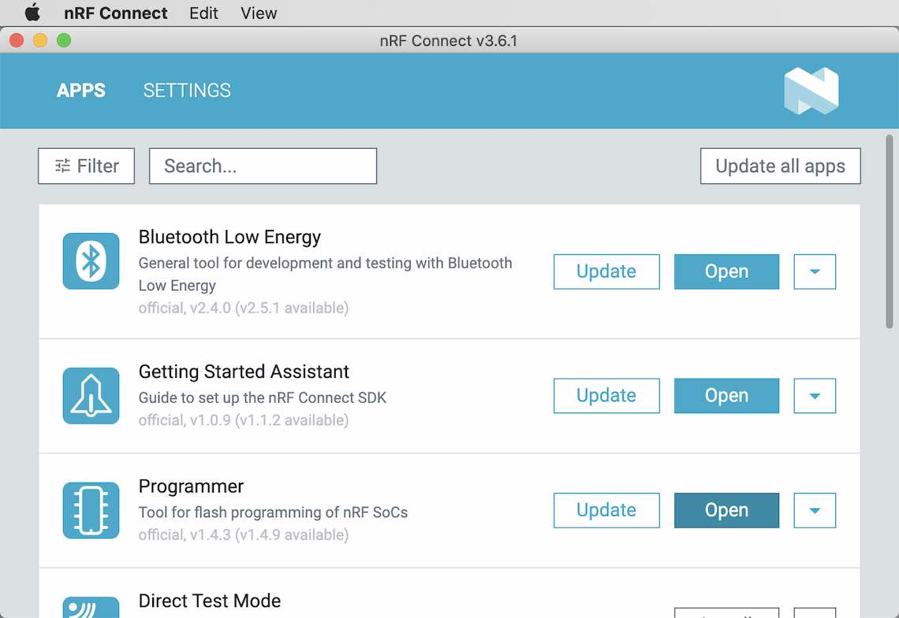
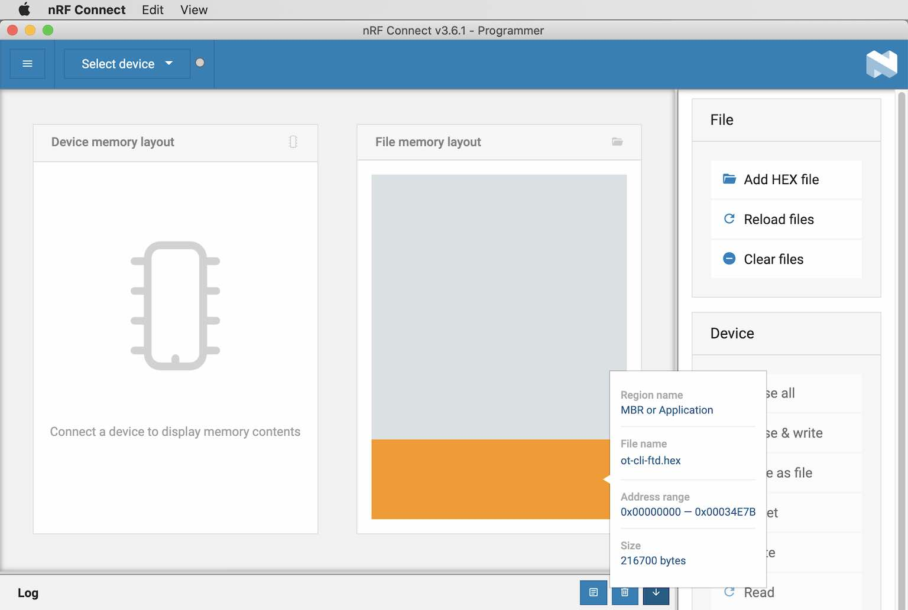
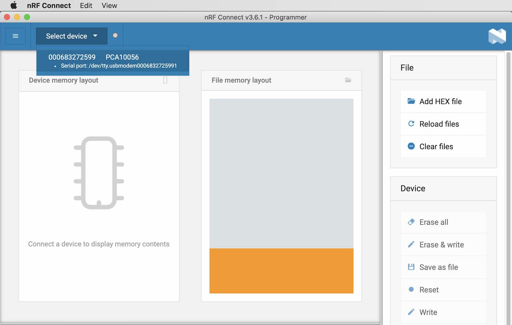

# OpenThread Dongle導入手順

[MDBT50Q Dongle](https://github.com/diverta/onecard-fido/tree/master/FIDO2Device/MDBT50Q_Dongle)を`OpenThread Dongle`として使用する手順について記載しています。

## 概要

`OpenThread Dongle`は、MDBT50Q DongleをThreadネットワークの構成要素として転用させたデバイスです。<br>
本件調査では、下記の３種類を使用します。

|#|デバイス名|説明|備考|
|:---:|:---|:---|:---|
|1|<b>OpenThread RCP Dongle</b>|Thread Leader Deviceとして使用<br>（Radio Co-Processor）|Border Routerのツールで操作|
|2|<b>OpenThread FTD Dongle</b>|Thread Router Deviceとして使用|UART CLIにより操作|
|3|<b>OpenThread MTD Dongle</b>|Thread End Deviceとして使用|UART CLIにより操作|

MDBT50Q Dongle（nRF52840）を`OpenThread Dongle`として利用するためには、以降の手順により「[OpenThreadサンプルアプリケーション](https://github.com/openthread/ot-nrf528xx/blob/main/src/nrf52840/README.md)」をMDBT50Q Dongleに導入する必要があります。

[注1]Threadネットワークの構成要素についての詳細は「[`OpenThread > Guides > Node Roles and Types`](https://openthread.io/guides/thread-primer/node-roles-and-types)」ご参照

#### OpenThread RCP Dongle

`OpenThread RCP Dongle`は、`OpenThread Border Router`とセットで、Threadネットワークを構築するための構成要素です。



下図は`OpenThread RPC Dongle`として[MDBT50Q Dongle](https://github.com/diverta/onecard-fido/tree/master/FIDO2Device/MDBT50Q_Dongle)、`OpenThread Border Router`として[Raspberry Pi 3](../../Research/Matter/OTBRSETUP.md)を使用する構成例です。


## ビルドの準備

#### ソースコードのダウンロード

GitHubのリポジトリー[`OpenThread on Nordic NRF528xx Example`](https://github.com/openthread/ot-nrf528xx)から、ソースコードをダウンロードします。


今回の例では、ソースコードはフォルダー`${HOME}/GitHub/ot-nrf528xx/`にダウンロードされました。

#### ビルドの準備

`${HOME}/GitHub/ot-nrf528xx/script/bootstrap`を実行し、ビルドの準備を行います。<br>
以下は実行例になります。

```
bash-3.2$ cd ${HOME}/GitHub/ot-nrf528xx/
bash-3.2$
bash-3.2$ ./script/bootstrap
++ dirname ./script/bootstrap
+ ./script/../openthread/script/bootstrap
+ main
+ install_packages
+ PM=source
+ command -v apt-get
+ command -v rpm
+ command -v opkg
+ command -v brew
/usr/local/bin/brew
+ PM=brew
+ install_packages_brew
+ echo 'Installing toolchain dependencies...'
Installing toolchain dependencies...
+ brew install automake libtool cmake ninja shfmt shellcheck
Updating Homebrew...
==> Auto-updated Homebrew!
Updated 2 taps (homebrew/core and homebrew/cask).
:
==> Summary
🍺  /usr/local/Cellar/llvm@9/9.0.1_2: 6,839 files, 3.7GB
==> Caveats
==> llvm@9
To use the bundled libc++ please add the following LDFLAGS:
  LDFLAGS="-L/usr/local/opt/llvm@9/lib -Wl,-rpath,/usr/local/opt/llvm@9/lib"

llvm@9 is keg-only, which means it was not symlinked into /usr/local,
because this is an alternate version of another formula.

If you need to have llvm@9 first in your PATH, run:
  echo 'export PATH="/usr/local/opt/llvm@9/bin:$PATH"' >> ~/.zshrc

For compilers to find llvm@9 you may need to set:
  export LDFLAGS="-L/usr/local/opt/llvm@9/lib"
  export CPPFLAGS="-I/usr/local/opt/llvm@9/include"

++ brew --prefix llvm@9
+ sudo ln -s /usr/local/opt/llvm@9/bin/clang-format /usr/local/bin/clang-format-9
Password:
+ python3 -m pip install yapf
Collecting yapf
  Downloading yapf-0.31.0-py2.py3-none-any.whl (185 kB)
     |████████████████████████████████| 185 kB 538 kB/s
Installing collected packages: yapf
Successfully installed yapf-0.31.0
WARNING: You are using pip version 21.0.1; however, version 21.1.2 is available.
You should consider upgrading via the '/usr/local/opt/python@3.9/bin/python3.9 -m pip install --upgrade pip' command.
+ echo 'bootstrap completed successfully.'
bootstrap completed successfully.
bash-3.2$
```

## ファームウェアのビルドと書込み

#### ビルドの実行

プロジェクトディレクトリー配下で`./script/build nrf52840 USB_trans`を実行します。<br>
以下は実行例になります。

```
bash-3.2$ ./script/build nrf52840 USB_trans
+ OT_CMAKE_NINJA_TARGET=
+ NRF_PLATFORMS=(nrf52811 nrf52833 nrf52840)
+ readonly NRF_PLATFORMS
+ NRF_BUILD_TYPES=(UART_trans USB_trans SPI_trans_NCP soft_crypto soft_crypto_threading)
+ readonly NRF_BUILD_TYPES
++ pwd
+ readonly OT_SRCDIR=/Users/makmorit/GitHub/ot-nrf528xx
+ OT_SRCDIR=/Users/makmorit/GitHub/ot-nrf528xx
+ OT_OPTIONS=("-DCMAKE_BUILD_TYPE=MinSizeRel" "-DOT_PLATFORM=external" "-DOT_SLAAC=ON")
+ readonly OT_OPTIONS
+ main nrf52840 USB_trans
+ [[ 2 == 0 ]]
+ local platform=nrf52840
+ echo nrf52811 nrf52833 nrf52840
+ grep -wq nrf52840
+ [[ 2 == 1 ]]
+ local nrf_build_type=USB_trans
+ echo UART_trans USB_trans SPI_trans_NCP soft_crypto soft_crypto_threading
+ grep -wq USB_trans
+ shift
+ shift
+ local_options=()
+ local local_options
+ options=("${OT_OPTIONS[@]}")
+ local options
+ case "${platform}" in
+ local_options+=("-DCMAKE_TOOLCHAIN_FILE=src/${platform}/arm-none-eabi.cmake")
+ case "${nrf_build_type}" in
+ options+=("${local_options[@]}" "-DOT_USB=ON" "-DOT_EXTERNAL_MBEDTLS=nordicsemi-mbedtls")
+ options+=("$@")
+ build -DNRF_PLATFORM=nrf52840 -DCMAKE_BUILD_TYPE=MinSizeRel -DOT_PLATFORM=external -DOT_SLAAC=ON -DCMAKE_TOOLCHAIN_FILE=src/nrf52840/arm-none-eabi.cmake -DOT_USB=ON -DOT_EXTERNAL_MBEDTLS=nordicsemi-mbedtls
+ local builddir=build
+ mkdir -p build
+ cd build
+ cmake -GNinja -DOT_COMPILE_WARNING_AS_ERROR=ON -DNRF_PLATFORM=nrf52840 -DCMAKE_BUILD_TYPE=MinSizeRel -DOT_PLATFORM=external -DOT_SLAAC=ON -DCMAKE_TOOLCHAIN_FILE=src/nrf52840/arm-none-eabi.cmake -DOT_USB=ON -DOT_EXTERNAL_MBEDTLS=nordicsemi-mbedtls /Users/makmorit/GitHub/ot-nrf528xx
-- The C compiler identification is GNU 9.2.1
-- The CXX compiler identification is GNU 9.2.1
-- Detecting C compiler ABI info
-- Detecting C compiler ABI info - done
-- Check for working C compiler: /usr/local/bin/arm-none-eabi-gcc - skipped
-- Detecting C compile features
-- Detecting C compile features - done
-- Detecting CXX compiler ABI info
-- Detecting CXX compiler ABI info - done
-- Check for working CXX compiler: /usr/local/bin/arm-none-eabi-g++ - skipped
-- Detecting CXX compile features
-- Detecting CXX compile features - done
-- OpenThread Source Directory: /Users/makmorit/GitHub/ot-nrf528xx/openthread
-- OpenThread CMake build type: MinSizeRel
-- Package Name: OPENTHREAD
-- Setting default package version: 0.01.00
-- Package Version: 0.01.00
-- Configuring done
-- Generating done
-- Build files have been written to: /Users/makmorit/GitHub/ot-nrf528xx/build
+ [[ -n '' ]]
+ ninja
[23/620] cd /Users/makmorit/GitHub/ot-nrf528xx/build/opent...kmorit/GitHub/ot-nrf528xx/openthread/etc/cmake/print.cmake
OPENTHREAD_CONFIG_ASSERT_ENABLE=1
OPENTHREAD_CONFIG_BACKBONE_ROUTER_DUA_NDPROXYING_ENABLE=0
OPENTHREAD_CONFIG_BACKBONE_ROUTER_MULTICAST_ROUTING_ENABLE=0
OPENTHREAD_CONFIG_ENABLE_BUILTIN_MBEDTLS=0
OPENTHREAD_CONFIG_ENABLE_BUILTIN_MBEDTLS_MANAGEMENT=1
OPENTHREAD_CONFIG_PING_SENDER_ENABLE=1
OPENTHREAD_CONFIG_IP6_SLAAC_ENABLE=1
OPENTHREAD_SPINEL_CONFIG_RCP_RESTORATION_MAX_COUNT=0
PACKAGE_NAME=OPENTHREAD
PACKAGE_VERSION=0.01.00
OPENTHREAD_CONFIG_THREAD_VERSION=OT_THREAD_VERSION_1_2
OPENTHREAD_CONFIG_NCP_HDLC_ENABLE=1
OPENTHREAD_CONFIG_FILE=openthread-core-nrf52840-config.h
OPENTHREAD_PROJECT_CORE_CONFIG_FILE=openthread-core-nrf52840-config.h
OPENTHREAD_CORE_CONFIG_PLATFORM_CHECK_FILE=openthread-core-nrf52840-config-check.h
MBEDTLS_USER_CONFIG_FILE=nrf52840-mbedtls-config.h
USB_CDC_AS_SERIAL_TRANSPORT=1
OPENTHREAD_CORE_CONFIG_PLATFORM_CHECK_FILE=openthread-core-nrf52840-config-check.h
MBEDTLS_CONFIG_FILE=nrf-config.h
[620/620] Linking CXX executable bin/ot-ncp-ftd
+ cd /Users/makmorit/GitHub/ot-nrf528xx
bash-3.2$
```

#### 書込用ファームウェアの作成

ビルドにより、`build/bin/`配下に生成されたファームウェアイメージ（３点）を、`.hex`形式に変換します。

|#|ファイル名|説明|変換後ファイル名|
|:---:|:---|:---|:---|
|1|`ot-rcp`|OpenThread RCP Dongle用ファームウェア|`ot-rcp.hex`|
|2|`ot-cli-ftd`|OpenThread FTD Dongle用ファームウェア|`ot-cli-ftd.hex`|
|3|`ot-cli-mtd`|OpenThread MTD Dongle用ファームウェア|`ot-cli-mtd.hex`|


以下は実行例になります。

```
bash-3.2$ cd ${HOME}/GitHub/ot-nrf528xx
bash-3.2$ ls -al build/bin/
total 9192
drwxr-xr-x   7 makmorit  staff      224  6  1 10:38 .
drwxr-xr-x  19 makmorit  staff      608  6  1 14:12 ..
-rwxr-xr-x   1 makmorit  staff  1190220  6  1 10:38 ot-cli-ftd
-rwxr-xr-x   1 makmorit  staff  1059404  6  1 10:38 ot-cli-mtd
-rwxr-xr-x   1 makmorit  staff  1132120  6  1 10:38 ot-ncp-ftd
-rwxr-xr-x   1 makmorit  staff  1070840  6  1 10:38 ot-ncp-mtd
-rwxr-xr-x   1 makmorit  staff   242592  6  1 10:38 ot-rcp
bash-3.2$
bash-3.2$
bash-3.2$ arm-none-eabi-objcopy -O ihex build/bin/ot-rcp ot-rcp.hex
bash-3.2$ arm-none-eabi-objcopy -O ihex build/bin/ot-cli-ftd ot-cli-ftd.hex
bash-3.2$ arm-none-eabi-objcopy -O ihex build/bin/ot-cli-mtd ot-cli-mtd.hex
bash-3.2$
bash-3.2$ ls -al *.hex
-rw-r--r--  1 makmorit  staff  925136  6  2 10:33 ot-cli-ftd.hex
-rw-r--r--  1 makmorit  staff  748989  6  2 10:33 ot-cli-mtd.hex
-rw-r--r--  1 makmorit  staff  173268  6  2 10:33 ot-rcp.hex
bash-3.2$
```

#### ファームウェアの書込み

前述の書込用ファームウェア（`ot-xxx.hex`）を、それぞれMDBT50Q Dongleに書込みます。<br>
[nRF Connectツール](../../nRF52840_app/NRFCONNECTINST.md)を使用して書込みすると便利です。

nRF Connectツールのアプリ「Programmer」を起動します。



「Programmer」が起動したら、右側のエリアに`.hex`ファイルをドラッグ＆ドロップして配置します。<br>
下図は`ot-cli-ftd.hex`を右側のエリアに配置したところです。



画面左上部のプルダウンリストから「PCA10056」を選択します。



書込み用のnRF52840 DKに接続されます。<br>
その後、画面右下部の「Write」ボタンをクリックし、書込みを開始させます。


書込みが完了すると、左側のエリアに書込みイメージが表示されます。<br>
画面左上部のプルダウンリストから「Close Device」を選択し、nRF52840 DKから切断します。


メニューの「Quit」を選択して、nRF Connectツールを終了させます。


以上で、ファームウェアの書込みは完了です。

nRF Connectツール・nRF52840 DKを使用した、MDBT50Q Dongleへのファームウェア書込みについての詳細（機器配線方法、etc）は「[USBブートローダー書込み手順書](../../nRF52840_app/firmwares/secure_bootloader/WRITESBL.md)」[注1]を参考にしてください。

[注1]`ot-xxx.hex`書き込みの際は、ソフトデバイス`s140_nrf52_7.2.0_softdevice.hex`の追加指定は不要です。
