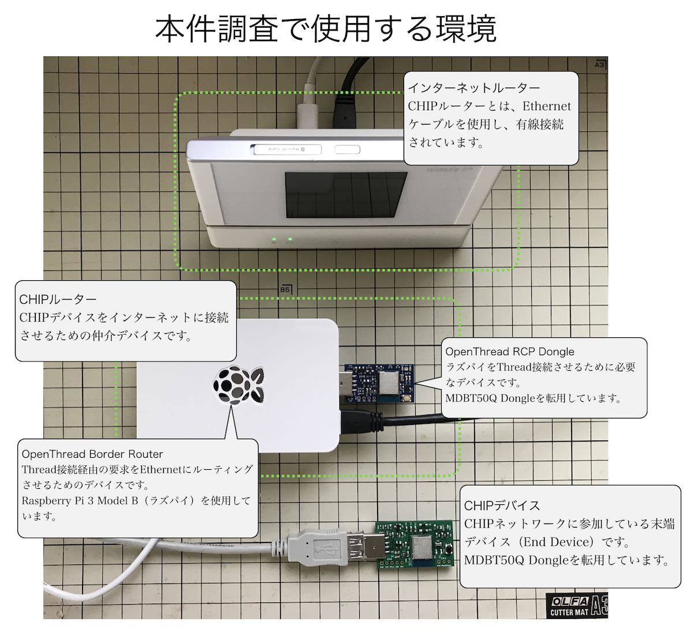

# 【WIP】サンプルThreadネットワーク構築手順

`OpenThread Commissioner`（以下、本ドキュメントにおいて「コミッショナーツール」と略します。）と`OpenThread CLI`（以下「CLIツール」と略します。）を使用し、サンプルのThreadネットワークを構築する手順を記載しています。

## 概要

この例では、３点のMDBT50Q Dongleを使用し、下図のようなThreadネットワークを構築します。

#### 参考文献

- <b>[OpenThread Border Router](https://openthread.io/codelabs/openthread-border-router)</b>

- <b>[External Thread Commissioning](https://openthread.io/guides/border-router/external-commissioning?comm=ot-commissioner)</b>
