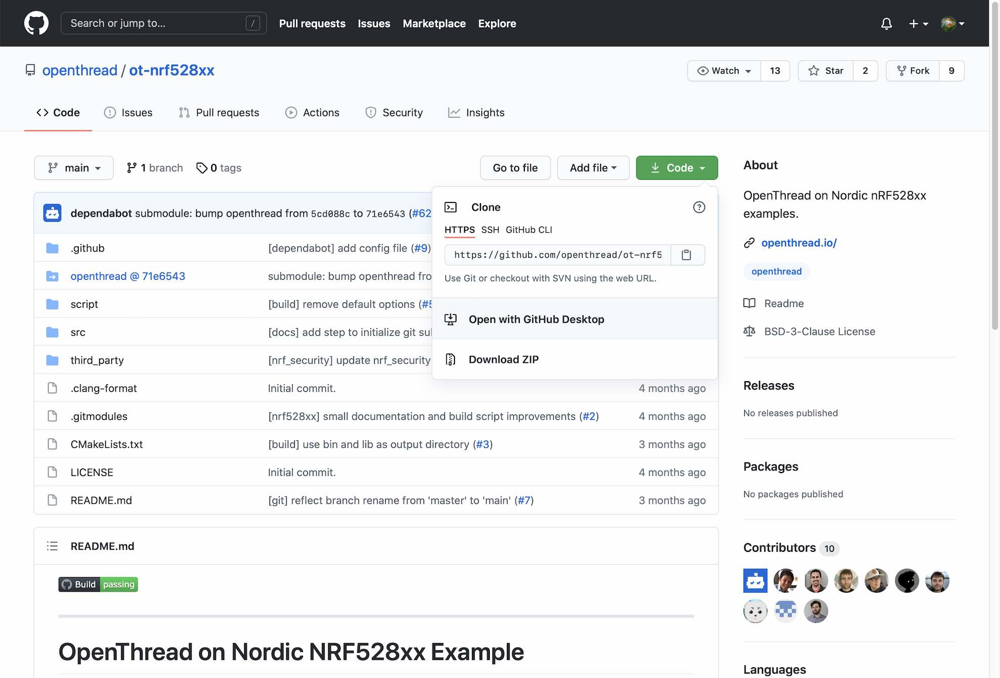
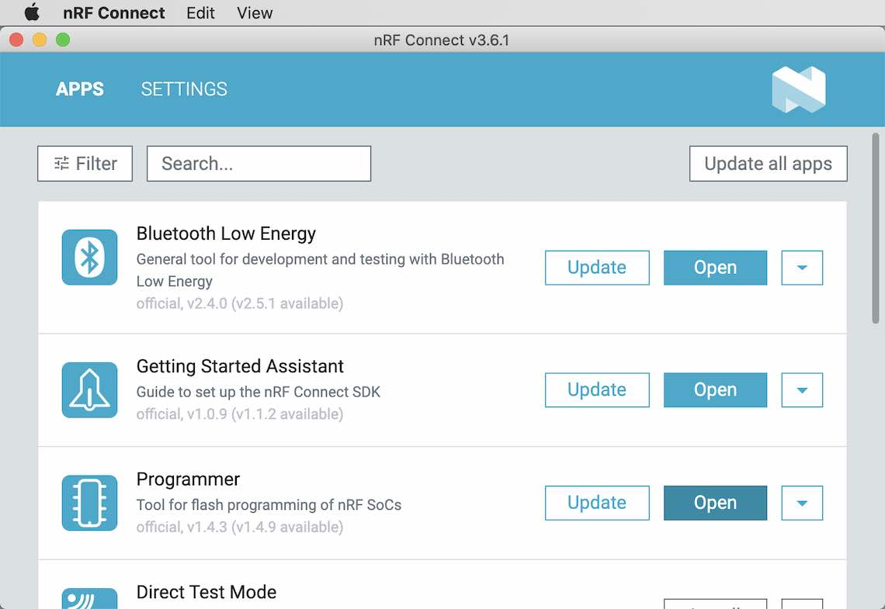
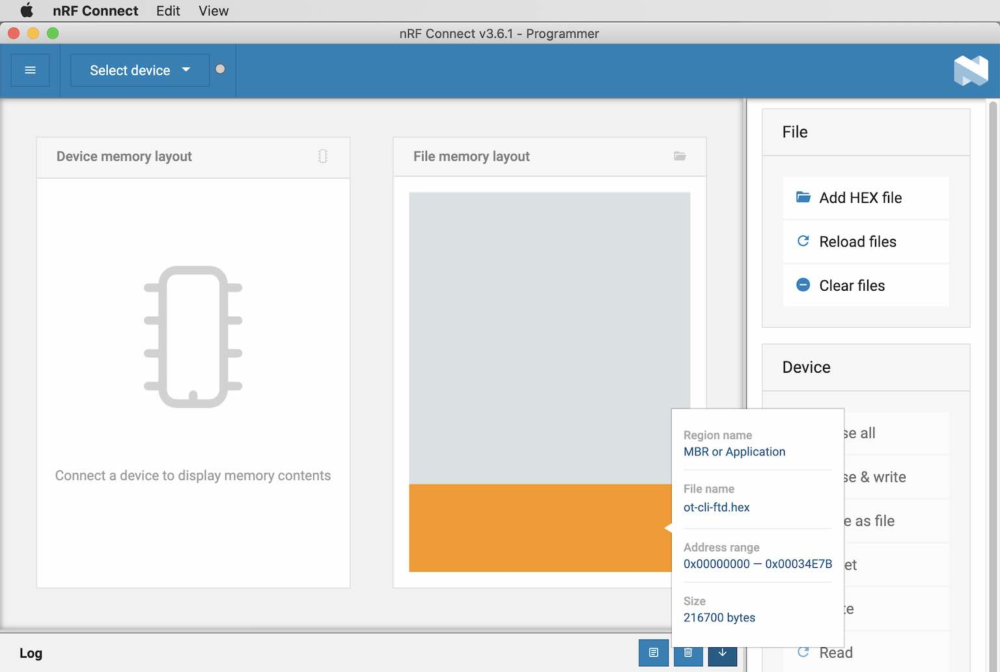
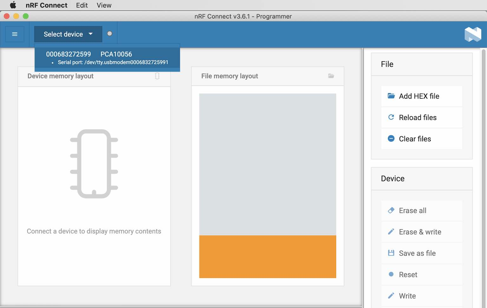
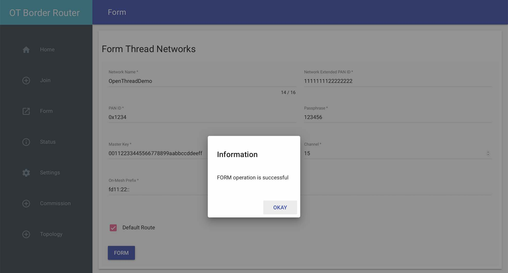
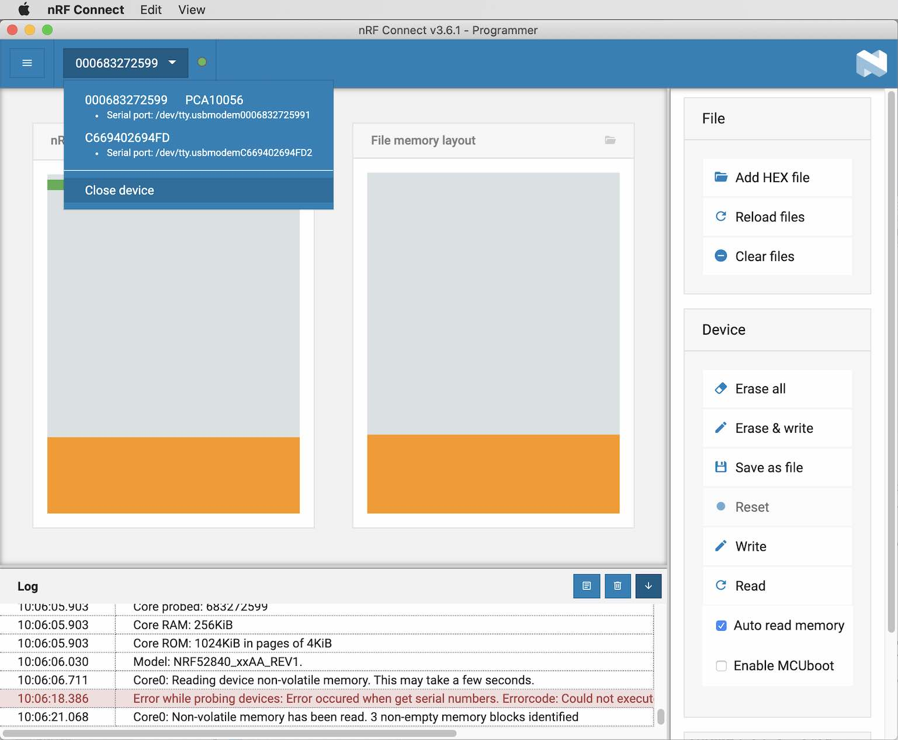
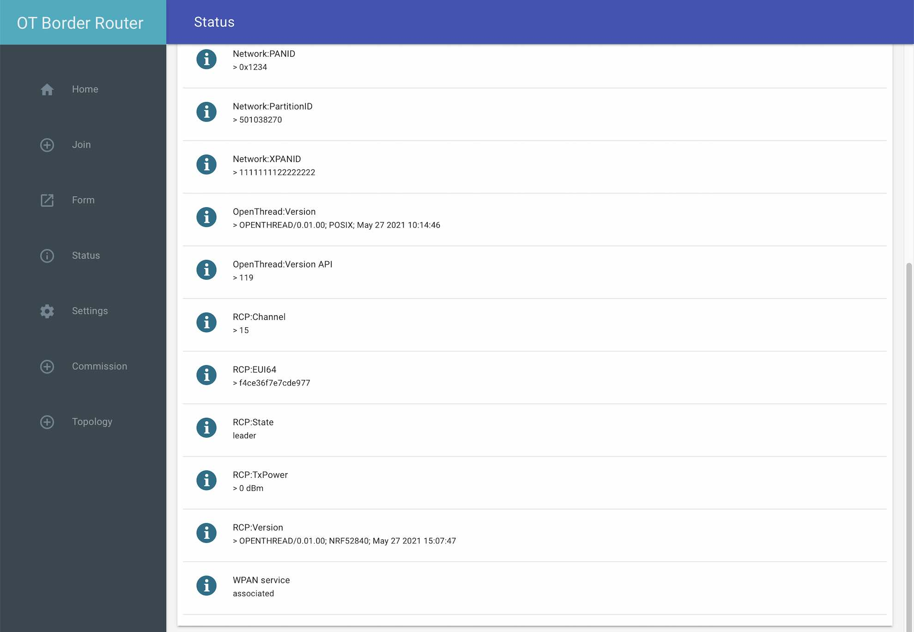

# OpenThread RPC Dongle導入手順

サンプルアプリ[`CHIP nRF Connect Lock Example Application`](https://github.com/project-chip/connectedhomeip/blob/master/examples/lock-app/nrfconnect/README.md)を使って動作確認する際、Threadネットワークの相手側となる`OpenThread RPC Dongle`を導入する手順について記載しています。

## 概要

`OpenThread RPC Dongle`は、`OpenThread Border Router`とセットで、Threadネットワークを構築するための構成要素です。


本件調査では、`OpenThread RPC Dongle`として[MDBT50Q Dongle](https://github.com/diverta/onecard-fido/tree/master/FIDO2Device/MDBT50Q_Dongle)、`OpenThread Border Router`として[Raspberry Pi 3](../../Research/Matter/OTBRSETUP.md)を使用したいと思います。


MDBT50Q Dongle（nRF52840）を`OpenThread RPC Dongle`として利用するためには、以降の手順により「[OpenThread RCPアプリケーション](https://github.com/openthread/ot-nrf528xx/blob/main/src/nrf52840/README.md)」をMDBT50Q Dongleに導入する必要があります。

## ビルドの準備

#### ソースコードのダウンロード

GitHubのリポジトリー[`OpenThread on Nordic NRF528xx Example`](https://github.com/openthread/ot-nrf528xx)から、ソースコードをダウンロードします。



今回の例では、ソースコードはフォルダー`${HOME}/GitHub/ot-nrf528xx/`にダウンロードされました。

#### ビルドの準備

`${HOME}/GitHub/ot-nrf528xx/script/bootstrap`を実行し、ビルドの準備を行います。<br>
以下は実行例になります。

```
bash-3.2$ cd ${HOME}/GitHub/ot-nrf528xx/
bash-3.2$
bash-3.2$ ./script/bootstrap
++ dirname ./script/bootstrap
+ ./script/../openthread/script/bootstrap
+ main
+ install_packages
+ PM=source
+ command -v apt-get
+ command -v rpm
+ command -v opkg
+ command -v brew
/usr/local/bin/brew
+ PM=brew
+ install_packages_brew
+ echo 'Installing toolchain dependencies...'
Installing toolchain dependencies...
+ brew install automake libtool cmake ninja shfmt shellcheck
Updating Homebrew...
==> Auto-updated Homebrew!
Updated 2 taps (homebrew/core and homebrew/cask).
:
==> Summary
🍺  /usr/local/Cellar/llvm@9/9.0.1_2: 6,839 files, 3.7GB
==> Caveats
==> llvm@9
To use the bundled libc++ please add the following LDFLAGS:
  LDFLAGS="-L/usr/local/opt/llvm@9/lib -Wl,-rpath,/usr/local/opt/llvm@9/lib"

llvm@9 is keg-only, which means it was not symlinked into /usr/local,
because this is an alternate version of another formula.

If you need to have llvm@9 first in your PATH, run:
  echo 'export PATH="/usr/local/opt/llvm@9/bin:$PATH"' >> ~/.zshrc

For compilers to find llvm@9 you may need to set:
  export LDFLAGS="-L/usr/local/opt/llvm@9/lib"
  export CPPFLAGS="-I/usr/local/opt/llvm@9/include"

++ brew --prefix llvm@9
+ sudo ln -s /usr/local/opt/llvm@9/bin/clang-format /usr/local/bin/clang-format-9
Password:
+ python3 -m pip install yapf
Collecting yapf
  Downloading yapf-0.31.0-py2.py3-none-any.whl (185 kB)
     |████████████████████████████████| 185 kB 538 kB/s
Installing collected packages: yapf
Successfully installed yapf-0.31.0
WARNING: You are using pip version 21.0.1; however, version 21.1.2 is available.
You should consider upgrading via the '/usr/local/opt/python@3.9/bin/python3.9 -m pip install --upgrade pip' command.
+ echo 'bootstrap completed successfully.'
bootstrap completed successfully.
bash-3.2$
```

## ファームウェアのビルドと書込み

#### ビルドの実行

プロジェクトディレクトリー配下で`./script/build nrf52840 USB_trans`を実行します。<br>
以下は実行例になります。

```
bash-3.2$ ./script/build nrf52840 USB_trans
+ OT_CMAKE_NINJA_TARGET=
+ NRF_PLATFORMS=(nrf52811 nrf52833 nrf52840)
+ readonly NRF_PLATFORMS
+ NRF_BUILD_TYPES=(UART_trans USB_trans SPI_trans_NCP soft_crypto soft_crypto_threading)
+ readonly NRF_BUILD_TYPES
++ pwd
+ readonly OT_SRCDIR=/Users/makmorit/GitHub/ot-nrf528xx
+ OT_SRCDIR=/Users/makmorit/GitHub/ot-nrf528xx
+ OT_OPTIONS=("-DCMAKE_BUILD_TYPE=MinSizeRel" "-DOT_PLATFORM=external" "-DOT_SLAAC=ON")
+ readonly OT_OPTIONS
+ main nrf52840 USB_trans
+ [[ 2 == 0 ]]
+ local platform=nrf52840
+ echo nrf52811 nrf52833 nrf52840
+ grep -wq nrf52840
+ [[ 2 == 1 ]]
+ local nrf_build_type=USB_trans
+ echo UART_trans USB_trans SPI_trans_NCP soft_crypto soft_crypto_threading
+ grep -wq USB_trans
+ shift
+ shift
+ local_options=()
+ local local_options
+ options=("${OT_OPTIONS[@]}")
+ local options
+ case "${platform}" in
+ local_options+=("-DCMAKE_TOOLCHAIN_FILE=src/${platform}/arm-none-eabi.cmake")
+ case "${nrf_build_type}" in
+ options+=("${local_options[@]}" "-DOT_USB=ON" "-DOT_EXTERNAL_MBEDTLS=nordicsemi-mbedtls")
+ options+=("$@")
+ build -DNRF_PLATFORM=nrf52840 -DCMAKE_BUILD_TYPE=MinSizeRel -DOT_PLATFORM=external -DOT_SLAAC=ON -DCMAKE_TOOLCHAIN_FILE=src/nrf52840/arm-none-eabi.cmake -DOT_USB=ON -DOT_EXTERNAL_MBEDTLS=nordicsemi-mbedtls
+ local builddir=build
+ mkdir -p build
+ cd build
+ cmake -GNinja -DOT_COMPILE_WARNING_AS_ERROR=ON -DNRF_PLATFORM=nrf52840 -DCMAKE_BUILD_TYPE=MinSizeRel -DOT_PLATFORM=external -DOT_SLAAC=ON -DCMAKE_TOOLCHAIN_FILE=src/nrf52840/arm-none-eabi.cmake -DOT_USB=ON -DOT_EXTERNAL_MBEDTLS=nordicsemi-mbedtls /Users/makmorit/GitHub/ot-nrf528xx
-- The C compiler identification is GNU 9.2.1
-- The CXX compiler identification is GNU 9.2.1
-- Detecting C compiler ABI info
-- Detecting C compiler ABI info - done
-- Check for working C compiler: /usr/local/bin/arm-none-eabi-gcc - skipped
-- Detecting C compile features
-- Detecting C compile features - done
-- Detecting CXX compiler ABI info
-- Detecting CXX compiler ABI info - done
-- Check for working CXX compiler: /usr/local/bin/arm-none-eabi-g++ - skipped
-- Detecting CXX compile features
-- Detecting CXX compile features - done
-- OpenThread Source Directory: /Users/makmorit/GitHub/ot-nrf528xx/openthread
-- OpenThread CMake build type: MinSizeRel
-- Package Name: OPENTHREAD
-- Setting default package version: 0.01.00
-- Package Version: 0.01.00
-- Configuring done
-- Generating done
-- Build files have been written to: /Users/makmorit/GitHub/ot-nrf528xx/build
+ [[ -n '' ]]
+ ninja
[23/620] cd /Users/makmorit/GitHub/ot-nrf528xx/build/opent...kmorit/GitHub/ot-nrf528xx/openthread/etc/cmake/print.cmake
OPENTHREAD_CONFIG_ASSERT_ENABLE=1
OPENTHREAD_CONFIG_BACKBONE_ROUTER_DUA_NDPROXYING_ENABLE=0
OPENTHREAD_CONFIG_BACKBONE_ROUTER_MULTICAST_ROUTING_ENABLE=0
OPENTHREAD_CONFIG_ENABLE_BUILTIN_MBEDTLS=0
OPENTHREAD_CONFIG_ENABLE_BUILTIN_MBEDTLS_MANAGEMENT=1
OPENTHREAD_CONFIG_PING_SENDER_ENABLE=1
OPENTHREAD_CONFIG_IP6_SLAAC_ENABLE=1
OPENTHREAD_SPINEL_CONFIG_RCP_RESTORATION_MAX_COUNT=0
PACKAGE_NAME=OPENTHREAD
PACKAGE_VERSION=0.01.00
OPENTHREAD_CONFIG_THREAD_VERSION=OT_THREAD_VERSION_1_2
OPENTHREAD_CONFIG_NCP_HDLC_ENABLE=1
OPENTHREAD_CONFIG_FILE=openthread-core-nrf52840-config.h
OPENTHREAD_PROJECT_CORE_CONFIG_FILE=openthread-core-nrf52840-config.h
OPENTHREAD_CORE_CONFIG_PLATFORM_CHECK_FILE=openthread-core-nrf52840-config-check.h
MBEDTLS_USER_CONFIG_FILE=nrf52840-mbedtls-config.h
USB_CDC_AS_SERIAL_TRANSPORT=1
OPENTHREAD_CORE_CONFIG_PLATFORM_CHECK_FILE=openthread-core-nrf52840-config-check.h
MBEDTLS_CONFIG_FILE=nrf-config.h
[620/620] Linking CXX executable bin/ot-ncp-ftd
+ cd /Users/makmorit/GitHub/ot-nrf528xx
bash-3.2$
```

#### 書込用ファームウェアの作成

ビルドにより生成されたファームウェアイメージ`build/bin/ot-rcp`を、`.hex`形式に変換します。<br>
以下は実行例になります。

```
bash-3.2$ ls -al build/bin/
total 5032
drwxr-xr-x   7 makmorit  staff     224  5 27 15:07 .
drwxr-xr-x  18 makmorit  staff     576  5 27 15:07 ..
-rwxr-xr-x   1 makmorit  staff  666532  5 27 15:07 ot-cli-ftd
-rwxr-xr-x   1 makmorit  staff  503488  5 27 15:07 ot-cli-mtd
-rwxr-xr-x   1 makmorit  staff  642220  5 27 15:07 ot-ncp-ftd
-rwxr-xr-x   1 makmorit  staff  515112  5 27 15:07 ot-ncp-mtd
-rwxr-xr-x   1 makmorit  staff  242592  5 27 15:07 ot-rcp
bash-3.2$
bash-3.2$ arm-none-eabi-objcopy -O ihex build/bin/ot-rcp ot-rcp.hex
bash-3.2$
bash-3.2$ ls -al
total 384
drwxr-xr-x  15 makmorit  staff     480  5 27 15:09 .
drwxr-xr-x  13 makmorit  staff     416  5 27 14:34 ..
：
drwxr-xr-x  18 makmorit  staff     576  5 27 15:07 build
drwxr-xr-x  34 makmorit  staff    1088  5 27 14:37 openthread
-rw-r--r--   1 makmorit  staff  173133  5 27 15:09 ot-rcp.hex
drwxr-xr-x   6 makmorit  staff     192  5 27 14:35 script
drwxr-xr-x   8 makmorit  staff     256  5 27 14:35 src
drwxr-xr-x   5 makmorit  staff     160  5 27 14:35 third_party
bash-3.2$
```

#### ファームウェアの書込み

前述の書込用ファームウェア（`ot-rcp.hex`）を、MDBT50Q Dongleに書込みます。<br>
[nRF Connectツール](../../nRF52840_app/NRFCONNECTINST.md)を使用して書込みすると便利です。

nRF Connectツール・nRF52840 DKを使用した、MDBT50Q Dongleへのファームウェア書込みについての具体的な手順は、「[USBブートローダー書込み手順書](../../nRF52840_app/firmwares/secure_bootloader/WRITESBL.md)」[注1]を参考にしてください。

[注1]`ot-rcp.hex`書き込みの際は、ソフトデバイス`s140_nrf52_7.2.0_softdevice.hex`の追加指定は不要です。

## ファームウェアの動作確認

ファームウェアの書込みが完了したMDBT50Q Dongleを、`OpenThread Border Router`となるラズパイのUSBポートに装着し、Threadネットワーク設定と、その動作確認を行います。

#### Threadネットワーク設定

任意の端末から、Webブラウザーで`OT Border Router`ページを表示します。<br>
Chromeブラウザーを使用する場合は、`OpenThread Border Router`のIPアドレスをそのままURL欄に入力して[Enter]を押下します。

ブラウザーに`OT Border Router`ページが表示されます。<br>
画面左側にある「`Form`」のリンクをクリックします。



「`Form Thread Networks`」ページが表示されます。<br>
入力内容に変更を加えず、画面下部の「`Form`」ボタンをクリックします。



下図のようなポップアップが表示されるので「`OKAY`」をクリックします。



下図のようなポップアップが表示されたら、Threadネットワーク設定は完了になります。<br>
「`OKAY`」をクリックします。



#### 動作確認

`OpenThread Border Router`に装着されたMDBT50Q Dongleが、`OpenThread RPC Dongle`として動作しているか確認します。<br>
`OT Border Router`ページの画面左側にある「`Status`」のリンクをクリックすると、下図のような「`Get Status`」画面に遷移します。



「`Get Status`」画面を下にスクロールします。<br>
「`RCP:Version`」欄に「`OPENTHREAD/0.01.00; NRF52840; mmm dd yyyy HH:MM:SS`」と表示されていることを確認します。<br>
（`mmm dd yyyy HH:MM:SS`＝ファームウェア作成時刻）



以上で、`OpenThread RPC Dongle`の導入は完了です。
