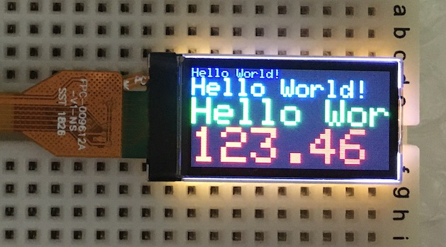

# TFTライブラリーの解析

最新更新日：2022/5/23

## 概要

超小型TFTディスプレイをArduino UNOに接続するためのライブラリーについて、解析を行います。

## 初期処理

`Adafruit_ST7735`というオブジェクトを初期化する部分になります。

```
#include <Adafruit_GFX.h>    // Core graphics library
#include <Adafruit_ST7735.h> // Hardware-specific library for ST7735
#include <Adafruit_ST7789.h> // Hardware-specific library for ST7789
#include <SPI.h>

#define TFT_CS        10
#define TFT_RST        9 // Or set to -1 and connect to Arduino RESET pin
#define TFT_DC         8

// OPTION 1 (recommended) is to use the HARDWARE SPI pins, which are unique
// to each board and not reassignable. For Arduino Uno: MOSI = pin 11 and
// SCLK = pin 13. This is the fastest mode of operation and is required if
// using the breakout board's microSD card.

// For 1.44" and 1.8" TFT with ST7735 use:
Adafruit_ST7735 tft = Adafruit_ST7735(TFT_CS, TFT_DC, TFT_RST);
```

#### ピン接続
前述のコード（デフォルト設定）の場合、TFT〜Arduino UNO間の配線は以下になります。

|TFT||Arduino UNO|説明|
|:--|:--:|:--|:--|
|#1（LEDA）|<--|3.3V|LEDバックライト電圧入力|
|#2（GND）|<--|GND|0V|
|#3（RESET）|<--|D9|TFTのリセット|
|#4（D/C）|<--|D8|データ／コマンド切替え|
|#5（SDA）|<--|D11（MOSI）|データ入力|
|#6（SCL）|<--|D13（SCLK）|クロック入力|
|#7（VDD）|<--|3.3V|動作電圧入力|
|#8（CS）|<--|D10（CS）|TFT通信開始|

#### オブジェクト生成

オブジェクト生成時の引数は、CS／DC／RESETピンを引数とします。

```
Adafruit_ST7735 tft = Adafruit_ST7735(TFT_CS, TFT_DC, TFT_RST);
```

コードは以下のようになっています。
```
Adafruit_ST7735::Adafruit_ST7735(int8_t cs, int8_t dc, int8_t rst)
    : Adafruit_ST77xx(ST7735_TFTWIDTH_128, ST7735_TFTHEIGHT_160, cs, dc, rst) {}
```

## setup関数

```
void setup(void) {
  Serial.begin(9600);
  Serial.print(F("Hello! ST77xx TFT Test"));

  // use this initializer (uncomment) if using a 0.96" 160x80 TFT:
  tft.initR(INITR_MINI160x80);  // Init ST7735S mini display

  Serial.println(F("Initialized"));

  uint16_t time = millis();
  tft.fillScreen(ST77XX_BLACK);
  time = millis() - time;

  Serial.println(time, DEC);
  delay(500);

  // tft print function!
  tftPrintTest();
  delay(4000);

  Serial.println("done");
  delay(1000);
}
```

#### initR関数
`Adafruit-ST7735-Library/Adafruit_ST7735.cpp`内のコードです。<br>
前半では、コマンドセット`Rcmd1`、`Rcmd2green160x80`、`Rcmd3`を実行します（詳細は後述）。

```
#define INITR_MINI160x80 0x04
:
void Adafruit_ST7735::initR(uint8_t options) {
  commonInit(Rcmd1);
  if (options == INITR_GREENTAB) {
  :
  } else if (options == INITR_MINI160x80) {
    _height = ST7735_TFTWIDTH_80;
    _width = ST7735_TFTHEIGHT_160;
    displayInit(Rcmd2green160x80);
    _colstart = 24;
    _rowstart = 0;
  :
  }
  displayInit(Rcmd3);

  // Black tab, change MADCTL color filter
  if ((options == INITR_BLACKTAB) || (options == INITR_MINI160x80)) {
    uint8_t data = 0xC0;
    sendCommand(ST77XX_MADCTL, &data, 1);
  }

  if (options == INITR_HALLOWING) {
  :
  } else {
    tabcolor = options;
    setRotation(0);
  }
}
```

#### commonInit関数
`Adafruit-ST7735-Library/Adafruit_ST77xx.cpp`内のコードです。<br>
コマンドセット`Rcmd1`を実行します。

```
#define SPI_DEFAULT_FREQ 32000000 ///< Default SPI data clock frequency

#define ST77XX_INVOFF 0x20
#define ST77XX_INVON 0x21
:
protected:
  uint8_t _colstart = 0,   ///< Some displays need this changed to offset
      _rowstart = 0,       ///< Some displays need this changed to offset
      spiMode = SPI_MODE0; ///< Certain display needs MODE3 instead

void Adafruit_ST77xx::commonInit(const uint8_t *cmdList) {
  begin();

  if (cmdList) {
    displayInit(cmdList);
  }
}

void Adafruit_ST77xx::begin(uint32_t freq) {
  if (!freq) {
    freq = SPI_DEFAULT_FREQ;
  }
  _freq = freq;

  invertOnCommand = ST77XX_INVON;
  invertOffCommand = ST77XX_INVOFF;

  initSPI(freq, spiMode);
}

void Adafruit_ST77xx::displayInit(const uint8_t *addr) {

  uint8_t numCommands, cmd, numArgs;
  uint16_t ms;

  numCommands = pgm_read_byte(addr++); // Number of commands to follow
  while (numCommands--) {              // For each command...
    cmd = pgm_read_byte(addr++);       // Read command
    numArgs = pgm_read_byte(addr++);   // Number of args to follow
    ms = numArgs & ST_CMD_DELAY;       // If hibit set, delay follows args
    numArgs &= ~ST_CMD_DELAY;          // Mask out delay bit
    sendCommand(cmd, addr, numArgs);
    addr += numArgs;

    if (ms) {
      ms = pgm_read_byte(addr++); // Read post-command delay time (ms)
      if (ms == 255)
        ms = 500; // If 255, delay for 500 ms
      delay(ms);
    }
  }
}
```

`initSPI`関数は、`/Users/makmorit/Documents/GitHub/Adafruit-GFX-Library/Adafruit_SPITFT.cpp`に実装があります。<br>
`spiMode`は`SPI_MODE0`（アイドル時のクロックがLow、立ち上がりでサンプリング）とのことです。

`displayInit`の引数（アドレス）は、`PROGMEM`で定義した配列名（すなわちコマンドセット名称）になります。

#### sendCommand関数

TFTに対し、I2C経由でコマンドを送信する関数です。<br>
本ライブラリーでもっとも重要な部分になります。

```
void Adafruit_SPITFT::sendCommand(uint8_t commandByte, const uint8_t *dataBytes,
                                  uint8_t numDataBytes) {
  SPI_BEGIN_TRANSACTION();
  if (_cs >= 0)
    SPI_CS_LOW();

  SPI_DC_LOW();          // Command mode
  spiWrite(commandByte); // Send the command byte

  SPI_DC_HIGH();
  for (int i = 0; i < numDataBytes; i++) {
    if ((connection == TFT_PARALLEL) && tft8.wide) {
      SPI_WRITE16(*(uint16_t *)dataBytes);
      dataBytes += 2;
    } else {
      spiWrite(pgm_read_byte(dataBytes++));
    }
  }

  if (_cs >= 0)
    SPI_CS_HIGH();
  SPI_END_TRANSACTION();
}
```

`SPI_CS_LOW`の実装は下記になります。<br>
`SPI_CS_HIGH`、`SPI_DC_LOW`、`SPI_DC_HIGH`の実装も、下記と同様の処理です。

```
  void SPI_CS_LOW(void) {
#if defined(USE_FAST_PINIO)
#if defined(HAS_PORT_SET_CLR)
#if defined(KINETISK)
    *csPortClr = 1;
#else  // !KINETISK
    *csPortClr = csPinMask;
#endif // end !KINETISK
#else  // !HAS_PORT_SET_CLR
    *csPort &= csPinMaskClr;
#endif // end !HAS_PORT_SET_CLR
#else  // !USE_FAST_PINIO
    digitalWrite(_cs, LOW);
#endif // end !USE_FAST_PINIO
  }
```

`SPI_BEGIN_TRANSACTION`、`SPI_END_TRANSACTION`の実装は下記になります。<br>
nRF5340に移植時は、Zephyrのサンプルなどを参考にした方が良いと思われます。

```
inline void Adafruit_SPITFT::SPI_BEGIN_TRANSACTION(void) {
  if (connection == TFT_HARD_SPI) {
#if defined(SPI_HAS_TRANSACTION)
    hwspi._spi->beginTransaction(hwspi.settings);
#else // No transactions, configure SPI manually...
#if defined(__AVR__) || defined(TEENSYDUINO) || defined(ARDUINO_ARCH_STM32F1)
    hwspi._spi->setClockDivider(SPI_CLOCK_DIV2);
#elif defined(__arm__)
    hwspi._spi->setClockDivider(11);
#elif defined(ESP8266) || defined(ESP32)
    hwspi._spi->setFrequency(hwspi._freq);
#elif defined(RASPI) || defined(ARDUINO_ARCH_STM32F1)
    hwspi._spi->setClock(hwspi._freq);
#endif
    hwspi._spi->setBitOrder(MSBFIRST);
    hwspi._spi->setDataMode(hwspi._mode);
#endif // end !SPI_HAS_TRANSACTION
  }
}

inline void Adafruit_SPITFT::SPI_END_TRANSACTION(void) {
#if defined(SPI_HAS_TRANSACTION)
  if (connection == TFT_HARD_SPI) {
    hwspi._spi->endTransaction();
  }
#endif
}
```

`spiWrite`の実装は下記になります。<br>
こちらもnRF5340に移植時は、Zephyrのサンプルなどを参考にした方が良いと思われます。

```
void Adafruit_SPITFT::spiWrite(uint8_t b) {
  if (connection == TFT_HARD_SPI) {
#if defined(__AVR__)
    AVR_WRITESPI(b);
#elif defined(ESP8266) || defined(ESP32)
    hwspi._spi->write(b);
#elif defined(ARDUINO_ARCH_RP2040)
    spi_inst_t *pi_spi = hwspi._spi == &SPI ? spi0 : spi1;
    spi_write_blocking(pi_spi, &b, 1);
#else
    hwspi._spi->transfer(b);
#endif
  } else if (connection == TFT_SOFT_SPI) {
    for (uint8_t bit = 0; bit < 8; bit++) {
      if (b & 0x80)
        SPI_MOSI_HIGH();
      else
        SPI_MOSI_LOW();
      SPI_SCK_HIGH();
      b <<= 1;
      SPI_SCK_LOW();
    }
  } else { // TFT_PARALLEL
#if defined(__AVR__)
    *tft8.writePort = b;
#elif defined(USE_FAST_PINIO)
    if (!tft8.wide)
      *tft8.writePort = b;
    else
      *(volatile uint16_t *)tft8.writePort = b;
#endif
    TFT_WR_STROBE();
  }
}
```

#### setRotation関数
`Adafruit-ST7735-Library/Adafruit_ST7735.cpp`内のコードです。

座標系の設定（すなわち、どちらが左上端となるかの設定）を実行します。<br>
座標系には、４点のモードがあるようです。

- <b>`0`：縦長モード</b>（デフォルト）<br>
コネクターの反対側が上端になります。<br>
（コネクターの反対側から文字列が下に向かって各行表示されます）

- <b>`1`：縦長モード</b><br>
コネクターの反対側が左端になります。<br>
（コネクターの反対側から文字列が横に表示されます）

- <b>`2`：縦長モード</b><br>
モード'0'とは180度逆に表示されるモードで、コネクター側が上端になります。<br>
（コネクター側から文字列が下に向かって各行表示されます）


- <b>`3`：縦長モード</b><br>
モード'1'とは180度逆に表示されるモードで、コネクター側が左端になります。<br>
（コネクター側から文字列が横に表示されます）

下図は、モード`3`で表示した時の例になります。



```
void Adafruit_ST7735::setRotation(uint8_t m) {
  uint8_t madctl = 0;

  rotation = m & 3; // can't be higher than 3
  :
  switch (rotation) {
  case 0:
    if ((tabcolor == INITR_BLACKTAB) || (tabcolor == INITR_MINI160x80)) {
      madctl = ST77XX_MADCTL_MX | ST77XX_MADCTL_MY | ST77XX_MADCTL_RGB;
    } else {
    :
    if (tabcolor == INITR_144GREENTAB) {
    :
    } else if (tabcolor == INITR_MINI160x80) {
      _height = ST7735_TFTHEIGHT_160;
      _width = ST7735_TFTWIDTH_80;
    } else {
    :
    _xstart = _colstart;
    _ystart = _rowstart;
    break;
  case 1:
    if ((tabcolor == INITR_BLACKTAB) || (tabcolor == INITR_MINI160x80)) {
      madctl = ST77XX_MADCTL_MY | ST77XX_MADCTL_MV | ST77XX_MADCTL_RGB;
    } else {
    :
    if (tabcolor == INITR_144GREENTAB) {
    :
    } else if (tabcolor == INITR_MINI160x80) {
      _width = ST7735_TFTHEIGHT_160;
      _height = ST7735_TFTWIDTH_80;
    } else {
    :
    _ystart = _colstart;
    _xstart = _rowstart;
    break;
  case 2:
    if ((tabcolor == INITR_BLACKTAB) || (tabcolor == INITR_MINI160x80)) {
      madctl = ST77XX_MADCTL_RGB;
    } else {
    :
    if (tabcolor == INITR_144GREENTAB) {
    :
    } else if (tabcolor == INITR_MINI160x80) {
      _height = ST7735_TFTHEIGHT_160;
      _width = ST7735_TFTWIDTH_80;
    } else {
    :
    _xstart = _colstart;
    _ystart = _rowstart;
    break;
  case 3:
    if ((tabcolor == INITR_BLACKTAB) || (tabcolor == INITR_MINI160x80)) {
      madctl = ST77XX_MADCTL_MX | ST77XX_MADCTL_MV | ST77XX_MADCTL_RGB;
    } else {
    :
    if (tabcolor == INITR_144GREENTAB) {
    :
    } else if (tabcolor == INITR_MINI160x80) {
      _width = ST7735_TFTHEIGHT_160;
      _height = ST7735_TFTWIDTH_80;
    } else {
    :
    _ystart = _colstart;
    _xstart = _rowstart;
    break;
  }

  sendCommand(ST77XX_MADCTL, &madctl, 1);
}
```

## 実行されるコマンドセット

コマンドセットは、コマンドに対応するバイトデータのシーケンスです。<br>
`Adafruit-ST7735-Library/Adafruit_ST7735.cpp`に記述されています。

### 初期化処理

「KWH009ST01-F01」の初期化処理においては、以下のコマンドセットが実行されます。

- `Rcmd1`
- `Rcmd2green160x80`
- `Rcmd3`

#### Rcmd1
デバイスの初期設定コマンドが実行されます。

<b>ご参考</b><br>
文中の`red or green tab`ですが、製品出荷時に貼付されている透明の赤いタブのことと思われます。<br>
本件調査に使用したFORMIKE社の「KWH009ST01-F01」には、赤いタブが貼付されておりました。

```
static const uint8_t PROGMEM
  :
  Rcmd1[] = {                       // 7735R init, part 1 (red or green tab)
    15,                             // 15 commands in list:
    ST77XX_SWRESET,   ST_CMD_DELAY, //  1: Software reset, 0 args, w/delay
      150,                          //     150 ms delay
    ST77XX_SLPOUT,    ST_CMD_DELAY, //  2: Out of sleep mode, 0 args, w/delay
      255,                          //     500 ms delay
    ST7735_FRMCTR1, 3,              //  3: Framerate ctrl - normal mode, 3 arg:
      0x01, 0x2C, 0x2D,             //     Rate = fosc/(1x2+40) * (LINE+2C+2D)
    ST7735_FRMCTR2, 3,              //  4: Framerate ctrl - idle mode, 3 args:
      0x01, 0x2C, 0x2D,             //     Rate = fosc/(1x2+40) * (LINE+2C+2D)
    ST7735_FRMCTR3, 6,              //  5: Framerate - partial mode, 6 args:
      0x01, 0x2C, 0x2D,             //     Dot inversion mode
      0x01, 0x2C, 0x2D,             //     Line inversion mode
    ST7735_INVCTR,  1,              //  6: Display inversion ctrl, 1 arg:
      0x07,                         //     No inversion
    ST7735_PWCTR1,  3,              //  7: Power control, 3 args, no delay:
      0xA2,
      0x02,                         //     -4.6V
      0x84,                         //     AUTO mode
    ST7735_PWCTR2,  1,              //  8: Power control, 1 arg, no delay:
      0xC5,                         //     VGH25=2.4C VGSEL=-10 VGH=3 * AVDD
    ST7735_PWCTR3,  2,              //  9: Power control, 2 args, no delay:
      0x0A,                         //     Opamp current small
      0x00,                         //     Boost frequency
    ST7735_PWCTR4,  2,              // 10: Power control, 2 args, no delay:
      0x8A,                         //     BCLK/2,
      0x2A,                         //     opamp current small & medium low
    ST7735_PWCTR5,  2,              // 11: Power control, 2 args, no delay:
      0x8A, 0xEE,
    ST7735_VMCTR1,  1,              // 12: Power control, 1 arg, no delay:
      0x0E,
    ST77XX_INVOFF,  0,              // 13: Don't invert display, no args
    ST77XX_MADCTL,  1,              // 14: Mem access ctl (directions), 1 arg:
      0xC8,                         //     row/col addr, bottom-top refresh
    ST77XX_COLMOD,  1,              // 15: set color mode, 1 arg, no delay:
      0x05 },                       //     16-bit color
    :
```

#### Rcmd2green160x80
「KWH009ST01-F01」に固有のコマンドが実行されます。

```
static const uint8_t PROGMEM
  :
  Rcmd2green160x80[] = {            // 7735R init, part 2 (mini 160x80)
    2,                              //  2 commands in list:
    ST77XX_CASET,   4,              //  1: Column addr set, 4 args, no delay:
      0x00, 0x00,                   //     XSTART = 0
      0x00, 0x4F,                   //     XEND = 79
    ST77XX_RASET,   4,              //  2: Row addr set, 4 args, no delay:
      0x00, 0x00,                   //     XSTART = 0
      0x00, 0x9F },                 //     XEND = 159
    :
```

#### Rcmd3
ディスプレイの開始コマンドが実行されます。

```
static const uint8_t PROGMEM
  :
  Rcmd3[] = {                       // 7735R init, part 3 (red or green tab)
    4,                              //  4 commands in list:
    ST7735_GMCTRP1, 16      ,       //  1: Gamma Adjustments (pos. polarity), 16 args + delay:
      0x02, 0x1c, 0x07, 0x12,       //     (Not entirely necessary, but provides
      0x37, 0x32, 0x29, 0x2d,       //      accurate colors)
      0x29, 0x25, 0x2B, 0x39,
      0x00, 0x01, 0x03, 0x10,
    ST7735_GMCTRN1, 16      ,       //  2: Gamma Adjustments (neg. polarity), 16 args + delay:
      0x03, 0x1d, 0x07, 0x06,       //     (Not entirely necessary, but provides
      0x2E, 0x2C, 0x29, 0x2D,       //      accurate colors)
      0x2E, 0x2E, 0x37, 0x3F,
      0x00, 0x00, 0x02, 0x10,
    ST77XX_NORON,     ST_CMD_DELAY, //  3: Normal display on, no args, w/delay
      10,                           //     10 ms delay
    ST77XX_DISPON,    ST_CMD_DELAY, //  4: Main screen turn on, no args w/delay
      100 };                        //     100 ms delay
```
