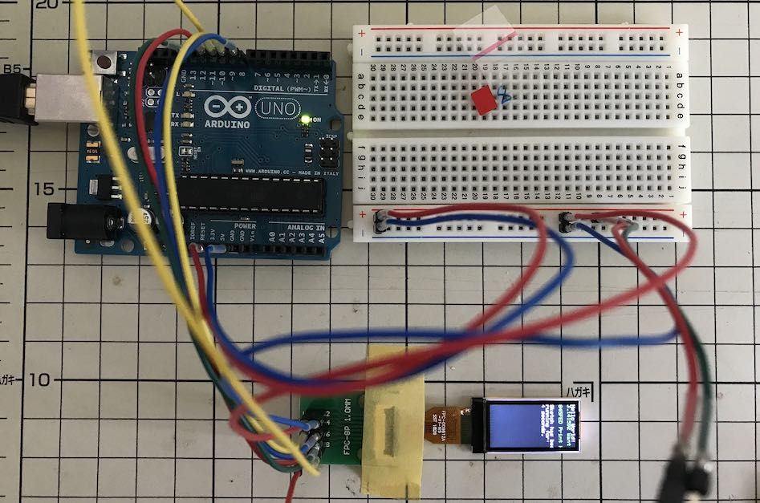
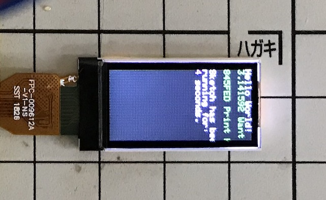

# Tiny TFT Library

最新更新日：2022/5/18

## 概要

超小型TFTディスプレイを、nRF5340アプリケーションに接続するためのライブラリーです。

使用するディスプレイは、FORMIKEというメーカーの「KWH009ST01-F01」になります。

#### 特色
- 外形寸法：`28`mm x `14`mm
- 表示領域：`21.7`mm x `10.8`mm（`0.96`inch）
- 白色バックライトLEDを装備
- 動作電圧：`2.75`V（`3.3V`までなら動作可能）
- 消費電力：`62mW`（`3.0`Vで動作時）
- SPI接続

## サンプルアプリ
「KWH009ST01-F01」の動作確認用サンプルアプリを制作しました。 
Arduino UNOで動作します。

#### [ソースコード](../../Research/TinyTFTLib/tft_sample)
フォルダー`tft_sample`配下に格納しています。

#### 解説書
（現在作成中）

## 参考文献

#### 動作確認方法

こちらのドキュメントを参考にし、まずはArduinoで動作確認しました。

- USING THE ST7735 1.8″ COLOR TFT DISPLAY WITH ARDUINO 
https://www.electronics-lab.com/project/using-st7735-1-8-color-tft-display-arduino/

#### [TFTライブラリーの解析](../../Research/TinyTFTLib/ADATFTLIB.md)
「KWH009ST01-F01」をArduino UNOに接続するためのライブラリー（`Adafruit-ST7735-Library`／`Adafruit-GFX-Library`）について、解析を行いました。
