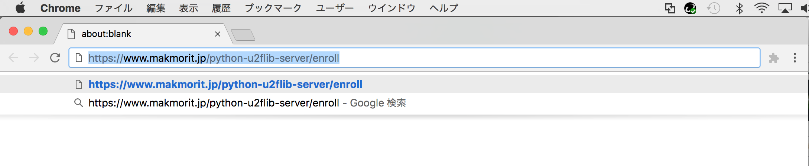
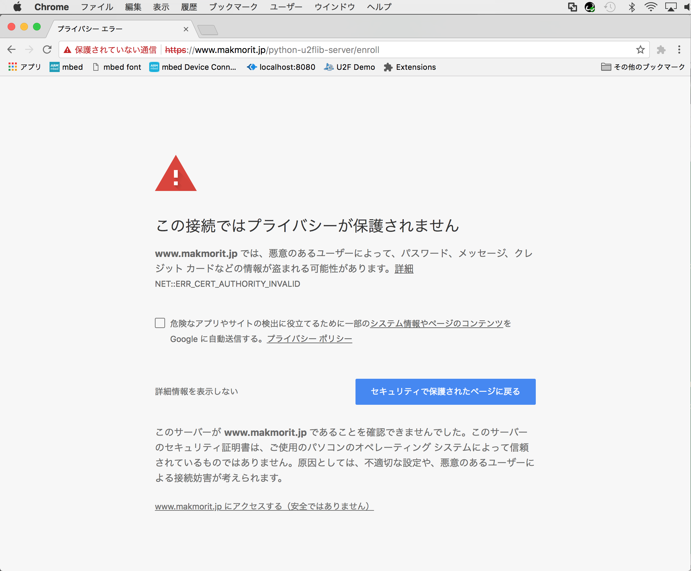
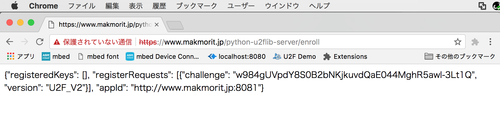

# U2Fテスト用ローカルサーバー構築手順

macOS上のApacheで稼働するローカルWebサーバーに、U2Fライブラリーサーバーを組み込む手順を掲載いたします。

以下の手順によりすでにApacheとU2Fライブラリーサーバーが稼働していることを前提といたします。

- [Apache ローカルSSLサーバー構築手順](APACHE_LOCAL_TSTSVR.md)

- [U2Fライブラリーサーバー導入手順](PYU2FSVRLIB.md)

## RP名（ホスト名）

今回は仮に `www.makmorit.jp` とします。

これを一時的に`/etc/hosts`ファイルに記述しておけば、ドメイン作成やDNS設定は不要なようです。

```
MacBookPro-makmorit-jp:~ makmorit$ cat /etc/hosts
（中略）
192.168.100.100 www.makmorit.jp
```

## U2FライブラリーサーバーをApacheに組込

Apacheに対し、以下の設定変更を行い、U2FライブラリーサーバーをApacheに組み込みます。

- ドキュメントルート・ディレクトリーを、GitHubチェックアウト・ディレクトリーと整合させる
- U2Fライブラリーサーバーの稼働パスを設定

#### ドキュメントルート・ディレクトリー変更

`/private/etc/apache2/httpd.conf`を変更し、GitHubでチェックアウトした静的Webコンテンツディレクトリーを、ドキュメントルート・ディレクトリーとして指定します。<br>
（これによってGitHubの登録内容と容易に整合できます）

以下、変更前とのdiffになります。<br>
下記例では`/Users/makmorit/GitHub/onecard-fido/U2FDemoServer/htdocs`が、静的Webコンテンツディレクトリーになっております。

```
MacBookPro-makmorit-jp:~ makmorit$ diff /private/etc/apache2/httpd.conf.original /private/etc/apache2/httpd.conf
：
237,238c237,238
< DocumentRoot "/Library/WebServer/Documents"
< <Directory "/Library/WebServer/Documents">
---
> DocumentRoot "/Users/makmorit/GitHub/onecard-fido/U2FDemoServer/htdocs"
> <Directory "/Users/makmorit/GitHub/onecard-fido/U2FDemoServer/htdocs">
：
```

#### U2Fライブラリーサーバーの稼働パス指定

`/private/etc/apache2/extra/httpd-ssl.conf`を変更し、`ProxyPass`に、U2Fライブラリーサーバーの稼働パスを指定します。

```
MacBookPro-makmorit-jp:~ makmorit$ diff /private/etc/apache2/extra/httpd-ssl.conf.original /private/etc/apache2/extra/httpd-ssl.conf
120d119
<
125c124
< ServerName www.example.com:443
---
> ServerName www.makmorit.jp:443
129a129,130
> ProxyPass /python-u2flib-server/ http://www.makmorit.jp:8081/
>
MacBookPro-makmorit-jp:~ makmorit$
```

#### U2Fライブラリーサーバーを始動

U2Fライブラリーサーバーを、上記で設定したパスで稼働するようにします。<br>
具体的には`u2f_server.py`に、引数`-i www.makmorit.jp`を与えて起動させるようにします。

起動メッセージの`Starting server on`に続いて表示されるサーバーパス（下記例では`http://www.makmorit.jp:8081`）が、前述の`ProxyPass`に指定したパスと同じになることを必ず確認してください。

```
MacBookPro-makmorit-jp:python-u2flib-server makmorit$ python ./u2f_server.py -i www.makmorit.jp
[23/May/2018 11:02:48] Starting server on http://www.makmorit.jp:8081
```

その後、Apacheを再起動させます。

```
MacBookPro-makmorit-jp:~ makmorit$ sudo apachectl restart
```

#### 動作確認

Chromeブラウザーを起動し、確認用のコマンド`enroll`を実行してみます。<br>
アドレスバーにURL`https://<RP名>/python-u2flib-server/enroll`を指定して実行します。



サーバー証明書が自己署名なので、いくつかの警告が表示されてしまいますが、テストなので静観します。



下図のように、`enroll`の実行結果がブラウザー上に表示されれば成功です。


