# NUCLEOのダウンサイジングに関する調査

現在、U2F Registerに必須のU2F USB HIDドングル（以下HIDドングル）を、NUCLEO-F411REで開発しています。

ただし、HIDドングルとしてはオーバースペックなので、これを同じNUCLEOシリーズであるNUCLEO-F103RBにダウンサイズできないかどうか、調査します。

これであれば、HIDドングルの本格開発時に使用するチップ（STM32F103）も最小限のサイズで済むというメリットがあります。

## 調査結果

調査した結果、mbedのUSBライブラリーが、そもそも「NUCLEO-F103RB」をサポートしていないことが判明しました。 
したがって、mbedを使用したダウンサイジングは不可能と判断しました。

（mbedによる確認時の手順・結果はご参考までに後述します）

対策としてはSTM32F103で動作させるためのネイティブ・プログラムを制作し、ARM GCCツールチェインによりファームウェアをビルドする必要があるかと存じます。

## ご参考

### NUCLEO-F103RBの詳細

- mbedプラットフォームの説明 
https://os.mbed.com/platforms/ST-Nucleo-F103RB/ 
（すでに小職の方で手持ちがございます。）

- STM32F103のデータシート 
https://www.mouser.jp/datasheet/2/389/stm32f103c8-956229.pdf 
最小パッケージは 5mm x 5mm（BGA64）と超小型です。 
様々なUSBドングル製品に使用されている様子です。

### 外部ツールによるプログラミング事例

- 基本はSWD経由で行う 
https://electronut.in/stm32-start/

- USART経由でもできるらしいです 
https://medium.com/@paramaggarwal/programming-an-stm32f103-board-using-usb-port-blue-pill-953cec0dbc86

## mbedによる確認時の手順・結果

mbedアプリに添付されるライブラリー「USBDEVICE」を、NUCLEO-F103RB用にビルドした時点で、サポートされていない旨のエラーが発生してしまいました。

### mbedアカウントの設定追加

mbedオンラインコンパイラーを開き、右上のデバイス名が表示されている部分をクリックします。

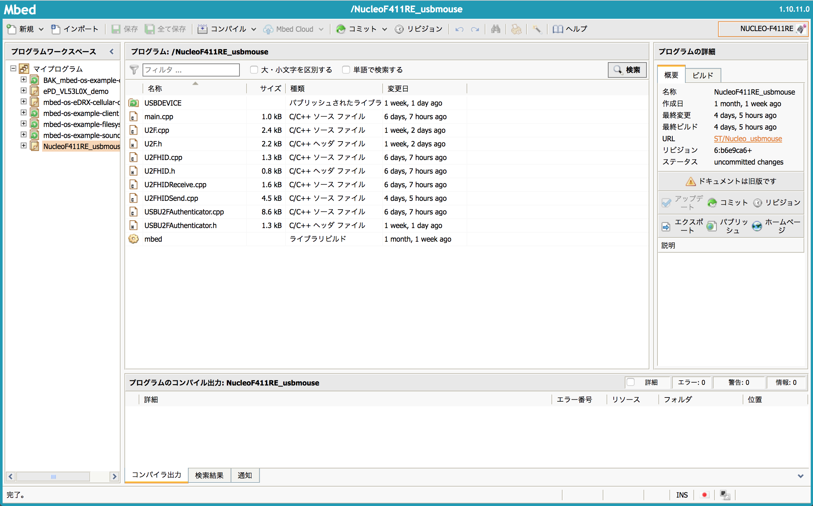

Add Boardをクリックします。

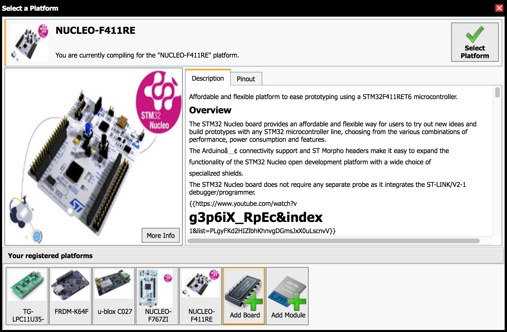

ボードの一覧が写真付きで表示されますので、NUCLEO-F103RBを選択してクリックします。

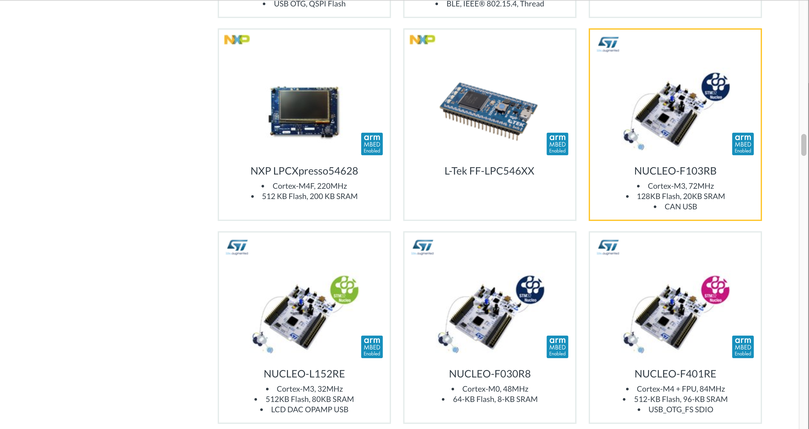

NUCLEO-F103RBの紹介ページに遷移するので、Add to your Mbed Compilerをクリックします。

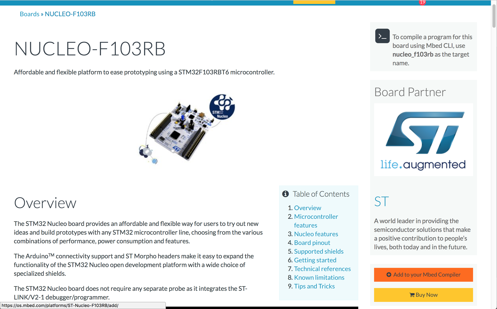

先ほどのページに「Platform 'NUCLEO-F103RB' is now added to your account!」が表示されれば、アカウント設定は完了です。

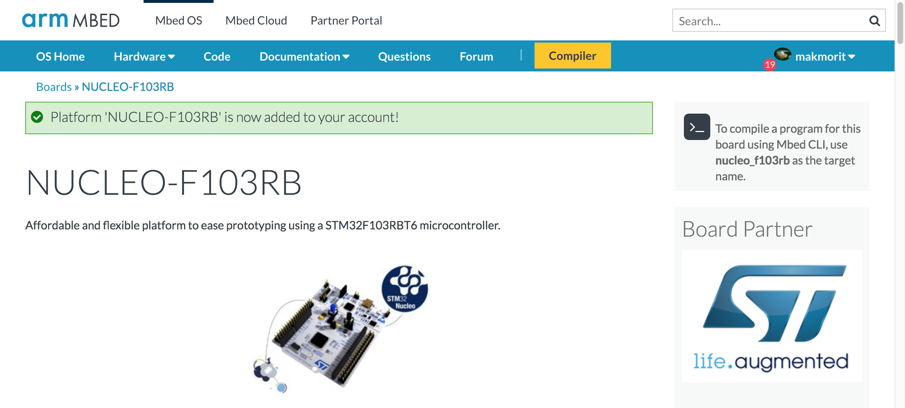

### mbedオンラインコンパイラーの設定

mbedオンラインコンパイラーを開き、右上のデバイス名が表示されている部分をクリックします。

プラットフォーム選択画面に遷移するので、NUCLEO-F103RBを選択して「Select Platform」をクリックします。

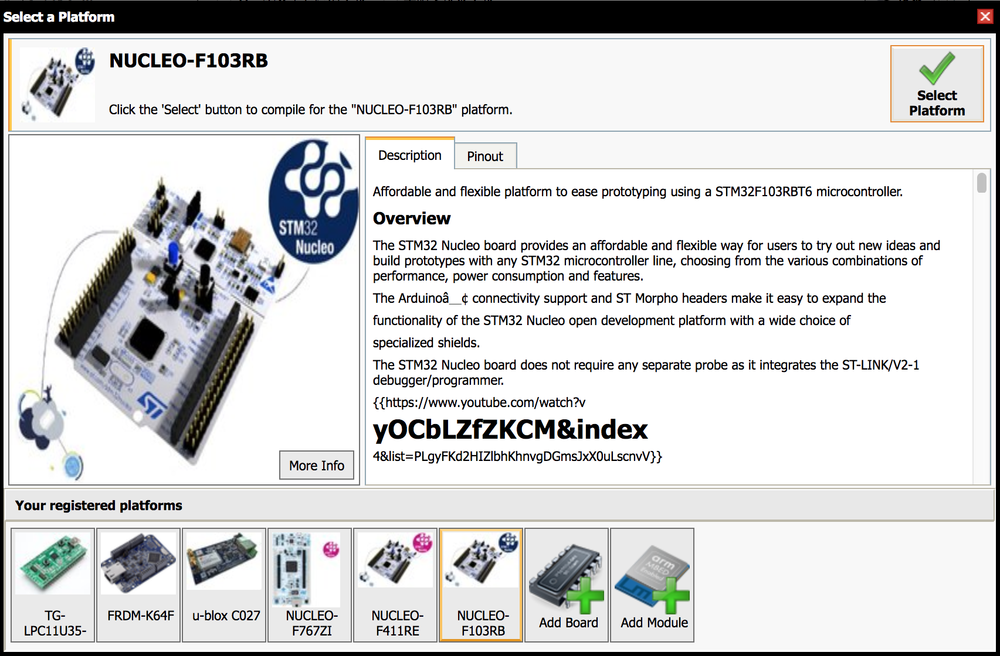

mbedオンラインコンパイラーに戻り、右上のデバイス名表示欄に「NUCLEO-F103RB」と表示されれば、導入は完了です。

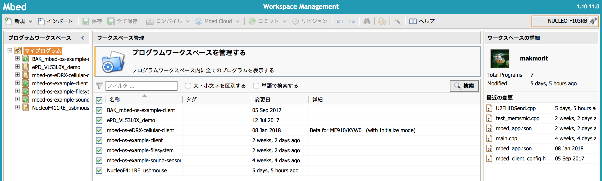

### サンプルアプリの再導入

下記ページをChromeブラウザーで開き、Import into Compilerを選択して実行します。
https://os.mbed.com/teams/ST/code/Nucleo_usbmouse/

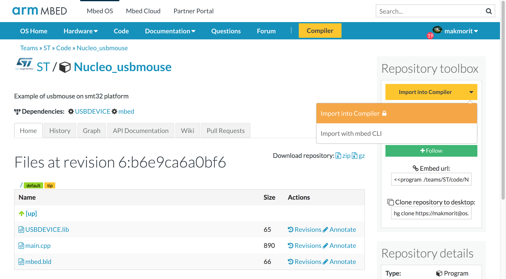

インポートするプログラムがImport Name欄に表示されます。
初期状態ではNucleo_usbmouseとなっています。

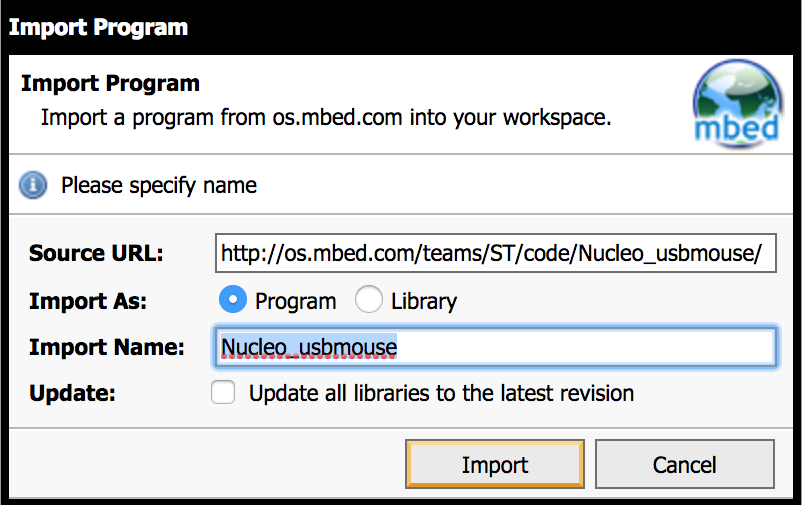

これを「U2F-HID-Dongle」を名称変更して、Importボタンをクリックします。

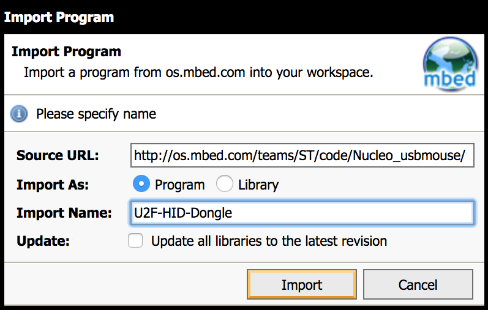

新しいmbedアプリが作成され、同時にライブラリー「USBDEVICE」がインポートされています。 
ここで、コンパイルを実行します。

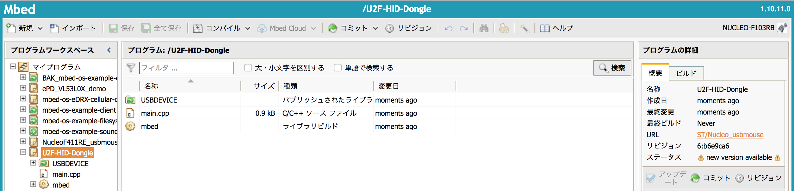

ただし結果は以下のとおりエラーとなってしまいました。 
（STM32F1がサポートされていない様子です）

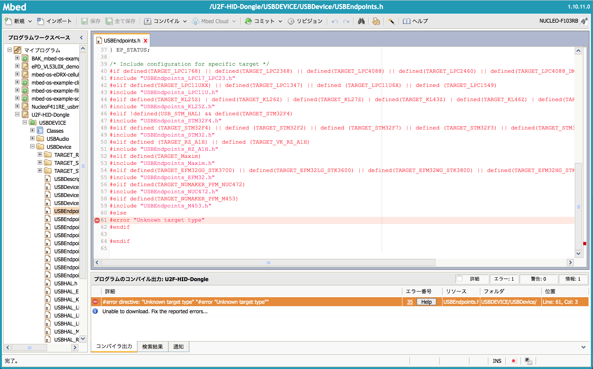
