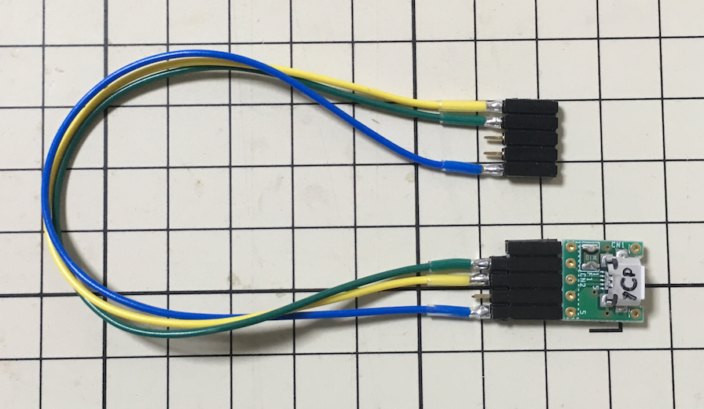
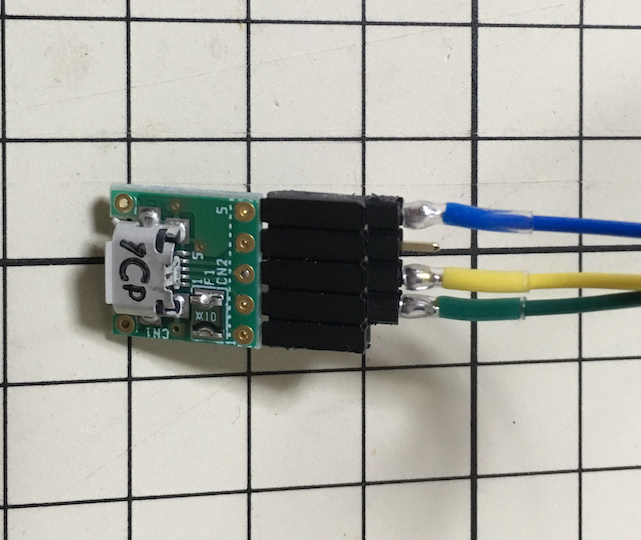
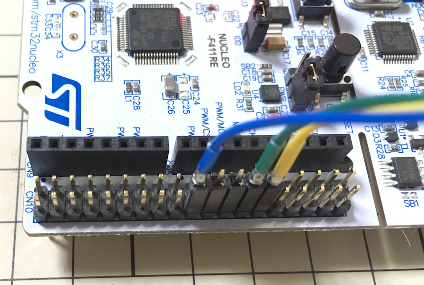
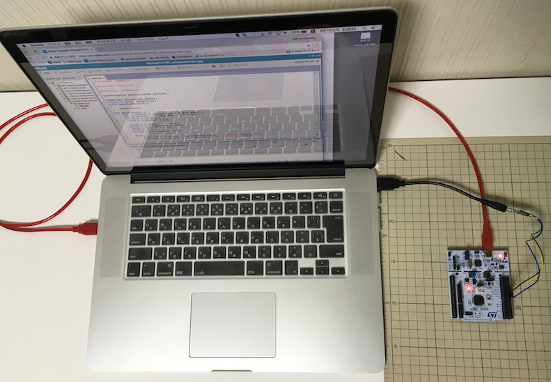
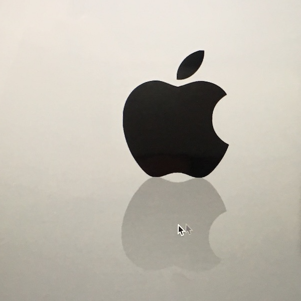
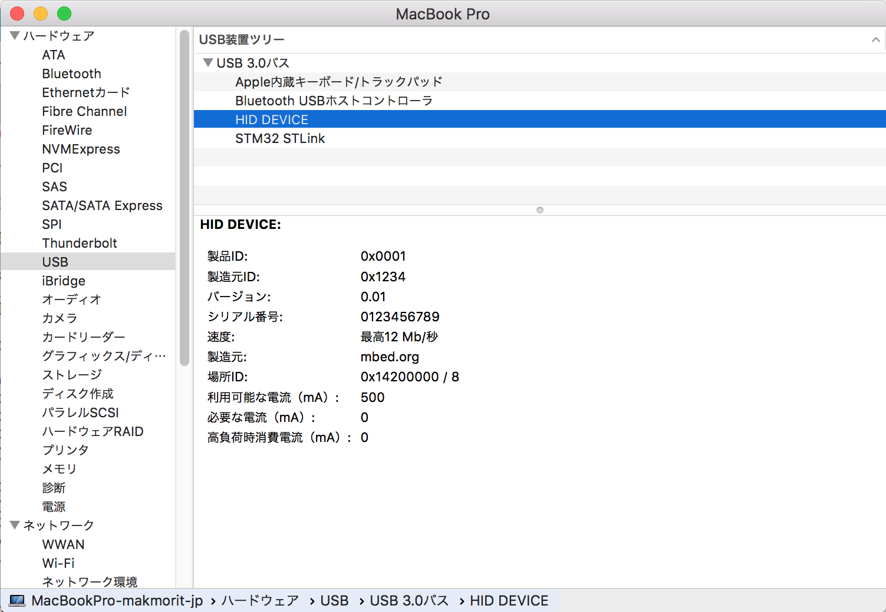

# HIDマウスデバイスを試す

NUCLEO（STM32開発環境）＋mbed OSにより、USB HIDデバイスが手軽に試行できるようです。

まずは手始めに、HIDマウスデバイスを試してみました。 
こちらの記事を参考にいたしました。 
https://qiita.com/eggman/items/9e7dad30e4d2833af17f

## サンプルアプリの書込み

サンプルのmbedアプリケーションをNUCLEOに書き込むため、NUCLEOとPCを接続しておきます。 
その後、mbedオンライン・コンパイラーを開いて、下記URLからサンプルアプリをインポートします。 
http://os.mbed.com/teams/ST/code/Nucleo_usbmouse/

コンパイルを実行します。

ダウンロードフォルダーに、`NucleoF411RE_usbmouse_NUCLEO_F411RE.bin`というファイルが作成されます。 
そのアイコンを`NODE_F411RE`というドライブにドラッグ＆ドロップし、NUCLEOに書き込みます。

書き込みが完了したら、NUCLEOとPCを切り離しておきます。

## ハードウェアのセットアップ

PCのUSBポートと、NUCLEOのUSB信号線を接続させるため、下図のような治具を作成しました。

下記URLの変換基板から配線を出しているだけのものです。 
http://akizukidenshi.com/catalog/g/gK-06656/

配線の先を、NUCLEOの`CN10`の下図位置に接続します。

USB変換基板とNUCLEO間の配線は下記のようになります。

|名称 |USB変換基板側 |NUCLEO側 |備考 |
|:-:|:--|:--|:--|
|D- |Pin #2 |CN10 #14 |図の緑色の線 |
|D+ |Pin #3 |CN10 #12 |図の黄色の線 |
|GND |Pin #5 |CN10 #20 |図の青色の線 |

## 動作確認

PCとUSB変換基板をUSBケーブルで接続したのち、NUCLEOとPCをUSBケーブルで接続します。 
イメージは下図のようになります。

程なく、下図のようにマウスポインターが画面内を回ります。

## システムレポートによる確認

macOSのシステムレポート画面で「USB装置ツリー」を開くと、上記ハードウェアが、HIDデバイスとして下図のように認識されることが確認できます。

