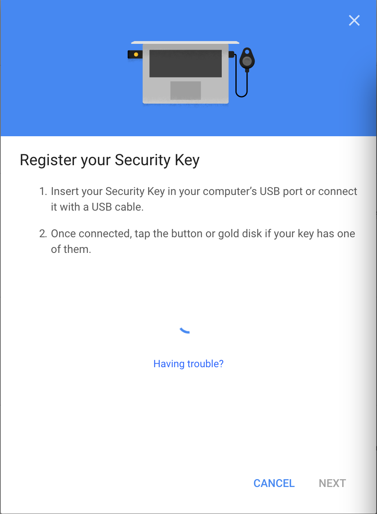

# HID U2FデバイスとU2F管理ツールの連携

## 概要

NUCLEO（STM32開発環境）＋mbed OSにより、U2F HID Init／U2F Versionを実行させるためのコマンドを実装するところまで試してみました。<br>
レポートはこちら---><b>[HID U2Fデバイスにコマンドを実装](NUCLEO_HID_U2F_COMMAND.md)</b>

上記のテストで使用したハードウェアで、HID U2FデバイスとU2F管理ツールを連携させるところまで試します。

## サンプルアプリを改修

前述テストで使用した、サンプルのmbedアプリケーションのmain関数に、HID U2FデバイスとU2F管理ツールを連携させるための処理を追加します。

改修したサンプルアプリのソースは[こちらのフォルダー](NucleoF411RE_usbmouse)に格納しておきます。

### U2F管理ツールにデータを転送

U2F RegisterリクエストがHIDデバイスに送信されたら、HIDデバイスで受信したリクエストデータを、無編集でU2F管理ツールに転送します。

ただし、HIDデバイスから１度に送信できるデータは32バイトであるため、ヘッダー（7バイト）を除く25バイトずつに分割した上で、U2F管理ツールに送信します。<br>
ヘッダーでは、U2F管理ツールのチャネルIDを0x00と設定し、他のチャネル（U2Fクライアント等）によって重複して処理されないように工夫しています。

```
bool send_response_packet() {
    :
    if (CMD == U2FHID_MSG) {
        :
        if (ins == U2F_REGISTER) {
            // リクエストデータをU2F管理ツールに転送
            if (send_xfer_report() == false) {
                return false;
            }
            :

static bool send_xfer_report(uint8_t *payload_data, size_t payload_length) {
    size_t  xfer_data_max = 25;
    size_t  xfer_data_len;
    size_t  remaining;
    uint8_t seq = 0;

    for (size_t i = 0; i < payload_length; i += xfer_data_len) {
        // データ長
        remaining = payload_length - i;
        xfer_data_len = (remaining < xfer_data_max) ? remaining : xfer_data_max;

        // パケットを生成（常にinitフレームとして生成）
        generate_hid_input_report(payload_data, xfer_data_len, i, xfer_data_len, 0x00, seq++, true);

        // パケットをU2F管理ツールへ転送
        if (u2fAuthenticator.send(&send_report) == false) {
            printf("u2fAuthenticator.send failed. \r\n");
            return false;
        }
    }

    return true;
}
```

### U2F管理ツールからのデータを受信

U2F RegisterレスポンスがU2F管理ツールから送信されたら、これをHIDデバイスで受信します。<br>
受信時にチャネルID=0x00であれば、U2F管理ツールからのメッセージと判断し、処理を行います。

ここで、U2F管理ツールからのメッセージを処理するためのコマンドとして`U2F_VENDOR_LAST`を定義し、メッセージデータを抽出する処理の中で、CMDを`U2F_VENDOR_LAST`に差替えしております。

```
bool receive_request_data(void) {
    :
    // チャネルIDを判定する
    U2F_HID_MSG *req = (U2F_HID_MSG *)recv_report.data;
    if (get_CID(req->cid) == U2FHID_RESERVED_CID) {
        //   U2F管理ツールからの転送レスポンスを処理
        return receive_xfer_response_data();
    }
    :

static bool receive_xfer_response_data() {
    :
    if (U2FHID_IS_INIT(req->pkt.init.cmd)) {
        // payload長を取得
        payload_len = get_payload_length(req);

        // リクエストデータ領域に格納
        pos = (payload_len < init_payload_size) ? payload_len : init_payload_size;
        memset(&u2f_request_buffer, 0, sizeof(HID_REPORT));
        memcpy(u2f_request_buffer, req->pkt.init.payload, pos);

        // CMDを設定
        CMD = U2F_VENDOR_LAST;
        dump_hid_init_packet("Recv ", recv_report.length, req, pos);
        :
```

受信したメッセージは、そのまま無編集でU2Fクライアントに送信します。<br>
ただし、CMDが`U2F_VENDOR_LAST`のままではU2Fエラーになってしまうため、CMDを本来の`U2FHID_MSG`に戻してからU2Fクライアントに送信しています。

```
bool send_response_packet(void) {
    :
    if (CMD == U2F_VENDOR_LAST) {
        // レスポンスデータを送信パケットに設定
        CMD = U2FHID_MSG;
        generate_u2f_register_response();
        if (send_hid_input_report(u2f_response_buffer, u2f_response_length) == false) {
            return false;
        }
    :

void generate_u2f_register_response(void) {
    // U2F管理ツールから転送されたレスポンスデータを設定
    u2f_response_length = u2f_request_length;
    memcpy(u2f_response_buffer, u2f_request_buffer, u2f_request_length);
}
```

## U2F管理ツールを改修

U2F管理ツール側でも、HID U2FデバイスとU2F管理ツールを連携させるための処理を追加します。

### HIDデバイスからの転送メッセージを受信

HIDデバイスから転送メッセージを受信するための初期設定を、`ToolHIDHelper`の`initializeHIDManager`関数で実行します。

```
- (void)initializeHIDManager {
    :
    IOReturn ret = IOHIDManagerOpen([self toolHIDManager], kIOHIDOptionsTypeNone);
    :
    // ハンドラー定義
    :
    IOHIDManagerRegisterInputReportCallback(
        [self toolHIDManager], &handleInputReport, (__bridge void *)self);
    :
```

HIDデバイスから転送メッセージが受信されると、`handleInputReport`関数が実行されます。<br>
ここでは、転送されたメッセージがコンソールにデバッグプリントされます。

```
void handleInputReport(void *context, IOReturn result, void *sender, IOHIDReportType type,
                       uint32_t reportID, uint8_t *report, CFIndex reportLength) {
    // 受信メッセージを転送
    ToolHIDHelper *helperSelf = (__bridge ToolHIDHelper *)context;
    [helperSelf HIDManagerDidReceiveMessage:report length:reportLength];
}

- (void)HIDManagerDidReceiveMessage:(uint8_t *)message length:(long)length {
    :
    NSData *reportData = [[NSData alloc] initWithBytes:message length:length];
    NSLog(@"ToolHIDHelper receive: reportLength(%ld) report(%@)", length, reportData);
    :
    // パケットをすべて受信したら、U2Fリクエスト（APDUヘッダー＋データ）をアプリケーションに引き渡す
    remaining -= datalen;
    if (remaining == 0) {
        NSLog(@"hidHelperDidReceive(%lu bytes): %@",
              (unsigned long)[[self hidU2FRequest] length],
              [self hidU2FRequest]);
        [[self delegate] hidHelperDidReceive:[self hidU2FRequest]];
    }
}
```

ここで、U2F管理ツールに制御が渡り、アプリケーション・デリゲートの`hidHelperDidReceive`が呼び出されます。

今回は調査目的のため、転送されたデータをそのまま、HIDデバイスにレスポンスするようにしています。<br>
（これは仮コードであり、後日One Cardの処理を呼び出してそのレスポンスを転送するように変更予定）

```
#pragma mark - Call back from ToolHIDHelper

    - (void)hidHelperDidReceive:(NSData *)hidHelperMessages {
        // HIDデバイスから受信したメッセージをエコーバック（仮の実装です）
        [[self toolHIDHelper] hidHelperWillSend:hidHelperMessages];
    }
```

## U2Fクライアントによる確認

### U2F Registerを起動

Googleアカウントの２段階認証設定ページを表示させます。<br>
下図のような画面に遷移させます。


画面上の「Security Key」セクションにある「ADD SECURITY KEY」リンクをクリックし、U2F Registerを開始させます。<br>
下図のようなポップアップが表示され、U2F Registerが起動します。



### mbedアプリケーションのデバッグプリント

U2Fクライアント上でU2F Registerが起動すると、mbedアプリケーションにチャネルID`0x00003301`でU2Fリクエストが送信されます。<br>
mbedアプリケーションは、そのU2Fリクエストを、チャネルID`0x00000000`でU2F管理ツールに転送します。

```
Recv ( 64 bytes) CID: 0x00003301, CMD: 0x83, Payload( 73 bytes): 00 01 03 00 00 00 40 ee 90 42 c1 41 81 0f b2 b0 88 c4 7c cc b9 6c 1c 92 b1 bd 41 96 6d 19 61 cf 36 7b e1 61 ee 33 4d 31 e9 dc 66 f2 88 e5 fa 45 eb 1b a5 a6 2b d2 3f df 64
Recv ( 64 bytes) CID: 0x00003301, SEQ: 0x00, fb d6 af 72 24 32 d0 cd c1 99 4b f5 79 ad 00 00
Send ( 32 bytes) CID: 0x00000000, CMD: 0x00, Payload( 25 bytes): 00 01 03 00 00 00 40 ee 90 42 c1 41 81 0f b2 b0 88 c4 7c cc b9 6c 1c 92 b1
Send ( 32 bytes) CID: 0x00000000, CMD: 0x01, Payload( 25 bytes): bd 41 96 6d 19 61 cf 36 7b e1 61 ee 33 4d 31 e9 dc 66 f2 88 e5 fa 45 eb 1b
Send ( 32 bytes) CID: 0x00000000, CMD: 0x02, Payload( 23 bytes): a5 a6 2b d2 3f df 64 fb d6 af 72 24 32 d0 cd c1 99 4b f5 79 ad 00 00
```

U2F管理ツールからは、チャネルID`0x00000000`で、ECHOバックがレスポンスされます。<br>
（こちらは後日、正式な処理に置き換える予定です）

U2F管理ツールからのレスポンスは、さらにmbedアプリケーションから、チャネルID`0x00003301`を使いU2Fクライアントに転送されます。

```
Recv ( 32 bytes) CID: 0x00000000, CMD: 0x83, Payload( 73 bytes): 00 01 03 00 00 00 40 ee 90 42 c1 41 81 0f b2 b0 88 c4 7c cc b9 6c 1c 92 b1
Recv ( 32 bytes) CID: 0x00000000, SEQ: 0x00, bd 41 96 6d 19 61 cf 36 7b e1 61 ee 33 4d 31 e9 dc 66 f2 88 e5 fa 45 eb 1b a5 a6
Recv ( 32 bytes) CID: 0x00000000, SEQ: 0x01, 2b d2 3f df 64 fb d6 af 72 24 32 d0 cd c1 99 4b f5 79 ad 00 00
Send ( 32 bytes) CID: 0x00003301, CMD: 0x83, Payload( 73 bytes): 00 01 03 00 00 00 40 ee 90 42 c1 41 81 0f b2 b0 88 c4 7c cc b9 6c 1c 92 b1
Send ( 32 bytes) CID: 0x00003301, SEQ: 0x00, bd 41 96 6d 19 61 cf 36 7b e1 61 ee 33 4d 31 e9 dc 66 f2 88 e5 fa 45 eb 1b a5 a6
Send ( 32 bytes) CID: 0x00003301, SEQ: 0x01, 2b d2 3f df 64 fb d6 af 72 24 32 d0 cd c1 99 4b f5 79 ad 00 00
```


### U2F管理ツールのデバッグプリント

mbedアプリケーションからU2F管理ツールに、U2F Registerリクエストが転送されると、下記のようなデバッグプリントが出力されます。<br>
U2F Registerリクエストが最大25バイトずつ、３分割されて受信されることが確認できます。

```
デフォルト	15:38:23.163701 +0900	U2FMaintenanceTool	ToolHIDHelper receive: reportLength(32) report(<00000000 00001900 01030000 0040ee90 42c14181 0fb2b088 c47cccb9 6c1c92b1>)
デフォルト	15:38:23.311617 +0900	U2FMaintenanceTool	ToolHIDHelper receive: reportLength(32) report(<00000000 010019bd 41966d19 61cf367b e161ee33 4d31e9dc 66f288e5 fa45eb1b>)
デフォルト	15:38:23.451621 +0900	U2FMaintenanceTool	ToolHIDHelper receive: reportLength(32) report(<00000000 020017a5 a62bd23f df64fbd6 af722432 d0cdc199 4bf579ad 00000000>)
デフォルト	15:38:23.451746 +0900	U2FMaintenanceTool	hidHelperDidReceive(73 bytes): <00010300 000040ee 9042c141 810fb2b0 88c47ccc b96c1c92 b1bd4196 6d1961cf 367be161 ee334d31 e9dc66f2 88e5fa45 eb1ba5a6 2bd23fdf 64fbd6af 722432d0 cdc1994b f579ad00 00>
```

現時点では、U2F Registerリクエストに対しては、ECHOバックでレスポンスするようにしています。<br>
（こちらは後日、正式な処理に置き換える予定です）

```
デフォルト	15:38:23.451803 +0900	U2FMaintenanceTool	hidHelperWillSend(73 bytes): <00010300 000040ee 9042c141 810fb2b0 88c47ccc b96c1c92 b1bd4196 6d1961cf 367be161 ee334d31 e9dc66f2 88e5fa45 eb1ba5a6 2bd23fdf 64fbd6af 722432d0 cdc1994b f579ad00 00>
デフォルト	15:38:23.455439 +0900	U2FMaintenanceTool	ToolHIDHelper send: messageLength(32) message(<00000000 83004900 01030000 0040ee90 42c14181 0fb2b088 c47cccb9 6c1c92b1>)
デフォルト	15:38:23.463547 +0900	U2FMaintenanceTool	ToolHIDHelper send: messageLength(32) message(<00000000 00bd4196 6d1961cf 367be161 ee334d31 e9dc66f2 88e5fa45 eb1ba5a6>)
デフォルト	15:38:23.619638 +0900	U2FMaintenanceTool	ToolHIDHelper send: messageLength(32) message(<00000000 012bd23f df64fbd6 af722432 d0cdc199 4bf579ad 00000000 00000000>)
```


これで、Chrome標準サポートのU2Fクライアントから、U2F RegisterリクエストがU2F管理ツールまで流れ、そのレスポンスがHIDデバイスまで戻るところまで確認できました。
