# AndroidスマートフォンからU2F Authenticateを実行

## 概要

HID U2FデバイスによりOne Cardと紐付け登録されたGoogleアカウントを使用し、Androidスマートフォン（以降、単にAndroidと称します。）からOne CardのU2F Authenticateを実行します。

確認にあたっては、[こちらの検証作業](NUCLEO_HID_U2F_REGISTER.md)で用意した、NUCLEOのHID U2Fデバイスを使用します。

### 操作の概要

#### U2F Register

GoogleアカウントとOne Cardを紐付け登録します。 
紐付けのためには、One Cardによる署名情報が必要となります。

U2F Register作業は、PCのChromeブラウザーでないとできません。 
また、Chromeブラウザーで動作するU2Fクライアントは、USB HIDデバイスしかサポートしていないため、先述のHID U2Fデバイスを使用してU2F管理ツール／One Cardと連携しなければなりません。

#### U2F Authenticate

Googleアカウントをスマートフォンで使用する際、それと紐付けられたOne Cardを使用して認証します。 
認証のためには、One Cardによる署名付きトークン・カウンター情報が必要となります。

U2F Authenticate作業は、スマートフォンと、One Cardのみで行うことができます。 
（Android設定アプリが、BLEによるU2F Authenticateをサポートしているため）

## U2F Register

Androidで、One CardのU2F Authenticateを使用するためには、事前にPCのChromeブラウザー上で、使用したいGoogleアカウントについて、U2F Registerを実行する必要があります。

また、Googleアカウントにはあらかじめ、２段階認証を有効にする設定をおこなってください。

### Chromeブラウザーでの操作

PCでChromeブラウザーを起動し、使用したいGoogleアカウントでログインします。

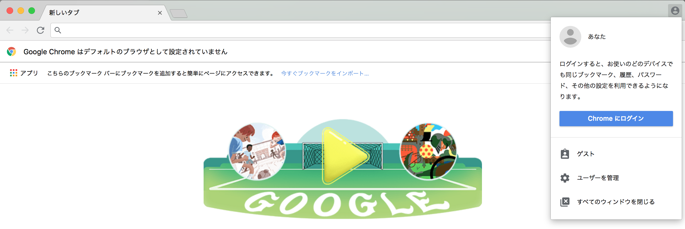

２段階認証の確認コード入力画面に遷移するので、携帯電話等に表示された確認コードを入力します。

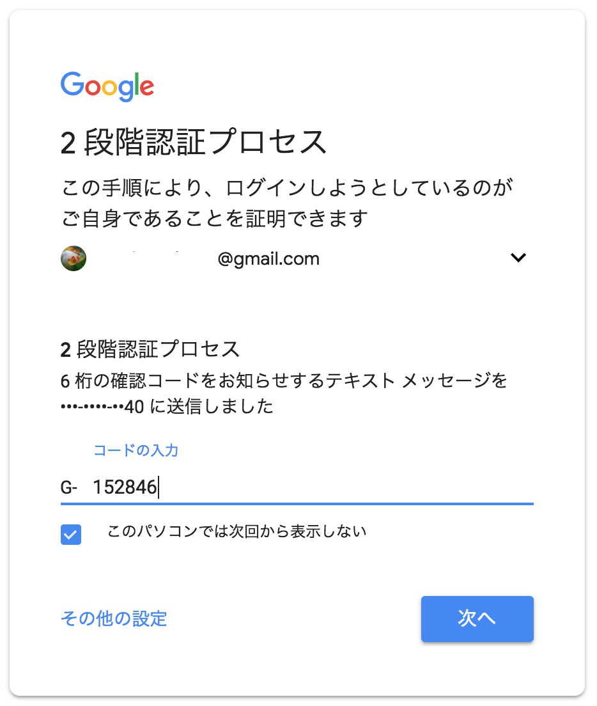

２段階認証のバックアップコード取得画面に遷移するので「設定画面に移動」をクリックします。

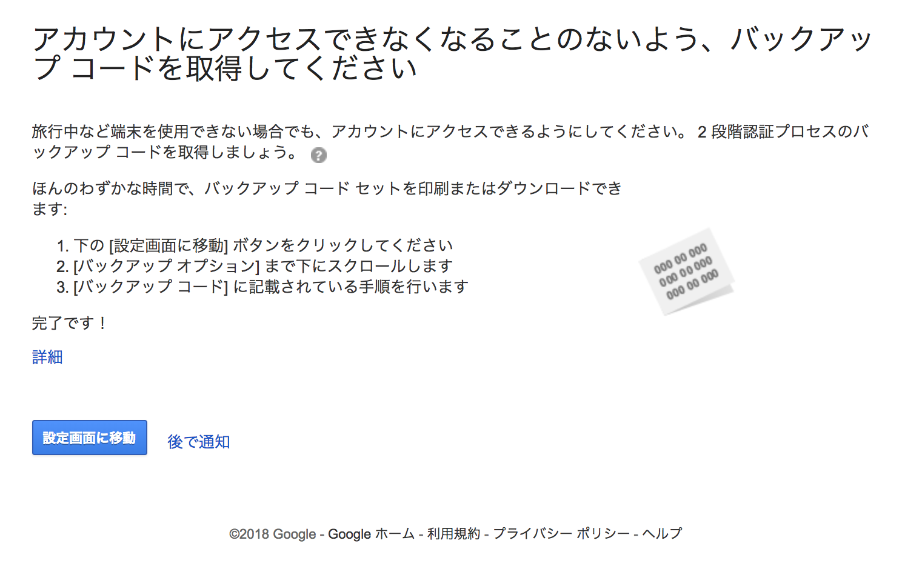

下図画面で「開始」をクリックします。

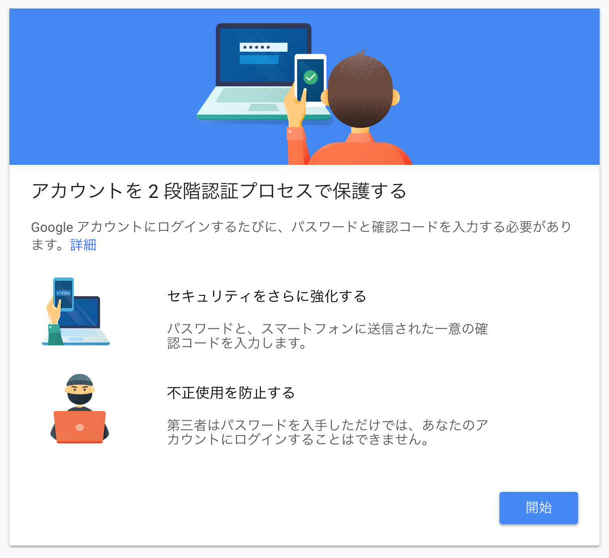

２段階認証設定画面に遷移するので、画面を下へスクロールして「セキュリティ キー」の項目を表示させます。 
（これがU2F Register起動画面になります）

「セキュリティ キーを追加」をクリックします。

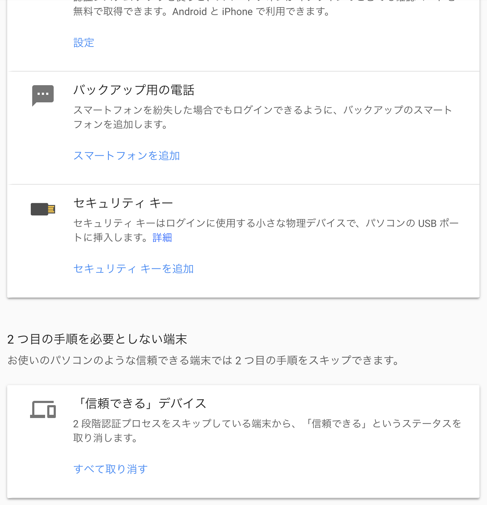

この段階までで、以下を確認しておきます。

- U2F管理ツールが起動していること
- One Cardがペアリングされていて、U2F管理ツールと通信可能であること（U2F管理ツールの「ヘルスチェック」機能で確認できます）
- One Cardが起動状態であること（MAIN SWを１回プッシュしてあげると Wake Up します）

以上問題がなければ、下図画面で「次へ」をクリックします。

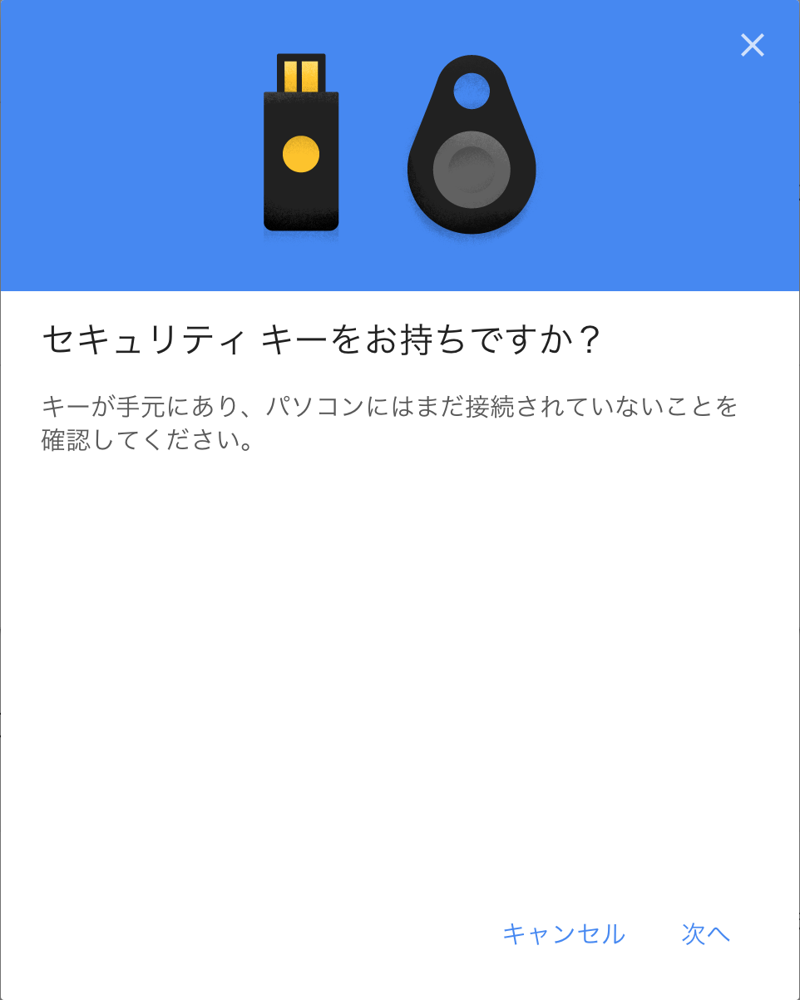

下図画面に遷移します。

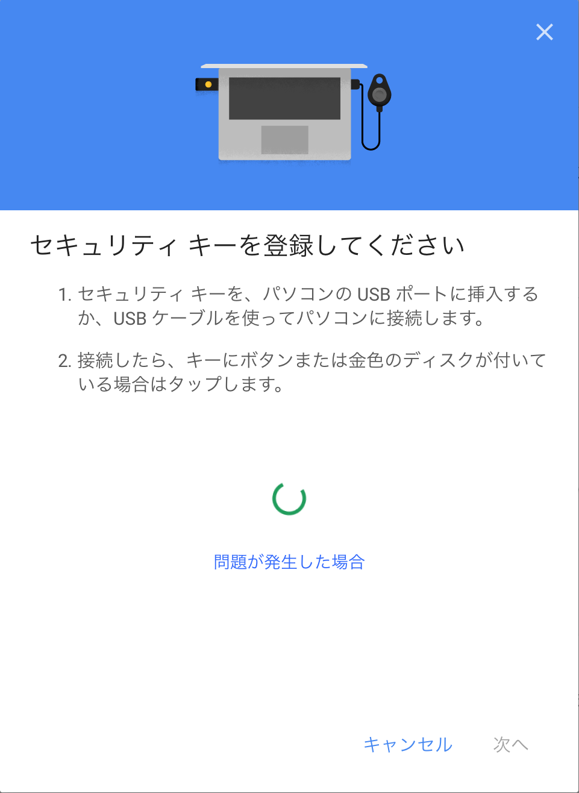

ここで、PCのUSBポートに、先述のHIDデバイスが接続します。 
（Yubikey NEOをUSBポートに挿すのと等価）

ほどなく、U2F Registerが起動し、下図のような画面に遷移し、U2F Registerが行われたことを通知します。 
任意の設定名称を入力して、完了をクリックします。

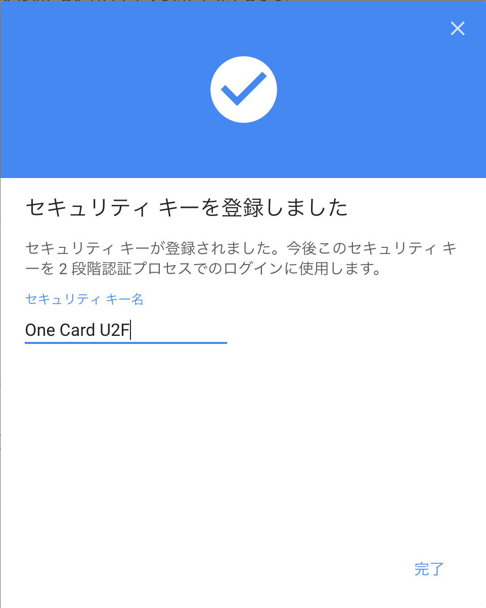

２段階認証設定画面に戻り、先ほどRegisterされたセキュリティ キーが表示されます。

以上で、U2F Registerは完了になります。

## U2F Authenticate

Androidで、One CardのU2F Authenticateを使用します。

今回の確認時に使用したのは「Androidのシステム設定にGoogleアカウントを追加する」機能になります。

### Android設定画面での操作

設定画面の「アカウント」をタップします。

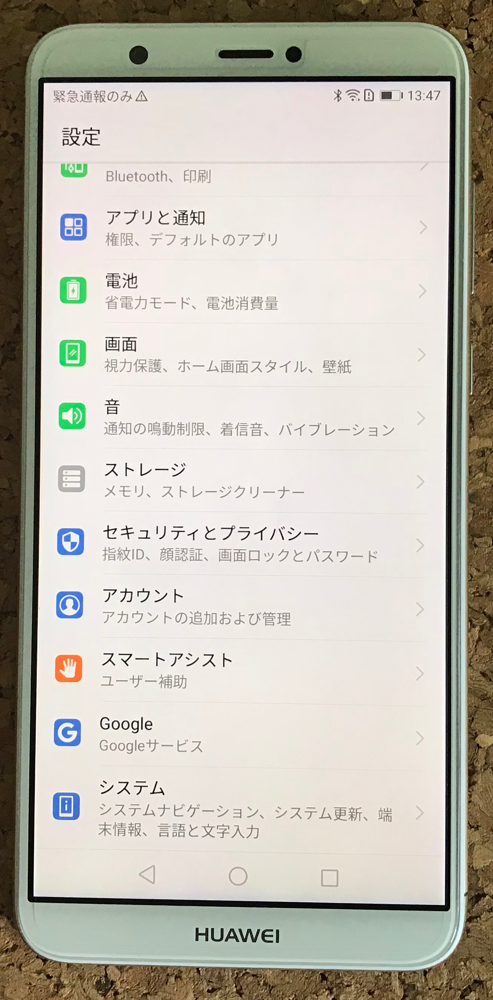

今はまだ、Googleアカウントがシステムに設定されていない状態になっております。 
画面上部のリンク「アカウントを追加」をタップします。

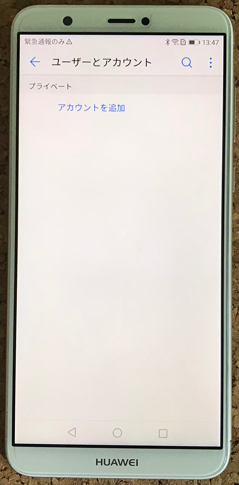

アカウントの一覧から「Google」をタップします。

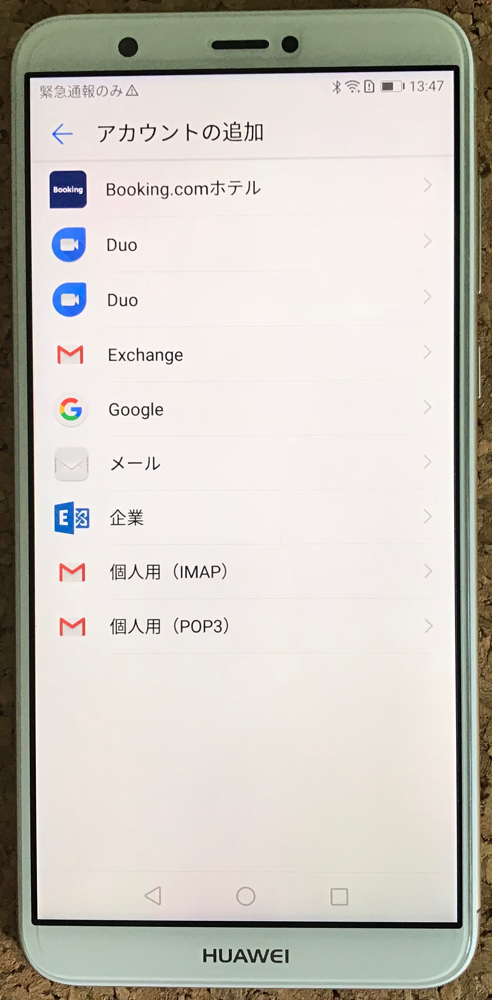

使用するGoogleアカウント（先述のU2F Registerで使用したGoogleアカウント）を入力して「次へ」をクリックします。

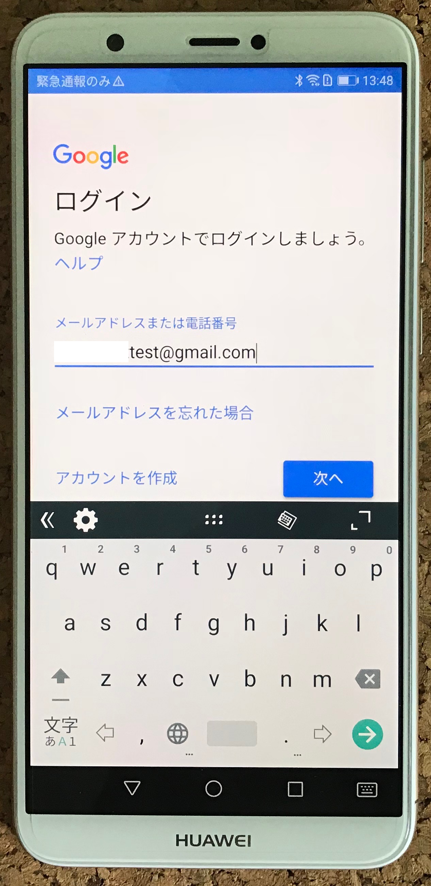

パスワードを入力します。

この段階で、One CardのMAIN SWを１回プッシュしておきます。 
（One Cardアプリが Wake Up します）

One Cardが Wake Up したら「次へ」をクリックします。

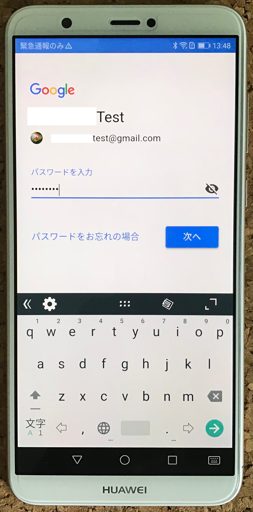

画面が下図のように切り替わり、U2F Authenticate処理が起動します。

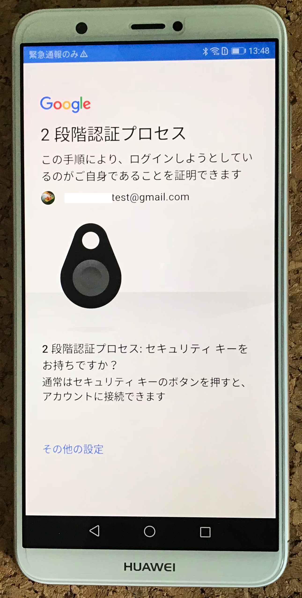

下図のように「セキュリティ キーを確認しています」というガイダンスに変わります。

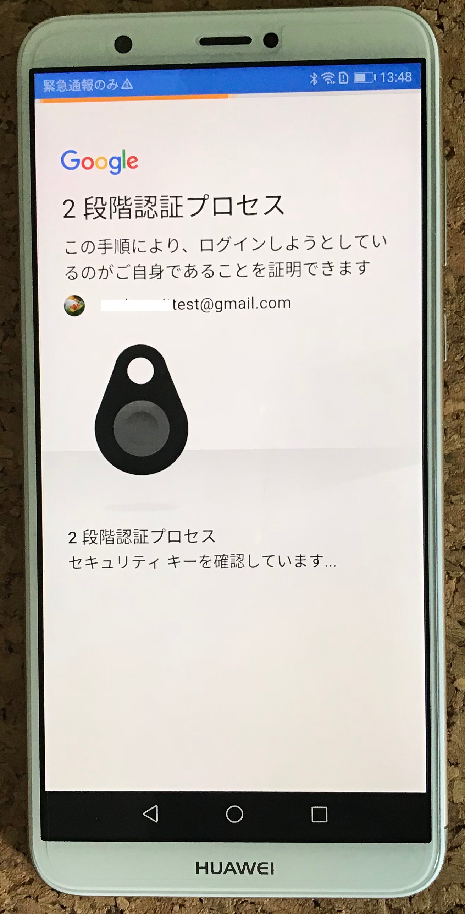

One CardのLED1（いちばん右側のLED）が点滅しているのを確認後、One CardのMAIN SWを１回プッシュします。

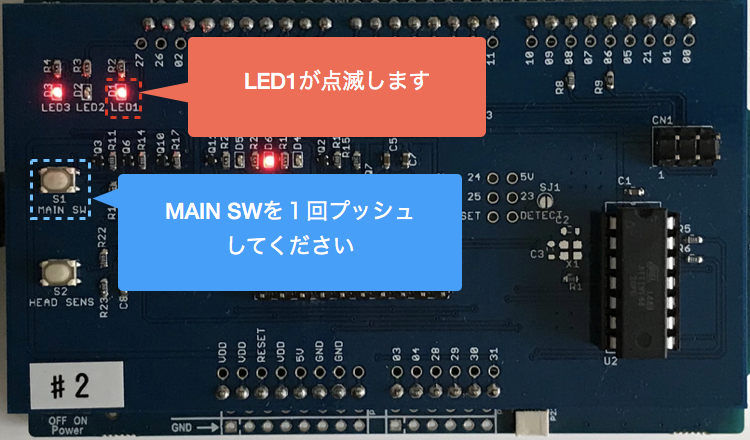

下図の画面に切り替わったら、U2F Authenticateが完了していますので、画面下部の「同意」ボタンをタップします。

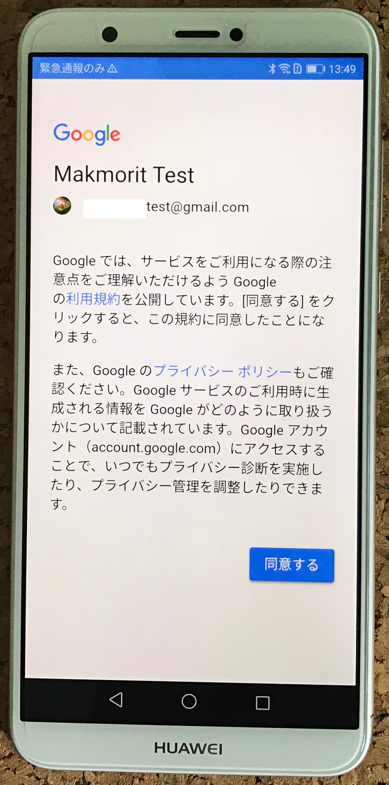

「ユーザーとアカウント」画面に戻り、Googleサービスが追加されます。

以上で、U2F Authenticateは完了になります。
