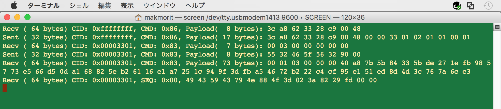

# HID U2Fデバイスにコマンドを実装

NUCLEO（STM32開発環境）＋mbed OSにより、U2F USB HIDデバイスを認識するところまで試してみました。<br>
レポートはこちら---><b>[HID U2Fデバイス開発の準備](NUCLEO_HID_U2F_PREPARE.md)</b>

上記のテストで使用したハードウェアに、U2F HID Init／U2F Versionを実行させるためのコマンドを実装するところまで試します。

## サンプルアプリを改修

前述テストで使用した、サンプルのmbedアプリケーションのmain関数に、U2F Versionリクエストにレスポンスするための処理を追加します。

改修したサンプルアプリのソースは[こちらのフォルダー](NucleoF411RE_usbmouse)に格納しておきます。

### リクエスト受信

U2Fクライアントから受信したリクエストは、main関数のループ内で処理します。

```
HID_REPORT recv_report;
:
int main(void) {
    wait(1);
    printf("----- U2F Authenticator sample start -----\r\n");

    while (true) {
        if (u2fAuthenticator.readNB(&recv_report)) {
            if (receive_request_data() == true) {
                // リクエストを全て受領したらレスポンス
                send_response_packet();
                :
```
`u2fAuthenticator.readNB`関数で受信したメッセージは、`recv_report`という構造体に保持されます。
この構造体の`pkt.init.cmd`というメンバーから、U2Fクライアントが指定する（＝U2F Authenticatorに実行してほしい）コマンドを取り出します。
また、リクエストデータは、`pkt.init.payload`というメンバーから、いったんバイト配列`u2f_request_buffer`に格納します。


```
bool receive_request_data() {
    static size_t pos;
    static size_t payload_len;
    :
    U2F_HID_MSG *req = (U2F_HID_MSG *)recv_report.data;
    :
    if (U2FHID_IS_INIT(req->pkt.init.cmd)) {
        // payload長を取得
        payload_len = get_payload_length(req);

        // リクエストデータ領域に格納
        pos = (payload_len < U2FHID_INIT_PAYLOAD_SIZE) ? payload_len : U2FHID_INIT_PAYLOAD_SIZE;
        memcpy(u2f_request_buffer, req->pkt.init.payload, pos);

        // CID、CMDを保持
        CID = get_CID(req->cid);
        CMD = req->pkt.init.cmd;
        :
```

### コマンドに対応する処理を実行

コマンドを判定して、対応する処理に分岐します。

```
bool send_response_packet() {
    if (CMD == U2FHID_INIT) {
        // レスポンスデータを送信パケットに設定
        generate_hid_init_response();
        set_send_report_data(u2f_response_buffer, u2f_response_length);
        if (send_hid_report() == false) {
            return false;
        }
    }

    if (CMD == U2FHID_MSG) {
        // u2f_request_buffer の先頭バイトを参照
        //   [0]CLA [1]INS [2]P1 3[P2]
        uint8_t ins = u2f_request_buffer[1];
        if (ins == U2F_VERSION) {
            // レスポンスデータを送信パケットに設定
            generate_u2f_version_response();
            set_send_report_data(u2f_response_buffer, u2f_response_length);
            if (send_hid_report() == false) {
                return false;
            }
        }
    }

    return true;
}
```

上記判定ロジックでは、`U2FHID_INIT`と`U2FHID_MSG`の２件のコマンドを判定しています。

まず、`U2FHID_INIT`（＝U2F HID Init）というコマンドは、U2F AuthenticatorのチャネルID（４バイトの整数）をU2Fクライアントに戻す処理になります。<br>
下記処理は、チャネルIDとして`0x00003301`を戻しています。<br>
U2Fクライアントに戻すレスポンス・データは、いったんバイト配列`u2f_response_buffer`に格納します。

```
void generate_hid_init_response(void) {
    // レスポンスデータを編集 (17 bytes)
    memcpy(init_res.nonce, u2f_request_buffer, 8);
    set_CID(init_res.cid, 0x00003301);
    :
    // レスポンスを格納
    u2f_response_length = sizeof(U2F_HID_INIT_RES);
    memcpy(u2f_response_buffer, &init_res, u2f_response_length);
}
```

他方、`U2FHID_MSG`というコマンドは、さらに`INS`というパラメーターで細かく処理種別を指定できます。<br>
下記処理は、U2Fクライアントから`INS=U2F_VERSION`（＝U2F Version）という処理が要求された時の処理です。<br>
U2F Versionは、バージョン文字列として`U2F_V2`を戻す処理になります。

```
void generate_u2f_version_response(void) {
    // レスポンスデータを編集 (8 bytes)
    strcpy((char *)version_res.version, "U2F_V2");
    :
    // レスポンスを格納
    u2f_response_length = sizeof(U2F_VERSION_RES);
    memcpy(u2f_response_buffer, &version_res, u2f_response_length);
}
```

### レスポンス送信

バイト配列`u2f_response_buffer`に格納されたレスポンス・データは、`send_hid_report`関数により、U2Fクライアントに送信されます。

```
bool send_hid_report() {
    U2F_HID_MSG *res = (U2F_HID_MSG *)send_report.data;
    dump_hid_init_packet("Sent ", send_report.length, res);

    if (u2fAuthenticator.send(&send_report) == false) {
        printf("u2fAuthenticator.send failed. \r\n");
        return false;
    }
    return true;
}
```

## U2Fクライアントによる確認

#### ！！注意！！
Chromeの標準サポートであるU2Fクライアントを使用するため、開発用のU2Fエクステンションは無効化しておきます。<br>
また、U2F AuthenticatorとしてすでにYubikey NEOが登録されている場合は、確認のためにいったん削除しておきます。

### U2F Registerを起動

Googleアカウントの２段階認証設定ページを表示させます。<br>
下図のような画面に遷移させます。


画面上の「Security Key」セクションにある「ADD SECURITY KEY」リンクをクリックし、U2F Registerを開始させます。<br>
下図のようなポップアップが表示され、U2F Registerが起動します。


### mbedアプリケーションのデバッグプリント

U2Fクライアント上でU2F Registerが起動すると、mbedアプリケーションにU2Fリクエストが送信されます。

U2Fリクエストのコマンドを判定し、各々処理が行われ、下図のようなデバッグプリントが出力されます。<br>
U2F HID Init--->U2F Version--->U2F Registerと処理が流れたところが確認できます。<br>

（ただし現状は、U2F Registerレスポンスは行われないので、以降の処理は進みません）



```
Recv ( 64 bytes) CID: 0xffffffff, CMD: 0x86, Payload(  8 bytes): 3c a8 62 33 28 c9 00 48
Sent ( 32 bytes) CID: 0xffffffff, CMD: 0x86, Payload( 17 bytes): 3c a8 62 33 28 c9 00 48 00 00 33 01 02 01 01 00 01
Recv ( 64 bytes) CID: 0x00003301, CMD: 0x83, Payload(  7 bytes): 00 03 00 00 00 00 00
Sent ( 32 bytes) CID: 0x00003301, CMD: 0x83, Payload(  8 bytes): 55 32 46 5f 56 32 90 00
Recv ( 64 bytes) CID: 0x00003301, CMD: 0x83, Payload( 73 bytes): 00 01 03 00 00 00 40 a8 7b 5b 84 33 5b de 27 1e fb 98 57 73 e5 66 d5 0d a1 68 82 5e b2 61 16 e1 a7 25 1c 94 9f 3d fb a5 46 72 b2 22 c4 cf 95 e1 51 ed 8d 4d 3c 76 7a 6c c3
Recv ( 64 bytes) CID: 0x00003301, SEQ: 0x00, 49 43 59 43 79 4e 88 4f 3d 02 3a 82 29 fd 00 00
```

これで、Chrome標準サポートのU2Fクライアントから、U2F RegisterリクエストがNUCLEOに投入されるところまで確認できました。
