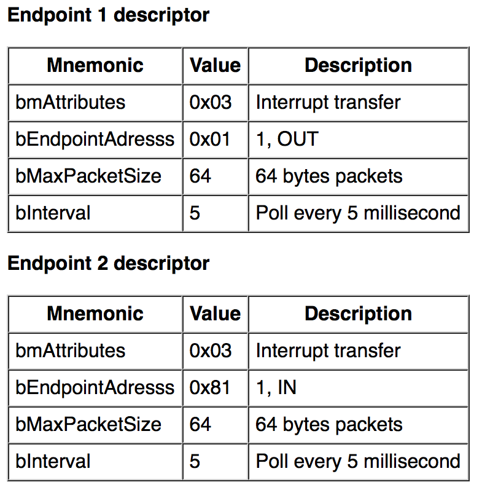
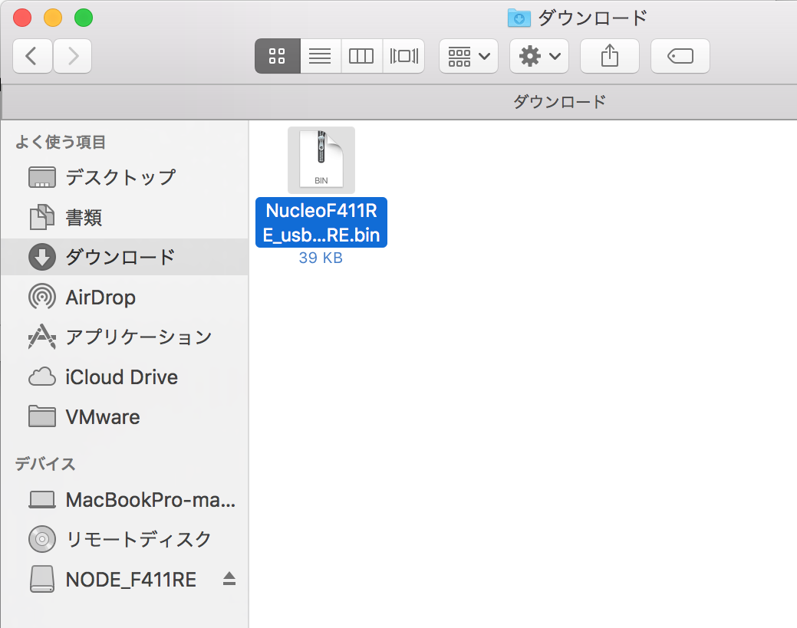
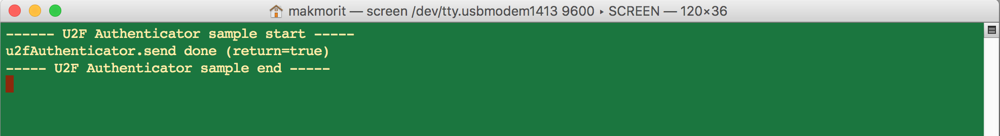
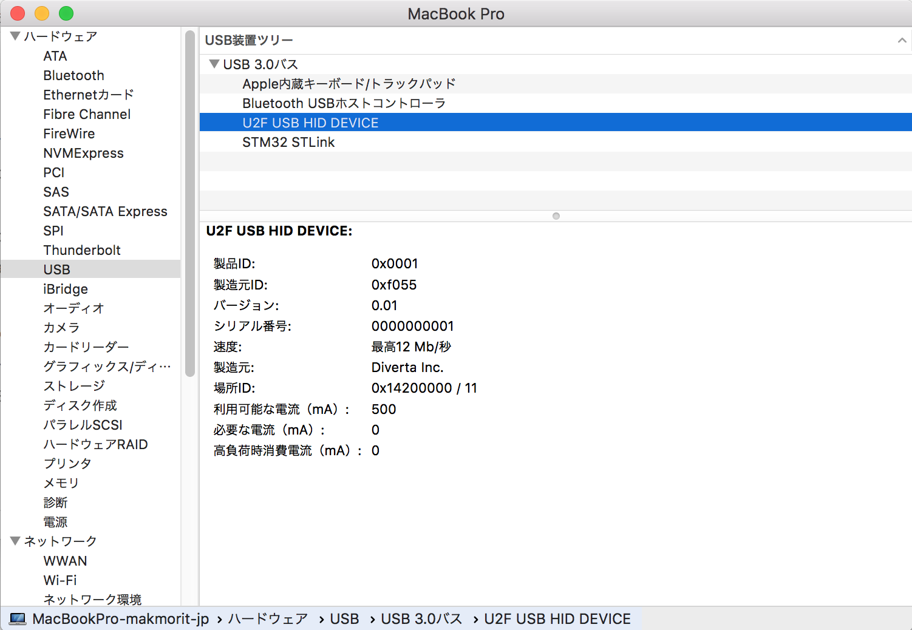

# HID U2Fデバイス開発の準備

まずは手始めに、NUCLEO（STM32開発環境）＋mbed OSにより、USB HIDマウスデバイスを試してみました。<br>
レポートはこちら---><b>[HIDマウスデバイスを試す](NUCLEO_HID_MOUSE.md)</b>

上記のテストで使用したハードウェアを、HID U2Fデバイスとして認識させるところまで試します。

## サンプルアプリを改修

前述テストで使用した、サンプルのmbedアプリケーションに、HID U2Fデバイス・クラスを追加します。<br>
名前は`USBU2FAuthenticator`とします。

改修したサンプルアプリのソースは[こちらのフォルダー](NucleoF411RE_usbmouse)に格納しておきます。

### クラスヘッダー

コンストラクター`USBU2FAuthenticator`では製造元ID（=0x8888）、製品ID（=0x0001）、バージョンといった情報を仮設定しています。

そのほかに、HIDデバイスの定義に必要な、`configurationDesc`と`reportDesc`を実装します。

```
#include "USBHID.h"

class USBU2FAuthenticator: public USBHID
{
    public:
        //
        // Constructor
        //
        USBU2FAuthenticator(bool debug, uint16_t vendor_id = 0x8888, uint16_t product_id = 0x0001, uint16_t product_release = 0x0001)
        : USBHID(0, 0, vendor_id, product_id, product_release, false)
        {
            this->debug = debug;
            connect();
        };

        //
        // To define the report descriptor.
        //
        virtual uint8_t * reportDesc();

    protected:
        //
        // Get configuration descriptor
        //
        virtual uint8_t * configurationDesc();

    private:
        bool debug;
};
```

### ディスクリプターの実装

`configurationDesc`を、FIDOアライアンスの仕様書（[Interface- and endpoint descriptors](https://fidoalliance.org/specs/fido-u2f-v1.2-ps-20170411/fido-u2f-hid-protocol-v1.2-ps-20170411.html#interface--and-endpoint-descriptors)）に基づき実装します。



```
uint8_t *USBU2FAuthenticator::configurationDesc() {
    static uint8_t configurationDescriptor[] = {
        :
        ENDPOINT_DESCRIPTOR_LENGTH,     // bLength
        ENDPOINT_DESCRIPTOR,            // bDescriptorType
        0x81,                           // bEndpointAddress (Endpoint 1, IN)
        0x03,                           // bmAttributes     (Interrupt transfer)
        LSB(64),                        // wMaxPacketSize   (LSB)
        MSB(64),                        // wMaxPacketSize   (MSB)
        5,                              // bInterval        (milliseconds)

        ENDPOINT_DESCRIPTOR_LENGTH,     // bLength
        ENDPOINT_DESCRIPTOR,            // bDescriptorType
        0x01,                           // bEndpointAddress (Endpoint 1, OUT)
        0x03,                           // bmAttributes     (Interrupt transfer)
        LSB(64),                        // wMaxPacketSize   (LSB)
        MSB(64),                        // wMaxPacketSize   (MSB)
        5,                              // bInterval        (milliseconds)
    };
    return configurationDescriptor;
}
```

続いて、`reportDesc`の実装をします。

ところが、FIDOアライアンスの仕様書（[HID report descriptor and device discovery](https://fidoalliance.org/specs/fido-u2f-v1.2-ps-20170411/fido-u2f-hid-protocol-v1.2-ps-20170411.html#hid-report-descriptor-and-device-discovery)）には、report discriptorに記述すべき具体的な値が掲載されていません。<br>
したがって、適宜GitHub上に公開されているサンプル（[gl-sergei/u2f-token/src/usb-hid.c](https://github.com/gl-sergei/u2f-token/blob/master/src/usb-hid.c)）に基づき実装します。

```
uint8_t *USBU2FAuthenticator::reportDesc() {

    static uint8_t reportDescriptor[] =
    {
        0x06, 0xd0, 0xf1,   // USAGE_PAGE (FIDO Alliance)
        0x09, 0x01,         // USAGE (Keyboard)
        0xa1, 0x01,         // COLLECTION (Application)
        0x09, 0x20,         //   USAGE (Input Report Data)
        0x15, 0x00,         //   LOGICAL_MINIMUM (0)
        0x26, 0xff, 0x00,   //   LOGICAL_MAXIMUM (255)
        0x75, 0x08,         //   REPORT_SIZE (8)
        0x95, 64,           //   REPORT_COUNT (64)
        0x81, 0x02,         //   INPUT (Data,Var,Abs)
        0x09, 0x21,         //   USAGE(Output Report Data)
        0x15, 0x00,         //   LOGICAL_MINIMUM (0)
        0x26, 0xff, 0x00,   //   LOGICAL_MAXIMUM (255)
        0x75, 0x08,         //   REPORT_SIZE (8)
        0x95, 64,           //   REPORT_COUNT (64)
        0x91, 0x02,         //   OUTPUT (Data,Var,Abs)
        0xc0,               // END_COLLECTION
    };
    reportLength = sizeof(reportDescriptor);
    return reportDescriptor;
}
```

### 動作確認用コードの実装

NUCLEOから、PCのUSB HIDポートに、１バイトのメッセージを出力して疎通確認を行うプログラムを作成します。

`main.cpp`に以下のようなコードを記述します。

```
#include <stdio.h>

#include "mbed.h"
#include "USBU2FAuthenticator.h"

USBU2FAuthenticator u2fAuthenticator(true);

int main(void) {
    wait(1);
    printf("----- U2F Authenticator sample start -----\r\n");

    //
    // １バイトのメッセージを出力
    //
    HID_REPORT report;
    report.data[0] = 0x01;
    report.length = 1;
    bool ret = u2fAuthenticator.send(&report);
    printf("u2fAuthenticator.send done (return=%s)\r\n", ret? "true" : "false");

    printf("----- U2F Authenticator sample end -----\r\n");

    while (true);
}
```

## 動作確認確認

コンパイルを実行すると、ダウンロードフォルダーに、`NucleoF411RE_usbmouse_NUCLEO_F411RE.bin`というファイルが作成されます。<br>
そのアイコンを`NODE_F411RE`というドライブにドラッグ＆ドロップし、NUCLEOに書き込みます。



書き込みが完了したら、NUCLEOが自動的に再起動し、USB HIDデバイスとして動作します。

### コンソールによる確認

NUCLEOからのデバッグプリントは、コンソールに下図のように出力されます。



コンソールに`u2fAuthenticator.send done (return=true)`と出力されれば、疎通確認は成功です。

### システムレポートによる確認

macOSのシステムレポート画面で「USB装置ツリー」を開くと、先ほど疎通確認させたハードウェア（製造元ID=0x8888、製品ID=0x0001）が、HIDデバイスとして下図のように認識されることが確認できます。


