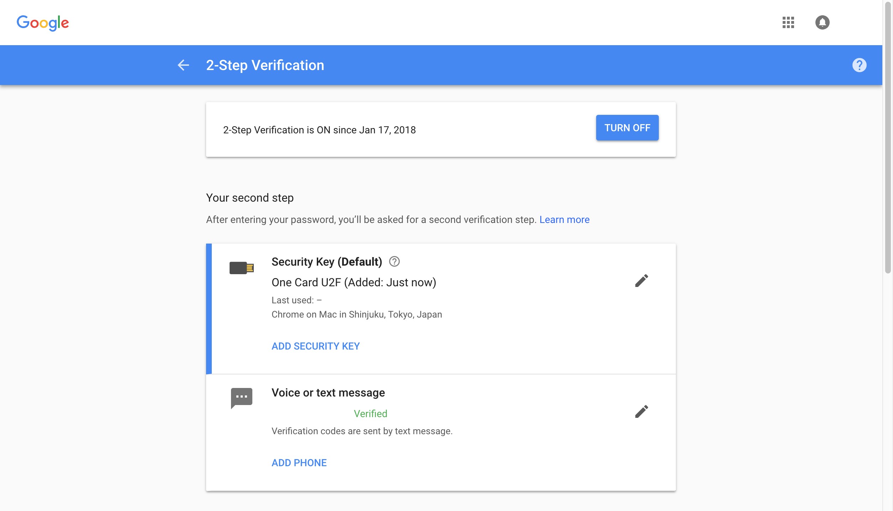

# HID U2FデバイスからU2F Registerを実行

## 概要

NUCLEO（STM32開発環境）＋mbed OSにより、HID U2Fデバイスを、既存のU2F管理ツールと連携させるところまで試してみました。<br>
レポートはこちら---><b>[HID U2FデバイスとU2F管理ツールの連携](NUCLEO_HID_U2FMNT.md)</b>

上記のテストで使用したハードウェアで、HID U2Fデバイスから、U2F管理ツールを経て、One CardのU2F Registerコマンドを実行させるところまで試します。

## U2F管理ツールを改修

U2F管理ツールに、HID U2FデバイスとOne Cardを連携させるための処理を追加します。

### HIDデバイスからのメッセージをOne Cardへ転送

HIDデバイスから転送されたAPDU（デバイスから転送されたデータから、ヘッダー＆フッターを削除したデータ）`hidHelperMessages`を、`ToolCommand`の`setU2FHIDProcessParameter`により引き渡します。<br>
その後、`ToolCommand`の該当コマンド`COMMAND_U2F_HID_PROCESS`を実行します。

```
#pragma mark - Call back from ToolHIDHelper

    - (void)hidHelperDidReceive:(NSData *)hidHelperMessages {
        // HIDデバイスから受信したメッセージをToolCommandに引き渡し
        [[self toolCommand] setU2FHIDProcessParameter:COMMAND_U2F_HID_PROCESS
                                     hidHelperMessage:hidHelperMessages];
        // ToolCommandの該当コマンドを実行する
        [self enableButtons:false];
        [[self toolCommand] toolCommandWillCreateBleRequest:COMMAND_U2F_HID_PROCESS];
    }
```

コマンドでは、APDUからBLEへ転送するデータ（INIT/CONT各フレーム）を生成します。

```
- (void)toolCommandWillCreateBleRequest:(Command)command {
    // コマンドに応じ、以下の処理に分岐
    [self setCommand:command];
    switch (command) {
        :
        case COMMAND_U2F_HID_PROCESS:
            [self createCommandU2FHIDProcess];
            break;
        :

- (void)createCommandU2FHIDProcess {
  // HIDデバイスから転送されたAPDUより、分割送信のために64バイトごとのコマンド配列を作成
  [self setBleRequestArray:[self generateCommandArrayFrom:[self hidHelperMessage]]];
}
```
以降は、他のU2F管理ツールにおけるコマンドと同様、BLE接続後、One Card側で処理が実行されます。

### One CardからのレスポンスをHIDデバイスへ転送

One Card側での処理が完了すると、U2Fレスポンスが`ToolCommand`の`bleResponseData`に格納され戻ってきます。

```
- (void)centralManagerDidReceive:(NSData *)bleResponse {
        :
        // レスポンスを次処理に引き渡す
        [self.toolCommand toolCommandWillProcessBleResponse];
        :

- (void)toolCommandWillProcessBleResponse {
    :
    // コマンドに応じ、以下の処理に分岐
    switch ([self command]) {
        :
        case COMMAND_U2F_PROCESS:
        case COMMAND_U2F_HID_PROCESS:
            [self toolCommandDidProcess:true message:@"U2F response received"];
            break;
            :

- (void)toolCommandDidProcess:(bool)result message:(NSString *)message {
    :
    // 画面処理時は、処理終了とメッセージ文言をAppDelegateに戻す
    [[self delegate] toolCommandDidProcess:[self command] result:result message:message];
    :
```

アプリケーション・デリゲートでは、U2Fレスポンスを無編集でHIDデバイスへ転送します。

```
- (void)centralManagerDidDisconnectWith:(NSString *)message error:(NSError *)error {
    :
    } else if ([[self toolCommand] command] == COMMAND_U2F_HID_PROCESS) {
        // U2FレスポンスをHIDデバイスに転送し、ボタンを活性化
        [[self toolHIDHelper] hidHelperWillSend:[[self toolCommand] bleResponseData]];
        [self enableButtons:true];
    :

- (void)hidHelperWillSend:(NSData *)message {
    :
    NSArray<NSData *> *responseFrames = [self generateU2FResponseFramesFrom:message];
    [self HIDManagerWillSendU2FResponseFrames:responseFrames];
}
```

## U2Fクライアントによる確認

### U2F Registerを起動

Googleアカウントの２段階認証設定ページを表示させます。<br>
下図のような画面に遷移させます。


画面上の「Security Key」セクションにある「ADD SECURITY KEY」リンクをクリックし、U2F Registerを開始させます。<br>
下図のようなポップアップが表示され、U2F Registerが起動します。


U2F Registerリクエストが、U2Fクライアント--->HIDデバイス--->U2F管理ツール--->One Cardと渡り、One Card上でU2F Register処理が行われます。<br>
処理完了後、One CardはU2F Registerレスポンスを、U2F管理ツール--->HIDデバイス--->U2Fクライアントに引き渡します。

U2FクライアントがU2F Register処理を完了させると、下図のような画面に遷移し、正常に登録されたことを通知します。


任意の名称を付与して、右下のDONEをクリックします。


２段階認証のデフォルト設定が、One Card U2Fに変更されたことが確認できます。



これでU2F Registerは正常に完了したので、以降はOne Cardを使用してU2F認証ができるということになります。

### ログによる確認

U2FクライアントからHIDデバイスに、U2F Registerリクエストが転送されます。

```
Recv ( 64 bytes) CID: 0x00003301, CMD: 0x83, Payload( 73 bytes): 00 01 03 00 00 00 40 a8 a9 52 cb 13 48 52 6c 0b 3f 02 e3 2b 6b a0 1b c2 b9 e6 b0 7a 35 08 f2 b0 78 ab 2d 2e 75 fe ce a5 46 72 b2 22 c4 cf 95 e1 51 ed 8d 4d 3c 76 7a 6c c3
Recv ( 64 bytes) CID: 0x00003301, SEQ: 0x00, 49 43 59 43 79 4e 88 4f 3d 02 3a 82 29 fd 00 00
```

HIDデバイスからU2F管理ツールに、U2F Registerリクエストが転送されてきます。

```
Send ( 32 bytes) CID: 0x00000000, CMD: 0x83, Payload( 73 bytes): 00 01 03 00 00 00 40 a8 a9 52 cb 13 48 52 6c 0b 3f 02 e3 2b 6b a0 1b c2 b9
Send ( 32 bytes) CID: 0x00000000, SEQ: 0x00, e6 b0 7a 35 08 f2 b0 78 ab 2d 2e 75 fe ce a5 46 72 b2 22 c4 cf 95 e1 51 ed 8d 4d
Send ( 32 bytes) CID: 0x00000000, SEQ: 0x01, 3c 76 7a 6c c3 49 43 59 43 79 4e 88 4f 3d 02 3a 82 29 fd 00 00
```

U2F管理ツールは、One Cardに接続して、U2F Registerリクエストを転送します。

```
デフォルト	15:35:35.840784 +0900	U2FMaintenanceTool	ToolHIDHelper receive: reportLength(32) report(<00000000 83004900 01030000 0040a8a9 52cb1348 526c0b3f 02e32b6b a01bc2b9>)
デフォルト	15:35:35.973656 +0900	U2FMaintenanceTool	ToolHIDHelper receive: reportLength(32) report(<00000000 00e6b07a 3508f2b0 78ab2d2e 75fecea5 4672b222 c4cf95e1 51ed8d4d>)
デフォルト	15:35:36.087880 +0900	U2FMaintenanceTool	ToolHIDHelper receive: reportLength(32) report(<00000000 013c767a 6cc34943 5943794e 884f3d02 3a8229fd 00000000 00000000>)
デフォルト	15:35:36.088029 +0900	U2FMaintenanceTool	hidHelperDidReceive(73 bytes): <00010300 000040a8 a952cb13 48526c0b 3f02e32b 6ba01bc2 b9e6b07a 3508f2b0 78ab2d2e 75fecea5 4672b222 c4cf95e1 51ed8d4d 3c767a6c c3494359 43794e88 4f3d023a 8229fd00 00>
デフォルト	15:35:36.088110 +0900	U2FMaintenanceTool	setU2FHIDProcessParameter: <00010300 000040a8 a952cb13 48526c0b 3f02e32b 6ba01bc2 b9e6b07a 3508f2b0 78ab2d2e 75fecea5 4672b222 c4cf95e1 51ed8d4d 3c767a6c c3494359 43794e88 4f3d023a 8229fd00 00>
デフォルト	15:35:36.089540 +0900	U2FMaintenanceTool	FIDO U2Fデバイスのスキャンを開始します。
:
デフォルト	15:35:40.180249 +0900	U2FMaintenanceTool	受信データの監視を開始します。
デフォルト	15:35:40.480645 +0900	U2FMaintenanceTool	Sent request [frame=0] <83004900 01030000 0040a8a9 52cb1348 526c0b3f 02e32b6b a01bc2b9 e6b07a35 08f2b078 ab2d2e75 fecea546 72b222c4 cf95e151 ed8d4d3c 767a6cc3 49435943>
デフォルト	15:35:40.630522 +0900	U2FMaintenanceTool	Sent request [frame=1] <00794e88 4f3d023a 8229fd00 00>
デフォルト	15:35:40.630667 +0900	U2FMaintenanceTool	リクエストを送信しました。
```

One Card側で処理が行われ、U2F管理ツールにU2F Registerレスポンスが戻ります。

```
デフォルト	15:35:40.930416 +0900	U2FMaintenanceTool	Received response <8302a905 041a7929 68ef6c1d 0dabf31b c9995b57 93ee0eb2 81e69fbd 252a7db2 f88402f4 d590267f f6d3fd81 6b8546bb 0ab67217 1ad26f56 71ad9f89 fb4d347c>
デフォルト	15:35:40.932372 +0900	U2FMaintenanceTool	Received response <0096b3bb 05bb40d9 269d77af 21673daf 8ced20ca f4a7d56c cca95d93 d5f27d21 62554ccf b117cce2 c3baf9ee f52941a0 a3569a80 e2b4f584 3d481222 8553bd64>
デフォルト	15:35:41.006551 +0900	U2FMaintenanceTool	Received response <0147bacf 91be17ba 308201d9 3082017f a0030201 02020900 e426afb6 2a1f08c3 30090607 2a8648ce 3d040130 66311a30 18060355 04030c11 7777772e 64697665>
デフォルト	15:35:41.080661 +0900	U2FMaintenanceTool	Received response <02727461 2e636f2e 6a703115 30130603 55040a0c 0c446976 65727461 20496e63 2e311430 12060355 04070c0b 5368696e 6a756b75 2d6b7531 0e300c06 03550408>
デフォルト	15:35:41.082495 +0900	U2FMaintenanceTool	Received response <030c0554 6f6b796f 310b3009 06035504 0613024a 50301e17 0d313830 33303130 36323334 395a170d 31393033 30313036 32333439 5a306631 1a301806 03550403>
デフォルト	15:35:41.155875 +0900	U2FMaintenanceTool	Received response <040c1177 77772e64 69766572 74612e63 6f2e6a70 31153013 06035504 0a0c0c44 69766572 74612049 6e632e31 14301206 03550407 0c0b5368 696e6a75 6b752d6b>
デフォルト	15:35:41.157318 +0900	U2FMaintenanceTool	Received response <0575310e 300c0603 5504080c 05546f6b 796f310b 30090603 55040613 024a5030 59301306 072a8648 ce3d0201 06082a86 48ce3d03 01070342 0004e8ed 507541ba>
デフォルト	15:35:41.230634 +0900	U2FMaintenanceTool	Received response <06a636aa 93062aa2 7ba085df 7eb98d84 929d5439 2ad471ed a8b3f41e bb0e2e53 ab7fe49d c748d178 8fed3c00 cd113eb8 d666ecc4 252768ad d8a043a3 17301530>
デフォルト	15:35:41.232324 +0900	U2FMaintenanceTool	Received response <0713060b 2b060104 0182e51c 02010104 04030206 40300906 072a8648 ce3d0401 03490030 46022100 b964c555 9b730bbc e48da829 19a83ddf 6fb5fec6 8070afc2>
デフォルト	15:35:41.305755 +0900	U2FMaintenanceTool	Received response <08a24a7b 34adbe8b d8022100 8da74057 72ba3b06 02d06d9e 732c42fd ed24a7f4 090f163b 5197e262 7d90a2cf 30450221 0080fce7 72cc1d6d cfe0a9fe 77e9cb64>
デフォルト	15:35:41.307310 +0900	U2FMaintenanceTool	Received response <09c70996 f5f37c67 950079cf ff496d23 9d730220 4e0b98d6 4054cc34 2032a7ff 12a46667 69e82a35 7a2591ea 6aa5bde6 9a1e4207 9000>
デフォルト	15:35:41.307476 +0900	U2FMaintenanceTool	U2F response received
デフォルト	15:35:41.401519 +0900	U2FMaintenanceTool	FIDO U2Fデバイスの接続が切断されました。
```

今度はU2F管理ツールからHIDデバイスに、U2F Registerレスポンスを転送します。

```
デフォルト	15:35:41.401809 +0900	U2FMaintenanceTool	hidHelperWillSend(681 bytes): <05041a79 2968ef6c 1d0dabf3 1bc9995b 5793ee0e b281e69f bd252a7d b2f88402 f4d59026 7ff6d3fd 816b8546 bb0ab672 171ad26f 5671ad9f 89fb4d34 7c96b3bb 05bb40d9 269d77af 21673daf 8ced20ca f4a7d56c cca95d93 d5f27d21 62554ccf b117cce2 c3baf9ee f52941a0 a3569a80 e2b4f584 3d481222 8553bd64 47bacf91 be17ba30 8201d930 82017fa0 03020102 020900e4 26afb62a 1f08c330 0906072a 8648ce3d 04013066 311a3018 06035504 030c1177 77772e64 69766572 74612e63 6f2e6a70 31153013 06035504 0a0c0c44 69766572 74612049 6e632e31 14301206 03550407 0c0b5368 696e6a75 6b752d6b 75310e30 0c060355 04080c05 546f6b79 6f310b30 09060355 04061302 4a50301e 170d3138 30333031 30363233 34395a17 0d313930 33303130 36323334 395a3066 311a3018 06035504 030c1177 77772e64 69766572 74612e63 6f2e6a70 31153013 06035504 0a0c0c44 69766572 74612049 6e632e31 14301206 03550407 0c0b5368 696e6a75 6b752d6b 75310e30 0c060355 04080c05 546f6b79 6f310b30 09060355 04061302 4a503059 30130607 2a8648ce 3d020106 082a8648 ce3d0301 07034200 04e8ed50 754<…>
デフォルト	15:35:41.403550 +0900	U2FMaintenanceTool	ToolHIDHelper send: messageLength(64) message(<00000000 8302a905 041a7929 68ef6c1d 0dabf31b c9995b57 93ee0eb2 81e69fbd 252a7db2 f88402f4 d590267f f6d3fd81 6b8546bb 0ab67217 1ad26f56 71ad9f89>)
デフォルト	15:35:41.409522 +0900	U2FMaintenanceTool	ToolHIDHelper send: messageLength(64) message(<00000000 00fb4d34 7c96b3bb 05bb40d9 269d77af 21673daf 8ced20ca f4a7d56c cca95d93 d5f27d21 62554ccf b117cce2 c3baf9ee f52941a0 a3569a80 e2b4f584>)
デフォルト	15:35:41.665487 +0900	U2FMaintenanceTool	ToolHIDHelper send: messageLength(64) message(<00000000 013d4812 228553bd 6447bacf 91be17ba 308201d9 3082017f a0030201 02020900 e426afb6 2a1f08c3 30090607 2a8648ce 3d040130 66311a30 18060355>)
デフォルト	15:35:41.906660 +0900	U2FMaintenanceTool	ToolHIDHelper send: messageLength(64) message(<00000000 0204030c 11777777 2e646976 65727461 2e636f2e 6a703115 30130603 55040a0c 0c446976 65727461 20496e63 2e311430 12060355 04070c0b 5368696e>)
デフォルト	15:35:42.148512 +0900	U2FMaintenanceTool	ToolHIDHelper send: messageLength(64) message(<00000000 036a756b 752d6b75 310e300c 06035504 080c0554 6f6b796f 310b3009 06035504 0613024a 50301e17 0d313830 33303130 36323334 395a170d 31393033>)
デフォルト	15:35:42.389772 +0900	U2FMaintenanceTool	ToolHIDHelper send: messageLength(64) message(<00000000 04303130 36323334 395a3066 311a3018 06035504 030c1177 77772e64 69766572 74612e63 6f2e6a70 31153013 06035504 0a0c0c44 69766572 74612049>)
デフォルト	15:35:42.631542 +0900	U2FMaintenanceTool	ToolHIDHelper send: messageLength(64) message(<00000000 056e632e 31143012 06035504 070c0b53 68696e6a 756b752d 6b75310e 300c0603 5504080c 05546f6b 796f310b 30090603 55040613 024a5030 59301306>)
デフォルト	15:35:42.872598 +0900	U2FMaintenanceTool	ToolHIDHelper send: messageLength(64) message(<00000000 06072a86 48ce3d02 0106082a 8648ce3d 03010703 420004e8 ed507541 baa636aa 93062aa2 7ba085df 7eb98d84 929d5439 2ad471ed a8b3f41e bb0e2e53>)
デフォルト	15:35:43.114524 +0900	U2FMaintenanceTool	ToolHIDHelper send: messageLength(64) message(<00000000 07ab7fe4 9dc748d1 788fed3c 00cd113e b8d666ec c4252768 add8a043 a3173015 3013060b 2b060104 0182e51c 02010104 04030206 40300906 072a8648>)
デフォルト	15:35:43.355552 +0900	U2FMaintenanceTool	ToolHIDHelper send: messageLength(64) message(<00000000 08ce3d04 01034900 30460221 00b964c5 559b730b bce48da8 2919a83d df6fb5fe c68070af c2a24a7b 34adbe8b d8022100 8da74057 72ba3b06 02d06d9e>)
デフォルト	15:35:43.597514 +0900	U2FMaintenanceTool	ToolHIDHelper send: messageLength(64) message(<00000000 09732c42 fded24a7 f4090f16 3b5197e2 627d90a2 cf304502 210080fc e772cc1d 6dcfe0a9 fe77e9cb 64c70996 f5f37c67 950079cf ff496d23 9d730220>)
デフォルト	15:35:43.838668 +0900	U2FMaintenanceTool	ToolHIDHelper send: messageLength(64) message(<00000000 0a4e0b98 d64054cc 342032a7 ff12a466 6769e82a 357a2591 ea6aa5bd e69a1e42 07900000 00000000 00000000 00000000 00000000 00000000 00000000>)
```

HIDデバイスで受信されたOne Cardのレスポンスは、無編集でU2Fクライアントに転送されてくるので、U2F Registerの処理が完了します。

```
Recv ( 64 bytes) CID: 0x00000000, CMD: 0x83, Payload(681 bytes): 05 04 1a 79 29 68 ef 6c 1d 0d ab f3 1b c9 99 5b 57 93 ee 0e b2 81 e6 9f bd 25 2a 7d b2 f8 84 02 f4 d5 90 26 7f f6 d3 fd 81 6b 85 46 bb 0a b6 72 17 1a d2 6f 56 71 ad 9f 89
Recv ( 64 bytes) CID: 0x00000000, SEQ: 0x00, fb 4d 34 7c 96 b3 bb 05 bb 40 d9 26 9d 77 af 21 67 3d af 8c ed 20 ca f4 a7 d5 6c cc a9 5d 93 d5 f2 7d 21 62 55 4c cf b1 17 cc e2 c3 ba f9 ee f5 29 41 a0 a3 56 9a 80 e2 b4 f5 84
Recv ( 64 bytes) CID: 0x00000000, SEQ: 0x01, 3d 48 12 22 85 53 bd 64 47 ba cf 91 be 17 ba 30 82 01 d9 30 82 01 7f a0 03 02 01 02 02 09 00 e4 26 af b6 2a 1f 08 c3 30 09 06 07 2a 86 48 ce 3d 04 01 30 66 31 1a 30 18 06 03 55
Recv ( 64 bytes) CID: 0x00000000, SEQ: 0x02, 04 03 0c 11 77 77 77 2e 64 69 76 65 72 74 61 2e 63 6f 2e 6a 70 31 15 30 13 06 03 55 04 0a 0c 0c 44 69 76 65 72 74 61 20 49 6e 63 2e 31 14 30 12 06 03 55 04 07 0c 0b 53 68 69 6e
Recv ( 64 bytes) CID: 0x00000000, SEQ: 0x03, 6a 75 6b 75 2d 6b 75 31 0e 30 0c 06 03 55 04 08 0c 05 54 6f 6b 79 6f 31 0b 30 09 06 03 55 04 06 13 02 4a 50 30 1e 17 0d 31 38 30 33 30 31 30 36 32 33 34 39 5a 17 0d 31 39 30 33
Recv ( 64 bytes) CID: 0x00000000, SEQ: 0x04, 30 31 30 36 32 33 34 39 5a 30 66 31 1a 30 18 06 03 55 04 03 0c 11 77 77 77 2e 64 69 76 65 72 74 61 2e 63 6f 2e 6a 70 31 15 30 13 06 03 55 04 0a 0c 0c 44 69 76 65 72 74 61 20 49
Recv ( 64 bytes) CID: 0x00000000, SEQ: 0x05, 6e 63 2e 31 14 30 12 06 03 55 04 07 0c 0b 53 68 69 6e 6a 75 6b 75 2d 6b 75 31 0e 30 0c 06 03 55 04 08 0c 05 54 6f 6b 79 6f 31 0b 30 09 06 03 55 04 06 13 02 4a 50 30 59 30 13 06
Recv ( 64 bytes) CID: 0x00000000, SEQ: 0x06, 07 2a 86 48 ce 3d 02 01 06 08 2a 86 48 ce 3d 03 01 07 03 42 00 04 e8 ed 50 75 41 ba a6 36 aa 93 06 2a a2 7b a0 85 df 7e b9 8d 84 92 9d 54 39 2a d4 71 ed a8 b3 f4 1e bb 0e 2e 53
Recv ( 64 bytes) CID: 0x00000000, SEQ: 0x07, ab 7f e4 9d c7 48 d1 78 8f ed 3c 00 cd 11 3e b8 d6 66 ec c4 25 27 68 ad d8 a0 43 a3 17 30 15 30 13 06 0b 2b 06 01 04 01 82 e5 1c 02 01 01 04 04 03 02 06 40 30 09 06 07 2a 86 48
Recv ( 64 bytes) CID: 0x00000000, SEQ: 0x08, ce 3d 04 01 03 49 00 30 46 02 21 00 b9 64 c5 55 9b 73 0b bc e4 8d a8 29 19 a8 3d df 6f b5 fe c6 80 70 af c2 a2 4a 7b 34 ad be 8b d8 02 21 00 8d a7 40 57 72 ba 3b 06 02 d0 6d 9e
Recv ( 64 bytes) CID: 0x00000000, SEQ: 0x09, 73 2c 42 fd ed 24 a7 f4 09 0f 16 3b 51 97 e2 62 7d 90 a2 cf 30 45 02 21 00 80 fc e7 72 cc 1d 6d cf e0 a9 fe 77 e9 cb 64 c7 09 96 f5 f3 7c 67 95 00 79 cf ff 49 6d 23 9d 73 02 20
Recv ( 64 bytes) CID: 0x00000000, SEQ: 0x0a, 4e 0b 98 d6 40 54 cc 34 20 32 a7 ff 12 a4 66 67 69 e8 2a 35 7a 25 91 ea 6a a5 bd e6 9a 1e 42 07 90 00
Send ( 32 bytes) CID: 0x00003301, CMD: 0x83, Payload(681 bytes): 05 04 1a 79 29 68 ef 6c 1d 0d ab f3 1b c9 99 5b 57 93 ee 0e b2 81 e6 9f bd
Send ( 32 bytes) CID: 0x00003301, SEQ: 0x00, 25 2a 7d b2 f8 84 02 f4 d5 90 26 7f f6 d3 fd 81 6b 85 46 bb 0a b6 72 17 1a d2 6f
Send ( 32 bytes) CID: 0x00003301, SEQ: 0x01, 56 71 ad 9f 89 fb 4d 34 7c 96 b3 bb 05 bb 40 d9 26 9d 77 af 21 67 3d af 8c ed 20
Send ( 32 bytes) CID: 0x00003301, SEQ: 0x02, ca f4 a7 d5 6c cc a9 5d 93 d5 f2 7d 21 62 55 4c cf b1 17 cc e2 c3 ba f9 ee f5 29
Send ( 32 bytes) CID: 0x00003301, SEQ: 0x03, 41 a0 a3 56 9a 80 e2 b4 f5 84 3d 48 12 22 85 53 bd 64 47 ba cf 91 be 17 ba 30 82
Send ( 32 bytes) CID: 0x00003301, SEQ: 0x04, 01 d9 30 82 01 7f a0 03 02 01 02 02 09 00 e4 26 af b6 2a 1f 08 c3 30 09 06 07 2a
Send ( 32 bytes) CID: 0x00003301, SEQ: 0x05, 86 48 ce 3d 04 01 30 66 31 1a 30 18 06 03 55 04 03 0c 11 77 77 77 2e 64 69 76 65
Send ( 32 bytes) CID: 0x00003301, SEQ: 0x06, 72 74 61 2e 63 6f 2e 6a 70 31 15 30 13 06 03 55 04 0a 0c 0c 44 69 76 65 72 74 61
Send ( 32 bytes) CID: 0x00003301, SEQ: 0x07, 20 49 6e 63 2e 31 14 30 12 06 03 55 04 07 0c 0b 53 68 69 6e 6a 75 6b 75 2d 6b 75
Send ( 32 bytes) CID: 0x00003301, SEQ: 0x08, 31 0e 30 0c 06 03 55 04 08 0c 05 54 6f 6b 79 6f 31 0b 30 09 06 03 55 04 06 13 02
Send ( 32 bytes) CID: 0x00003301, SEQ: 0x09, 4a 50 30 1e 17 0d 31 38 30 33 30 31 30 36 32 33 34 39 5a 17 0d 31 39 30 33 30 31
Send ( 32 bytes) CID: 0x00003301, SEQ: 0x0a, 30 36 32 33 34 39 5a 30 66 31 1a 30 18 06 03 55 04 03 0c 11 77 77 77 2e 64 69 76
Send ( 32 bytes) CID: 0x00003301, SEQ: 0x0b, 65 72 74 61 2e 63 6f 2e 6a 70 31 15 30 13 06 03 55 04 0a 0c 0c 44 69 76 65 72 74
Send ( 32 bytes) CID: 0x00003301, SEQ: 0x0c, 61 20 49 6e 63 2e 31 14 30 12 06 03 55 04 07 0c 0b 53 68 69 6e 6a 75 6b 75 2d 6b
Send ( 32 bytes) CID: 0x00003301, SEQ: 0x0d, 75 31 0e 30 0c 06 03 55 04 08 0c 05 54 6f 6b 79 6f 31 0b 30 09 06 03 55 04 06 13
Send ( 32 bytes) CID: 0x00003301, SEQ: 0x0e, 02 4a 50 30 59 30 13 06 07 2a 86 48 ce 3d 02 01 06 08 2a 86 48 ce 3d 03 01 07 03
Send ( 32 bytes) CID: 0x00003301, SEQ: 0x0f, 42 00 04 e8 ed 50 75 41 ba a6 36 aa 93 06 2a a2 7b a0 85 df 7e b9 8d 84 92 9d 54
Send ( 32 bytes) CID: 0x00003301, SEQ: 0x10, 39 2a d4 71 ed a8 b3 f4 1e bb 0e 2e 53 ab 7f e4 9d c7 48 d1 78 8f ed 3c 00 cd 11
Send ( 32 bytes) CID: 0x00003301, SEQ: 0x11, 3e b8 d6 66 ec c4 25 27 68 ad d8 a0 43 a3 17 30 15 30 13 06 0b 2b 06 01 04 01 82
Send ( 32 bytes) CID: 0x00003301, SEQ: 0x12, e5 1c 02 01 01 04 04 03 02 06 40 30 09 06 07 2a 86 48 ce 3d 04 01 03 49 00 30 46
Send ( 32 bytes) CID: 0x00003301, SEQ: 0x13, 02 21 00 b9 64 c5 55 9b 73 0b bc e4 8d a8 29 19 a8 3d df 6f b5 fe c6 80 70 af c2
Send ( 32 bytes) CID: 0x00003301, SEQ: 0x14, a2 4a 7b 34 ad be 8b d8 02 21 00 8d a7 40 57 72 ba 3b 06 02 d0 6d 9e 73 2c 42 fd
Send ( 32 bytes) CID: 0x00003301, SEQ: 0x15, ed 24 a7 f4 09 0f 16 3b 51 97 e2 62 7d 90 a2 cf 30 45 02 21 00 80 fc e7 72 cc 1d
Send ( 32 bytes) CID: 0x00003301, SEQ: 0x16, 6d cf e0 a9 fe 77 e9 cb 64 c7 09 96 f5 f3 7c 67 95 00 79 cf ff 49 6d 23 9d 73 02
Send ( 32 bytes) CID: 0x00003301, SEQ: 0x17, 20 4e 0b 98 d6 40 54 cc 34 20 32 a7 ff 12 a4 66 67 69 e8 2a 35 7a 25 91 ea 6a a5
Send ( 32 bytes) CID: 0x00003301, SEQ: 0x18, bd e6 9a 1e 42 07 90 00 
```
