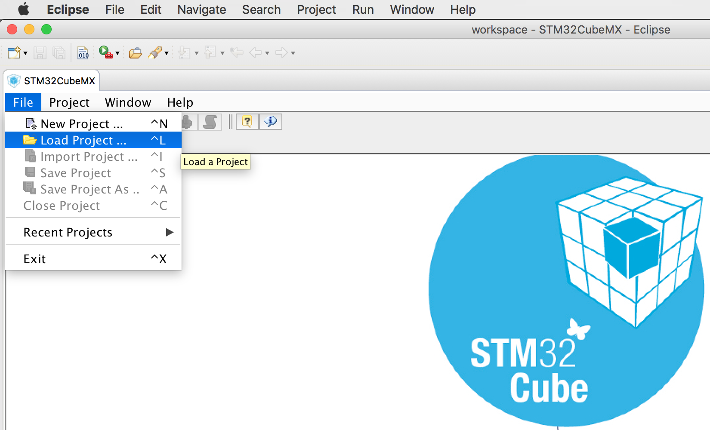
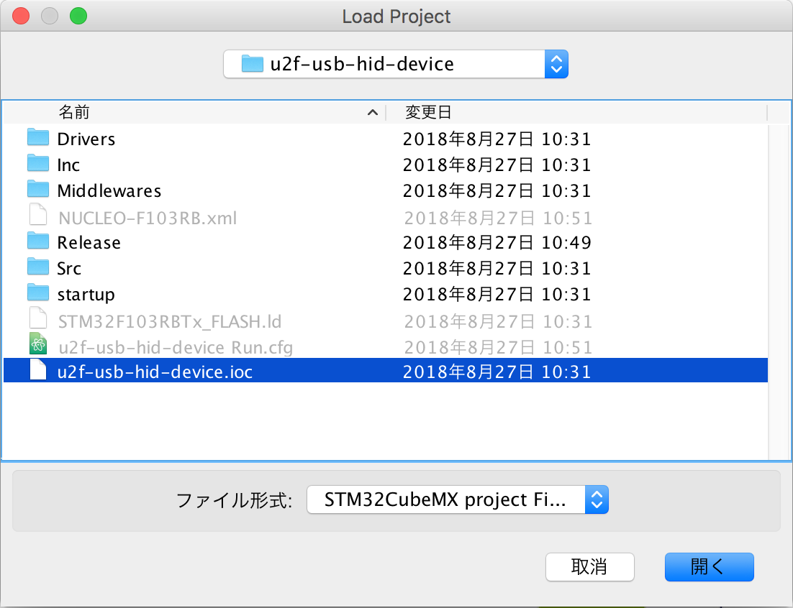
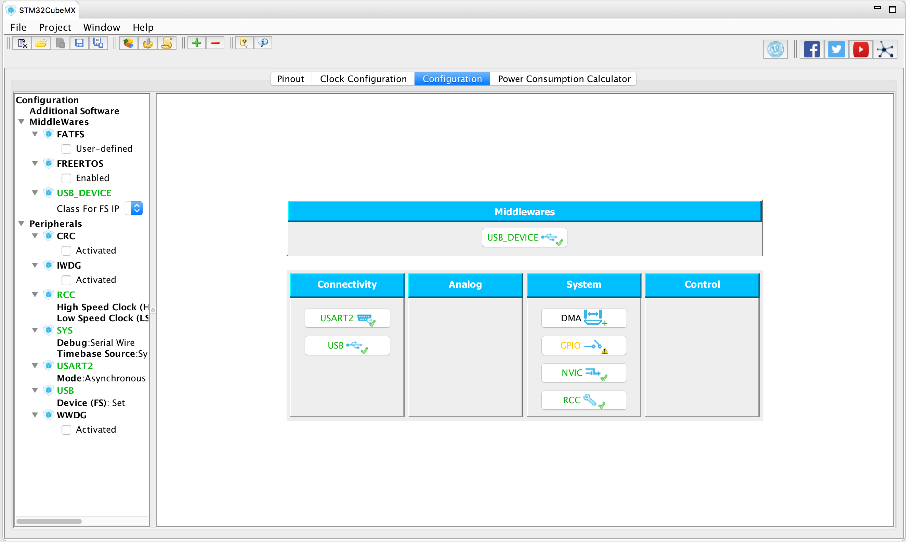
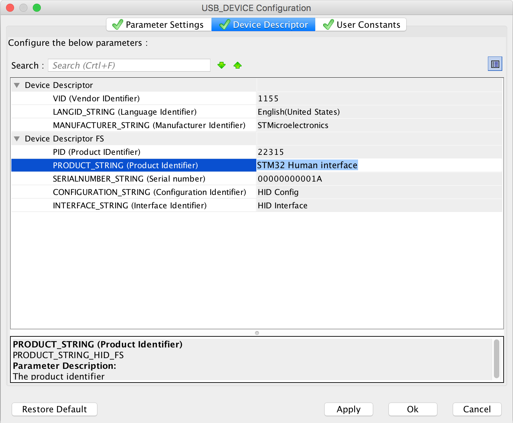
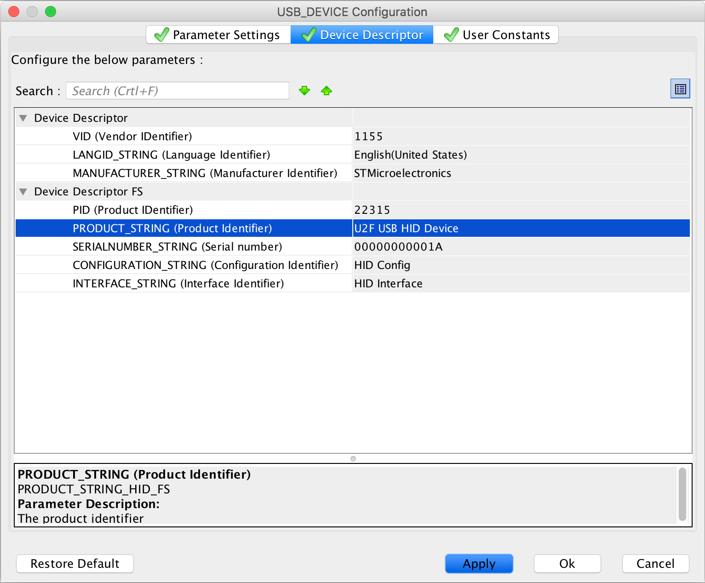
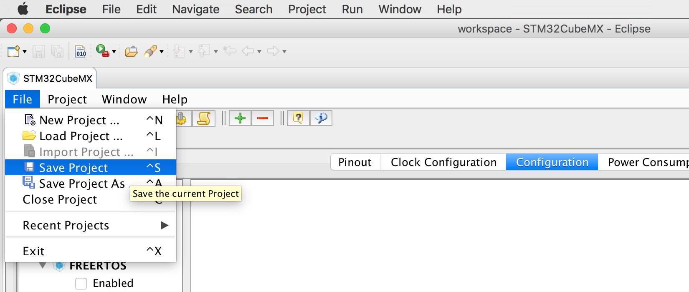
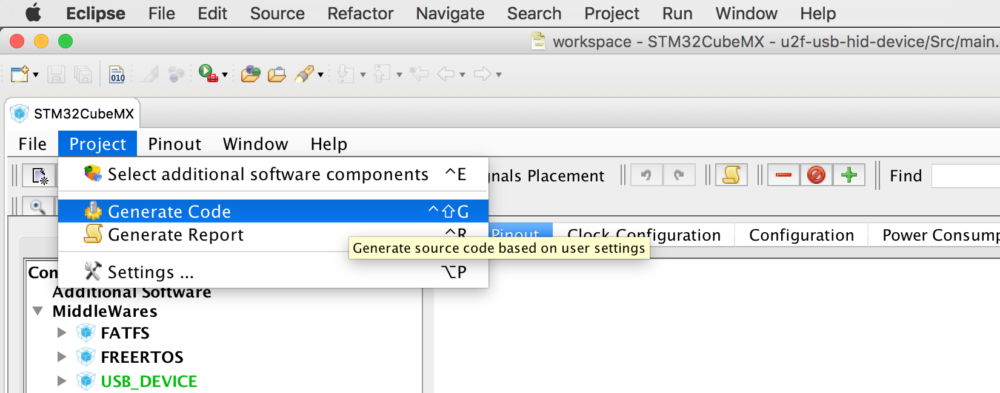
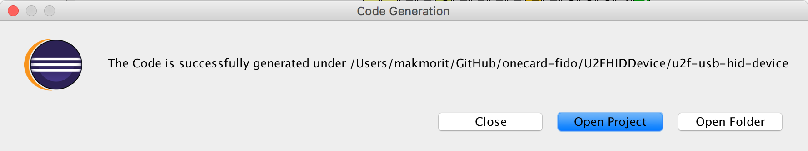
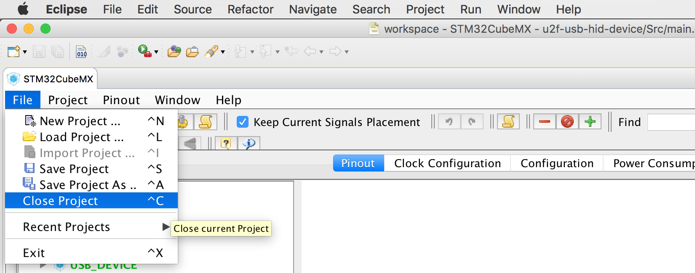
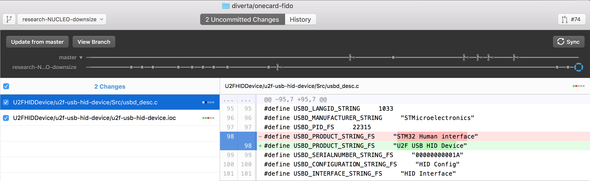

# プロジェクト設定項目修正手順

「STM32CubeMXプラグイン」上で、STM32CubeMXのプロジェクト設定項目を修正し、コードテンプレートに反映させる手順を掲載します。

## 手順

STM32CubeMXプラグインメニューの「Load Project」を実行します。

ファイル選択ダイアログで「.ioc」ファイルを選択して「開く」ボタンをクリックします。

以下は、USBデバイスのConfiguration項目を修正する例になります。 
「Middlewares」の「USB_DEVICE」ボタンをクリックします。

下図のような設定画面に切り替わります。 
初期状態では、以下のような値が設定されています。

「PRODUCT_STRING」を「U2F USB HID Device」と修正します。 
その後「OK」ボタンをクリックします。

メニューから「Save Project」を実行します。

修正内容は、以上の手順だけではコードテンプレートに反映されません。 
STM32CubeMXのプロジェクトから、もう一度、コードテンプレートを生成する必要があります。

メニューから「Generate Code」を実行します。

処理が終わると下図のようなポップアップが表示されます。 
「Close」をクリックしてポップアップを閉じます。

最後に、メニューから「Close Project」を実行して、STM32CubeMXのプロジェクトを閉じます。

以上で、プロジェクト設定項目の修正は完了です。

### 修正後の確認

修正された設定項目が、生成されたコードテンプレートに反映されていることを確認します。 
GitHubデスクトップなどのツールを利用して確認すると確実です。

