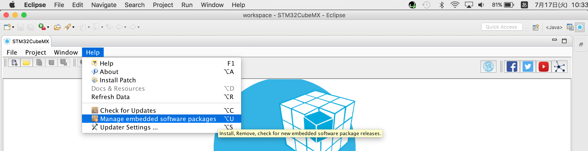
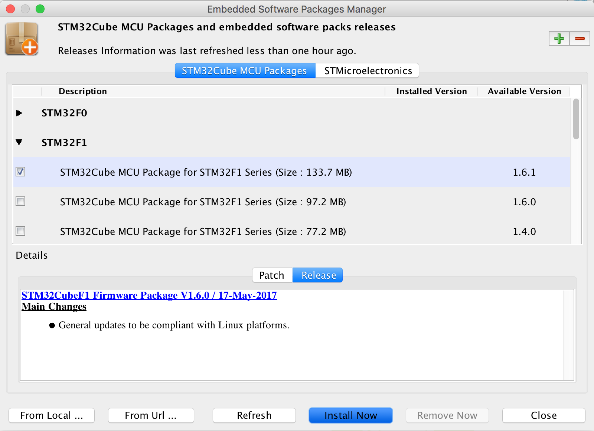
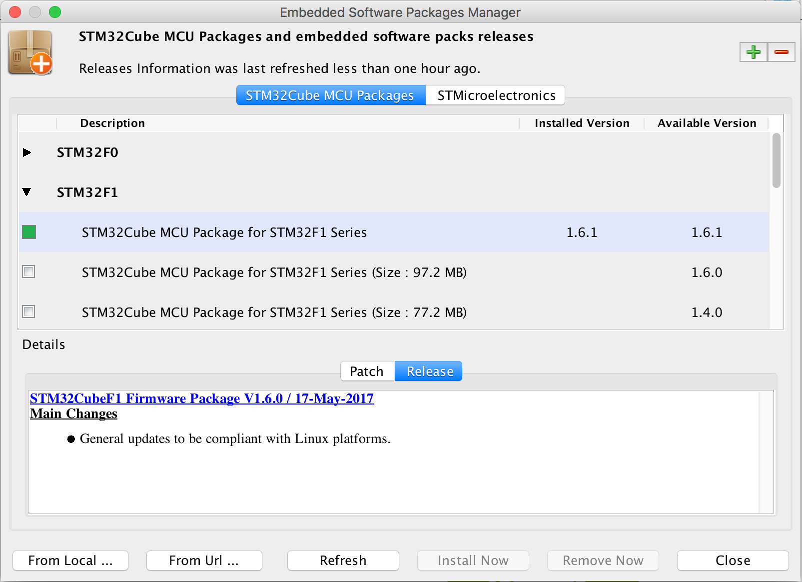

# STM32CubeF1 インストール手順

「System Workbench for STM32F」に、STM32F103でHIDデバイスを開発するために必要なライブラリー「STM32CubeF1」をインストールします。

## インストール実行

「System Workbench for STM32F」を起動し、STM32CubeMXプラグインの画面を表示させます。

STM32CubeMXプラグインメニューの「Help --> Manage embedded software packages」を実行します。

表示されたポップアップでSTM32F1の1.6.1（最新バージョン）を選択して「Install Now」ボタンをクリックします。

インストールが完了すると、Installed Version欄に「1.6.1」と表示されます。

「Close」ボタンをクリックして、画面を閉じます。

以上で、STM32CubeF1のインストールは完了です。
